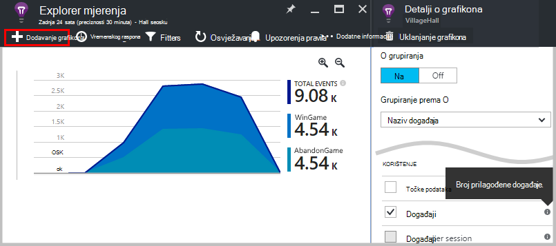
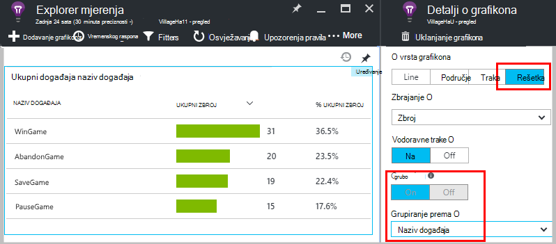
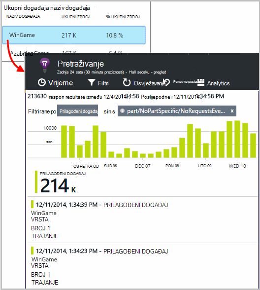
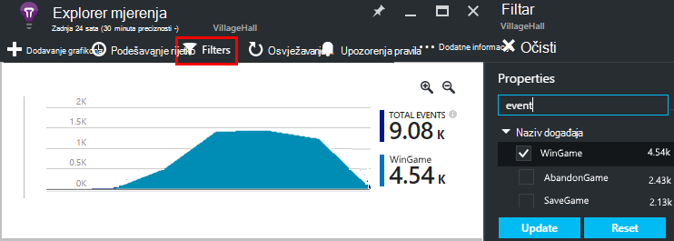
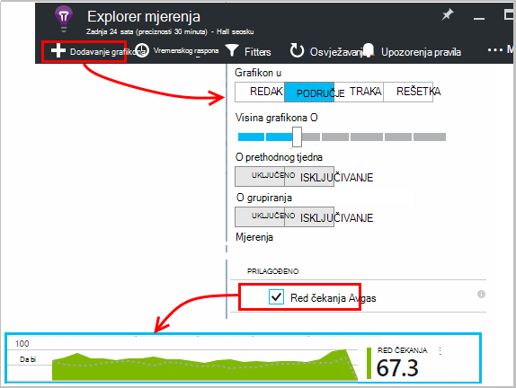
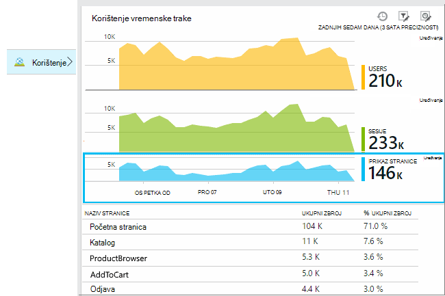
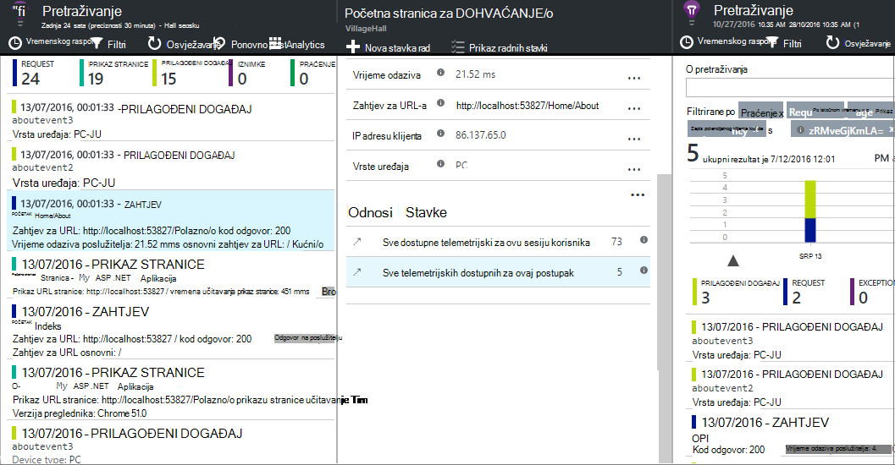
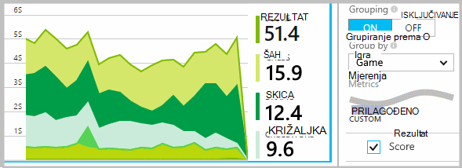
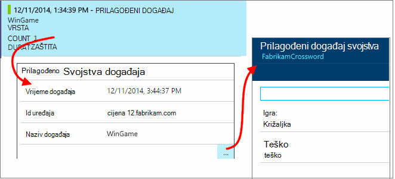
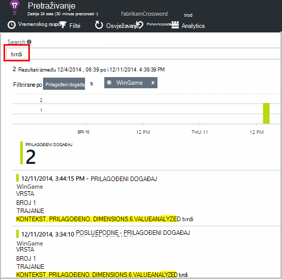

<properties 
    pageTitle="API uvida aplikacije za prilagođene događaje i metrike | Microsoft Azure" 
    description="Umetnite nekoliko redaka koda aplikacije uređaja ili radne površine, web-stranicu ili usluge za praćenje korištenja i otklanjanja poteškoća." 
    services="application-insights"
    documentationCenter="" 
    authors="alancameronwills" 
    manager="douge"/>
 
<tags 
    ms.service="application-insights" 
    ms.workload="tbd" 
    ms.tgt_pltfrm="ibiza" 
    ms.devlang="multiple" 
    ms.topic="article" 
    ms.date="10/19/2016" 
    ms.author="awills"/>

# <a name="application-insights-api-for-custom-events-and-metrics"></a>API uvida aplikacije za prilagođene događaje i metrike 

*Aplikacija uvida je u pretpregledu.*

Umetnite nekoliko redaka koda u aplikaciji da biste saznali što korisnici rade s njom ili pomaže utvrditi probleme. Možete poslati telemetrijskih iz aplikacije uređaja i stolna računala, web-klijentima i web-poslužiteljima. Temeljni telemetrijskih [Uvida aplikacije za Visual Studio](app-insights-overview.md) API omogućuje vam slanje prilagođenih događaja i mjernih podataka i vlastite verzijama standardni telemetrijskih. Taj API je isti API koji koriste standard collectors podataka aplikacije uvide.

## <a name="api-summary"></a>Sažetak API-JA

U API je uniform preko sve platforme, osim nekoliko small varijacije.

Način | Koristi se za
---|---
[`TrackPageView`](#page-views) | Stranica, zasloni, blades ili obrazaca
[`TrackEvent`](#track-event) | Akcije korisnika i druge događaje. Služi za praćenje ponašanje korisnika ili praćenje performansi.
[`TrackMetric`](#track-metric) | Performanse mjere kao što su duljine reda čekanja ne odnose na određene događaje
[`TrackException`](#track-exception)|Prijavite se iznimke za Dijagnostika. Praćenje kojoj pojaviti u odnosu na druge događaje i pregledajte kašnjenja stogu.
[`TrackRequest`](#track-request)| Prijavite se učestalost i trajanje poslužitelj zahtjeva za analizu performansi.
[`TrackTrace`](#track-trace)|Poruke dijagnostičkog zapisnika. Možete snimiti i 3 proizvođača zapisnika.
[`TrackDependency`](#track-dependency)|Prijavite se trajanje i učestalost poziva za vanjske komponente aplikacije ovisi.

Možete [priložiti svojstva i metrike](#properties) većinu te telemetrijskih pozive. 


## <a name="prep"></a>Prije početka

Ako dosad niste te još:

* Dodavanje uvida SDK aplikacije projekta:
 * [Project platforme ASP.NET][greenbrown]
 * [Java projekta][java] 
 * [JavaScript u svakoj web-stranici][client]   

* U svoj uređaj ili web-poslužitelj kod, obuhvaćaju sljedeće:

    *C#:*`using Microsoft.ApplicationInsights;`

    *VB:*`Imports Microsoft.ApplicationInsights`

    *Java:*`import com.microsoft.applicationinsights.TelemetryClient;`

## <a name="construct-a-telemetryclient"></a>Sastavljanje na TelemetryClient

Sastavljanje instance komponente TelemetryClient (osim u JavaScript koda na web-stranicama):

*C#:* 

    private TelemetryClient telemetry = new TelemetryClient();

*VB:* 

    Private Dim telemetry As New TelemetryClient

*Java*

    private TelemetryClient telemetry = new TelemetryClient();

TelemetryClient je niti sigurnih.

Preporučujemo da koristite instance komponente `TelemetryClient` za svakom modulu aplikacije. Na primjer, možda nemate `TelemetryClient` u web-servisa za dolazni zahtjevi za http, a drugi u razredu proizvod izvješća poslovne logike događaja. Možete postaviti svojstva kao što su `TelemetryClient.Context.User.Id` da biste pratili korisnika i sesijama, ili `TelemetryClient.Context.Device.Id` da biste odredili na računalu. Ove informacije možete priložiti Svi događaji poslao tu instancu.


## <a name="track-event"></a>Praćenje događaja

U uvide aplikacije *Prilagođeni događaj* je pokažite podataka koje možete prikazati i u programu [Explorer metriku] [ metrics] kao zbroja count i kao pojedinačne pojave [Dijagnostike]pretraživanja[diagnostic]. (Nije povezan s MVC ili druge framework "događaji.") 

Umetanje TrackEvent pozive u kodu za Brojanje učestalosti pojavljivanja korisnika odaberite određene značajke koliko često su postigli određene ciljeve ili možda provjerite određene vrste pogrešku. 

Na primjer, u aplikaciji za igre poslati događaja svaki put kada korisnik Pobjednik: 

*JavaScript*

    appInsights.trackEvent("WinGame");

*C#*
    
    telemetry.TrackEvent("WinGame");

*VB*


    telemetry.TrackEvent("WinGame")

*Java*

    telemetry.trackEvent("WinGame");


### <a name="view-your-events-in-the-azure-portal"></a>Pregled događaja na portalu za Azure

Da biste vidjeli ukupan broj svoje događaje, otvorite [Metriku Explorer](app-insights-metrics-explorer.md) plohu, dodajte novi grafikon pa odaberite događaje.  



Da biste usporedili broji različite događaje, postavio vrstu grafikona rešetke i grupi naziv događaja:




Na rešetki, kliknite kroz naziv događaja da biste vidjeli pojedinačne pojave taj događaj.



Kliknite bilo koju pojavu da biste vidjeli dodatne detalje.

Radi fokusiranja na određene događaje u pretraživanje ili metriku Explorer, postavite filtar na plohu događaj imena koja vas zanima:



## <a name="track-metric"></a>Praćenje mjerenja

Koristite TrackMetric za slanje metriku koje su priložene na određene događaje. Na primjer, nije moguće nadzirati Duljina reda čekanja u pravilnim vremenskim razmacima. 

Mjernih podataka prikazuju se kao statističkih grafikona u programu explorer metrike, no za razliku od događaje, ne možete tražiti pojedinačne pojave u dijagnostičkih pretraživanju.

Metričkim vrijednosti mora biti > = 0 da biste se pravilno prikazati.


*JavaScript*

    appInsights.trackMetric("Queue", queue.Length);

*C#*

    telemetry.TrackMetric("Queue", queue.Length);

*VB*

    telemetry.TrackMetric("Queue", queue.Length)

*Java*

    telemetry.trackMetric("Queue", queue.Length);

Zapravo, možda će to možete učiniti u pozadini niti:

*C#*

    private void Run() {
     var appInsights = new TelemetryClient();
     while (true) {
      Thread.Sleep(60000);
      appInsights.TrackMetric("Queue", queue.Length);
     }
    }


Da biste vidjeli rezultate, otvorite Eksplorer za metriku i dodajte novi grafikon. Postavite da bi se prikazale vaše metriku.



Postoje neka [ograničenja broja metriku](#limits) možete koristiti.

## <a name="page-views"></a>Prikaza stranice

Na uređaju ili u web-stranicu aplikacije telemetrijskih prikaz stranice prema zadanim postavkama kad šalje učitava se svaki zaslona ili stranice. No možete promijeniti da biste pratili prikaza stranice dodatne ili nekog drugog vrijeme. Na primjer, u aplikaciji sustava prikazat će se kartica ili blades, možda ćete morati pratiti "stranica" svaki put kada korisnik otvori novi plohu. 



Korisnik i sesiju podaci se šalju kao svojstva zajedno s prikaza stranice tako da se grafikoni korisnika i sesiju dolaze aktivnosti kada telemetrijskih prikaz stranice.

#### <a name="custom-page-views"></a>Prikazi za prilagođenu stranicu

*JavaScript*

    appInsights.trackPageView("tab1");

*C#*

    telemetry.TrackPageView("GameReviewPage");

*VB*

    telemetry.TrackPageView("GameReviewPage")


Ako imate nekoliko kartice u različitim stranicama HTML, URL možete odrediti previše:

    appInsights.trackPageView("tab1", "http://fabrikam.com/page1.htm");

#### <a name="timing-page-views"></a>Tempiranje prikaza stranice

Prema zadanim postavkama, vrijeme je mjeri "Vremena učitavanja prikaz stranice" su iz kada preglednik pošalje zahtjev, dok se zove događaj učitavanja stranice u web-pregledniku.

Umjesto toga, možete:

* U pozivu [trackPageView](https://github.com/Microsoft/ApplicationInsights-JS/blob/master/API-reference.md#trackpageview) postavite eksplicitnih trajanje.
 * `appInsights.trackPageView("tab1", null, null, null, durationInMilliseconds);`
* Korištenje prikaza stranice tempiranja pozive `startTrackPage` i `stopTrackPage`.

*JavaScript*

    // To start timing a page:
    appInsights.startTrackPage("Page1");

... 

    // To stop timing and log the page:
    appInsights.stopTrackPage("Page1", url, properties, measurements);

Naziv koristiti kao prvi parametar povezuje pozive početka i završetka. Po zadanom je odabrana naziv trenutne stranice. 

Rezultat trajanje učitavanja stranice prikazana u programu Explorer metrika su izvedene iz interval između pozive početka i završetka. To je vaša koje interval zapravo vremena.

## <a name="track-request"></a>Zahtjev za praćenje

Koristi poslužitelj SDK za prijavu HTTP zahtjeva. 

Možete i nazvati je sami želite li kao zamjenu za zahtjeve u kontekstu kojem nemate modul servisa web pokrenut.

*C#*

    // At start of processing this request:

    // Operation Id and Name are attached to all telemetry and help you identify
    // telemetry associated with one request:
    telemetry.Context.Operation.Id = Guid.NewGuid().ToString();
    telemetry.Context.Operation.Name = requestName;
    
    var stopwatch = System.Diagnostics.Stopwatch.StartNew();

    // ... process the request ...

    stopwatch.Stop();
    telemetry.TrackRequest(requestName, DateTime.Now,
       stopwatch.Elapsed, 
       "200", true);  // Response code, success


## <a name="operation-context"></a>Operacija kontekst

Telemetrijskih stavke mogu biti povezan zajedno Pridruživanjem ih uobičajenih operacija ID. Zahtjev za standardni modul za praćenje to iznimke i druge događaje poslane tijekom obrade HTTP zahtjev. [Pretraživanje](app-insights-diagnostic-search.md) i [analize](app-insights-analytics.md), možete koristiti ID da biste brzo pronašli sve događaje povezane sa zahtjevom za. 

Da biste postavili ID najjednostavnije da biste postavili u kontekstu operacija pomoću ovaj uzorak:

    // Establish an operation context and associated telemetry item:
    using (var operation = telemetry.StartOperation<RequestTelemetry>("operationName"))
    {
        // Telemetry sent in here will use the same operation ID.
        ...
        telemetry.TrackEvent(...); // or other Track* calls
        ...
        // Set properties of containing telemetry item - for example:
        operation.Telemetry.ResponseCode = "200";
        
        // Optional: explicitly send telemetry item:
        telemetry.StopOperation(operation);

    } // When operation is disposed, telemetry item is sent.

Kao i postavljanje konteksta je postupak `StartOperation` stvara stavku telemetrijskih vrste navesti i šalje kada rashoda postupka ili ako izričito poziva `StopOperation`. Ako koristite `RequestTelemetry` kao vrstu telemetrijskih pa njegov trajanje postavljen na vremenski interval između početka i završetka.

Operacija konteksta nije moguće ugnijezditi. Ako već postoji u kontekstu operacija, zatim njegov ID povezan je s sve sadrži stavke, uključujući stavke stvorene pomoću StartOperation.

U odjeljku pretraživanje, kontekst operacija koristi se da biste stvorili popis povezanih stavki:




## <a name="track-exception"></a>Praćenje iznimke

Slanje iznimke aplikacije uvid u: [noći][metrics], kao indikator učestalosti pojavljivanja problema; i [Ispitivanje pojedinačne][diagnostic]. Izvješća obuhvaćaju kašnjenja stogu.

*C#*

    try
    {
        ...
    }
    catch (Exception ex)
    {
       telemetry.TrackException(ex);
    }

*JavaScript*

    try
    {
       ...
    }
    catch (ex)
    {
       appInsights.trackException(ex);
    }

U SDK-ovi automatski pojavljivanje mnogo iznimke pa uvijek ne morate izričito poziva TrackException.

* ASP.NET: [kod da biste privukli iznimke](app-insights-asp-net-exceptions.md)
* J2EE: [Iznimke su otkrivena automatski](app-insights-java-get-started.md#exceptions-and-request-failures)
* JavaScript: Automatski otkrivena. Ako želite da biste onemogućili automatsko zbirke, dodajte redak u isječak koda koje umetnete u web-stranice:

    ```
    ({
      instrumentationKey: "your key"
      , disableExceptionTracking: true
    })
    ```


## <a name="track-trace"></a>Praćenje praćenja 

Ta postavka omogućuje pomaže utvrditi probleme slanjem 'povratna trag' aplikacije uvid u. Možete slati blokova dijagnostičkih podataka i provjera ih u [dijagnostike pretraživanja][diagnostic]. 

 

[Prijavite se prilagodnika] [ trace] koristiti taj API da biste poslali zapisnika drugih proizvođača na portal.


*C#*

    telemetry.TrackTrace(message, SeverityLevel.Warning, properties);


Možete pretraživati prema sadržaj poruke, ali (za razliku od vrijednosti nekretnina) ne možete filtrirati na njemu.

Ograničenje veličine na `message` je mnogo veća od ograničenja svojstva.
Prednost TrackTrace se može smjestiti relativno dugačkih podataka u poruci. Ako, na primjer, nije moguće kodiranje postoji POST podatke.  


Osim toga, možete dodati na razinu težinu poruku. Možete i kao što su druge telemetrijskih možete dodati vrijednosti svojstava koje možete koristiti radi filtriranja ili pretraživanja za različite skupove kašnjenja. Ako, na primjer:


    var telemetry = new Microsoft.ApplicationInsights.TelemetryClient();
    telemetry.TrackTrace("Slow database response",
                   SeverityLevel.Warning,
                   new Dictionary<string,string> { {"database", db.ID} });

To činite omogućuju, u odjeljku [pretraživanje][diagnostic], da biste jednostavno filtriranje svih poruka obavješćivanje razine koji se odnose na određenu bazu podataka.

## <a name="track-dependency"></a>Praćenje ovisnost

Pomoću ovog poziva da biste pratili vremena odaziva i postocima uspjeha pozive na vanjski dio kod. Rezultati se prikazuju u grafikonima ovisnosti na portalu. 

```C#

            var success = false;
            var startTime = DateTime.UtcNow;
            var timer = System.Diagnostics.Stopwatch.StartNew();
            try
            {
                success = dependency.Call();
            }
            finally
            {
                timer.Stop();
                telemetry.TrackDependency("myDependency", "myCall", startTime, timer.Elapsed, success);
            }
```

Imajte na umu da server SDK-ovi obuhvaćaju [ovisnost modul](app-insights-dependencies.md) koji otkrije, a zatim prati određene ovisnosti poziva automatski – na primjer za baze podataka i REST API-ji. Morate instalirati agent na poslužitelju da biste modul rad. Ako ne želite pratiti pozive koje nisu prepoznate automatiziranog praćenje ili ako ne želite da biste instalirali agenta koristila ovog poziva.

Da biste isključili modula za praćenje standardne ovisnost, uređivanje [ApplicationInsights.config](app-insights-configuration-with-applicationinsights-config.md) i brisanje referenca `DependencyCollector.DependencyTrackingTelemetryModule`.


## <a name="flushing-data"></a>Pražnjenje podataka

U normalnim SDK šalje podataka ponekad odabrali da biste minimizirali utjecaj na korisnike. No u nekim slučajevima možda ćete morati pražnjenje međuspremnik – na primjer, ako koristite SDK u aplikaciji koja zatvara.

*C#*

    telemetry.Flush();

    // Allow some time for flushing before shutdown.
    System.Threading.Thread.Sleep(1000);

Imajte na umu da funkcija asinkronog [poslužitelja telemetrijskih kanal](https://www.nuget.org/packages/Microsoft.ApplicationInsights.WindowsServer.TelemetryChannel/), ali sinkronizirano Ako odlučite koristiti u memoriji kanalu ili [stalni kanala](app-insights-api-filtering-sampling.md#persistence-channel).


## <a name="authenticated-users"></a>Korisnicima čija je autentičnost provjerena

U web-aplikacijama, korisnici su po zadanom otkrije kolačića. Korisnik može Brojanje više puta ako pristup aplikacije na drugo računalo ili preglednika ili izbrisati kolačiće. 

No ako korisnici se prijaviti u aplikaciju, možete dobiti točnije count postavljanjem čija je autentičnost provjerena korisničkog id-a kod preglednika:

*JavaScript*

```JS
    // Called when my app has identified the user.
    function Authenticated(signInId) {
      var validatedId = signInId.replace(/[,;=| ]+/g, "_");
      appInsights.setAuthenticatedUserContext(validatedId);
      ...
    }
```

U ASP.NET web-mjestu MVC aplikacije, na primjer:

*Platforma razor*

        @if (Request.IsAuthenticated)
        {
            <script>
                appInsights.setAuthenticatedUserContext("@User.Identity.Name
                   .Replace("\\", "\\\\")"
                   .replace(/[,;=| ]+/g, "_"));
            </script>
        }

Nije potrebno da biste koristili stvarni prijavu ime korisnika. Ga samo mora biti id jedinstven za tog korisnika. Mora sadržavati razmake ni znakove `,;=|`. 

Korisnički id je postaviti u kolačić sesije i poslane na poslužitelj. Ako je instaliran server SDK čija je autentičnost provjerena korisničkog id-a poslat će se kao dio svojstva kontekst postupak klijentske i poslužiteljske telemetrijskih tako da možete filtrirati i pretraživanje na njemu.

Ako aplikaciju grupe korisnika u račune, možete proslijediti i identifikatora za račun (s ista ograničenja znakova).


      appInsights.setAuthenticatedUserContext(validatedId, accountId);

U programu [explorer mjernih podataka](app-insights-metrics-explorer.md), možete stvoriti grafikon koji broji **korisnika, potvrda autentičnosti** i **korisničke račune**. 

Možete i [pretraživanje] [ diagnostic] za klijent točke podataka s određenim korisnička imena i računima.

## <a name="properties"></a>Filtriranje, pretraživanje i fazi podataka sa svojstvima

Možete priložiti svojstva i mjere događaja (i i metrike stranicu prikaza, iznimke i drugih telemetrijskih podataka).

**Svojstva** su vrijednosti niza koje možete koristiti da biste filtrirali vaše telemetriju u izvješća o korištenju. Na primjer ako aplikacije nudi nekoliko igre, ćete želite priložiti u naziv igre za svaki događaj tako da možete vidjeti igara koje su češće. 

Postoji ograničenje od otprilike 1k na duljina niza znakova. (Ako želite poslati velike blokova podatke koristiti parametar poruke [TrackTrace](#track-trace).)

**Metriku** nisu numeričke vrijednosti koje se može prikazivati grafički. Na primjer, možda ćete morati postoji li postupne povećava rezultate postići vaše gamers. Svojstva poslane s događajem, biti segmentirajući na grafikona da bi mogli pristupiti zasebnom ili složeni grafikona za različite igre.

Metričkim vrijednosti mora biti > = 0 da biste se pravilno prikazati.


Postoje neka [ograničenja broja svojstva, vrijednosti nekretnina i metrike](#limits) koje možete koristiti.


*JavaScript*

    appInsights.trackEvent
      ("WinGame",
         // String properties:
         {Game: currentGame.name, Difficulty: currentGame.difficulty},
         // Numeric metrics:
         {Score: currentGame.score, Opponents: currentGame.opponentCount}
         );

    appInsights.trackPageView
        ("page name", "http://fabrikam.com/pageurl.html",
          // String properties:
         {Game: currentGame.name, Difficulty: currentGame.difficulty},
         // Numeric metrics:
         {Score: currentGame.score, Opponents: currentGame.opponentCount}
         );
          

*C#*

    // Set up some properties and metrics:
    var properties = new Dictionary <string, string> 
       {{"game", currentGame.Name}, {"difficulty", currentGame.Difficulty}};
    var metrics = new Dictionary <string, double>
       {{"Score", currentGame.Score}, {"Opponents", currentGame.OpponentCount}};

    // Send the event:
    telemetry.TrackEvent("WinGame", properties, metrics);


*VB*

    ' Set up some properties:
    Dim properties = New Dictionary (Of String, String)
    properties.Add("game", currentGame.Name)
    properties.Add("difficulty", currentGame.Difficulty)

    Dim metrics = New Dictionary (Of String, Double)
    metrics.Add("Score", currentGame.Score)
    metrics.Add("Opponents", currentGame.OpponentCount)

    ' Send the event:
    telemetry.TrackEvent("WinGame", properties, metrics)


*Java*
    
    Map<String, String> properties = new HashMap<String, String>();
    properties.put("game", currentGame.getName());
    properties.put("difficulty", currentGame.getDifficulty());
    
    Map<String, Double> metrics = new HashMap<String, Double>();
    metrics.put("Score", currentGame.getScore());
    metrics.put("Opponents", currentGame.getOpponentCount());
    
    telemetry.trackEvent("WinGame", properties, metrics);


> [AZURE.NOTE] Pobrinuti ne da biste se prijavili osobne podatke u svojstvima.

**Ako ste koristili metriku**, otvorite Eksplorer za mjerenje i odaberite metriku iz prilagođene grupe:


*Ako se ne prikazuje vaš metriku ili naslovom Prilagođeno nema, zatvorite plohu odabira i pokušajte kasnije. Ponekad može potrajati sata za metriku za zbrojiti kroz kanal.*

**Ako ste koristili svojstva i metrike**segmenta metriku tako da svojstvo:





**U dijagnostike pretraživanja**, možete pogledati svojstva i metrike pojavljivanja pojedinačne događaja.





Koristite polje za pretraživanje da biste vidjeli pojavljivanja događaja uz određenu vrijednost.




[Dodatne informacije o izrazima pretraživanja][diagnostic].

#### <a name="alternative-way-to-set-properties-and-metrics"></a>Drugi način da biste postavili svojstva i mjerenja

Ako vam je praktičnije, možete prikupiti parametre događaja u zasebnom objekta:

    var event = new EventTelemetry();

    event.Name = "WinGame";
    event.Metrics["processingTime"] = stopwatch.Elapsed.TotalMilliseconds;
    event.Properties["game"] = currentGame.Name;
    event.Properties["difficulty"] = currentGame.Difficulty;
    event.Metrics["Score"] = currentGame.Score;
    event.Metrics["Opponents"] = currentGame.Opponents.Length;

    telemetry.TrackEvent(event);

> [AZURE.WARNING] Ne ponovno korištenje istoj instanci stavke za telemetriju (`event` u ovom primjeru) da biste nazvali Track*() više puta. To može uzrokovati telemetrijskih slati netočan konfiguraciji.


## <a name="timed"></a>Tempiranje događaja

Ponekad biste željeli grafikona koliko dugo traje izvršiti neke akcije. Ako, na primjer, možda želite Saznajte koliko korisnika preuzimanje treba uzeti u obzir mogućnosti igre. Ovo je korisno primjer koristi parametra mjera.


*C#*

    var stopwatch = System.Diagnostics.Stopwatch.StartNew();

    // ... perform the timed action ...

    stopwatch.Stop();

    var metrics = new Dictionary <string, double>
       {{"processingTime", stopwatch.Elapsed.TotalMilliseconds}};

    // Set up some properties:
    var properties = new Dictionary <string, string> 
       {{"signalSource", currentSignalSource.Name}};

    // Send the event:
    telemetry.TrackEvent("SignalProcessed", properties, metrics);


## <a name="defaults"></a>Zadana svojstva za prilagođene telemetrijskih

Ako želite postaviti zadane vrijednosti svojstava za neke prilagođene događaje koje pišete, možete ih postaviti u na TelemetryClient. Su priložene svaku stavku telemetrijskih poslane iz tog klijenta. 

*C#*

    using Microsoft.ApplicationInsights.DataContracts;

    var gameTelemetry = new TelemetryClient();
    gameTelemetry.Context.Properties["Game"] = currentGame.Name;
    // Now all telemetry will automatically be sent with the context property:
    gameTelemetry.TrackEvent("WinGame");
    
*VB*

    Dim gameTelemetry = New TelemetryClient()
    gameTelemetry.Context.Properties("Game") = currentGame.Name
    ' Now all telemetry will automatically be sent with the context property:
    gameTelemetry.TrackEvent("WinGame")

*Java*

    import com.microsoft.applicationinsights.TelemetryClient;
    import com.microsoft.applicationinsights.TelemetryContext;
    ...


    TelemetryClient gameTelemetry = new TelemetryClient();
    TelemetryContext context = gameTelemetry.getContext();
    context.getProperties().put("Game", currentGame.Name);
    
    gameTelemetry.TrackEvent("WinGame");


    
Pojedinačne telemetrijskih pozive možete nadjačati zadane vrijednosti u rječnicima njihova svojstva.

**JavaScript za web-klijentima**, [koristite initializers telemetrijskih JavaScript](#js-initializer).

**Da biste dodali svojstva da biste sve telemetrijskih** uključujući podatke iz modula standardne zbirke [implementirati `ITelemetryInitializer` ](app-insights-api-filtering-sampling.md#add-properties).


## <a name="sampling-filtering-and-processing-telemetry"></a>Uzorkovanje, filtriranja i obrada telemetrijskih 

Možete upisati kod radi obrade vaše telemetrijskih prije slanja iz SDK-a. Obrada obuhvaća podataka koji se šalju iz modula standardni telemetrijskih kao što su HTTP zahtjev zbirke i ovisnosti zbirke.

* [Dodaj svojstva](app-insights-api-filtering-sampling.md#add-properties) za telemetriju implementacijom `ITelemetryInitializer` – na primjer, da biste dodali verziju brojeva i izračunate vrijednosti od ostalih svojstava. 
* [Filtriranje](app-insights-api-filtering-sampling.md#filtering) možete izmijeniti ili odbaciti telemetrijskih prije slanja iz SDK implementacijom `ITelemetryProcesor`. Kontrola što je poslano ili odbaciti, ali morate učiniti račun efekta na vašem mjernih podataka. Ovisno o tome kako odbacivanje stavki, izgubiti mogućnost kretanje između povezanih stavki.
* [Uzorkovanje](app-insights-api-filtering-sampling.md#sampling) je zapakirani rješenja da biste smanjili količinu podataka koji se šalju iz aplikacije na portal. To radi bez utjecaja na prikazani metriku i bez utjecaja na mogućnost dijagnosticiranje problema navigacijom između povezanih stavki kao što su iznimke, zahtjeve i prikaza stranice.

[uči više](app-insights-api-filtering-sampling.md)


## <a name="disabling-telemetry"></a>Onemogućivanje telemetrijskih

Da biste **dinamički zaustaviti i pokrenuti** zbirka i prijenos telemetrijskih:

*C#*

```C#

    using  Microsoft.ApplicationInsights.Extensibility;

    TelemetryConfiguration.Active.DisableTelemetry = true;
```

**Onemogućivanje odabrane standardni collectors** -, na primjer, mjerača performansi, HTTP zahtjeva ili ovisnosti – brisanje ili komentar izvan odgovarajuće retke u [ApplicationInsights.config][config]. Nije moguće to, na primjer, ako želite poslati TrackRequest podataka.

## <a name="debug"></a>Način rada za razvojne inženjere

Tijekom ispravljanje pogrešaka, je korisno da bi vaše telemetrijskih poslane kroz kanal tako da se odmah možete pogledati rezultate. I dobivanje dodatnih poruka koje olakšavaju praćenje probleme sa za telemetriju. Isključuje ga u proizvodnje, kao što je može usporiti aplikacije.


*C#*
    
    TelemetryConfiguration.Active.TelemetryChannel.DeveloperMode = true;

*VB*

    TelemetryConfiguration.Active.TelemetryChannel.DeveloperMode = True


## <a name="ikey"></a>Postavljanje instrumentation ključa za odabrane prilagođene telemetrijskih

*C#*
    
    var telemetry = new TelemetryClient();
    telemetry.InstrumentationKey = "---my key---";
    // ...


## <a name="dynamic-ikey"></a>Dinamični instrumentation ključ

Da biste izbjegli Miješanje gore telemetrijskih iz razvoj, testiranje i radnog okruženja, možete [stvoriti zasebnu resursi uvida aplikacije] [ create] i promijenite ključ ovisno o okruženje.

Umjesto dohvaćanje tipku instrumentation iz konfiguracijska datoteka, možete je postaviti u kodu. Ključ postavite u način Inicijalizacija, kao što su global.aspx.cs u servis za ASP.NET:

*C#*

    protected void Application_Start()
    {
      Microsoft.ApplicationInsights.Extensibility.
        TelemetryConfiguration.Active.InstrumentationKey = 
          // - for example -
          WebConfigurationManager.Settings["ikey"];
      ...

*JavaScript*

    appInsights.config.instrumentationKey = myKey; 


U web-stranice, možda ćete morati postaviti s web-poslužitelj stanje, umjesto doslovno kodiranje u skriptu. Na primjer, u web-stranice koje generira u ASP.NET aplikacije:

*JavaScript u platforma Razor*

    <script type="text/javascript">
    // Standard Application Insights web page script:
    var appInsights = window.appInsights || function(config){ ...
    // Modify this part:
    }({instrumentationKey:  
      // Generate from server property:
      @Microsoft.ApplicationInsights.Extensibility.
         TelemetryConfiguration.Active.InstrumentationKey"
    }) // ...


## <a name="telemetrycontext"></a>TelemetryContext

TelemetryClient ima svojstvo kontekst, koja sadrži broj vrijednosti koje se šalju zajedno sa svih telemetrijskih podataka. Obično odredio standardni telemetrijskih module, ali možete postaviti ih sami. Ako, na primjer:

    telemetry.Context.Operation.Name = "MyOperationName";

Ako ste postavili neke od ovih vrijednosti sami, bilo bi dobro ukloniti odgovarajući redak iz [ApplicationInsights.config][config], tako da se vrijednosti i standardne vrijednosti ne dobiti isto.

* **Komponenta** Služi za identifikaciju aplikaciji i njezinu verziju
* **Uređaj** Podaci o uređaja na kojem se izvodi aplikacije (u web-aplikacijama, to je poslužitelj ili klijenta uređaj iz koje se šalju u telemetrijskih)
* **InstrumentationKey** Označava resurs aplikacije uvida u Azure gdje će se pojaviti u telemetrijskih. Obično izdvojiti iz ApplicationInsights.config
* **Mjesto** Služi za identifikaciju zemljopisnu lokaciju uređaja.
* **Postupak** U web-aplikacijama trenutni HTTP zahtjev. U drugim vrstama aplikacije možete postaviti to na događaje grupe zajedno.
 * **ID**: generirani vrijednost koja se tako da se kada pregledavate bilo koji događaj u dijagnostike pretraživanja, možete pronaći u različitim događajima korelaciji "povezane stavke"
 * **Naziv**: identifikatoru, obično URL HTTP zahtjev. 
 * **SyntheticSource**: Ako nije null ili je prazan, taj niz upućuje na to da izvorni zahtjev je označen kao stroj ili web-testa. Po zadanom je će izuzeti iz izračuna u programu Explorer metriku.
* **Svojstva** Svojstva koja se šalju se sa svih telemetrijskih podataka. Moguće poništiti u pojedinačne evidentiranje * pozive.
* **Sesije** Služi za identifikaciju sesija. Id postavljen je na generirani vrijednosti koje se mijenjaju kada korisnik nije aktivan za neko vrijeme.
* **Korisnik** Podaci o korisniku. 

## <a name="limits"></a>Ograničenja


[AZURE.INCLUDE [application-insights-limits](../../includes/application-insights-limits.md)]

*Kako izbjeći odlazak stopa ograničenje podataka?*

* Pomoću [uzorkovanja](app-insights-sampling.md).

*Koliko je podataka zadržati?*

* U odjeljku [zadržavanje podataka i privatnosti][data].


## <a name="reference-docs"></a>Pregled dokumenata

* [Referenca platforme ASP.NET](https://msdn.microsoft.com/library/dn817570.aspx)
* [Pregled jezika Java](http://dl.windowsazure.com/applicationinsights/javadoc/)
* [Referenca JavaScript](https://github.com/Microsoft/ApplicationInsights-JS/blob/master/API-reference.md)
* [Android SDK](https://github.com/Microsoft/ApplicationInsights-Android)
* [iOS SDK](https://github.com/Microsoft/ApplicationInsights-iOS)


## <a name="sdk-code"></a>Kod SDK

* [Temeljni ASP.NET SDK](https://github.com/Microsoft/ApplicationInsights-dotnet)
* [ASP.NET 5](https://github.com/Microsoft/ApplicationInsights-aspnet5)
* [Paketa Windows Server](https://github.com/Microsoft/applicationInsights-dotnet-server)
* [Java SDK](https://github.com/Microsoft/ApplicationInsights-Java)
* [JavaScript SDK](https://github.com/Microsoft/ApplicationInsights-JS)
* [Sve platforme](https://github.com/Microsoft?utf8=%E2%9C%93&query=applicationInsights)

## <a name="questions"></a>Pitanja

* *Što je iznimke vratiti možda Track_() poziva?*
    
    Ništa. Ne trebate omotati ih u pokušajte zamka rečenice. Ako SDK naiđe na problem, ga će evidentirati poruka koju će vidjeti u rezultatu konzole za ispravljanje pogrešaka i, ako je poruka se kroz – dijagnostike pretraživanja.


* *Je li REST API-JA za dohvaćanje podataka na portalu?*

    Da, uskoro dostupno. S aplikacijom, koristite [Neprekinuti izvoz](app-insights-export-telemetry.md).

## <a name="next"></a>Daljnji koraci


[Zapisnici i događaje pretraživanja][diagnostic]

[Uzorci i vodiči](app-insights-code-samples.md)

[Otklanjanje poteškoća][qna]


<!--Link references-->

[client]: app-insights-javascript.md
[config]: app-insights-configuration-with-applicationinsights-config.md
[create]: app-insights-create-new-resource.md
[data]: app-insights-data-retention-privacy.md
[diagnostic]: app-insights-diagnostic-search.md
[exceptions]: app-insights-asp-net-exceptions.md
[greenbrown]: app-insights-asp-net.md
[java]: app-insights-java-get-started.md
[metrics]: app-insights-metrics-explorer.md
[qna]: app-insights-troubleshoot-faq.md
[trace]: app-insights-search-diagnostic-logs.md

 
