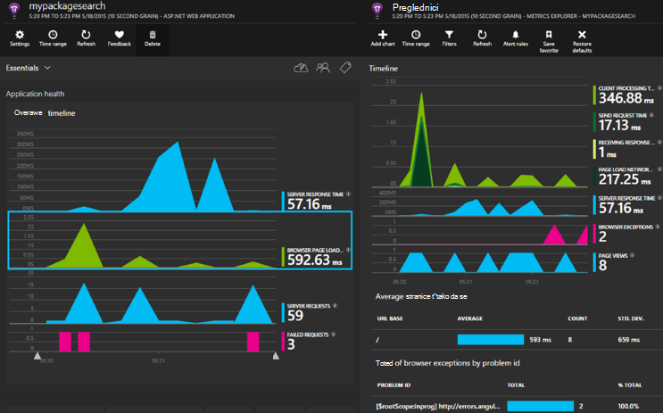

<properties 
    pageTitle="Uvidi aplikacija za Core platforme ASP.NET" 
    description="Praćenje web-aplikacije za dostupnost, performanse i korištenje." 
    services="application-insights" 
    documentationCenter=".net"
    authors="alancameronwills" 
    manager="douge"/>

<tags 
    ms.service="application-insights" 
    ms.workload="tbd" 
    ms.tgt_pltfrm="ibiza" 
    ms.devlang="na" 
    ms.topic="article" 
    ms.date="08/30/2016" 
    ms.author="awills"/>

# Uvidi aplikacija za Core platforme ASP.NET

[Uvid aplikacije za Visual Studio](app-insights-overview.md) omogućuje vam praćenje web-aplikaciju za dostupnost, performanse i korištenje. S povratnih informacija se o performansama i učinkovitosti aplikacije koji olakšavaju mogućnosti informirali o smjeru dizajna u svakom životni ciklus razvoja.

Potreban vam je pretplata s [Microsoft Azure](http://azure.com). Prijavite se pomoću Microsoftova računa koje možda imaju za Windows, XBox Live ili drugim Microsoftovim servisima u oblaku. Vaš tim može imati pretplate za tvrtke ili ustanove za Azure: zatražite od vlasnika da vas doda pomoću Microsoftova računa.

## Početak rada

Slijedite [Vodič za početak rada](https://github.com/Microsoft/ApplicationInsights-aspnetcore/wiki/Getting-Started).

## Korištenje aplikacije uvida

Prijavite se na [portal Microsoft Azure](https://portal.azure.com) i pregled resursa stvoriti aplikaciju za praćenje.

U zasebnom prozoru preglednika, pomoću aplikacije za neko vrijeme. Vidjet ćete podataka koji se pojavljuje u aplikaciji uvida grafikonima. (Možda ćete morati kliknite Osvježi.) Bit će samo malu količinu podataka dok je razvijate, ali tim grafikonima zaista dolaze aktivnosti Kad objavite aplikacije i imate mnogo korisnika. 

Na stranici pregled prikazuje grafikoni performansi ste vjerojatno će vas zanimati: vrijeme odaziva poslužitelja, vremena učitavanja stranice i brojanja zahtjeva nije uspjelo. Kliknite bilo koji od njih da biste vidjeli dodatne grafikona i podataka.

Prikazi na portalu ulaze u dvije glavne kategorije:

* [Metriku Explorer](app-insights-metrics-explorer.md) prikazuje grafikone i tablice metriku i broji kao što su vrijeme odaziva, pogreška tečajeve ili metrike koju ste sami stvorili pomoću [API-JA](app-insights-api-custom-events-metrics.md). Filtriranje i fazi podatke prema vrijednosti nekretnina da biste bolje razumjeli aplikacije i njezine korisnike.
* [Search Explorer](app-insights-diagnostic-search.md) navodi pojedinačne događaja, kao što su određenim zahtjevima, iznimke, zapisnika kašnjenja ili događaji koje ste sami stvorili s [API-JA](app-insights-api-custom-events-metrics.md). Filtriranje i pretraživanje događaje, a zatim otvorite među povezane događaja da biste istražili problema.
* [Analize](app-insights-analytics.md) omogućuje pokretanje nalik SQL upita putem vaše telemetrijskih pa je Napredna analitičke i dijagnostički alat.

## Upozorenja

* Automatski se [određene proaktivne dijagnostičkih upozorenja](app-insights-proactive-diagnostics.md) o anomalous promjene u neuspjeh stope i druge mjernih podataka.
* Postavljanje [dostupnosti testira](app-insights-monitor-web-app-availability.md) da biste testirali web-mjesta neprestano s mjesta diljem svijeta i pronađite poruke e-pošte čim sve testiranje ne uspije.
* Postavljanje [upozorenja metričkim](app-insights-monitor-web-app-availability.md) znati ako mjernih podataka kao što su vrijeme odaziva ili iznimke stope otvorite izvan ograničenja prihvatljiva.

## Dobiti dodatne telemetrijskih

* [Dodavanje telemetrijskih web-stranicama](app-insights-javascript.md) nadzor korištenja stranice i performansi.
* [Zavisnosti monitora](app-insights-dependencies.md) da biste vidjeli ako OSTALE, SQL ili drugim vanjskim izvorima usporava vam.
* [Korištenje na API-JA](app-insights-api-custom-events-metrics.md) da biste poslali vlastite događaja i mjernih podataka za detaljnije prikaz performanse i korištenje aplikacije programa.
* [Dostupnost testira](app-insights-monitor-web-app-availability.md) potvrdite aplikacije neprestano s diljem svijeta. 

## Otvori izvor

[Čitanje i sudjelovati u radu u kodu](https://github.com/Microsoft/ApplicationInsights-aspnetcore#recent-updates)

