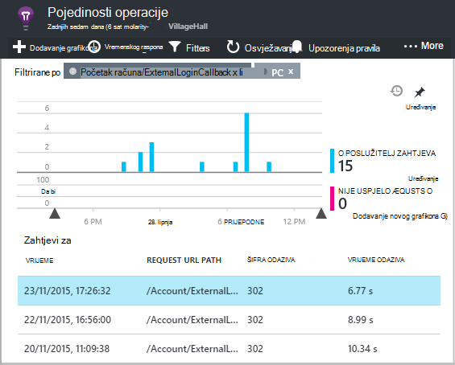

<properties 
    pageTitle="Ovisnost praćenja u aplikaciji uvida" 
    description="Analiza korištenje, dostupnost i performanse svog lokalnog ili web-aplikacije Microsoft Azure s uvida aplikacije." 
    services="application-insights" 
    documentationCenter=".net"
    authors="alancameronwills" 
    manager="douge"/>

<tags 
    ms.service="application-insights" 
    ms.workload="tbd" 
    ms.tgt_pltfrm="ibiza" 
    ms.devlang="na" 
    ms.topic="article" 
    ms.date="10/24/2016" 
    ms.author="awills"/>


# <a name="set-up-application-insights-dependency-tracking"></a>Postavljanje aplikacije uvida: praćenje ovisnost


[AZURE.INCLUDE [app-insights-selector-get-started-dotnet](../../includes/app-insights-selector-get-started-dotnet.md)]


*Ovisnost* je vanjski komponenta naziva aplikacije. Obično je servis naziva pomoću HTTP, baze podataka ili u datotečnom sustavu. U uvide aplikacije Visual Studio, jednostavno možete vidjeti koliko aplikacije čeka ovisnosti, a koliko često ne uspije ovisnost poziv.


Ovisnost Izlaz u-tvorničke monitor trenutno izvješća pozive na te vrste ovisnosti:

* PLATFORME ASP.NET
 * Baze podataka SQL
 * ASP.NET web- a WCF usluge koje koriste utemeljen na HTTP povezivanja
 * Lokalnom ili udaljenom HTTP poziva
 * Azure DocumentDb, tablice, blobova i reda čekanja
* Java
 * Pozivi u bazi podataka kroz [JDBC](http://docs.oracle.com/javase/7/docs/technotes/guides/jdbc/) upravljačkog programa, kao što su MySQL, SQL Server, PostgreSQL ili SQLite.
* JavaScript koda na web-stranicama – [web-stranicu SDK](app-insights-javascript.md) automatski evidentira pozive AJAX-a kao ovisnosti.

Možete napisati vlastitu pozive SDK praćenje drugih ovisnosti pomoću [TrackDependency API -JA](app-insights-api-custom-events-metrics.md#track-dependency).


## <a name="to-set-up-dependency-monitoring"></a>Da biste postavili ovisnost nadzora

Potreban vam je pretplata na [Microsoft Azure](http://azure.com) .

### <a name="if-your-app-runs-on-your-iis-server"></a>Ako aplikaciju izvodi na poslužitelj za IIS

Ako web-aplikaciju programa izvodi na .NET 4.6 ili noviji, možete ili [Instalacija uvida SDK aplikacije](app-insights-asp-net.md) u svojoj aplikaciji ili ponovno instalirati aplikaciju uvida Status Monitor. Ne morate oboje.

U suprotnom, instalirajte aplikaciju uvida Status monitora na poslužitelju:

1. Na IIS web-poslužitelj, prijava s vjerodajnicama za administratora.
2. Preuzmite i pokrenite [Nadzornik stanja installer](http://go.microsoft.com/fwlink/?LinkId=506648).
4. U čarobnjaku za instalaciju, prijavite se u Microsoft Azure.

    

    *Pogreške pri povezivanju? Potražite u članku [Otklanjanje poteškoća](#troubleshooting).*

5. Odaberite instaliranih web-aplikacije ili web-mjesto koje želite nadzirati, a zatim konfiguriranje resursa u kojem želite da biste vidjeli rezultate na portalu uvida aplikacije.

    

    Normalno, odaberite da biste konfigurirali novi resurs i [grupa resursa][roles].

    U suprotnom koristite postojeći resurs ako ste već postavili [testira web] [ availability] web-mjesta ili [web-klijentu nadzor][client].

6. Ponovno pokrenite IIS.

    

    Za uskoro će biti prekinut web-servisa.

6. Obratite pozornost na to da ApplicationInsights.config umetnut u web-aplikacije koje želite nadzirati.

    

   Postoje i neke promjene u web.config.

#### <a name="want-to-reconfigure-later"></a>Želite li (ponovno) konfigurirati kasnije?

Kada dovršite čarobnjak, ponovno možete konfigurirati agenta kad god želite. To možete koristiti i ako ste instalirali agenta, ali nema nekih problema s početnog postavljanja.


### <a name="if-your-app-runs-as-an-azure-web-app"></a>Ako aplikaciju izvodi kao web-aplikaciju programa Azure

Na upravljačkoj ploči web-aplikacije Azure dodajte proširenje uvida aplikacije.


### <a name="if-its-an-azure-cloud-services-project"></a>Ako je za projekt servisa Azure oblaka

[Dodavanje skripte na web- a tempiranja uloge](app-insights-cloudservices.md#dependencies). Ili ponovno [instalirati .NET framework 4.6 ili noviji](../cloud-services/cloud-services-dotnet-install-dotnet.md).

## <a name="diagnosis"></a>Dijagnosticiranje probleme s performansama ovisnost

Procijenite performanse zahtjeva na vašem poslužitelju, otvorite plohu performanse i pomaknite se do odjeljka susret rešetki zahtjeva za:


Gornji jedan traje neobično dugo. Pogledajmo ako smo možete saznati koje je utrošeno vrijeme.

Kliknite tom retku da biste vidjeli zahtjev za pojedinačne događaja:




Kliknite bilo koju dugoročnih instancu da biste ga dodatno pregledati.

Pomaknite se do odjeljka poziva udaljene ovisnost vezane uz taj zahtjev:


Izgleda većinu vremena održavanje zahtjev je utrošeno u pozivu lokalni servis. 


Odaberite tom retku da biste dobili dodatne informacije:


Pojedinosti sadrži potrebne informacije za dijagnosticiranje problema.


U slučaju različite bez ovisnost poziv je dugo, ali prebacivanjem na prikaz vremenske trake, možemo vidjeti gdje odgode došlo je do u našem Interna obrada:


## <a name="failures"></a>Pogreške

Ako postoje neuspjelih zahtjeva, kliknite grafikon.


Kliknite putem vrstu zahtjeva i instancu zahtjev, da biste pronašli nije uspjelo poziva udaljene ovisnosti.


## <a name="custom-dependency-tracking"></a>Prilagođeni ovisnost praćenja

Standardni modul ovisnost praćenje automatski otkriva vanjske ovisnosti kao što su baze podataka i REST API-ji. No možda ćete neke dodatne komponente tretirati na isti način. 

Kod koji šalje informacije o zavisnosti možete pisati pomoću isti [TrackDependency API](app-insights-api-custom-events-metrics.md#track-dependency) koji koriste standardni moduli.

Ako, na primjer, ako je kod stvaranja s grupom koju niste napisali sami, nije vrijeme sve pozive, da biste saznali što doprinos će se na vaše vrijeme odgovor. Da bi se ove podatke prikazane u ovisnosti grafikona u aplikaciji uvida, pošaljite je pomoću `TrackDependency`.

```C#

            var startTime = DateTime.UtcNow;
            var timer = System.Diagnostics.Stopwatch.StartNew();
            try
            {
                success = dependency.Call();
            }
            finally
            {
                timer.Stop();
                telemetry.TrackDependency("myDependency", "myCall", startTime, timer.Elapsed, success);
            }
```

Ako želite da biste se prebacili isključeno praćenje modul standardne ovisnost, uklonite referencu DependencyTrackingTelemetryModule u [ApplicationInsights.config](app-insights-configuration-with-applicationinsights-config.md).

## <a name="troubleshooting"></a>Otklanjanje poteškoća

*Ovisnost uspjeh označite uvijek prikazuje true ili false.*

* Nadograditi na najnoviju verziju SDK-a. Ako je vaša verzija .NET manje od 4.6, instalirajte [Nadzornik stanja](app-insights-monitor-performance-live-website-now.md).

## <a name="next-steps"></a>Daljnji koraci

- [Iznimke](app-insights-asp-net-exceptions.md)
- [Korisnik & stranica podataka][client]
- [Dostupnost](app-insights-monitor-web-app-availability.md)


<!--Link references-->

[api]: app-insights-api-custom-events-metrics.md
[apikey]: app-insights-api-custom-events-metrics.md#ikey
[availability]: app-insights-monitor-web-app-availability.md
[azure]: ../insights-perf-analytics.md
[client]: app-insights-javascript.md
[diagnostic]: app-insights-diagnostic-search.md
[metrics]: app-insights-metrics-explorer.md
[netlogs]: app-insights-asp-net-trace-logs.md
[portal]: http://portal.azure.com/
[qna]: app-insights-troubleshoot-faq.md
[redfield]: app-insights-asp-net-dependencies.md
[roles]: app-insights-resources-roles-access-control.md

 
