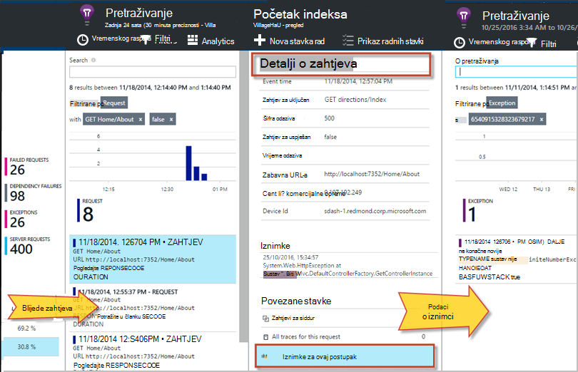

<properties 
    pageTitle="Dijagnosticiranje pogreške i iznimke u ASP.NET aplikacija s računala uvida" 
    description="Snimite iznimke iz aplikacija ASP.NET uz zahtjev za telemetriju." 
    services="application-insights" 
    documentationCenter=".net"
    authors="alancameronwills" 
    manager="douge"/>

<tags 
    ms.service="application-insights" 
    ms.workload="tbd" 
    ms.tgt_pltfrm="ibiza" 
    ms.devlang="na" 
    ms.topic="article" 
    ms.date="10/27/2016" 
    ms.author="awills"/>


# <a name="set-up-application-insights-diagnose-exceptions"></a>Postavljanje aplikacije uvida: dijagnosticiranje iznimke

[AZURE.INCLUDE [app-insights-selector-get-started-dotnet](../../includes/app-insights-selector-get-started-dotnet.md)]


Prateći aplikacije s [Uvida aplikacije za Visual Studio][start], možete povezivanje neuspjelih zahtjeva s iznimke i druge događaje na klijenta i poslužitelja, tako da možete brzo dijagnosticiranje uzroka.

Da biste pratili ASP.NET aplikacije, morate [dodati aplikaciju uvida SDK] [ greenbrown] aplikaciju ili [Instalacija Nadzornik stanja na poslužitelj za IIS][redfield], ili, ako je aplikacija web-aplikaciju programa Azure, dodajte [Proširenje uvida aplikacije](app-insights-azure-web-apps.md).

## <a name="diagnosing-exceptions-using-visual-studio"></a>Dijagnosticiranje iznimke pomoću Visual Studio

Otvorite aplikaciju rješenje u Visual Studio će vam pomoći u ispravljanje pogrešaka.

Pokrenite aplikaciju, na vašem poslužitelju ili na vašem računalu razvoj pomoću F5.

Otvaranje prozora za pretraživanje uvida aplikacije u Visual Studio i postaviti tako da prikazuje događaje iz aplikacije. Dok ste ispravljanje pogrešaka, to možete učiniti jednim klikom na gumb uvida aplikacije.


Obratite pozornost na to da možete filtrirati izvješće da biste prikazali samo iznimke. 

*Izuzetaka prikazuje? Potražite u članku [snimanje iznimke](#exceptions).*

Kliknite izvješće o iznimku da bi se prikazala njegova Praćenje stoga.


Kliknite reference redak u rezultatu praćenja snop da biste otvorili odgovarajuću datoteku.  

## <a name="diagnosing-failures-using-the-azure-portal"></a>Dijagnosticiranje pogreške pomoću portala za Azure

Iz aplikacije uvida pregled aplikacije pločicu neuspjeha prikazuje grafikone iznimki i nije uspjela HTTP zahtjeva okomite zahtjeva za URL-ovi koji uzrokuju Najčešći pogreške.


Kliknite preko jedne vrste zahtjeva na popisu da biste pristupili pojedinačne pojave pogreške. Iz njega, kliknite do iznimke ili bilo koje praćenje podataka povezanih s njom:




**Osim toga,** možete krenuti od na popis iznimki koje možete pronaći ćete daljnje dolje plohu pogreške. Zadrži kliknete dok ne naposljetku dođete do pojedinačne iznimke.


*Izuzetaka prikazuje? Potražite u članku [snimanje iznimke](#exceptions).*

Iz njega možete pogledati detaljne svojstva svaki iznimku i praćenje stoga i pronađite povezane zapisnika praćenja ili druge događaje.


[Dodatne informacije o dijagnostike pretraživanja][diagnostic].


## <a name="dependency-failures"></a>Ovisnost neuspjeha

*Ovisnost* je servis koji aplikacije nazove, obično putem veze za REST API-JA ili u bazi podataka. [Aplikacija uvida Status Monitor] [ redfield] automatski nadzire razne vrste ovisnost poziva za mjerenje trajanja poziva i uspjelo ili nije. 

Da biste dobili ovisnost podataka, morate [instalirati Nadzornik stanja] [ redfield] na poslužitelj za IIS ili ako je aplikacija web-aplikaciju programa Azure, koristite [Proširenje uvida aplikacije](app-insights-azure-web-apps.md). 

Nije uspjelo pozive ovisnosti navedene su na plohu pogreške, a možete pronaći i ih u odjeljku povezane stavke u detalji zahtjeva i detaljima o iznimci.

*Bez pogrešaka ovisnost? to je dobro. No da biste provjerili primate ovisnost podataka, otvorite plohu performanse i pogledajte ovisnost trajanje grafikona.*

 

## <a name="custom-tracing-and-log-data"></a>Prilagođeni praćenje i podaci iz zapisnika

Da biste dobili dijagnostičkih podataka specifičnih za aplikaciju, možete umetnuti kod da biste poslali telemetrijskih podataka. To prikazana u dijagnostičkih pretraživanju duž zahtjev, prikaz stranica i druge automatski prikupiti podatke. 

Imate nekoliko mogućnosti:

* [TrackEvent()](app-insights-api-custom-events-metrics.md#track-event) se obično koristi za nadzor uzoraka korištenja, ali podatke i šalje pojavit će se u odjeljku Prilagođeno događaji u dijagnostičkih pretraživanju. Događaji se nazivaju i mogu prenositi svojstva niza i numeričke mjernih podataka na kojoj možete [filtrirati dijagnostike pretraživanja][diagnostic].
* [TrackTrace()](app-insights-api-custom-events-metrics.md#track-trace) omogućuje vam slanje više podataka kao što su podaci objavu.
* [TrackException()](#exceptions) šalje stogu kašnjenja. [Dodatne informacije o iznimke](#exceptions).
* Ako već koristite zapisivanje framework kao što su Log4Net ili NLog, možete [snimiti te zapisnika] [ netlogs] da biste ih vidjeli u dijagnostike pretraživanja uz zahtjev i iznimke podataka.

Da biste vidjeli te događaje, otvorite [pretraživanje][diagnostic], otvaranje filtra, a zatim odaberite Prilagođena događaj, praćenje ili iznimke.


> [AZURE.NOTE] Aplikaciju generira mnogo telemetrijskih, modul prilagodljivo uzorkovanje automatski smanjite glasnoću koja je poslana na portal slanjem samo predstavniku razlomak događaja. Događaji koje su dio isti postupak će biti odabrana ili Neoznačeni grupe tako da možete se kretati između povezanih događaja. [Saznajte više o uzorkovanje.](app-insights-sampling.md)

### <a name="how-to-see-request-post-data"></a>Kako provjeriti zahtjev POST podatke

Detalji zahtjeva Nemoj uvrštavati podataka koji se šalju u aplikaciju za poziv u tijeku objavu. Da biste tih podataka prijavili:

* [Instalacija SDK] [ greenbrown] u projektu aplikacije.
* Umetanje koda u aplikaciji za pozivanje [Microsoft.ApplicationInsights.TrackTrace()][api]. Slanje podataka objavu u parametar poruke. Postoji ograničenje veličine dopušteno pa pokušajte da biste poslali samo ključne podatke.
* Kada istražili zahtjeva nije uspjelo, pronađite povezane kašnjenja.  


## <a name="exceptions"></a>Dohvaćanje iznimke i povezane dijagnostičkih podataka

Najprije, nećete vidjeti na portalu za sve iznimke uzrokovati pogreške u svojoj aplikaciji. Prikazat će se sve iznimke preglednika (Ako koristite [JavaScript SDK] [ client] u web-stranica). No većina poslužitelja iznimke su prepoznate IIS i morate pisati malo kod da biste ih vidjeli.

možeš:

* **Eksplicitno prijave iznimke** umetanjem kod u iznimku rukovatelja izvješća iznimke.
* **Automatski snimiti iznimke** konfiguriranjem vaše framework ASP.NET. Potrebni dodaci razlikuju za različite vrste framework.

## <a name="reporting-exceptions-explicitly"></a>Izvješćivanje o iznimke izričito

Najjednostavniji način je da biste umetnuli poziv TrackException() u rukovatelju iznimke.

JavaScript

    try 
    { ...
    }
    catch (ex)
    {
      appInsights.trackException(ex, "handler loc",
        {Game: currentGame.Name, 
         State: currentGame.State.ToString()});
    }

C#

    var telemetry = new TelemetryClient();
    ...
    try 
    { ...
    }
    catch (Exception ex)
    {
       // Set up some properties:
       var properties = new Dictionary <string, string> 
         {{"Game", currentGame.Name}};

       var measurements = new Dictionary <string, double>
         {{"Users", currentGame.Users.Count}};

       // Send the exception telemetry:
       telemetry.TrackException(ex, properties, measurements);
    }

VB

    Dim telemetry = New TelemetryClient
    ...
    Try
      ...
    Catch ex as Exception
      ' Set up some properties:
      Dim properties = New Dictionary (Of String, String)
      properties.Add("Game", currentGame.Name)

      Dim measurements = New Dictionary (Of String, Double)
      measurements.Add("Users", currentGame.Users.Count)
  
      ' Send the exception telemetry:
      telemetry.TrackException(ex, properties, measurements)
    End Try

Svojstva i mjere parametre nije obavezno, ali su korisne za [Filtriranje i dodavanje] [ diagnostic] dodatnih informacija. Na primjer, ako imate aplikaciju koja se može pokrenuti nekoliko igre, nije moguće pronaći sva izvješća iznimku vezana uz određena igra. Možete dodati proizvoljan broj stavki po želji svaki rječnik.

## <a name="browser-exceptions"></a>Iznimke u pregledniku

Većini preglednika iznimke prijavljene.

Ako web-stranicu obuhvaća datoteke skripti s mreže za isporuku sadržaja ili drugih domena, provjerite je li oznaka skripte sadrži atribut ```crossorigin="anonymous"```, a da poslužitelj šalje [CORS zaglavlja](http://enable-cors.org/). To će vam omogućiti da biste dobili Praćenje stoga i detalja za neobrađenu JavaScript iznimke od ovih resursa.

## <a name="web-forms"></a>Web-obrazaca

Za web-obrasce modul HTTP će moći prikupljanje iznimke kad postoje bez preusmjeravanja konfiguriran pomoću CustomErrors.

No ako imate aktivni preusmjeravanja, dodajte sljedeće retke funkcija Application_Error u Global.asax.cs. (Dodavanje Global.asax datoteke ako ga već nemate.)

*C#*

    void Application_Error(object sender, EventArgs e)
    {
      if (HttpContext.Current.IsCustomErrorEnabled && Server.GetLastError  () != null)
      {
         var ai = new TelemetryClient(); // or re-use an existing instance

         ai.TrackException(Server.GetLastError());
      }
    }


## <a name="mvc"></a>MVC

Ako je konfiguracija [CustomErrors](https://msdn.microsoft.com/library/h0hfz6fc.aspx) `Off`, tada će biti dostupan za [Modul HTTP](https://msdn.microsoft.com/library/ms178468.aspx) prikupljanje iznimke. Međutim, ako je `RemoteOnly` (zadano) ili `On`, tada iznimku će biti očišćenog i nije dostupna za aplikacije uvida automatski prikupiti. Ispravak koji nadjačavanje [System.Web.Mvc.HandleErrorAttribute predmete](http://msdn.microsoft.com/library/system.web.mvc.handleerrorattribute.aspx)i primjenom overridden predmete kao što je prikazano u različitim verzijama MVC ispod ([github izvora](https://github.com/AppInsightsSamples/Mvc2UnhandledExceptions/blob/master/MVC2App/Controllers/AiHandleErrorAttribute.cs)):

    using System;
    using System.Web.Mvc;
    using Microsoft.ApplicationInsights;

    namespace MVC2App.Controllers
    {
      [AttributeUsage(AttributeTargets.Class | AttributeTargets.Method, Inherited = true, AllowMultiple = true)] 
      public class AiHandleErrorAttribute : HandleErrorAttribute
      {
        public override void OnException(ExceptionContext filterContext)
        {
            if (filterContext != null && filterContext.HttpContext != null && filterContext.Exception != null)
            {
                //If customError is Off, then AI HTTPModule will report the exception
                if (filterContext.HttpContext.IsCustomErrorEnabled)
                {   //or reuse instance (recommended!). see note above  
                    var ai = new TelemetryClient();
                    ai.TrackException(filterContext.Exception);
                } 
            }
            base.OnException(filterContext);
        }
      }
    }

#### <a name="mvc-2"></a>MVC 2

Vaš novi atribut u vašem kontrolera zamijenite atribut HandleError.

    namespace MVC2App.Controllers
    {
       [AiHandleError]
       public class HomeController : Controller
       {
    ...

[Uzorak](https://github.com/AppInsightsSamples/Mvc2UnhandledExceptions)

#### <a name="mvc-3"></a>MVC 3

Registrirajte se `AiHandleErrorAttribute` kao globalni filtar u Global.asax.cs:

    public class MyMvcApplication : System.Web.HttpApplication
    {
      public static void RegisterGlobalFilters(GlobalFilterCollection filters)
      {
         filters.Add(new AiHandleErrorAttribute());
      }
     ...

[Uzorak](https://github.com/AppInsightsSamples/Mvc3UnhandledExceptionTelemetry)


#### <a name="mvc-4-mvc5"></a>MVC 4, MVC5

Da biste registrirali AiHandleErrorAttribute kao globalni filtar u FilterConfig.cs:

    public class FilterConfig
    {
      public static void RegisterGlobalFilters(GlobalFilterCollection filters)
      {
        // Default replaced with the override to track unhandled exceptions
        filters.Add(new AiHandleErrorAttribute());
      }
    }

[Uzorak](https://github.com/AppInsightsSamples/Mvc5UnhandledExceptionTelemetry)

## <a name="web-api-1x"></a>Web-API 1.x


Zanemarivanje System.Web.Http.Filters.ExceptionFilterAttribute:

    using System.Web.Http.Filters;
    using Microsoft.ApplicationInsights;

    namespace WebAPI.App_Start
    {
      public class AiExceptionFilterAttribute : ExceptionFilterAttribute
      {
        public override void OnException(HttpActionExecutedContext actionExecutedContext)
        {
            if (actionExecutedContext != null && actionExecutedContext.Exception != null)
            {  //or reuse instance (recommended!). see note above 
                var ai = new TelemetryClient();
                ai.TrackException(actionExecutedContext.Exception);    
            }
            base.OnException(actionExecutedContext);
        }
      }
    }

Nije moguće dodati overridden atribut određene kontrolera ili dodavanje konfiguracije globalnih filtra u razredu WebApiConfig: 

    using System.Web.Http;
    using WebApi1.x.App_Start;

    namespace WebApi1.x
    {
      public static class WebApiConfig
      {
        public static void Register(HttpConfiguration config)
        {
            config.Routes.MapHttpRoute(name: "DefaultApi", routeTemplate: "api/{controller}/{id}",
                defaults: new { id = RouteParameter.Optional });
            ...
            config.EnableSystemDiagnosticsTracing();

            // Capture exceptions for Application Insights:
            config.Filters.Add(new AiExceptionFilterAttribute());
        }
      }
    }

[Uzorak](https://github.com/AppInsightsSamples/WebApi_1.x_UnhandledExceptions)

Postoji nekoliko slučajeva koje ne prepoznaje filtri iznimke. Ako, na primjer:

* Iznimke izbačena iz constructors kontroler. 
* Iznimke izbačena iz rukovatelja poruke. 
* Iznimke izbačena tijekom usmjeravanja. 
* Iznimke izbačena tijekom sadržaja serijalizacije odgovor. 

## <a name="web-api-2x"></a>Web-API 2.x

Dodajte implementacija IExceptionLogger:

    using System.Web.Http.ExceptionHandling;
    using Microsoft.ApplicationInsights;

    namespace ProductsAppPureWebAPI.App_Start
    {
      public class AiExceptionLogger : ExceptionLogger
      {
        public override void Log(ExceptionLoggerContext context)
        {
            if (context !=null && context.Exception != null)
            {//or reuse instance (recommended!). see note above 
                var ai = new TelemetryClient();
                ai.TrackException(context.Exception);
            }
            base.Log(context);
        }
      }
    }

Dodaj na servise u WebApiConfig:

    using System.Web.Http;
    using System.Web.Http.ExceptionHandling;
    using ProductsAppPureWebAPI.App_Start;

    namespace WebApi2WithMVC
    {
      public static class WebApiConfig
      {
        public static void Register(HttpConfiguration config)
        {
            // Web API configuration and services

            // Web API routes
            config.MapHttpAttributeRoutes();

            config.Routes.MapHttpRoute(
                name: "DefaultApi",
                routeTemplate: "api/{controller}/{id}",
                defaults: new { id = RouteParameter.Optional }
            );
            config.Services.Add(typeof(IExceptionLogger), new AiExceptionLogger()); 
        }
      }
  }

[Uzorak](https://github.com/AppInsightsSamples/WebApi_2.x_UnhandledExceptions)

Kao Alternativa, koje nije moguće:

2. Samo ExceptionHandler zamijenite prilagođene implementaciji sustava IExceptionHandler. To je samo naziva kada framework je i dalje ćete moći odabrati koje poruku odgovora koju želite poslati (ne kada veza je prekinuta na primjer) 
3. Iznimke filtri (kao što je opisano u odjeljku Web API 1.x kontrolera gore) – ne poziva u svim slučajevima.


## <a name="wcf"></a>WCF

Dodajte predmet koji proširuje atribut i implementira IErrorHandler i IServiceBehavior.

    using System;
    using System.Collections.Generic;
    using System.Linq;
    using System.ServiceModel.Description;
    using System.ServiceModel.Dispatcher;
    using System.Web;
    using Microsoft.ApplicationInsights;

    namespace WcfService4.ErrorHandling
    {
      public class AiLogExceptionAttribute : Attribute, IErrorHandler, IServiceBehavior
      {
        public void AddBindingParameters(ServiceDescription serviceDescription,
            System.ServiceModel.ServiceHostBase serviceHostBase,
            System.Collections.ObjectModel.Collection<ServiceEndpoint> endpoints,
            System.ServiceModel.Channels.BindingParameterCollection bindingParameters)
        {
        }

        public void ApplyDispatchBehavior(ServiceDescription serviceDescription, 
            System.ServiceModel.ServiceHostBase serviceHostBase)
        {
            foreach (ChannelDispatcher disp in serviceHostBase.ChannelDispatchers)
            {
                disp.ErrorHandlers.Add(this);
            }
        }

        public void Validate(ServiceDescription serviceDescription, 
            System.ServiceModel.ServiceHostBase serviceHostBase)
        {
        }

        bool IErrorHandler.HandleError(Exception error)
        {//or reuse instance (recommended!). see note above 
            var ai = new TelemetryClient();

            ai.TrackException(error);
            return false;
        }

        void IErrorHandler.ProvideFault(Exception error, 
            System.ServiceModel.Channels.MessageVersion version, 
            ref System.ServiceModel.Channels.Message fault)
        {
        }
      }
    }

Dodajte atribut implementacije servisa:

    namespace WcfService4
    {
        [AiLogException]
        public class Service1 : IService1 
        { 
         ...

[Uzorak](https://github.com/AppInsightsSamples/WCFUnhandledExceptions)

## <a name="exception-performance-counters"></a>Iznimke mjerača performansi

Ako imate [instaliran Nadzornik stanja] [ redfield] na poslužitelju, možete dobiti grafikon stopu iznimke mjeri po .NET. To obuhvaća obrađene i neobrađenu .NET iznimke.

Otvaranje metriku Explorer plohu, dodajte novi grafikon i odaberite **iznimke stopa**, u odjeljku mjerača performansi. 

.NET framework izračunava stopu prebrojavanje iznimke u interval i dijeljenjem duljinu intervala. 

Imajte na umu da će se razlikovati od 'Iznimke' count izračunava pomoću portala za aplikacije uvida tako što broji TrackException izvješća. Intervale uzorkovanje razlikuju, a SDK ne šalje TrackException izvješća za sve obrađuju i neobrađenu iznimke.

<!--Link references-->

[api]: app-insights-api-custom-events-metrics.md
[client]: app-insights-javascript.md
[diagnostic]: app-insights-diagnostic-search.md
[greenbrown]: app-insights-asp-net.md
[netlogs]: app-insights-asp-net-trace-logs.md
[redfield]: app-insights-monitor-performance-live-website-now.md
[start]: app-insights-overview.md

 
