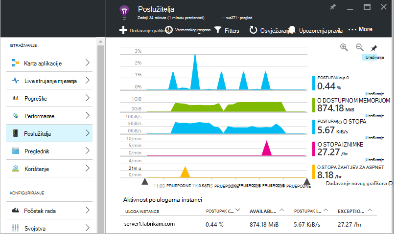
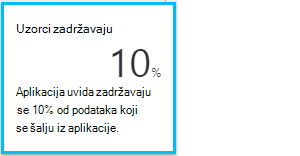

<properties 
    pageTitle="Bolje iskoristite aplikacije uvida | Microsoft Azure" 
    description="Nakon Uvod uvida aplikacije, ovo je sažetak značajki možete istraživati." 
    services="application-insights" 
    documentationCenter=".net"
    authors="alancameronwills" 
    manager="douge"/>

<tags 
    ms.service="application-insights" 
    ms.workload="tbd" 
    ms.tgt_pltfrm="ibiza" 
    ms.devlang="na" 
    ms.topic="article" 
    ms.date="10/27/2016" 
    ms.author="awills"/>

# <a name="more-telemetry-from-application-insights"></a>Dodatne telemetrijskih iz aplikacije uvida

Nakon što ste [dodali aplikacije uvida u kodu ASP.NET](app-insights-asp-net.md), postoji nekoliko stvari koje možete učiniti da biste još više telemetrijskih. 

## <a name="if-your-app-runs-on-your-iis-server-"></a>Ako aplikaciju izvodi na poslužitelj za IIS...

Ako aplikaciju nalazi se na poslužiteljima IIS u kontroli, instalirajte Monitor Status uvida aplikacije na poslužiteljima. Ako je već instalirana, ne morate ništa učiniti.

1. Na svakom IIS web-poslužitelju, prijavite se pomoću administratorske vjerodajnice.
2. Preuzmite i pokrenite [Nadzornik stanja installer](http://go.microsoft.com/fwlink/?LinkId=506648).
3. U čarobnjaku za instalaciju, prijavite se u Microsoft Azure.

Ne morate ništa učiniti, ali možete potvrditi da nadzor je omogućen za aplikacije.


(Možete i koristiti Nadzornik stanja da biste [omogućili nadzor prilikom izvođenja](app-insights-monitor-performance-live-website-now.md), čak i ako niste instrumenata aplikacije u Visual Studio.)

### <a name="what-do-you-get"></a>Što vam dobivam?

Ako Status Monitor je instaliran na poslužitelju, primit ćete neke dodatne telemetrijskih:

* Ovisnost telemetriju (SQL poziva i OSTALE pozive, pokrenite aplikaciju) za .NET 4,5 aplikacije. (Za novijim verzijama sustava .NET Nadzornik stanja nije potrebna za telemetriju ovisnost.) 
* Iznimke stogu kašnjenja Pokaži više detalja.
* Mjerača performansi. U uvida računala te mjerača pojavljuju se u plohu poslužiteljima. 



Da biste vidjeli više ili manje mjerača [Uređivanje grafikona](app-insights-metrics-explorer.md). Ako brojač performanse želite nije dostupan skup, možete [dodati skup prikupljene putem modula brojač performanse](app-insights-performance-counters.md).

## <a name="if-its-an-azure-web-app-"></a>Ako je Azure web-aplikaciju programa...

Ako aplikaciju izvodi kao Azure web-aplikaciju programa, otvorite Azure upravljačku ploču za aplikacije ili VM i otvorite plohu uvida aplikacije. 

### <a name="what-do-you-get"></a>Što vam dobivam?

* Iznimke stogu kašnjenja Pokaži više detalja.
* Ovisnost telemetriju (SQL poziva i OSTALE pozive, pokrenite aplikaciju) za .NET 4,5 aplikacije. (Za novijim verzijama sustava .NET proširenje nije potrebna za telemetriju ovisnost.) 


(Vam može poslužiti ovu metodu da biste [omogućili performanse nadzor prilikom izvođenja](app-insights-monitor-performance-live-website-now.md), čak i ako niste instrumenata aplikacije u Visual Studio.)

## <a name="client-side-monitoring"></a>Nadzor klijentskoj strani

Instalirate SDK koje šalje telemetrijskih podataka s poslužitelja (pozadinskih) aplikacije. Sada možete dodati klijentsko nadzor. Ovo vam omogućuje podatke na korisnike, sesije, prikaza stranice i iznimke ili ruši koji se pojavljuju u pregledniku. Također ćete moći sami kod da biste pratili kako korisnici funkcioniraju s aplikacijom desno prema dolje do detaljne razinu klikova i pritisaka na tipke.

Dodavanje isječak jezika JavaScript uvida aplikacije svaki web-stranicu da biste dobili telemetrijskih iz preglednika klijenta.

1. Azure, otvorite aplikaciju uvida resurs za aplikaciju.
2. Početak rada monitora na strani klijenta, otvorite i kopirajte u isječak.
3. Zalijepite tako da se pojavljuje u zaglavlje svake stranice web - obično to možete učiniti tako da lijepljenje u stranici izgled matrice.


Obratite pozornost na to sadrži li kod tipku instrumentation koja služi za identifikaciju vašeg računala resursa.

### <a name="what-do-you-get"></a>Što vam dobivam?

* Možete napisati JavaScript da biste poslali [prilagođene telemetrijskih iz web-stranica](app-insights-api-custom-events-metrics.md), na primjer da biste pratili klika na gumb.
* U [analize](app-insights-analytics.md), podataka u `pageViews` i AJAX podataka u `dependencies`. 
* [Performanse klijenta i podataka o korištenju](app-insights-javascript.md) u preglednicima plohu.


[Dodatne informacije o web-stranici za praćenje.](app-insights-web-track-usage.md)


## <a name="track-application-version"></a>Praćenje verzija aplikacije

Provjerite je li `buildinfo.config` je generirao proces MSBuild. U datoteci .csproj dodajte:  

```XML

    <PropertyGroup>
      <GenerateBuildInfoConfigFile>true</GenerateBuildInfoConfigFile>    <IncludeServerNameInBuildInfo>true</IncludeServerNameInBuildInfo>
    </PropertyGroup> 
```

Kada je Sastavi informacije, modul web aplikacije uvida automatski dodaje **verzija aplikacije** kao svojstvo svaku stavku telemetrijskih. Koji omogućuje vam da biste filtrirali prema verziju prilikom izvođenja [dijagnostike pretraživanja](app-insights-diagnostic-search.md) ili [Istraživanje mjernih podataka](app-insights-metrics-explorer.md). 

Međutim, imajte na umu da Sastavi broj verzije je generirao isključivo MS Build ne Sastavi za razvojne inženjere u Visual Studio.


## <a name="availability-web-tests"></a>Testira web dostupnosti

Slanje web-aplikaciju programa HTTP zahtjeva u pravilnim vremenskim razmacima iz diljem svijeta. Ne možemo vas ako je odgovor sporo ili nepouzdanih.

U aplikaciju uvida resursa za aplikaciju, kliknite pločicu dostupnosti za dodavanje, uređivanje i prikaz testira web.

Možete dodati više testova koji se izvodi na više mjesta.


[uči više](app-insights-monitor-web-app-availability.md)

## <a name="custom-telemetry-and-logging"></a>Prilagođeni telemetrijskih i zapisivanje

Paketi uvida aplikacije koje ste dodali kod pružaju API-JA koji možete nazvati iz aplikacije.

* [Stvaranje vlastite događaja i mjernih podataka](app-insights-api-custom-events-metrics.md), da biste, primjerice broj disciplina tvrtke ili praćenje performansi.
* [Prikupljanje zapisnika kašnjenja](app-insights-asp-net-trace-logs.md) Log4Net, NLog ili System.Diagnostics.Trace.
* [Filtriranje, izmijenili, ili proširiti](app-insights-api-filtering-sampling.md) standardni telemetrijskih iz aplikacije programa poslao zapisivanje Telemetrijskih procesora. 


## <a name="powerful-analysis-and-presentation"></a>Napredna analiza i prezentaciju

Postoji mnogo načina pregledavanje podataka. Ako ste nedavno rada s uvida aplikacije, potražite u sljedećim člancima:

||
|---|---
|[**Dijagnostike pretraživanja na primjer podataka**](app-insights-visual-studio.md)<br/>Pretraživanja i filtriranja događaje kao što su zahtjeve, iznimke, ovisnosti pozive, kašnjenja zapisnika i prikaza stranice. U Visual Studio, idite na kod iz kašnjenja stogu.|
|[**Explorer metriku za skupne podatke**](app-insights-metrics-explorer.md)<br/>Istraživanje, filtriranje i fazi skupne podatke kao što su učestalost zahtjeva, pogreške i iznimke; vrijeme odgovor, vremena učitavanja stranice.|
|[**Nadzorne ploče**](app-insights-dashboards.md#dashboards)<br/>Kombinirali podataka iz više resursa i zajednički koristiti s drugima. Sjajan je za više komponenti aplikacije i za neprekinuti prikaza u sobu za tim.  |
|[**Live strujanje mjerenja**](app-insights-metrics-explorer.md#live-metrics-stream)<br/>Ako pokrenete novi Sastavi, pogledajte ove blizu--sadržajima pokazatelji da biste provjerili sve funkcionira ispravno.|
|[**Analytics**](app-insights-analytics.md)<br/>Odgovor teška pitanja o performansama i korištenje aplikacije programa pomoću naprednih upita jezik.|
|[**Automatskog i ručnog upozorenja**](app-insights-alerts.md)<br/>Automatske obavijesti o prilagoditi pokrenite aplikaciju normalni uzoraka telemetrijskih i okidača kada nešto izvan uobičajenog uzorka. Upozorenja možete postaviti i na određene razine prilagođeni ili standardni mjernih podataka.|

## <a name="data-management"></a>Upravljanje podacima

|||
|---|---|
|[**Neprekinuti izvoza**](app-insights-export-telemetry.md)<br/>Kopirajte sve telemetrijskih prostor za pohranu tako da ih možete analizirati vlastite način.|
|**Pristup podacima API-JA**<br/>dolazim brzo.|
|[**Stvaranje uzoraka**](app-insights-sampling.md)<br/>Smanjuje brzinu podataka i vam omogućuje ostajanje u unutar ograničenja za vaše cijene sloju.|