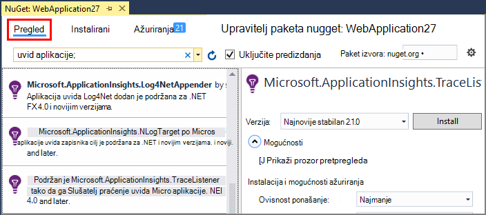

<properties 
    pageTitle="Istražite .NET praćenje zapisnika u aplikaciji uvida" 
    description="Pretraživanje zapisnika generirao praćenja, NLog ili Log4Net." 
    services="application-insights" 
    documentationCenter=".net"
    authors="alancameronwills" 
    manager="douge"/>

<tags 
    ms.service="application-insights" 
    ms.workload="tbd" 
    ms.tgt_pltfrm="ibiza" 
    ms.devlang="na" 
    ms.topic="article" 
    ms.date="07/21/2016" 
    ms.author="awills"/>
 
# <a name="explore-net-trace-logs-in-application-insights"></a>Istražite .NET praćenje zapisnika u aplikaciji uvida  

Ako koristite NLog, log4Net ili System.Diagnostics.Trace za dijagnostičkih praćenje u ASP.NET aplikacija može imati vaše zapisnika poslane [Visual Studio aplikacije uvid]u[start], gdje možete istraživati i pretraživati ih. Vaš zapisnika će se spojiti s drugim telemetrijskih koji dolaze iz aplikacije, tako da mogu prepoznavanje kašnjenja pridružene održavanje svaki zahtjev za korisnika i njihovo povezivanje s drugim događajima i iznimke izvješća.


> [AZURE.NOTE] Morate li modul prikupljanje zapisnika? Je korisno prilagodnik za bilježe tipkanje 3 trećih strana, no ako trenutno ne koristite NLog, log4Net ili System.Diagnostics.Trace, razmislite o samo izravno pozivanje [TrackTrace() uvida aplikacije](app-insights-api-custom-events-metrics.md#track-trace) .


## <a name="install-logging-on-your-app"></a>Instalacija prijave aplikacije

Instalirajte na odabranom zapisivanje framework u projektu. Posljedica mora biti unos u app.config ili web.config.

Ako koristite System.Diagnostics.Trace, morate dodati stavku web.config:

```XML

    <configuration>
     <system.diagnostics>
       <trace autoflush="false" indentsize="4">
         <listeners>
           <add name="myListener" 
             type="System.Diagnostics.TextWriterTraceListener" 
             initializeData="TextWriterOutput.log" />
           <remove name="Default" />
         </listeners>
       </trace>
     </system.diagnostics>
   </configuration>
```

## <a name="configure-application-insights-to-collect-logs"></a>Konfiguriranje aplikacije uvida prikupljanje zapisnika

**[Dodavanje aplikacije uvid u projekt](app-insights-asp-net.md)** ako to još niste učinili. Vidjet ćete mogućnost da biste uključili prikupljanje zapisnika.

Ili **Konfiguriranje aplikacije uvida** tako da desnom tipkom miša kliknete projekta u programu Explorer rješenja. Odaberite mogućnost **Konfiguracija zbirka praćenja**.

*Nema aplikacije uvida izbornik ili zapisnik prikupljanje mogućnosti?* Pokušajte [Otklanjanje poteškoća](#troubleshooting).


## <a name="manual-installation"></a>Ručna instalacija

Ovu metodu koristite ako je vaš vrsta projekta ne podržava installer uvida aplikacije (primjerice Windows radne površine projekta). 

1. Ako namjeravate koristiti log4Net ili NLog, instalirajte ga u projektu. 
2. U pregledniku rješenja, desnom tipkom miša kliknite projekt i odaberite **Upravljanje NuGet paketa**.
3. Traženje "Aplikacije uvida"

    

4. Odaberite odgovarajući paket – jedan od:
  + Microsoft.ApplicationInsights.TraceListener (da biste snimili System.Diagnostics.Trace pozive)
  + Microsoft.ApplicationInsights.NLogTarget
  + Microsoft.ApplicationInsights.Log4NetAppender

Paket NuGet instalira potrebne sklopova i i mijenja web.config ili app.config.

## <a name="insert-diagnostic-log-calls"></a>Umetanje dijagnostičkog zapisnika poziva

Ako koristite System.Diagnostics.Trace, uobičajeni poziv bio sljedeći:

    System.Diagnostics.Trace.TraceWarning("Slow response - database01");

Ako biste radije log4net ili NLog:

    logger.Warn("Slow response - database01");


## <a name="using-the-trace-api-directly"></a>Izravno pomoću praćenje API-JA

Praćenje aplikacija uvida API možete nazvati izravno. Zapisivanje prilagodnika pomoću ovog API-JA. 

Ako, na primjer:

    var telemetry = new Microsoft.ApplicationInsights.TelemetryClient();
    telemetry.TrackTrace("Slow response - database01");

Prednost TrackTrace se može smjestiti relativno dugačkih podataka u poruci. Ako, na primjer, nije moguće kodiranje postoji POST podatke. 

Osim toga, možete dodati na razinu težinu poruku. Možete i kao što su druge telemetrijskih možete dodati vrijednosti svojstava koje možete koristiti radi filtriranja ili pretraživanja za različite skupove kašnjenja. Ako, na primjer:


    var telemetry = new Microsoft.ApplicationInsights.TelemetryClient();
    telemetry.TrackTrace("Slow database response",
                   SeverityLevel.Warning,
                   new Dictionary<string,string> { {"database", db.ID} });

To činite omogućuju, u odjeljku [pretraživanje][diagnostic], da biste jednostavno filtriranje svih poruka obavješćivanje razine koji se odnose na određenu bazu podataka.

## <a name="explore-your-logs"></a>Istražite vaše zapisnika

Pokrenite aplikaciju ili u načinu rada za ispravljanje pogrešaka ili uvođenje uživo.

U plohu pregled pokrenite aplikaciju na [portalu aplikacije uvida][portal], odaberite [pretraživanje][diagnostic].


Možete, primjerice:

* Filtriranje zapisnika kašnjenja i stavke s određenim svojstvima
* Provjeri određenu stavku detaljno.
* Traženje drugih telemetrijskih koji se odnose na isti zahtjev korisnika (to jest, s istom OperationId) 
* Spremanje konfiguracije ove stranice kao favorita

> [AZURE.NOTE] **Uzorkovanje.** Ako aplikacija šalje velike količine podataka i koristite uvide SDK aplikacije za ASP.NET verzije 2.0.0-beta3 ili noviji, značajku prilagodljivo uzorkovanje može raditi i pošaljite samo postotak vaše telemetrijskih. [Saznajte više o uzorkovanje.](app-insights-sampling.md)

## <a name="next-steps"></a>Daljnji koraci

[Dijagnosticiranje pogreške i iznimke u ASP.NET][exceptions]

[Dodatne informacije o pretraživanje][diagnostic].


## <a name="troubleshooting"></a>Otklanjanje poteškoća

### <a name="how-do-i-do-this-for-java"></a>Kako to napraviti za Java?

Pomoću [Java zapisnika prilagodnika](app-insights-java-trace-logs.md).

### <a name="theres-no-application-insights-option-on-the-project-context-menu"></a>Ne postoji mogućnost uvida aplikacije na kontekstnom izborniku projekta

* Provjerite je na ovom računalu razvoj instalirani alati za aplikaciju uvide. U izborniku Alati za Visual Studio Extensions i ažuriranja, potražite aplikaciju uvida Alati. Ako još nije kartica instalira, otvorite karticu internetska i instalirajte ga.
* To može biti vrsta projekta ne podržava aplikacija uvida Alati. Korištenje [ručnog instalacije](#manual-installation).

### <a name="no-log-adapter-option-in-the-configuration-tool"></a>Mogućnost bez zapisnika prilagodnik u alat za konfiguraciju

* Morate najprije instalirajte framework zapisivanje.
* Ako koristite System.Diagnostics.Trace, provjerite je li vam [konfiguriran u `web.config` ](https://msdn.microsoft.com/library/system.diagnostics.eventlogtracelistener.aspx).
* Imate imate najnoviju verziju aplikacije uvida Alati? U izborniku **Alati** za Visual Studio, odaberite **proširenja i ažuriranja**i otvorite karticu **ažuriranja** . Ako aplikacija uvida Alati tamo nalazi, kliknite je ažurirajte.


### <a name="emptykey"></a>Prikazuje se pogreška "Instrumentation ključa ne može biti prazna"

Izgleda kao da ste instalirali paket Nuget prilagodnika zapisivanje bez instaliranja aplikacije uvide.

U pregledniku rješenja, desnom tipkom miša kliknite `ApplicationInsights.config` , a zatim odaberite **Ažuriranje aplikacije uvide**. Prikazat će se dijaloški okvir koji vas za prijavu na Azure poziva pa stvorite resursa do uvida aplikacije ili iskoristite postojeći. Koje treba alata za popravak.

### <a name="i-can-see-traces-in-diagnostic-search-but-not-the-other-events"></a>Prikazuje kašnjenja u dijagnostike pretraživanja, ali ne na druge događaje

Ponekad može potrajati neko vrijeme događaja i zahtjevi za dohvaćanje kroz kanal.

### <a name="limits"></a>Koliko se podaci se zadržavaju?

Do 500 događaji sekundi iz svaku aplikaciju. Događaji koje se zadržavaju sedam dana.

### <a name="im-not-seeing-some-of-the-log-entries-that-i-expect"></a>Ne vidi se neke stavke evidencije koje očekujem

Ako aplikacija šalje velike količine podataka i koristite uvide SDK aplikacije za ASP.NET verzije 2.0.0-beta3 ili noviji, značajku prilagodljivo uzorkovanje može raditi i pošaljite samo postotak vaše telemetrijskih. [Saznajte više o uzorkovanje.](app-insights-sampling.md)

## <a name="add"></a>Daljnji koraci

* [Postavljanje dostupnosti i testira odziv][availability]
* [Otklanjanje poteškoća][qna]


<!--Link references-->

[availability]: app-insights-monitor-web-app-availability.md
[diagnostic]: app-insights-diagnostic-search.md
[exceptions]: app-insights-asp-net-exceptions.md
[portal]: https://portal.azure.com/
[qna]: app-insights-troubleshoot-faq.md
[start]: app-insights-overview.md

 
