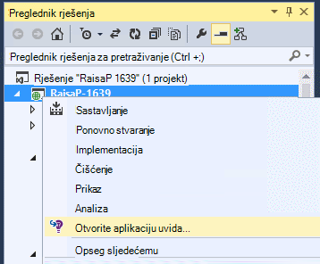

<properties 
    pageTitle="Postavljanje web-aplikacije Analitika za ASP.NET s računala uvida | Microsoft Azure" 
    description="Konfiguriranje performanse, dostupnost i analitičkih podataka o web-mjestu ASP.NET hostira lokalnog ili Azure." 
    services="application-insights" 
    documentationCenter=".net"
    authors="NumberByColors" 
    manager="douge"/>

<tags 
    ms.service="application-insights" 
    ms.workload="tbd" 
    ms.tgt_pltfrm="ibiza" 
    ms.devlang="na" 
    ms.topic="get-started-article" 
    ms.date="10/13/2016" 
    ms.author="awills"/>


# <a name="set-up-application-insights-for-aspnet"></a>Postavljanje aplikacije uvida za platforme ASP.NET

[Uvid aplikacije za Visual Studio](app-insights-overview.md) nadzire uživo aplikacije da biste lakše [Otkrivanje i dijagnosticiranje probleme s performansama i iznimke](app-insights-detect-triage-diagnose.md)i [ustanovili korištenja aplikacije](app-insights-overview-usage.md).  Radi aplikacije za koje se nalaze na vlastitu lokalne poslužitelje IIS ili oblaka VMs, kao i Azure web-aplikacije.


## <a name="before-you-start"></a>Prije početka

trebaš:

* Visual Studio ažuriranje 2013 3 ili noviji. Kasnije je bolje.
* Pretplate na [Microsoft Azure](http://azure.com). Ako vaš tim ili tvrtka ili ustanova ima Azure pretplatu, vlasnik možete dodati ste ga pomoću [Microsoftova računa](http://live.com). 

Dva su druge članke možete pogledati ako vas zanima:

* [Vrijeme izvođenja instrumenting web-aplikacijama](app-insights-monitor-performance-live-website-now.md)
* [Azure servise u Oblaku](app-insights-cloudservices.md)

## <a name="ide"></a>1. dodavanje aplikacije uvida SDK


### <a name="if-its-a-new-project"></a>Ako je novi projekt...

Obavezno aplikacije uvida prilikom stvaranja novog projekta u Visual Studio. 


### <a name="-or-if-its-an-existing-project"></a>... ili ako je postojeći projekt

Desnom tipkom miša kliknite projekt u pregledniku rješenja i odaberite web-mjesto **Dodati Telemetrijskih uvida aplikacije** ili u okvir za **Konfiguriranje aplikacije uvida**.


* Temeljni ASP.NET projekt? – [Slijedite ove upute da biste riješili problem nekoliko redaka koda](https://github.com/Microsoft/ApplicationInsights-aspnetcore/wiki/Getting-Started#add-application-insights-instrumentation-code-to-startupcs). 


## <a name="run"></a>2. pokretanje aplikacije

Pokrenite aplikaciju s F5 i isprobajte sami: otvaranje različite stranice da biste generirali neke telemetrijskih.

U Visual Studio, pogledajte broj događaja koji su zapisane. 


## <a name="3-see-your-telemetry"></a>3. na telemetriju u odjeljku...

### <a name="-in-visual-studio"></a>... u Visual Studio

Otvorite prozor aplikacije uvida u Visual Studio: kliknite gumb uvida aplikacije ili desnom tipkom miša kliknite projekta u programu Explorer rješenja:


Ova prikaz prikazuje telemetrijskih generira na strani poslužitelja aplikacije. Eksperimentirajte s filtrima pa kliknite bilo koji događaj da biste vidjeli dodatne detalje.

[Saznajte više o alatima aplikacije uvida u Visual Studio](app-insights-visual-studio.md).

<a name="monitor"></a> 
### <a name="-in-the-portal"></a>... na portalu

Osim ako ne odaberete *Instalirati SDK samo,* možete vidjeti i telemetrijskih na web-portalu uvida aplikacije. 

Na portalu ima grafikone, analitičkih alata i nadzornih ploča od Visual Studio. 


Otvorite svoje aplikacije uvida resursa [Azure portal](https://portal.azure.com/).



Otvorit će se na portal u prikazu telemetrijskih iz aplikacije programa:

* Prvi telemetrijskih pojavljuje se u [uživo metriku strujanje](app-insights-metrics-explorer.md#live-metrics-stream).
* Pojedinačne događaji se pojavljuju u **pretraživanje** (1). Podataka može potrajati nekoliko minuta da se pojavi. Kliknite bilo koji događaj da biste vidjeli njezina svojstva. 
* Zbrojeno mjernih podataka prikazuju se u grafikonima (2). Može potrajati minutu ili dvije podataka pojavi ovdje. Kliknite bilo koji od njih da biste otvorili na plohu s više detalja.

[Dodatne informacije o korištenju aplikacije uvida na portalu za Azure](app-insights-dashboards.md).

## <a name="4-publish-your-app"></a>4. objavljivanje aplikacije

Objavljivanje aplikacija za IIS poslužitelj ili za Azure. Pogledajte [uživo metriku strujanje](app-insights-metrics-explorer.md#live-metrics-stream) da biste provjerili sve što je nesmetan.

Vidjet ćete svoje telemetrijskih izgradnji na portalu uvida aplikacije, gdje možete nadzirati mjernih podataka, pretraživanja na telemetrijskih i postaviti [nadzorne ploče](app-insights-dashboards.md). Napredne [analize jezika za upite](app-insights-analytics.md) možete koristiti i radi analize korištenja i performanse i pronašli određene događaje. 

Možete nastaviti i analizirati telemetriju u [Visual Studio](app-insights-visual-studio.md) s alatima kao što su dijagnostike pretraživanja i [trendova](app-insights-visual-studio-trends.md).

> [AZURE.NOTE] Ako aplikaciju šalje dovoljno telemetrijskih da biste postići [Ograničavanje ograničenja](app-insights-pricing.md#limits-summary), automatsko [stvaranje uzoraka](app-insights-sampling.md) se prebacuje. Stvaranje uzoraka smanjuje količinu telemetrijskih poslane iz aplikacije, uz čuvanje povezanog podataka dijagnostičkih svrhe.


##<a name="land"></a>Što nije "Dodavanje aplikacije uvida"?

Aplikacija uvida šalje telemetrijskih iz aplikacije programa portal za aplikacije uvida (koji se nalazi u Microsoft Azure):


Da bi se naredba nije tri stvari:

1. Dodavanje paketa aplikacije uvida Web SDK NuGet u projekt. Da biste vidjeli u Visual Studio, desnom tipkom miša kliknite projekt, a zatim odaberite upravljanje NuGet paketa.
2. Stvaranje do uvida aplikacije resursa na [portalu za Azure](https://portal.azure.com/). Evo gdje ćete vidjeti podatke. Dohvaća *ključ instrumentation* koji označava resurs.
3. Umeće ključ instrumentation u `ApplicationInsights.config`, tako da se SDK možete poslati telemetrijskih portalu.

Ako želite, to možete učiniti sljedeće korake ručno [ASP.NET 4](app-insights-windows-services.md) ili [ASP.NET Core](https://github.com/Microsoft/ApplicationInsights-aspnetcore/wiki/Getting-Started).

### <a name="to-upgrade-to-future-sdk-versions"></a>Da biste nadogradili na budućim verzijama SDK

Da biste nadogradili na [Novo izdanje SDK](https://github.com/Microsoft/ApplicationInsights-dotnet-server/releases), ponovno otvorite upravitelj paketa NuGet i filtrirati na instaliranih paketa. Odaberite Microsoft.ApplicationInsights.Web, a zatim odaberite nadogradnju.

Ako ste sve prilagodbe ApplicationInsights.config, spremite kopiju prije nadogradnje, a naknadno spojiti promjene novu verziju.

## <a name="add-more-telemetry"></a>Dodavanje više telemetrijskih

### <a name="web-pages-and-single-page-apps"></a>Web-stranica i aplikacija za jednu stranicu

1. [Dodavanje isječak jezika JavaScript](app-insights-javascript.md) web-stranicama Osnovno gore preglednika i korištenje blades s podacima o prikaza stranice učitava, iznimke preglednika, performanse poziv AJAX-a korisnika i sesiju.
2. [Prilagođene događaje kod](app-insights-api-custom-events-metrics.md) broj, vrijeme ili mjeru korisničkim akcijama.

### <a name="dependencies-exceptions-and-performance-counters"></a>Zavisnosti, iznimke i mjerača performansi

[Instalacija Monitor stanje](app-insights-monitor-performance-live-website-now.md) na svim računalima na poslužitelju da biste dobili dodatne telemetrijskih o aplikacije. Evo što se:

* [Mjerača performansi](app-insights-performance-counters.md) - 
procesora, memorije, na disku i druge mjerača performansi koji se odnose na aplikaciju. 
* [Iznimke](app-insights-asp-net-exceptions.md) – detaljnije telemetrijskih za neke iznimke.
* [Zavisnosti](app-insights-asp-net-dependencies.md) - pozive REST API-JA ili SQL usluga. Saznajte više li na koji sporo odgovore vanjske komponente uzrokuju probleme s performansama u svojoj aplikaciji. (Ako aplikacije izvodi na .NET 4.6, ne morate Nadzornik stanja da biste dobili ovo telemetrijskih.)

### <a name="diagnostic-code"></a>Dijagnostički Šifra

Imate problema? Ako želite umetnuti kod u aplikaciji za dijagnostiku ga, imate nekoliko mogućnosti:

* [Prikupljanje zapisnika kašnjenja](app-insights-asp-net-trace-logs.md): Ako već koristite Log4N, NLog ili System.Diagnostics.Trace za zapisivanje događaja praćenje izlaz može poslati aplikacije uvid u tako da možete je povezivanje s zahtjeve, pretraživanje kroz nju i analizirati. 
* [Prilagođene događaje i metrike](app-insights-api-custom-events-metrics.md): korištenje TrackEvent() i TrackMetric() poslužitelja ili kod web-stranice.
* [Oznaka telemetrijskih s dodatna svojstva](app-insights-api-filtering-sampling.md#add-properties)

Pomoću [pretraživanja](app-insights-diagnostic-search.md) za pronalaženje i povezivanje određene događaje i [analize](app-insights-analytics.md) za izvođenje naprednijih upita.

## <a name="alerts"></a>Upozorenja

Biti prvi znati ako aplikacije ima poteškoća. (Ne Pričekajte da vam korisnici reći!) 

* [Testira Stvori web](app-insights-monitor-web-app-availability.md) da biste bili sigurni da je vidljiva na webu web-mjesto.
* [Određene proaktivne Dijagnostika](app-insights-proactive-diagnostics.md) pokretanje automatski (Ako aplikacije sadrži određen minimalni iznos prometa). Ne morate ništa ih možete postaviti. Mogu vam reći ima li aplikacije stopu neobičan neuspjelih zahtjeva.
* [Postavljanje upozorenja metričkim](app-insights-alerts.md) vas upozoriti ako metrike presjek praga. Možete postaviti na prilagođeni metriku kod koji u aplikaciju.

Prema zadanim postavkama upozorenja šalju se vlasniku Azure pretplate. 


## <a name="version-and-release-tracking"></a>Verzija i izdanje praćenja

### <a name="track-application-version"></a>Praćenje verzija aplikacije

Provjerite je li `buildinfo.config` je generirao proces MSBuild. U datoteci .csproj dodajte:  

```XML

    <PropertyGroup>
      <GenerateBuildInfoConfigFile>true</GenerateBuildInfoConfigFile>    <IncludeServerNameInBuildInfo>true</IncludeServerNameInBuildInfo>
    </PropertyGroup> 
```

Kada je Sastavi informacije, modul web aplikacije uvida automatski dodaje **verzija aplikacije** kao svojstvo svaku stavku telemetrijskih. Koji omogućuje vam da biste filtrirali prema verziju prilikom izvođenja [dijagnostike pretraživanja](app-insights-diagnostic-search.md) ili [Istraživanje mjernih podataka](app-insights-metrics-explorer.md). 

Međutim, imajte na umu da Sastavi broj verzije je generirao isključivo MS Build ne Sastavi za razvojne inženjere u Visual Studio.

### <a name="release-annotations"></a>Pustite primjedbe

Ako koristite Visual Studio Team Services, možete [dobiti na oznaku primjedbu](app-insights-annotations.md) dodali grafikone svaki put kada pustite novu verziju.


## <a name="next-steps"></a>Daljnji koraci

| | 
|---|---
|**[Rad s računala uvida u Visual Studio](app-insights-visual-studio.md)**<br/>Ispravljanje pogrešaka s dijagnostičkih telemetrijskih za pretraživanje, Brazdanje kod.|
|**[Rad s portala za aplikacije uvida](app-insights-dashboards.md)**<br/>Nadzorne ploče, naprednih alata dijagnostičkih i analitički, a zatim upozorenja, kartu uživo ovisnost aplikacije i telemetrijskih izvoz. |
|**[Dodavanje dodatnih podataka](app-insights-asp-net-more.md)**<br/>Nadzor korištenja, dostupnost, ovisnosti, iznimke. Integrirati kašnjenja iz zapisivanje okviri. Napišite prilagođenu telemetrijskih. | 


