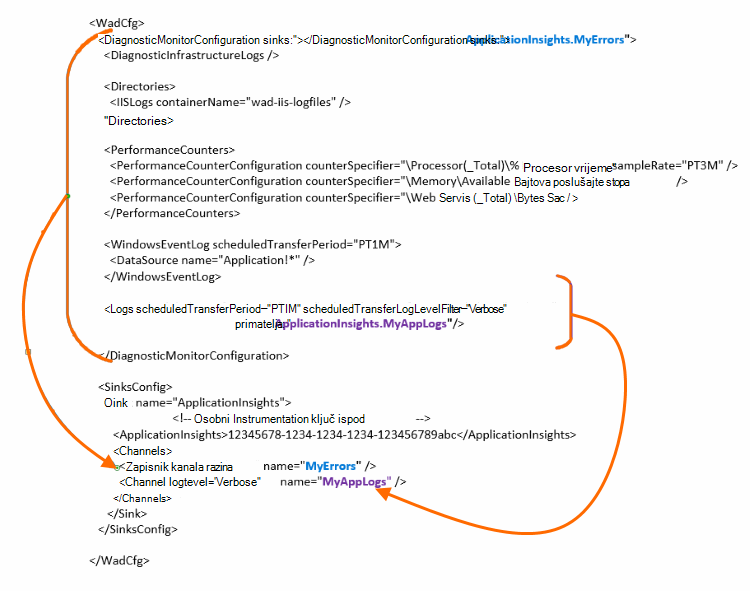

<properties
    pageTitle="Slanje Azure dijagnostičkih zapisnika aplikacije uvid u"
    description="Konfiguriranje pojedinosti servise u Oblaku Azure zapisnicima dijagnostičkih podataka koji se šalju portal za aplikacije uvide."
    services="application-insights"
    documentationCenter=".net"
    authors="sbtron"
    manager="douge"/>

<tags
    ms.service="application-insights"
    ms.workload="tbd"
    ms.tgt_pltfrm="ibiza"
    ms.devlang="na"
    ms.topic="article"
    ms.date="11/17/2015"
    ms.author="awills"/>

# <a name="configure-azure-diagnostic-logging-to-application-insights"></a>Konfiguriranje Azure dijagnostičkog zapisnika do uvida aplikacije

Kada postavite projekta servise u Oblaku ili virtualnog računala u Microsoft Azure [Azure možete generirati dijagnostičkog zapisnika](../vs-azure-tools-diagnostics-for-cloud-services-and-virtual-machines.md). Imate to poslali uvida aplikacije pa ih možete analizirati uz Dijagnostika i korištenje telemetrijskih poslao iz aplikacije uvida SDK aplikacije. Azure zapisnik sadrži događaje u upravljanju aplikacije kao što su početka, zaustavljanje, ruši, kao i mjerača performansi. Zapisnik obuhvaća i pozive u aplikaciji za System.Diagnostics.Trace.

U ovom se članku opisuje Konfiguriranje dijagnostičkog snimke detaljno.

Potreban vam je Azure SDK 2,8 instaliran u Visual Studio.

## <a name="get-an-application-insights-resource"></a>Početak do uvida aplikacije resursa

Za najbolje sučelje, [Dodavanje uvida SDK aplikacije za svaku ulogu aplikacije servisa u Oblaku](app-insights-cloudservices.md), ili [bilo kakve aplikaciju će pokrenuti u vašem VM](app-insights-overview.md). Zatim možete poslati dijagnostičkih podataka da biste se analizirati i prikazati isti resurs uvida aplikacije.

Osim toga, ako ne želite koristiti SDK -, na primjer, ako je već uživo - aplikaciju možete samo [Stvaranje nove uvide aplikacije resursa](app-insights-create-new-resource.md) na portalu za Azure. Odaberite **Azure Dijagnostika** kao vrsta aplikacije.


## <a name="send-azure-diagnostics-to-application-insights"></a>Slanje Azure Dijagnostika do uvida aplikacije

Ako ne može ažurirati aplikaciju projekta, zatim u Visual Studio odaberite ulogama, odaberite Svojstva, a na kartici konfiguracije odaberite **Pošalji Dijagnostika aplikacije uvid u**.

Ako je aplikacija već uživo, koristite Visual Studio Explorer poslužitelja ili explorer servise u Oblaku da biste otvorili svojstva aplikacije. Odaberite **Pošalji Dijagnostika do uvida aplikacije**.

U svakom slučaju će se zatražiti detalje aplikacije uvida resursa koji ste stvorili.

[Dodatne informacije o postavljanju uvida aplikacije za aplikaciju servisa u Oblaku](app-insights-cloudservices.md).

## <a name="configuring-the-azure-diagnostics-adapter"></a>Konfiguriranje prilagodnika Azure dijagnostiku

Samo za čitanje na ako želite odabrati dijelove zapisnika koje šaljete aplikacije uvid u. Prema zadanim postavkama, sve se šalje, uključujući: Microsoft Azure događaje; mjerača performansi; Praćenje poziva iz aplikacije System.Diagnostics.Trace.

Azure Dijagnostika sprema podatke tablice Azure prostora za pohranu. Međutim, možete i kanala sve ili podskup podataka do uvida aplikacije konfiguriranjem "primatelja" i "kanala" u konfiguraciji prilikom korištenja Azure Dijagnostika proširenje 1.5 ili noviji.

### <a name="configure-application-insights-as-a-sink"></a>Konfiguriranje aplikacije uvida kao na primatelj

Kada koristite uloga svojstva da biste postavili "Slanje podataka do uvida aplikacije", SDK Azure (2,8 ili noviji) dodaje na `<SinksConfig>` element javnu [Azure Dijagnostika konfiguracijska datoteka](https://msdn.microsoft.com/library/azure/dn782207.aspx) uloge.

`<SinksConfig>`definira dodatne primatelj gdje se mogu poslati podatke Azure Dijagnostika.  Primjer `SinksConfig` izgleda ovako:

```xml

    <SinksConfig>
     <Sink name="ApplicationInsights">
      <ApplicationInsights>{Insert InstrumentationKey}</ApplicationInsights>
      <Channels>
        <Channel logLevel="Error" name="MyTopDiagData"  />
        <Channel logLevel="Verbose" name="MyLogData"  />
      </Channels>
     </Sink>
    </SinksConfig>

```

Na `ApplicationInsights` element određuje ključ instrumentation koji služi za identifikaciju aplikacije uvida resursa koji će se slati Azure Dijagnostika podataka. Kad odaberete resursa, on je automatski popunjavaju na temelju na `APPINSIGHTS_INSTRUMENTATIONKEY` konfiguraciju servisa. (Ako želite ručno postavljanje zatražite tipku od Essentials padajući popis resursa.)

`Channels`Definiranje podataka koja će se slati primatelj. Kanal ponaša se kao filtar. Na `loglevel` atribut omogućuje vam da odredite razinu zapisnika koju ćete poslati kanal. Dostupne vrijednosti: `{Verbose, Information, Warning, Error, Critical}`.

### <a name="send-data-to-the-sink"></a>Slanje podataka u primatelj

Slanje podataka do uvida aplikacije sita dodavanjem atribut primatelji u odjeljku čvor DiagnosticMonitorConfiguration. Dodavanje element primatelji svaki čvor određuje koje želite da se podaci prikupljeni s tom čvor i svi čvorovi ispod njega slati primatelj naveden.

Ako, na primjer, zadani stvorio Azure SDK je da biste poslali sve podatke Azure dijagnostičkih:

```xml

    <DiagnosticMonitorConfiguration overallQuotaInMB="4096" sinks="ApplicationInsights">
```

No ako želite poslati samo evidencije pogrešaka ispunjavate uvjete primatelj naziv s nazivom kanala:

```xml

    <DiagnosticMonitorConfiguration overallQuotaInMB="4096" sinks="ApplicationInsights.MyTopDiagdata">
```

Imajte na umu da ne možemo koristite naziv primatelj koji ste definirali, zajedno s naziv kanala koji ste definirali iznad.

Ako samo želite poslati zapisnike opširno aplikacije aplikacije uvid u, zatim dodajte primatelji atribut u `Logs` čvor.

```xml

    <Logs scheduledTransferPeriod="PT1M" scheduledTransferLogLevelFilter="Verbose" sinks="ApplicationInsights.MyLogData"/>
```

Također mogu sadržavati više primatelji u konfiguraciji na različitim razinama hijerarhije. U tom slučaju primatelj naveden na najvišoj razini hijerarhije djeluje kao općih postavki i jedan naveden u činovi element pojedinačne element kao što je Odbaci da biste tu općih postavki.

Ovdje je dovršena primjer javna konfiguracijska datoteka koje šalje sve pogreške aplikacije uvid u (navedeni pri na `DiagnosticMonitorConfiguration` čvor) i nadalje opširno razinu zapisnike zapisnici aplikacije (navedeni pri na `Logs` čvor).

```xml

    <WadCfg>
     <DiagnosticMonitorConfiguration overallQuotaInMB="4096"
       sinks="ApplicationInsights.MyTopDiagData"> <!-- All info below sent to this channel -->
      <DiagnosticInfrastructureLogs />
      <PerformanceCounters>
        <PerformanceCounterConfiguration counterSpecifier="\Processor(_Total)\% Processor Time" sampleRate="PT3M" sinks="ApplicationInsights.MyLogData/>
        <PerformanceCounterConfiguration counterSpecifier="\Memory\Available MBytes" sampleRate="PT3M" />
        <PerformanceCounterConfiguration counterSpecifier="\Web Service(_Total)\Bytes Total/Sec" sampleRate="PT3M" />
      </PerformanceCounters>
      <WindowsEventLog scheduledTransferPeriod="PT1M">
        <DataSource name="Application!*" />
      </WindowsEventLog>
      <Logs scheduledTransferPeriod="PT1M" scheduledTransferLogLevelFilter="Verbose"
            sinks="ApplicationInsights.MyLogData"/>
       <!-- This specific info sent to this channel -->
     </DiagnosticMonitorConfiguration>

     <SinksConfig>
      <Sink name="ApplicationInsights">
        <ApplicationInsights>{Insert InstrumentationKey}</ApplicationInsights>
        <Channels>
          <Channel logLevel="Error" name="MyTopDiagData"  />
          <Channel logLevel="Verbose" name="MyLogData"  />
        </Channels>
      </Sink>
     </SinksConfig>
    </WadCfg>
```



Postoje određena ograničenja Imajte na umu s ta je funkcija:

* Kanala samo namijenjeni su rad s vrste zapisa i mjerača performansi. Ako navedete kanala elementom brojač performanse će zanemariti.
* Razina zapisnika za kanal ne može prelaziti razinu zapisnika za što je koji se prikupljanju Azure Dijagnostika. Na primjer: ne prikupljanje zapisnika aplikacije pogrešaka u zapisnicima element i poslali tekstni zapisnika za sinkronizaciju uvid aplikacije. Atribut scheduledTransferLogLevelFilter moraju uvijek prikupljanje jednaka ili više zapisnika od zapisnike pokušavate poslati na primatelj.
* Ne možete poslati podatke blob prikupi Azure Dijagnostika proširenje aplikacije uvid u. Na primjer sve navedene u odjeljku čvor direktorija. Za pad ako ste stvarni pad i dalje poslat će se bloba prostora za pohranu i samo u pad generirana obavijest poslat će se aplikacija uvid u.

## <a name="related-topics"></a>Povezane teme

* [Nadzor Azure oblaka usluge s ugovorima o aplikaciji uvida](app-insights-cloudservices.md)
* [Da biste poslali Azure Dijagnostika aplikacije uvid u pomoću komponente PowerShell](app-insights-powershell-azure-diagnostics.md)
* [Azure Dijagnostika konfiguracijska datoteka](https://msdn.microsoft.com/library/azure/dn782207.aspx)
