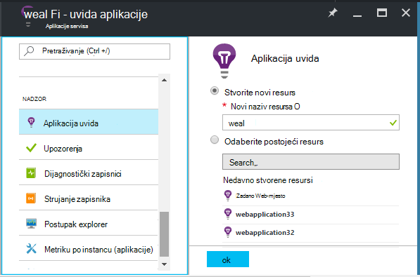
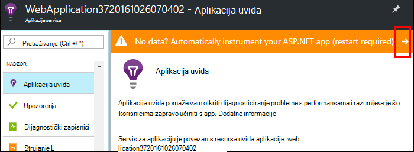
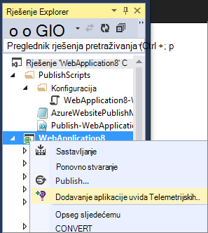
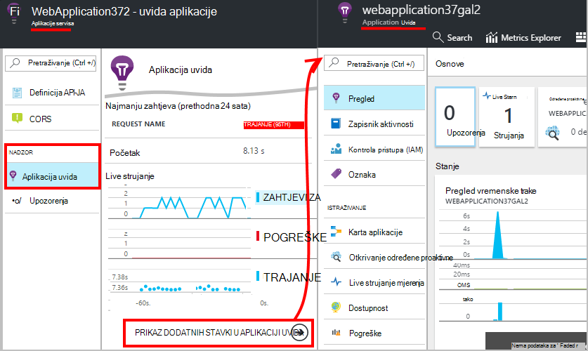
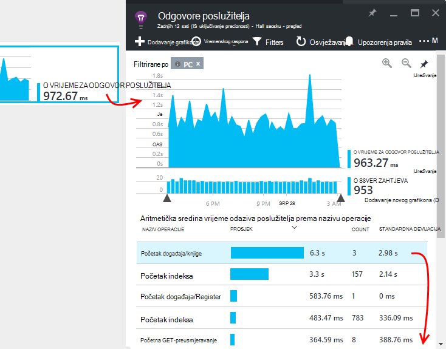
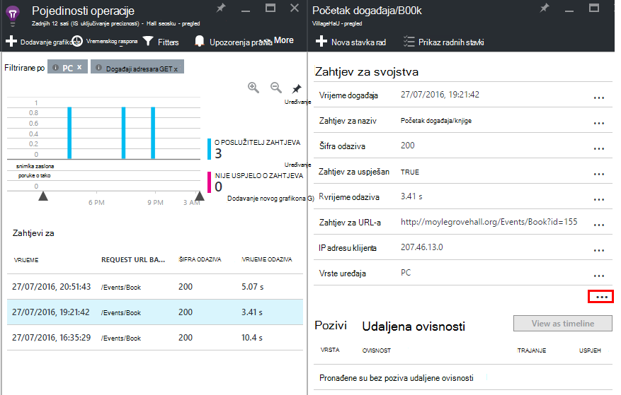

<properties
    pageTitle="Praćenje performansi Azure web app | Microsoft Azure"
    description="Performanse aplikacije nadzor Azure web-aplikacijama. Grafikon vremena učitavanja i odgovora, podaci o ovisnosti i postavljanje upozorenja na performanse."
    services="application-insights"
    documentationCenter=".net"
    authors="alancameronwills"
    manager="douge"/>

<tags
    ms.service="azure-portal"
    ms.workload="na"
    ms.tgt_pltfrm="na"
    ms.devlang="na"
    ms.topic="article"
    ms.date="10/24/2016"
    ms.author="awills"/>

# Praćenje performansi Azure web app

[Portal za Azure](https://portal.azure.com) možete postaviti aplikacije za [Azure web-aplikacije](../app-service-web/app-service-web-overview.md)za praćenje performansi. [Uvid aplikacije za Visual Studio](app-insights-overview.md) instruments aplikacije da biste poslali telemetrijskih njegov aktivnostima uvida aplikacije servisa, gdje je pohranjena i analizirati. Postoji, metrike grafikone i Alati za pretraživanje mogu se pomoć za dijagnosticiranje problema, poboljšali performanse i procijenite korištenje.

## Vrijeme izvođenja i sastavljanje vremena

Možete konfigurirati nadzor po instrumenting aplikaciju na dva načina:

* **Vrijeme izvođenja** - možete odabrati performanse nadzor nastavak kad je već web-aplikaciju programa uživo. Nije potrebno ponovno stvaranje ili ponovno instalirati aplikaciju. Dobit standardnog skupa paketi za praćenje odgovora puta, postocima uspjeha, iznimke, ovisnosti i tako dalje. 
 
* **Sastavljanje vrijeme** - instalirate paket u svojoj aplikaciji u razvoju. Ta je mogućnost raznovrsniji. Uz isti standardne paketa možete napisati kod da biste prilagodili za telemetriju ili da biste poslali vlastite telemetrijskih. Prijavite se mogu određenih aktivnosti i događaja zapisa prema semantiku domene aplikacije. 

## Vođenje instrumentation vrijeme uz aplikacije uvida

Ako već imate web-aplikacijama u Azure, već se neke nadzor: zahtjev i pogreškama stope. Dodavanje uvida aplikacije da biste bolje, kao što su vrijeme odaziva, nadzor pozive ovisnosti pametne otkrivanje i napredne analize upita jezik. 

1. **Odaberite aplikaciju uvida** Azure na upravljačkoj ploči za web-aplikacije.

    

 * Odaberite da biste stvorili novi resurs, osim ako ste već postavili do uvida aplikacije resurs za ovu aplikaciju prema drugom usmjeravanje.

2. **Instrument web-aplikaciju programa** nakon instaliranja aplikacije uvide. 

    

3. **Monitor aplikacije**.  [Expore podatke](#explore-the-data).

Noviju verziju, možete izraditi i ponovno implementirate aplikaciju pomoću aplikacije uvida ako želite.

*Kako ukloniti aplikaciju uvide, ili prijeđite na slanje drugi resurs?*

* U Azure, otvorite plohu za kontrolu web app, a u odjeljku Alati za razvoj odjeljak **proširenja**. Izbrišite nastavak uvida aplikacije. Zatim u odjeljku nadzor, odaberite uvida aplikacije i stvaranje ili odabir resursa koji želite.

## Sastavljanje aplikaciju pomoću aplikacije uvida

Aplikacija uvida unijeti detaljnije telemetrijskih instalacijom programa SDK u aplikaciju. Posebno prikupljanje zapisnika praćenja [napišite prilagođenu telemetrijskih](../application-insights/app-insights-api-custom-events-metrics.md), i dobiti detaljnije iznimku izvješća.

1. **U Visual Studio** (ažuriranje iz 2013 2 ili novija verzija), dodajte uvida SDK aplikacije u projekt.

    

    Ako se zatraži prijavite se pomoću vjerodajnica za vaš račun za Azure.

    Postupak sastoji se od dva efekata:

 1. Stvara do uvida aplikacije resursa u Azure, gdje telemetrijskih pohranjuju, analizirati i prikazuju.
 2. Dodaje paketa aplikacije uvida NuGet kodu i konfigurira je da biste poslali telemetrijskih Azure resursa.

2. **Test za telemetriju** tako da pokrenete aplikaciju na računalu razvoj (F5).

3. **Objavljivanje aplikacija** za Azure na uobičajen način. 

*Kako se prebaciti slanju drugi resurs uvida aplikacije?*

* U Visual Studio, desnom tipkom miša kliknite projekt, odaberite **uvida aplikacije > Konfiguriraj** , a zatim odaberite resurs koji želite. Prikazat će se mogućnost da biste stvorili novi resurs. Ponovno stvaranje i ponovno implementirate.

## Istraživanje podataka

1. Na plohu uvida aplikacije programa na upravljačkoj ploči web app, vidjet ćete Live metrike koji se prikazuje zahtjeve i pogrešaka u drugi ili dvije od njih koje su se pojavile. Prikaz vrlo koristan je kada se ponovno objavljivanje aplikacije – odmah vidjeti probleme.

2. Kliknite kroz cijeli resursa uvida aplikacije.

    
    

    Možete posjetiti i tamo izravno iz navigacije Azure resursa.

2. Kliknite putem bilo koji od njih da biste dobili dodatne detalje:

    

    Možete [prilagoditi blades mjernih podataka](../application-insights/app-insights-metrics-explorer.md).

3. Kliknite kroz se potražite u članku pojedinačne događaja i njihova svojstva:

    

    Obratite pozornost na "..." veza da biste otvorili sva svojstva.

    Možete [prilagoditi pretraživanja](../application-insights/app-insights-diagnostic-search.md).

Jače pretraživanja putem vaše telemetrijskih pomoću [analize jezika za upite](../application-insights/app-insights-analytics-tour.md).

## Daljnji koraci

* [Omogućivanje Azure Dijagnostika](app-insights-azure-diagnostics.md) slati aplikacije uvid u.
* [Monitor servis stanja metriku](../monitoring-and-diagnostics/insights-how-to-customize-monitoring.md) da biste bili sigurni na servisu dostupan je i odredište.
* [Primanje upozorenja](../monitoring-and-diagnostics/insights-receive-alert-notifications.md) kad god radu događajima ili metriku Unakrsna praga.
* Pomoću [Aplikacije Uvidi za JavaScript aplikacije i stranica web-](app-insights-web-track-usage.md) klijenta telemetrijskih iz preglednika koji se posjetite web-mjesto.
* [Postavljanje dostupnosti web testira](app-insights-monitor-web-app-availability.md) biti obaviješteni ako je web-mjesto prema dolje.
