<properties
   pageTitle="Uvide aplikacije za servise u Oblaku za Azure"
   description="Praćenje web- a tempiranja uloge s računala uvida"
   services="application-insights"
   documentationCenter=""
   authors="soubhagyadash"
   manager="douge"
   editor="alancameronwills"/>

<tags
   ms.service="application-insights"
   ms.devlang="na"
   ms.tgt_pltfrm="ibiza"
   ms.topic="article"
   ms.workload="tbd"
   ms.date="03/02/2016"
   ms.author="sdash"/>

# <a name="application-insights-for-azure-cloud-services"></a>Uvid u aplikaciji za servise u Oblaku Azure


*Aplikacija uvida se pretpregled*

[Aplikacije servisa Microsoft Azure Cloud](https://azure.microsoft.com/services/cloud-services/) možete nadzire [Uvida aplikacije za Visual Studio] [ start] za dostupnost, performanse, pogrešaka i korištenje. S povratnih informacija se o performansama i učinkovitosti aplikacije koji olakšavaju odabire informirali o smjeru dizajna u svakom životni ciklus razvoja.

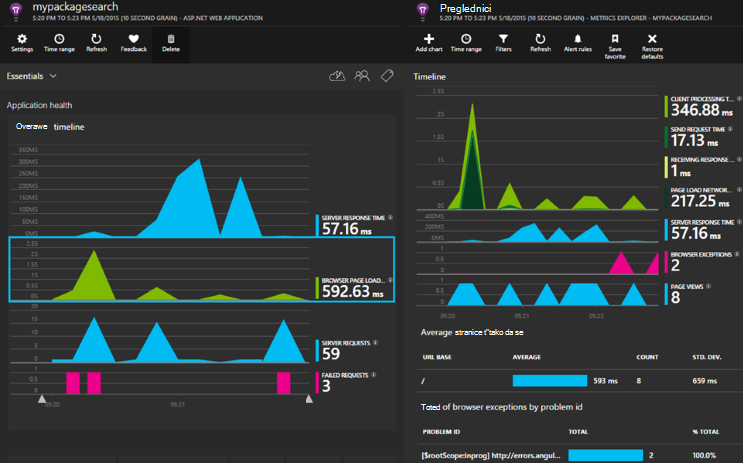

Potreban vam je pretplata s [Microsoft Azure](http://azure.com). Prijavite se pomoću Microsoftova računa koje možda imaju za Windows, XBox Live ili drugim Microsoftovim servisima u oblaku. 


#### <a name="sample-application-instrumented-with-application-insights"></a>Primjer aplikacije instrumented s uvide aplikacije

Pogledajte ove [Ogledni program](https://github.com/Microsoft/ApplicationInsights-Home/tree/master/Samples/AzureEmailService) u kojem uvida aplikacije se dodaje na servis u oblaku s dva tempiranja ulogama smješten u Azure. 

Što slijedi objašnjeno kako prilagoditi vlastitim oblaka servisa project na isti način.

## <a name="create-an-application-insights-resource-for-each-role"></a>Stvaranje programa aplikacije uvide resursa za svaku ulogu

Na aplikaciju uvide resurs je gdje analizirati i prikazati telemetrijskih podataka.  

1.  [Portal za Azure][portal], stvorite novi resurs uvida aplikacije. Za vrstu aplikacije, odaberite ASP.NET aplikacija. 

    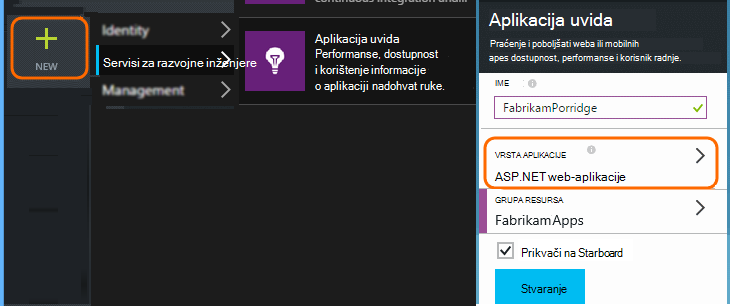

2.  Preuzimanje kopije tipku Instrumentation. Potreban vam je to uskoro da biste konfigurirali SDK-a.

    


Obično je [najbolje je stvoriti zasebnu resursa za podatke iz ulogama web i tempiranja](app-insights-separate-resources.md). 

Umjesto toga, nije moguće poslati podatke iz svih uloga samo jedan resurs, ali postavite [svojstvo default] [ apidefaults] tako da možete filtrirati ili grupe rezultate iz svaku ulogu.

## <a name="sdk"></a>Instalirajte SDK u svaki projekt


1. U Visual Studio Uredi paketa NuGet oblak aplikacije projekta.

    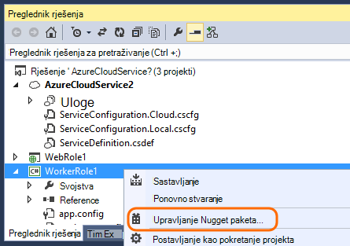


2. Uloge za web, dodajte NuGet paket [Uvide aplikaciju za web-mjesto](http://www.nuget.org/packages/Microsoft.ApplicationInsights.Web) . Ova verzija obuhvaća module koji dodajte kontekst poslužitelja kao što su informacije o ulozi. Uloga suradnika, korištenja [Uvide aplikacija za Windows poslužitelja](https://www.nuget.org/packages/Microsoft.ApplicationInsights.WindowsServer/).

    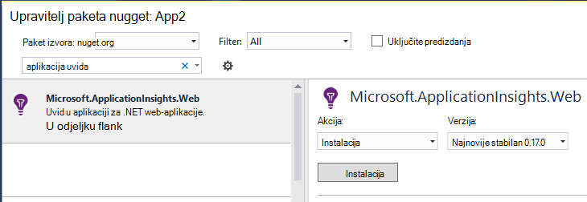


3. Konfiguriranje SDK slanje podataka u resursa uvida aplikacije.

    Postavi tipku instrumentation kao postavke konfiguracije u datoteci `ServiceConfiguration.Cloud.cscfg`. ([Ogledni kod](https://github.com/Microsoft/ApplicationInsights-Home/blob/master/Samples/AzureEmailService/AzureEmailService/ServiceConfiguration.Cloud.cscfg)).
 
    ```XML
     <Role name="WorkerRoleA"> 
      <Setting name="APPINSIGHTS_INSTRUMENTATIONKEY" value="YOUR IKEY" /> 
     </Role>
    ```
 
    U funkciji odgovarajuću pokretanja, postavite ključ instrumentation iz postavke konfiguracije:

    ```C#
     TelemetryConfiguration.Active.InstrumentationKey = RoleEnvironment.GetConfigurationSettingValue("APPINSIGHTS_INSTRUMENTATIONKEY");
    ```

    Napomena, s istim nazivom `APPINSIGHTS_INSTRUMENTATIONKEY` konfiguracije postavka koristit će Azure Dijagnostika izvješćivanje. 


    Postupak za svaku ulogu u aplikaciji. Pogledajte primjere:
 
 * [Uloge za web](https://github.com/Microsoft/ApplicationInsights-Home/blob/master/Samples/AzureEmailService/MvcWebRole/Global.asax.cs#L27)
 * [Uloga suradnika](https://github.com/Microsoft/ApplicationInsights-Home/blob/master/Samples/AzureEmailService/WorkerRoleA/WorkerRoleA.cs#L232)
 * [Za web-stranice](https://github.com/Microsoft/ApplicationInsights-Home/blob/master/Samples/AzureEmailService/MvcWebRole/Views/Shared/_Layout.cshtml#L13)   

4. Postavite ApplicationInsights.config datoteku na kopirat uvijek izlaznog direktorija. 

    (U datoteci .config, vidjet ćete poruke s pitanjem želite li postavite ključ instrumentation. Međutim, za aplikacije oblak bolje je da biste postavili .cscfg datoteke. Na taj način da ulogu ispravno prepoznati na portalu.)


#### <a name="run-and-publish-the-app"></a>Pokretanje i objavljivanje aplikacije

Pokrenite aplikaciju i prijavite se u Azure. Otvorite aplikaciju uvida resursi koji ste stvorili, a ćete vidjeti pojedinačnih točaka podataka koji se pojavljuje u [pretraživanju](app-insights-diagnostic-search.md)i pridružuje podataka u [Programu Explorer metriku](app-insights-metrics-explorer.md). 

Dodavanje više telemetrijskih – potražite u odjeljcima ispod -, a zatim objavite aplikacije da biste dobili uživo Dijagnostika i korištenje povratne informacije. 


#### <a name="no-data"></a>Nema podataka?

* Otvorite [pretraživanja] [ diagnostic] pločici, da biste vidjeli pojedinačna događaja.
* Korištenje aplikacije, otvaranje druge stranice tako da generira neke telemetriju.
* Pričekajte nekoliko sekundi, a zatim kliknite Osvježi.
* Potražite u članku [Otklanjanje poteškoća s][qna].


## <a name="more-telemetry"></a>Dodatne telemetrijskih

Odjeljci u nastavku pokazuju kako da biste dobili dodatne telemetrijskih iz različitih aspekata aplikacije.


## <a name="track-requests-from-worker-roles"></a>Pratite zahtjeve iz uloga suradnika

Uloge web modula zahtjeva za automatski prikuplja podatke o HTTP zahtjeva. U odjeljku [uzorka MVCWebRole](https://github.com/Microsoft/ApplicationInsights-Home/tree/master/Samples/AzureEmailService/MvcWebRole) za Primjeri kako možete nadjačati zadano ponašanje zbirke. 

Performanse pozive tempiranja ulogama možete snimiti praćenjem ih na isti način kao i zahtjevi za HTTP. U aplikaciji uvide, telemetriju vrstu zahtjeva mjeri jedinica imenovani poslužitelj strani posao možete timed možete nezavisno uspjeti i neće uspjeti. Dok HTTP zahtjeva snimaju automatski po SDK-a, možete umetnuti vlastitog koda da biste pratili zahtjeva za uloge suradnika.

Potražite u članku dva uloga suradnika ogledne instrumented zahtjeva za izvješća: [WorkerRoleA](https://github.com/Microsoft/ApplicationInsights-Home/tree/master/Samples/AzureEmailService/WorkerRoleA) i [WorkerRoleB](https://github.com/Microsoft/ApplicationInsights-Home/tree/master/Samples/AzureEmailService/WorkerRoleB)

## <a name="azure-diagnostics"></a>Azure dijagnostiku

[Dijagnostika Azure](../vs-azure-tools-diagnostics-for-cloud-services-and-virtual-machines.md) podaci obuhvaćaju uloga upravljanje događaje, mjerača performansi i zapisnika aplikacije. Možete imati te je poslana aplikacije uvid u tako da ih vidite uzduž ostatak telemetriju, što olakšava dijagnosticiranje problema.

Azure Dijagnostika osobito korisni su ako ulogu ne uspije neočekivano ili ne pokreće.

1. Desnom tipkom miša kliknite uloga (ne projekta!) da biste otvorili svojstva i odaberite **Omogući Dijagnostika**, **Slanje Dijagnostika aplikacije uvid u**.

    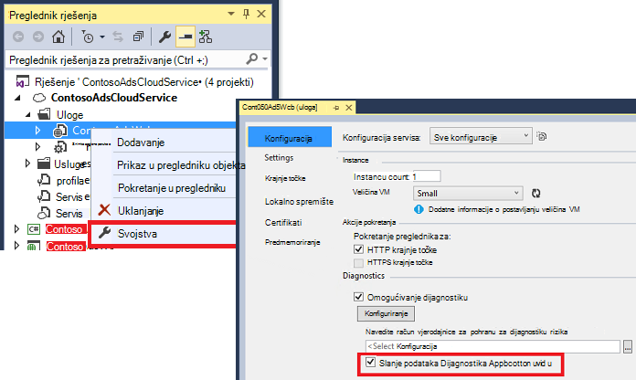

    **Ili ako je već objavljene i pokrenuti aplikacija**, Otvori Explorer poslužitelja ili oblaka Explorer, desnom tipkom miša kliknite aplikacije, a zatim odaberite istu mogućnost.

3.  Odaberite isti resurs uvida aplikacije drugih telemetrijskih.

    Ako želite, možete postaviti različite resursa u različitim servisa konfiguracijama (oblak, lokalno) da biste lakše odvojiti razvoj podataka od podataka u stvarnom vremenu.

3. Po želji [izostaviti dio Azure Dijagnostika](app-insights-azure-diagnostics.md) koju želite proslijediti uvida aplikacije. Zadano je sve.

### <a name="view-azure-diagnostic-events"></a>Prikaz Azure dijagnostičkih događaja

Gdje pronaći Dijagnostika:

* Mjerača performansi prikazuju se kao prilagođeni metriku. 
* Zapisnike događaja sustava Windows prikazana su kao kašnjenja i prilagođenih događaja.
* Aplikacije zapisnike, ETW zapisnika i sve Dijagnostika infrastrukture zapisnika prikazuju se kao kašnjenja.

Da biste vidjeli mjerača performansi i brojanja događaja, otvorite [Eksplorer za metriku](app-insights-metrics-explorer.md) i dodavanje novog grafikona:


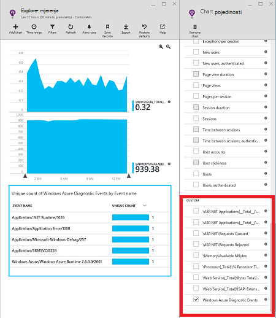

Da biste pretražili različitim zapisnika praćenja poslao Dijagnostika Azure pomoću [pretraživanja](app-insights-diagnostic-search.md) . Za ako ste iznimku unhanded u ulozi koji je uzrok uloga rušenje i koš za smeće, te podatke, primjerice bi prikazivati u aplikaciji kanala od zapisnika događaja sustava Windows. Funkcije pretraživanja možete koristiti za pregled pogreške zapisnik događaja sustava Windows i praćenje puni stoga za iznimku omogućujući vam da biste pronašli uzrok problema.


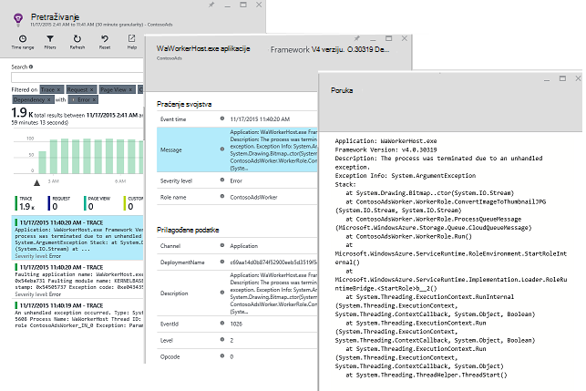

## <a name="app-diagnostics"></a>Aplikacije dijagnostici

Azure Dijagnostika automatski uključuje stavke evidencije koje generira aplikacije pomoću System.Diagnostics.Trace. 

No ako već koristite okviri Log4N ili NLog, možete [snimiti njihove kašnjenja zapisnika][netlogs].

[Praćenje prilagođene događaje i metrike] [ api] klijenta ili poslužitelja ili oboje, dodatne informacije o performansama i korištenje vaše aplikacije.

## <a name="dependencies"></a>Zavisnosti

SDK uvide aplikacije mogu prijaviti poziva aplikacije unese vanjske ovisnosti kao što su REST API-ji i SQL Server. To možete vidjeti je li određene ovisnosti uzrok sporo odgovora ili neuspješna.

Ako aplikacija koristi .NET framework 4.6 ili noviji, ne morate ništa učiniti. 

U suprotnom, postavite ulogu web-tempiranja s [Agent uvida aplikacije](app-insights-monitor-performance-live-website-now.md) poznata i kao "Nadzornik stanja".

Da biste koristili program Agent za uvida s vašim web-radnih ulogama:

* Dodati mapu [AppInsightsAgent](https://github.com/Microsoft/ApplicationInsights-Home/tree/master/Samples/AzureEmailService/WorkerRoleA/AppInsightsAgent) i dvije datoteke u njoj projekte uloga web-tempiranja. Obavezno postavljanje njihova svojstva Sastavi tako da se uvijek kopirat izlaznog direktorija. Te datoteke instalirati agenta.
* Dodajte pokretanja zadatka CSDEF datoteku kao što je prikazano [ovdje](https://github.com/Microsoft/ApplicationInsights-Home/tree/master/Samples/AzureEmailService/AzureEmailService/ServiceDefinition.csdef#L18).
* Napomena: *Uloge suradnika* zahtijevaju tri varijable okruženja kao što je prikazano [ovdje](https://github.com/Microsoft/ApplicationInsights-Home/tree/master/Samples/AzureEmailService/AzureEmailService/ServiceDefinition.csdef#L44). Nije potrebna za uloge web.

### <a name="dependency-reports"></a>Ovisnost izvješća

Evo primjera ono što vidite na portalu uvida aplikacije:

* Obogaćeni Dijagnostika sa zahtjevima za automatski povezanog i ovisnosti:

    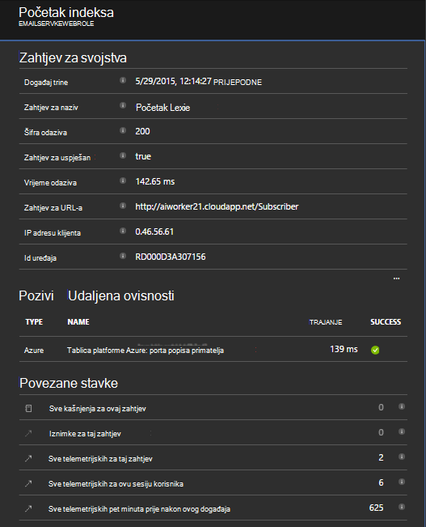

* Performanse ulogu web ovisnost podacima:

    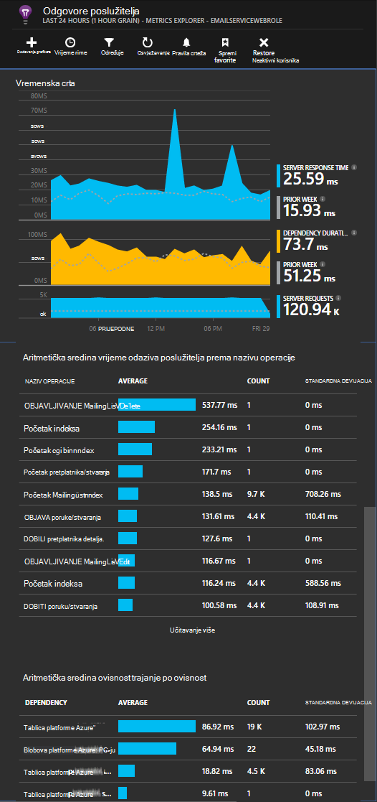

* Evo snimke zaslona na zahtjeve i podaci o ovisnosti uloge suradnika.

    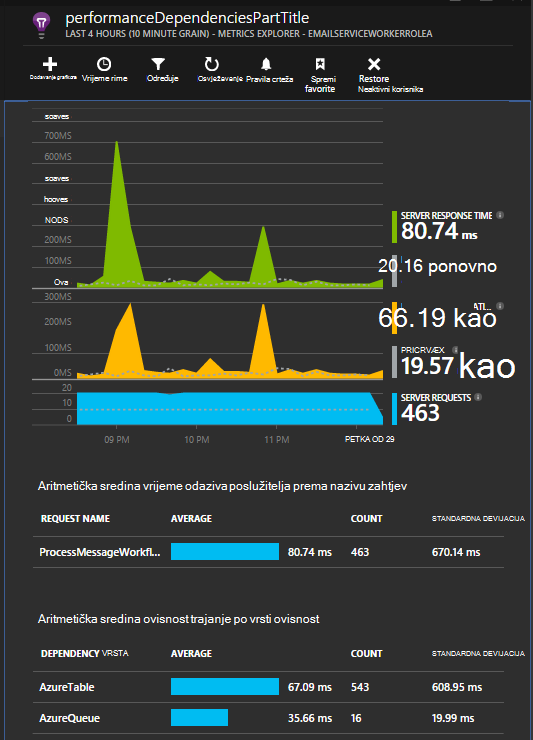

## <a name="exceptions"></a>Iznimke

Informacije o kako možete prikupiti neobrađenu iznimke iz različitih web aplikacije vrsta potražite u članku [Praćenje iznimke u aplikaciji uvida](app-insights-asp-net-exceptions.md) .

Uloga web za uzorak ima kontrolera MVC5 i 2 API na webu. Neobrađenu iznimke od 2 snimaju sa sljedećim:

* [AiHandleErrorAttribute](https://github.com/Microsoft/ApplicationInsights-Home/blob/master/Samples/AzureEmailService/MvcWebRole/Telemetry/AiHandleErrorAttribute.cs) postavljanje [ovdje](https://github.com/Microsoft/ApplicationInsights-Home/blob/master/Samples/AzureEmailService/MvcWebRole/App_Start/FilterConfig.cs#L12) za MVC5 kontrolera
* [AiWebApiExceptionLogger](https://github.com/Microsoft/ApplicationInsights-Home/blob/master/Samples/AzureEmailService/MvcWebRole/Telemetry/AiWebApiExceptionLogger.cs) postavljanje [ovdje](https://github.com/Microsoft/ApplicationInsights-Home/blob/master/Samples/AzureEmailService/MvcWebRole/App_Start/WebApiConfig.cs#L25) za kontrolera 2 API na webu

Uloge suradnika, dva su načina za praćenje iznimke.

* TrackException(ex)
* Ako ste dodali NuGet paketa aplikacije uvida praćenje ga slušatelj, System.Diagnostics.Trace možete koristiti da biste se prijavili iznimke. [Primjer koda.](https://github.com/Microsoft/ApplicationInsights-Home/blob/master/Samples/AzureEmailService/WorkerRoleA/WorkerRoleA.cs#L107)

## <a name="performance-counters"></a>Mjerača performansi

Sljedeće mjerača prikupljaju se po zadanom:

    * \Process(??APP_WIN32_PROC??)\% procesor vrijeme
    * \Memory\Available bajtova
    * \.Neto CLR Exceptions(??APP_CLR_PROC??)\# od Exceps izbačena sekundi
    * \Process (??. APP_WIN32_PROC??) \Private bajtova
    * \Process (??. APP_WIN32_PROC??) \IO podataka bajtova/sec
    * \Processor(_Total)\% procesor vremena

Uz to, sljedeće su i prikupljaju web uloge:

    * \ASP.NET aplikacije (???. APP_W3SVC_PROC???) \Requests/sec    
    * \ASP.NET aplikacije (??. APP_W3SVC_PROC??) Vrijeme izvođenja \Request
    * \ASP.NET aplikacije (??. APP_W3SVC_PROC??) \Requests u redu čekanja za aplikaciju

Kao što je prikazano [ovdje](https://github.com/Microsoft/ApplicationInsights-Home/blob/master/Samples/AzureEmailService/WorkerRoleA/ApplicationInsights.config#L14) možete navesti dodatne prilagođene ili druge mjerača performansi sustava windows

  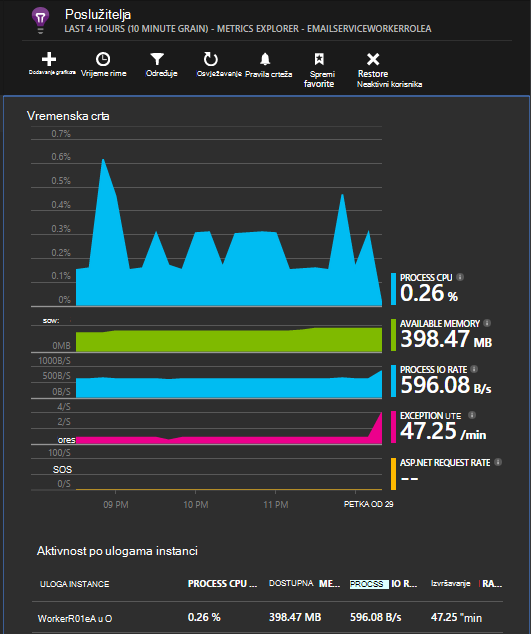

## <a name="correlated-telemetry-for-worker-roles"></a>Povezanog Telemetriju za uloge suradnika

Obogaćeni dijagnostičkih sučelje je kada možete vidjeti što koji vode zahtjeva nije uspjelo ili visoko Latencija. Uloga web SDK automatski postavlja korelacije između povezane telemetriju. Za tempiranja uloge, možete koristiti prilagođene telemetriju initializer da biste postavili uobičajene Kontekstni atribut Operation.Id za telemetriju da biste to postigli. To će vam omogućiti da biste vidjeli je li problem kašnjenje/pogreške pri zbog ovisnosti ili kod, kratak! 

Evo kako:

* Postavite Id korelacije u na CallContext kao što je prikazano [ovdje](https://github.com/Microsoft/ApplicationInsights-Home/blob/master/Samples/AzureEmailService/WorkerRoleA/WorkerRoleA.cs#L36). U ovom slučaju ne možemo koristite ID zahtjev kao id korelacije
* Dodavanje prilagođene implementaciju TelemetryInitializer koja će postavljen na Operation.Id correlationId postavite iznad. Što je prikazano ovdje: [ItemCorrelationTelemetryInitializer](https://github.com/Microsoft/ApplicationInsights-Home/blob/master/Samples/AzureEmailService/WorkerRoleA/Telemetry/ItemCorrelationTelemetryInitializer.cs#L13)
* Dodavanje prilagođene telemetriju initializer. To može učiniti u datoteci ApplicationInsights.config ili kod kao što je prikazano [ovdje](https://github.com/Microsoft/ApplicationInsights-Home/blob/master/Samples/AzureEmailService/WorkerRoleA/WorkerRoleA.cs#L233)

To je to! Rad s portala već wired prema gore da biste lakše provjerili sve povezane telemetriju na prvi pogled:

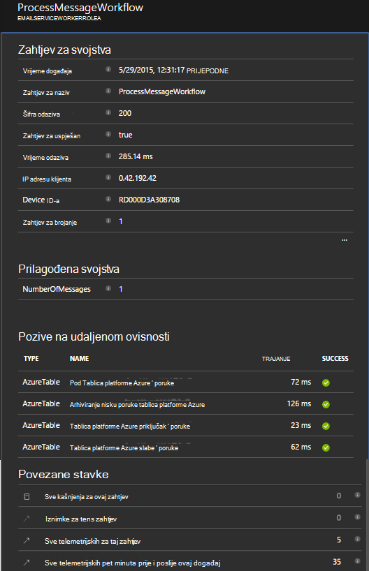


## <a name="client-telemetry"></a>Telemetriju klijenta

[Dodati JavaScript SDK web-stranicama] [ client] utemeljenima na pregledniku telemetriju kao što su broji prikaz stranica, vremena učitavanja stranice, a zatim iznimke skripte i da vam pisati telemetriju prilagođene skripte za stranice.

## <a name="availability-tests"></a>Dostupnost testira

[Postavljanje web testira] [ availability] da biste bili sigurni aplikacije ostaje uživo i odredište.


## <a name="example"></a>Primjer

[U primjeru](https://github.com/Microsoft/ApplicationInsights-Home/tree/master/Samples/AzureEmailService) nadzire servis koji ima web uloga i dva uloge suradnika.

## <a name="exception-method-not-found-on-running-in-azure-cloud-services"></a>Iznimke "metode nije pronađen" o pokretanju u Azure servise u Oblaku

Jeste li sastavljanje za .NET 4.6? 4.6 automatski nije podržan u ulogama Azure servise u Oblaku. [Instalacija 4.6 na ulogama](../cloud-services/cloud-services-dotnet-install-dotnet.md) prije pokretanja aplikacije.

## <a name="related-topics"></a>Povezane teme

* [Konfiguriranje slanja Azure Dijagnostika aplikacije uvid u](app-insights-azure-diagnostics.md)
* [Da biste poslali Azure Dijagnostika aplikacije uvid u pomoću komponente PowerShell](app-insights-powershell-azure-diagnostics.md)


[api]: app-insights-api-custom-events-metrics.md
[apidefaults]: app-insights-api-custom-events-metrics.md#default-properties
[apidynamicikey]: app-insights-separate-resources.md#dynamic-ikey
[availability]: app-insights-monitor-web-app-availability.md
[azure]: app-insights-azure.md
[client]: app-insights-javascript.md
[diagnostic]: app-insights-diagnostic-search.md
[netlogs]: app-insights-asp-net-trace-logs.md
[portal]: http://portal.azure.com/
[qna]: app-insights-troubleshoot-faq.md
[redfield]: app-insights-monitor-performance-live-website-now.md
[start]: app-insights-overview.md 
