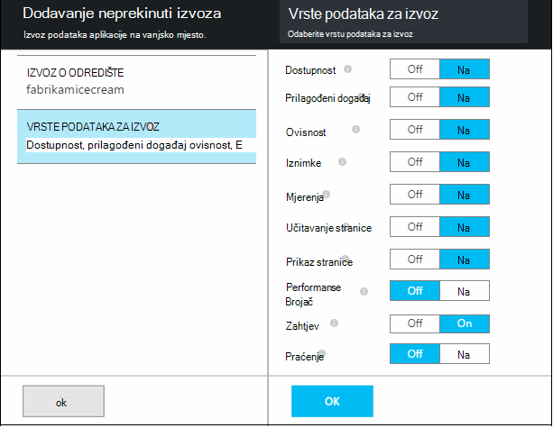

<properties 
    pageTitle="Vodič: izvoz telemetrijskih u SQL baze podataka iz aplikacije uvida" 
    description="Neprestano izvoz podataka aplikacije uvida u SQL pomoću analize strujanje." 
    services="application-insights" 
    documentationCenter=""
    authors="noamben" 
    manager="douge"/>

<tags 
    ms.service="application-insights" 
    ms.workload="tbd" 
    ms.tgt_pltfrm="ibiza" 
    ms.devlang="na" 
    ms.topic="article" 
    ms.date="03/06/2015" 
    ms.author="awills"/>
 
# <a name="walkthrough-export-to-sql-from-application-insights-using-stream-analytics"></a>Vodič: Izvoz u SQL iz aplikacije uvide pomoću strujanje Analytics

U ovom se članku objašnjava premještanje telemetrijskih podataka iz [Uvida aplikacije za Visual Studio] [ start] u bazu podataka Azure SQL pomoću [Neprekinuti izvoz] [ export] i [Analitiku strujanje Azure](https://azure.microsoft.com/services/stream-analytics/). 

Neprekinuti izvoz uvlači telemetrijskih podataka u prostor za pohranu Azure JSON OSNOVNI oblik. Ne možemo će raščlaniti objekata JSON pomoću analize strujanje Azure i stvaranje redaka u tablici baze podataka.

(Više Općenito, neprekinuti izvoz je način da biste učinili vlastitu analizu telemetrijskih aplikacija slanje aplikacije uvid u. Koje nije moguće prilagoditi ovaj uzorak koda za druge stvari s izvezene telemetrijskih, kao što su zbrajanje podataka.)

Ne možemo ćete počinju pretpostavci da ste već aplikaciju koju želite nadzirati.


U ovom primjeru smo koristit će prikaz podataka stranice, ali isti uzorak mogu se jednostavno proširiti druge vrste podataka kao što su prilagođene događaje i iznimke. 


## <a name="add-application-insights-to-your-application"></a>Dodavanje aplikacije uvida u aplikaciji


Za početak rada:

1. [Postavljanje uvida aplikaciju za web-stranice](app-insights-javascript.md). 

    (U ovom primjeru smo ćete usredotočite se na obradu stranice prikaz podataka iz preglednika klijent, ali nije moguće postaviti i tako uvida aplikacije za strani poslužitelja [Java](app-insights-java-get-started.md) ili [ASP.NET](app-insights-asp-net.md) aplikacije i proces zahtjev, ovisnosti i drugi poslužitelj za telemetriju.)


5. Objavljivanje aplikacije, a zatim pogledajte telemetrijskih podataka koji se pojavljuje u vaše aplikacije uvida resursa.


## <a name="create-storage-in-azure"></a>Stvaranje prostora za pohranu u Azure

Neprekinuti izvoz uvijek proizvodi podataka na račun za Azure pohranu da morate najprije stvorite prostora za pohranu.

1. Stvaranje računa za pohranu u pretplatu na [portal za Azure][portal].

    

2. Stvaranje spremnika

    

3. Kopiranje tipkovni prečac za pohranu

    Morat ćete ga uskoro da biste postavili unosa na servis za strujanje analize.

    

## <a name="start-continuous-export-to-azure-storage"></a>Pokreni neprekinuti izvoz Azure za pohranu

1. Na portalu Azure pronađite aplikaciju uvida resursa koji ste stvorili za svoju aplikaciju.

    

2. Stvaranje neprekinuti izvoz.

    


    Odaberite račun za pohranu koji ste prethodno stvorili:

    
    
    Postavljanje vrste događaja koje želite vidjeti:

    


3. Pustiti da neki podaci skupiti. Ponovno sjesti i neka druge osobe pomoću aplikacije za neko vrijeme. Telemetrijskih prosljeđivala i vidjet ćete statističkih grafikona u programu [explorer metričke](app-insights-metrics-explorer.md) i pojedinačne događaja u [dijagnostike pretraživanja](app-insights-diagnostic-search.md). 

    Osim toga, podaci će na i izvoz prostora za pohranu. 

4. Provjera na izvezene podatke ili na portalu – odaberite **Pregledaj**, odaberite vaš račun za pohranu, a zatim **spremnika** - ili u Visual Studio. U Visual Studio, odaberite **Prikaz / Cloud Explorer**, a zatim otvorite Azure / prostora za pohranu. (Ako još nemate mogućnost na izborniku, morate instalirati Azure SDK: Otvorite dijaloški okvir novi projekt, a Visual C# / Cloud / dobivanje Microsoft Azure SDK za .NET.)

    

    Zabilježite uobičajeni dio naziva put, dobivena iz naziv i instrumentation tipku za aplikacije. 

Događaji zapisuju se bloba datoteke u obliku JSON. Svaki dokument možda sadrži jednu ili više događaja. Stoga željeli bismo čitanje podataka događaja i filtriraju polja želimo. Postoje sve vrste što smo može učiniti s podacima, ali naš plan danas je za korištenje strujanje Analytics za premještanje podataka s bazom podataka SQL. Koje će olakšavaju da biste pokrenuli mnogo zanimljivih upita.

## <a name="create-an-azure-sql-database"></a>Stvaranje baze podataka Azure SQL

Ponovno pokretanje iz pretplate na [portalu za Azure][portal], stvoriti bazu podataka (i novi poslužitelj osim ako već imate nešto) za koje ćete pišete podatke.


Provjerite dopušta li poslužitelj baze podataka pristup Azure servisi:


## <a name="create-a-table-in-azure-sql-db"></a>Stvaranje tablice u baze podataka SQL Azure

Povezivanje baza podataka stvorena u prethodnom odjeljku pomoću alata za upravljanje Preferirani. U ovom vodiču smo će koristiti [Alate za upravljanje sustava SQL Server](https://msdn.microsoft.com/ms174173.aspx) (SSMS).


Stvorite novi upit, a izvođenje sljedećih T-SQL naredbe:

```SQL

CREATE TABLE [dbo].[PageViewsTable](
    [pageName] [nvarchar](max) NOT NULL,
    [viewCount] [int] NOT NULL,
    [url] [nvarchar](max) NULL,
    [urlDataPort] [int] NULL,
    [urlDataprotocol] [nvarchar](50) NULL,
    [urlDataHost] [nvarchar](50) NULL,
    [urlDataBase] [nvarchar](50) NULL,
    [urlDataHashTag] [nvarchar](max) NULL,
    [eventTime] [datetime] NOT NULL,
    [isSynthetic] [nvarchar](50) NULL,
    [deviceId] [nvarchar](50) NULL,
    [deviceType] [nvarchar](50) NULL,
    [os] [nvarchar](50) NULL,
    [osVersion] [nvarchar](50) NULL,
    [locale] [nvarchar](50) NULL,
    [userAgent] [nvarchar](max) NULL,
    [browser] [nvarchar](50) NULL,
    [browserVersion] [nvarchar](50) NULL,
    [screenResolution] [nvarchar](50) NULL,
    [sessionId] [nvarchar](max) NULL,
    [sessionIsFirst] [nvarchar](50) NULL,
    [clientIp] [nvarchar](50) NULL,
    [continent] [nvarchar](50) NULL,
    [country] [nvarchar](50) NULL,
    [province] [nvarchar](50) NULL,
    [city] [nvarchar](50) NULL
)

CREATE CLUSTERED INDEX [pvTblIdx] ON [dbo].[PageViewsTable]
(
    [eventTime] ASC
)WITH (PAD_INDEX = OFF, STATISTICS_NORECOMPUTE = OFF, SORT_IN_TEMPDB = OFF, DROP_EXISTING = OFF, ONLINE = OFF, ALLOW_ROW_LOCKS = ON, ALLOW_PAGE_LOCKS = ON)

```


U ovom primjeru ćemo se pomoću podataka iz prikaza stranice. Da biste vidjeli druge podaci koji su dostupni, provjera JSON izlaz pa potražite u članku [Izvoz podatkovnog modela](app-insights-export-data-model.md).

## <a name="create-an-azure-stream-analytics-instance"></a>Stvaranje instance Azure strujanje Analytics

[Klasični Azure portala](https://manage.windowsazure.com/)odaberite servisa Azure strujanje analize i stvaranje novog zadatka strujanje analize:


Kada se Stvori novi zadatak, proširite detalja:


#### <a name="set-blob-location"></a>Postavljanje blob lokacije

Postavite ga da bi unos iz vaše blob neprekinuti izvoz:


Sada potreban vam je primarni ključ programa Access s računa za pohranu koji ste ranije zabilježili. Postavi ovo kao ključ za račun za pohranu.


#### <a name="set-path-prefix-pattern"></a>Postavljanje put prefiks uzorak 


Ne zaboravite da biste postavili oblik datuma na **Gggg-MM-DD** (s **crtice**).

Put prefiks uzorak određuje kako strujanje analize pronalazi ulaznih datoteka u prostora za pohranu. Morate postaviti tako da odgovaraju kako neprekinuti izvoz sprema podatke. Postavite ovako:

    webapplication27_12345678123412341234123456789abcdef0/PageViews/{date}/{time}

U ovom primjeru:

* `webapplication27`je naziv aplikacije uvida resursa, **sve u mala slova**. 
* `1234...`je instrumentation ključ na aplikaciju uvida resursa **s crtice ukloniti**. 
* `PageViews`je vrsta podataka ne možemo želite analizirati. Dostupne vrste ovise o tome u neprekinuti izvoz postavite filtar. Pregledajte izvezene podatke da biste vidjeli druge dostupne vrste pa potražite u članku [Izvoz podatkovnog modela](app-insights-export-data-model.md).
* `/{date}/{time}`Uzorak zapisuje doslovno.

Da biste dobili naziv i iKey vaše aplikacije uvida resursa, otvorite Essentials na njegovoj stranici pregled, ili postavke.

#### <a name="finish-initial-setup"></a>Završi početnog postavljanja

Potvrdite serijaliziranog oblika:


Zatvorite čarobnjak i pričekajte da biste dovršili postavljanje.

>[AZURE.TIP] Da biste provjerili ispravno postavljen unos put, koristite funkciju uzorka. Ako ne uspijete: Provjerite je li podatke u prostor za pohranu za uzorak vremenskog razdoblja koje ste odabrali. Uređivanje definicije za unos i provjerite postavite račun za pohranu, put prefiks i datum obliku pravilno.

## <a name="set-query"></a>Postavljanje upita

Otvorite odjeljak upita:


Zamjena zadane upit:

```SQL

    SELECT flat.ArrayValue.name as pageName
    , flat.ArrayValue.count as viewCount
    , flat.ArrayValue.url as url
    , flat.ArrayValue.urlData.port as urlDataPort
    , flat.ArrayValue.urlData.protocol as urlDataprotocol
    , flat.ArrayValue.urlData.host as urlDataHost
    , flat.ArrayValue.urlData.base as urlDataBase
    , flat.ArrayValue.urlData.hashTag as urlDataHashTag
      ,A.context.data.eventTime as eventTime
      ,A.context.data.isSynthetic as isSynthetic
      ,A.context.device.id as deviceId
      ,A.context.device.type as deviceType
      ,A.context.device.os as os
      ,A.context.device.osVersion as osVersion
      ,A.context.device.locale as locale
      ,A.context.device.userAgent as userAgent
      ,A.context.device.browser as browser
      ,A.context.device.browserVersion as browserVersion
      ,A.context.device.screenResolution.value as screenResolution
      ,A.context.session.id as sessionId
      ,A.context.session.isFirst as sessionIsFirst
      ,A.context.location.clientip as clientIp
      ,A.context.location.continent as continent
      ,A.context.location.country as country
      ,A.context.location.province as province
      ,A.context.location.city as city
    INTO
      AIOutput
    FROM AIinput A
    CROSS APPLY GetElements(A.[view]) as flat


```

Obratite pozornost na to jesu li prvi nekoliko svojstava specifični za podatke za prikaz stranice. Izvozi drugih vrsta telemetrijskih će imati drugačija svojstva. Pogledajte na [detaljna referenca model podataka za svojstvo vrste i vrijednosti.](app-insights-export-data-model.md)

## <a name="set-up-output-to-database"></a>Postavljanje Izlaz u bazi podataka

Odaberite SQL kao izlaz.


Navedite SQL baze podataka.


Zatvorite čarobnjak i pričekajte da obavijest o rezultatu je postavljen.

## <a name="start-processing"></a>Pokretanje obrada

Pokretanje zadatka s akcijske trake:


Možete odabrati želite li da biste pokrenuli obrada podataka počevši od sada ili započeti s ranijim podataka. Drugu mogućnost je korisno ako ste imali neprekinuti izvoz već pokrenut neko vrijeme.


Nakon nekoliko minuta, vratite se u alata za upravljanje sustava SQL Server i gledanje podataka slijedi u. Ako, na primjer, koristite upit ovako:

    SELECT TOP 100 *
    FROM [dbo].[PageViewsTable]


## <a name="related-articles"></a>Povezani članci

* [Izvoz u SQL pomoću ulogu suradnika](app-insights-code-sample-export-telemetry-sql-database.md)
* [Izvoz u PowerBI pomoću strujanje Analytics](app-insights-export-power-bi.md)
* [Detaljne podatke modela vodič za svojstvo vrste i vrijednosti.](app-insights-export-data-model.md)
* [Neprekinuti Izvoz u aplikaciji uvida](app-insights-export-telemetry.md)
* [Aplikacija uvida](https://azure.microsoft.com/services/application-insights/)

<!--Link references-->

[diagnostic]: app-insights-diagnostic-search.md
[export]: app-insights-export-telemetry.md
[metrics]: app-insights-metrics-explorer.md
[portal]: http://portal.azure.com/
[start]: app-insights-overview.md

 