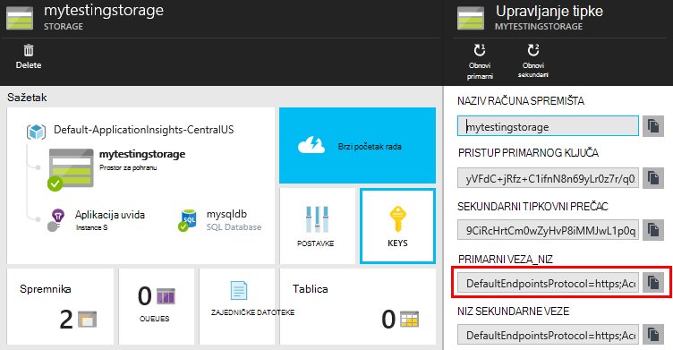

<properties 
    pageTitle="Uzorak koda: raščlaniti podaci izvezeni iz aplikacije uvida" 
    description="Kod vlastitu analizu telemetriju u aplikaciju uvide pomoću značajke neprekinuti izvoz. Spremanje podataka za SQL." 
    services="application-insights" 
    documentationCenter=""
    authors="mazharmicrosoft" 
    manager="douge"/>

<tags 
    ms.service="application-insights" 
    ms.workload="tbd" 
    ms.tgt_pltfrm="ibiza" 
    ms.devlang="na" 
    ms.topic="article" 
    ms.date="01/05/2016" 
    ms.author="awills"/>
 
# Uzorak koda: raščlaniti podaci izvezeni iz aplikacije uvida

U ovom se članku objašnjava obrada podataka JSON izvezene iz aplikacije uvide. Kao primjer smo ćete pisanje koda za premještanje telemetrijskih podataka iz [Uvida aplikacije za Visual Studio] [ start] u bazu podataka Azure SQL pomoću [Neprekinuti izvoz][export]. (Možete postići i ova [pomoću analize strujanje](app-insights-code-sample-export-sql-stream-analytics.md), ali je naš ciljem da bi se prikazala neke koda.) 

Neprekinuti izvoz prelazi na telemetriju u Azure prostora za pohranu u obliku JSON, pa ćemo ćete pisati neke kod za raščlaniti JSON objekte i stvaranje redaka u tablici baze podataka.

Više je Općenito govoreći, neprekinuti izvoz je način da biste učinili vlastitu analizu telemetrijskih aplikacija slanje aplikacije uvid u. Ovaj uzorak koda za druge stvari s izvezene telemetrijskih nije moguće prilagoditi.

Ne možemo ćete počinju pretpostavci da ste već aplikaciju koju želite nadzirati.

## Dodavanje aplikacije uvida SDK

Praćenje aplikaciju, [dodajte programa SDK uvida aplikacije] [ start] u aplikaciji. Postoje različite SDK-ovi i Pomoćnik za alate za različite platforme, IDEs i jezike. Možete nadzirati web-stranica, Java ili ASP.NET web-poslužiteljima i mobilne uređaje nekoliko vrsta. Sve SDK-ovi poslati telemetrijskih [portal za aplikacije uvida][portal], gdje možete koristiti naše Napredna analiza i Alati za dijagnostiku i izvoz podataka u prostor za pohranu.

Za početak rada:

1. Pronađite [račun u programu Microsoft Azure](https://azure.microsoft.com/pricing/).
2. [Portal za Azure][portal], dodajte novi resurs uvida aplikacije za aplikaciju:

    

    (Vrsta aplikacije i pretplate mogu se razlikovati.)
3. Otvorite brzi početak rada da biste pronašli upute za postavljanje SDK-a za svoju aplikaciju vrstu.

    

    Ako vaša vrsta aplikacija nije navedena, pogledajte [Početak rada] [ start] stranice.

4. U ovom primjeru smo si nadzor web-aplikacijama da ćemo pomoću alata za Azure u Visual Studio da biste instalirali SDK-a. Ne možemo, čime se štedi naziv naš aplikacije uvida resursa:

    

## Stvaranje prostora za pohranu u Azure

Podaci iz aplikacije uvida uvijek izvozi se na račun za Azure prostora za pohranu u JSON OSNOVNI oblik. Potječe iz ovog prostora za pohranu kod će pročitati podatke.

1. Stvaranje računa "klasični" prostora za pohranu u pretplatu na [portal za Azure][portal].

    

2. Stvaranje spremnika

    

## Pokreni neprekinuti izvoz Azure za pohranu

1. Na portalu Azure pronađite aplikaciju uvida resursa koji ste stvorili za svoju aplikaciju.

    

2. Stvaranje neprekinuti izvoz.

    

    Odaberite račun za pohranu koji ste prethodno stvorili:

    
    
    Postavljanje vrste događaja koje želite vidjeti:

    

3. Pustiti da neki podaci skupiti. Ponovno sjesti i neka druge osobe pomoću aplikacije za neko vrijeme. Telemetrijskih prosljeđivala i vidjet ćete statističkih grafikona u programu [explorer metričke](app-insights-metrics-explorer.md) i pojedinačne događaja u [dijagnostike pretraživanja](app-insights-diagnostic-search.md). 

    Osim toga, podaci će na i izvoz prostora za pohranu. 

4. Provjeri izvezene podatke. U Visual Studio, odaberite **Prikaz / Cloud Explorer**, a zatim otvorite Azure / prostora za pohranu. (Ako još nemate mogućnost na izborniku, morate instalirati Azure SDK: Otvorite dijaloški okvir novi projekt, a Visual C# / Cloud / dobivanje Microsoft Azure SDK za .NET.)

    

    Zabilježite uobičajeni dio naziva put, dobivena iz naziv i instrumentation tipku za aplikacije. 

Događaji zapisuju se bloba datoteke u obliku JSON. Svaki dokument možda sadrži jednu ili više događaja. Stoga željeli bismo čitanje podataka događaja i filtriraju polja želimo. Postoje sve vrste što smo može učiniti s podacima, ali naš plan danas je neke kod da biste premjestili podatke s bazom podataka SQL. Koje će olakšavaju da biste pokrenuli mnogo zanimljivih upita.

## Stvaranje baze podataka Azure SQL

U ovom primjeru smo ćete pisati kod za slanje podataka u bazu podataka.

Ponovno pokretanje iz pretplate na [portalu za Azure][portal], stvoriti bazu podataka (i novi poslužitelj osim ako već imate nešto) za koje ćete pišete podatke.

Provjerite dopušta li poslužitelj baze podataka pristup Azure servisi:

## Stvaranje ulogu suradnika 

Sada najmanje smo možete [neke kod](https://sesitai.codeplex.com/) raščlaniti JSON u izvezeni blob-ova i stvaranje zapisa u bazi podataka. Jer spremište izvoz i baze podataka i u Azure, ne možemo pokrenut ćete kod u ulogu Azure tempiranja.

Kod automatski se izdvaja bilo kakve svojstva postoje na JSON. Opise svojstava, potražite u članku [Izvoz podatkovnog modela](app-insights-export-data-model.md).

#### Stvaranje projekta ulogu suradnika

U Visual Studio stvaranje novog projekta za ulogu suradnika:

#### Povezivanje s računom za pohranu

U Azure, pojavljuje se niz za povezivanje s računa za pohranu:

U Visual Studio konfigurirati postavke ulogu suradnika niz za povezivanje za pohranu računa:

#### Paketi

U pregledniku rješenja, desnom tipkom miša kliknite projekt ulogu suradnika i odaberite upravljanje NuGet paketa.
Pretraživanje i instalacija te pakete: 

 * EntityFramework 6.1.2 ili kasnije - ćemo koristiti ovo da biste generirali DB shemu tablica u hodu prema sadržaju JSON u blob-om.
 * JsonFx - ćemo koristiti ovo za stapanja JSON svojstva klase C#.

Koristite ovaj alat za generiranje C# predmete iz naših jedan dokument JSON. Potrebna je neke manji promjene kao što su stapanja JSON polja u jednom C# svojstvo u Uključi jednog stupca u tablici DB (franko. urlData_port) 

 * [Generator predmete JSON C#](http://jsonclassgenerator.codeplex.com/)

## Kod 

Kod možete pohraniti na `WorkerRole.cs`.

#### Uvozi

    using Microsoft.WindowsAzure.Storage;

    using Microsoft.WindowsAzure.Storage.Blob;

#### Dohvaćanje niza za povezivanje za pohranu

    private static string GetConnectionString()
    {
      return Microsoft.WindowsAzure.CloudConfigurationManager.GetSetting("StorageConnectionString");
    }

#### Pokretanje zaposlenik u pravilnim vremenskim razmacima

Zamjena postojećeg izvođenja način pa odaberite interval radije. Mora biti najmanje jedan sat jer značajka izvoz dovršava jedan objekt JSON u jedan sat.

    public override void Run()
    {
      Trace.TraceInformation("WorkerRole1 is running");

      while (true)
      {
        Trace.WriteLine("Sleeping", "Information");

        Thread.Sleep(86400000); //86400000=24 hours //1 hour=3600000
                
        Trace.WriteLine("Awake", "Information");

        ImportBlobtoDB();
      }
    }

#### Umetni sve objekte JSON kao redak tablice

    public void ImportBlobtoDB()
    {
      try
      {
        CloudStorageAccount account = CloudStorageAccount.Parse(GetConnectionString());

        var blobClient = account.CreateCloudBlobClient();
        var container = blobClient.GetContainerReference(FilterContainer);

        foreach (CloudBlobDirectory directory in container.ListBlobs())//Parent directory
        {
          foreach (CloudBlobDirectory subDirectory in directory.ListBlobs())//PageViewPerformance
          {
            foreach (CloudBlobDirectory dir in subDirectory.ListBlobs())//2015-01-31
            {
              foreach (CloudBlobDirectory subdir in dir.ListBlobs())//22
              {
                foreach (IListBlobItem item in subdir.ListBlobs())//3IAwm6u3-0.blob
                {
                  itemname = item.Uri.ToString();
                  ParseEachBlob(container, item);
                  AuditBlob(container, directory, subDirectory, dir, subdir, item);
                } //item loop
              } //subdir loop
            } //dir loop
          } //subDirectory loop
        } //directory loop
      }
      catch (Exception ex)
      {
        //handle exception
      }
    }

#### Raščlanjivanje svaki blobova platforme

    private void ParseEachBlob(CloudBlobContainer container, IListBlobItem item)
    {
      try
      {
        var blob = container.GetBlockBlobReference(item.Parent.Prefix + item.Uri.Segments.Last());
    
        string json;
    
        using (var memoryStream = new MemoryStream())
        {
          blob.DownloadToStream(memoryStream);
          json = System.Text.Encoding.UTF8.GetString(memoryStream.ToArray());
    
          IEnumerable<string> entities = json.Split('\n').Where(s => !string.IsNullOrWhiteSpace(s));
    
          recCount = entities.Count();
          failureCount = 0; //resetting failure count
    
          foreach (var entity in entities)
          {
            var reader = new JsonFx.Json.JsonReader();
            dynamic output = reader.Read(entity);
    
            Dictionary<string, object> dict = new Dictionary<string, object>();
    
            GenerateDictionary((System.Dynamic.ExpandoObject)output, dict, "");
    
            switch (FilterType)
            {
              case "PageViewPerformance":
    
              if (dict.ContainsKey("clientPerformance"))
                {
                  GenerateDictionary(((System.Dynamic.ExpandoObject[])dict["clientPerformance"])[0], dict, "");
                }
    
              if (dict.ContainsKey("context_custom_dimensions"))
              {
                if (dict["context_custom_dimensions"].GetType() == typeof(System.Dynamic.ExpandoObject[]))
                {
                  GenerateDictionary(((System.Dynamic.ExpandoObject[])dict["context_custom_dimensions"])[0], dict, "");
                }
              }
    
            PageViewPerformance objPageViewPerformance = (PageViewPerformance)GetObject(dict);
    
            try
            {
              using (var db = new TelemetryContext())
              {
                db.PageViewPerformanceContext.Add(objPageViewPerformance);
                db.SaveChanges();
              }
            }
            catch (Exception ex)
            {
              failureCount++;
            }
            break;
    
            default:
            break;
          }
        }
      }
    }
    catch (Exception ex)
    {
      //handle exception 
    }
    }

#### Priprema rječnik za svaki JSON dokument

    private void GenerateDictionary(System.Dynamic.ExpandoObject output, Dictionary<string, object> dict, string parent)
        {
            try
            {
                foreach (var v in output)
                {
                    string key = parent + v.Key;
                    object o = v.Value;

                    if (o.GetType() == typeof(System.Dynamic.ExpandoObject))
                    {
                        GenerateDictionary((System.Dynamic.ExpandoObject)o, dict, key + "_");
                    }
                    else
                    {
                        if (!dict.ContainsKey(key))
                        {
                            dict.Add(key, o);
                        }
                    }
                }
            }
            catch (Exception ex)
            {
            //handle exception 
            }
        }

#### Oblikuje dokument JSON u C# klase telemetrijskih svojstva objekta

     public object GetObject(IDictionary<string, object> d)
        {
            PropertyInfo[] props = null;
            object res = null;

            try
            {
                switch (FilterType)
                {
                    case "PageViewPerformance":

                        props = typeof(PageViewPerformance).GetProperties();
                        res = Activator.CreateInstance<PageViewPerformance>();
                        break;

                    default:
                        break;
                }

                for (int i = 0; i < props.Length; i++)
                {
                    if (props[i].CanWrite && d.ContainsKey(props[i].Name))
                    {
                        props[i].SetValue(res, d[props[i].Name], null);
                    }
                }
            }
            catch (Exception ex)
            {
            //handle exception 
            }

            return res;
        }

#### Datoteka klase PageViewPerformance generiran iz JSON dokumenta

    public class PageViewPerformance
    {
        [DatabaseGenerated(DatabaseGeneratedOption.Identity)]
        public Guid Id { get; set; }

        public string url { get; set; }

        public int urlData_port { get; set; }

        public string urlData_protocol { get; set; }

        public string urlData_host { get; set; }

        public string urlData_base { get; set; }

        public string urlData_hashTag { get; set; }

        public double total_value { get; set; }

        public double networkConnection_value { get; set; }

        public double sendRequest_value { get; set; }

        public double receiveRequest_value { get; set; }

        public double clientProcess_value { get; set; }

        public string name { get; set; }

        public string internal_data_id { get; set; }

        public string internal_data_documentVersion { get; set; }

        public DateTime? context_data_eventTime { get; set; }

        public string context_device_id { get; set; }

        public string context_device_type { get; set; }

        public string context_device_os { get; set; }

        public string context_device_osVersion { get; set; }

        public string context_device_locale { get; set; }

        public string context_device_userAgent { get; set; }

        public string context_device_browser { get; set; }

        public string context_device_browserVersion { get; set; }

        public string context_device_screenResolution_value { get; set; }

        public string context_user_anonId { get; set; }

        public string context_user_anonAcquisitionDate { get; set; }

        public string context_user_authAcquisitionDate { get; set; }

        public string context_user_accountAcquisitionDate { get; set; }

        public string context_session_id { get; set; }

        public bool context_session_isFirst { get; set; }

        public string context_operation_id { get; set; }

        public double context_location_point_lat { get; set; }

        public double context_location_point_lon { get; set; }

        public string context_location_clientip { get; set; }

        public string context_location_continent { get; set; }

        public string context_location_country { get; set; }

        public string context_location_province { get; set; }

        public string context_location_city { get; set; }
    }

#### DBcontext za interakciju SQL prema entitet Framework

    public class TelemetryContext : DbContext
    {
        public DbSet<PageViewPerformance> PageViewPerformanceContext { get; set; }
        public TelemetryContext()
            : base("name=TelemetryContext")
        {
        }
    }

Dodavanje DB niz za povezivanje u pod nazivom `TelemetryContext` u `app.config`.

## Shema (samo za informacije)

Ovo je shema za tablicu koja će se generira za PageView.

> [AZURE.NOTE] Ne morate da biste pokrenuli ovu skriptu. Atributi u na JSON odredite stupaca u tablici.

    CREATE TABLE [dbo].[PageViewPerformances](
    [Id] [uniqueidentifier] NOT NULL,
    [url] [nvarchar](max) NULL,
    [urlData_port] [int] NOT NULL,
    [urlData_protocol] [nvarchar](max) NULL,
    [urlData_host] [nvarchar](max) NULL,
    [urlData_base] [nvarchar](max) NULL,
    [urlData_hashTag] [nvarchar](max) NULL,
    [total_value] [float] NOT NULL,
    [networkConnection_value] [float] NOT NULL,
    [sendRequest_value] [float] NOT NULL,
    [receiveRequest_value] [float] NOT NULL,
    [clientProcess_value] [float] NOT NULL,
    [name] [nvarchar](max) NULL,
    [User] [nvarchar](max) NULL,
    [internal_data_id] [nvarchar](max) NULL,
    [internal_data_documentVersion] [nvarchar](max) NULL,
    [context_data_eventTime] [datetime] NULL,
    [context_device_id] [nvarchar](max) NULL,
    [context_device_type] [nvarchar](max) NULL,
    [context_device_os] [nvarchar](max) NULL,
    [context_device_osVersion] [nvarchar](max) NULL,
    [context_device_locale] [nvarchar](max) NULL,
    [context_device_userAgent] [nvarchar](max) NULL,
    [context_device_browser] [nvarchar](max) NULL,
    [context_device_browserVersion] [nvarchar](max) NULL,
    [context_device_screenResolution_value] [nvarchar](max) NULL,
    [context_user_anonId] [nvarchar](max) NULL,
    [context_user_anonAcquisitionDate] [nvarchar](max) NULL,
    [context_user_authAcquisitionDate] [nvarchar](max) NULL,
    [context_user_accountAcquisitionDate] [nvarchar](max) NULL,
    [context_session_id] [nvarchar](max) NULL,
    [context_session_isFirst] [bit] NOT NULL,
    [context_operation_id] [nvarchar](max) NULL,
    [context_location_point_lat] [float] NOT NULL,
    [context_location_point_lon] [float] NOT NULL,
    [context_location_clientip] [nvarchar](max) NULL,
    [context_location_continent] [nvarchar](max) NULL,
    [context_location_country] [nvarchar](max) NULL,
    [context_location_province] [nvarchar](max) NULL,
    [context_location_city] [nvarchar](max) NULL,
    CONSTRAINT [PK_dbo.PageViewPerformances] PRIMARY KEY CLUSTERED 
    (
     [Id] ASC
    )WITH (PAD_INDEX = OFF, STATISTICS_NORECOMPUTE = OFF, IGNORE_DUP_KEY = OFF, ALLOW_ROW_LOCKS = ON, ALLOW_PAGE_LOCKS = ON) ON [PRIMARY]
    ) ON [PRIMARY] TEXTIMAGE_ON [PRIMARY]

    GO

    ALTER TABLE [dbo].[PageViewPerformances] ADD  DEFAULT (newsequentialid()) FOR [Id]
    GO

Da biste vidjeli u ovom se primjeru u praksi, [Preuzimanje](https://sesitai.codeplex.com/) dovrši kod za rad promjena na `app.config` postavke i objavite ulogu suradnika Azure.

## Povezani članci

* [Izvoz u SQL pomoću ulogu suradnika](app-insights-code-sample-export-telemetry-sql-database.md)
* [Neprekinuti Izvoz u aplikaciji uvida](app-insights-export-telemetry.md)
* [Aplikacija uvida](https://azure.microsoft.com/services/application-insights/)
* [Izvoz podatkovnog modela](app-insights-export-data-model.md)
* [Dodatne primjere i prikazi](app-insights-code-samples.md)

<!--Link references-->

[diagnostic]: app-insights-diagnostic-search.md
[export]: app-insights-export-telemetry.md
[metrics]: app-insights-metrics-explorer.md
[portal]: http://portal.azure.com/
[start]: app-insights-overview.md

 
