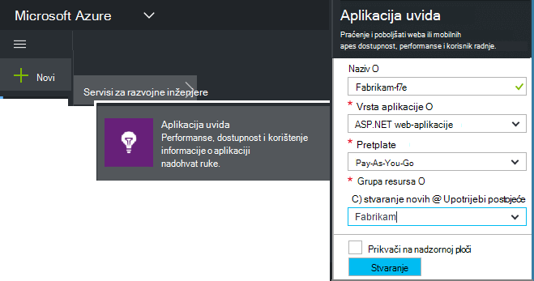
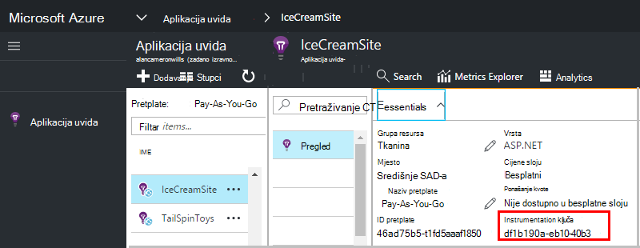

<properties 
    pageTitle="Stvaranje nove uvide aplikacije resursa | Microsoft Azure" 
    description="Postavljanje aplikacije uvide nadzor za novu aplikaciju uživo. Pristup utemeljen na webu." 
    services="application-insights" 
    documentationCenter=""
    authors="alancameronwills" 
    manager="douge"/>

<tags 
    ms.service="application-insights" 
    ms.workload="tbd" 
    ms.tgt_pltfrm="ibiza" 
    ms.devlang="na" 
    ms.topic="article" 
    ms.date="08/26/2016" 
    ms.author="awills"/>

# Stvoriti u aplikaciji uvide resurs

Uvid aplikacije za Visual Studio prikazuje podatke o aplikaciji Microsoft Azure *resursa*. Stvaranje novog resursa stoga je dio [postavljanja aplikacije uvida praćenje nove aplikacije][start]. U mnogim slučajevima, to možete učiniti automatski na IDE, a to je preporučeni način u kojem je dostupna. No u nekim slučajevima, stvoriti resursa ručno.

Nakon stvaranja resursa, njegov instrumentation ključ, a koji koristite za konfiguriranje SDK u aplikaciji. Šalje se na telemetrijskih na resursa.

## Prijavite se za Microsoft Azure

Ako još niste imate [Microsoftov račun, nabavili sada](http://live.com). (Ako koristite servisa kao što je Outlook.com, OneDrive, Windows Phone ili XBox Live, već imate Microsoftov račun.)

Trebat ćete pretplate na [Microsoft Azure](http://azure.com). Ako vaš tim ili tvrtka ili ustanova ima Azure pretplatu, vlasnik možete dodati vam ga pomoću Windows Live ID.

Ili možete stvoriti novu pretplatu. Besplatan račun možete isprobati sve u Azure. Nakon isteka probnog razdoblja, možda pay-as-you-go pretplate odgovarajuće, kao što je vam neće biti naplatiti besplatno services. 

Kada nakon postavljanja pristup pretplatu, prijavu u aplikaciju uvide pri [http://portal.azure.com](https://portal.azure.com)i koristiti vaš Live ID za prijavu.

## Stvoriti u aplikaciji uvide resurs
  

U [portal.azure.com](https://portal.azure.com)dodati programa aplikacija uvide resursa:

* **Vrsta aplikacije** utječe na ono što vidite na pregled plohu i svojstva dostupna u [metričkim Exploreru][metrics]. Ako ne vidite vrstu aplikacije, odaberite ASP.NET.
* **Grupa resursa** jest praktičnost za upravljanje svojstvima li kontrola pristupa. Ako ste već stvorili drugi Azure resursi, možete odabrati da biste umetnuli novi resurs u istoj grupi.
* **Pretplata** je račun za uplate u Azure.
* **Mjesto** je gdje ćemo zadržali podatke. Trenutno je nije moguće promijeniti.
* **Dodaj u startboard** stavlja pločicu brzi pristup vašem resursa Azure početnu stranicu. Preporučuje se.

Prilikom stvaranja aplikacije otvorit će se novi plohu. Evo gdje ćete vidjeti performanse i korištenje podataka o aplikacije. 

Da biste dobili natrag da biste ga sljedeći put prijava za Azure, pogledajte za aplikaciju programa Brzi start pločicu na ploču start (početni zaslon). Ili kliknite Pregledaj da biste ga pronašli.

## Kopiranje tipku instrumentation

Tipku instrumentation označava resurs koji ste stvorili. Morat ćete ga da biste omogućili SDK-a.

## Instalirajte SDK u aplikaciju

Instalirajte aplikaciju uvida SDK u svojoj aplikaciji. Ovaj korak intenzivnog ovisi o vrsti aplikacije. 

Konfiguriranje [SDK koje instalirate u aplikaciji]pomoću tipke instrumentation[start].

SDK sadrži standardni moduli slanje telemetriju bez potrebe pisanja koda. Pratiti akcije korisnika ili dijagnosticiranje problema u više detalja, [koristite na API] [ api] da biste poslali vlastite telemetriju.

## Potražite u članku telemetrijskih podataka

Zatvorite plohu brzi početak rada da biste se vratili na plohu aplikacije na portalu za Azure.

Kliknite pločicu pretraživanja da biste vidjeli [Dijagnostike pretraživanja][diagnostic], gdje će se pojaviti prvi događaja. 

Ako se očekivana više podataka, kliknite Osvježi nakon nekoliko sekundi.

## Automatsko stvaranje resursa

Možete napisati [skriptu PowerShell](app-insights-powershell-script-create-resource.md) da biste automatski stvorili resurs.

## Daljnji koraci

* [Stvaranje nadzorne ploče](app-insights-dashboards.md)
* [Dijagnostičke pretraživanja](app-insights-diagnostic-search.md)
* [Istražite mjerenja](app-insights-metrics-explorer.md)
* [Pisanje analize upita](app-insights-analytics.md)

<!--Link references-->

[api]: app-insights-api-custom-events-metrics.md
[diagnostic]: app-insights-diagnostic-search.md
[metrics]: app-insights-metrics-explorer.md
[start]: app-insights-overview.md

 