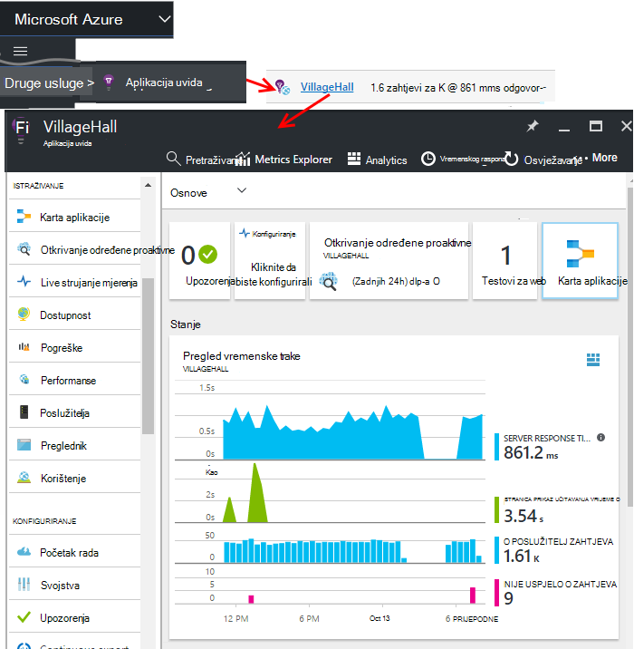

<properties
    pageTitle="Nadzorne ploče i navigacije na portalu aplikacije uvida | Microsoft Azure"
    description="Stvaranje prikaza ključa APM grafikone i upitima."
    services="application-insights"
    documentationCenter=""
    authors="alancameronwills"
    manager="douge"/>

<tags
    ms.service="application-insights"
    ms.workload="tbd"
    ms.tgt_pltfrm="ibiza"
    ms.devlang="multiple"
    ms.topic="article" 
    ms.date="10/18/2016"
    ms.author="awills"/>

# Navigacija i nadzorne ploče na portalu uvida aplikacije

Nakon što ste [postavili uvida aplikacije na projektu](app-insights-overview.md), telemetrijskih podataka o performansama i korištenje aplikacije programa pojavit će se resursa aplikacije uvid u projekt [Azure portal](https://portal.azure.com).

## Pronađite svoje telemetrijskih

Prijava na [portal za Azure](https://portal.azure.com) , a zatim otvorite aplikaciju uvida resursa koji ste stvorili za aplikaciju.

Pregled plohu (stranica) za aplikaciju prikazuje sažetak ključa dijagnostičkih mjernih podataka aplikacije, a je pristupnik za ostale značajke portala.

Možete prilagoditi sve druge grafikone i prikvačiti na nadzornu ploču. Na taj način možete prenijeti zajedno ključa grafikona iz različitih aplikacija.

## Nadzorne ploče

Prvo što vidite kada se prijavite na [portal Microsoft Azure](https://portal.azure.com) je nadzorna ploča. Ovdje možete unijeti zajedno grafikoni koji su vam najvažnije preko sve Azure resursa, uključujući telemetrijskih iz [Uvida aplikacije za Visual Studio](app-insights-overview.md).
 

1. **Kretanje određene resursima** kao što su aplikacije u aplikaciju uvida: pomoću trake s lijevom.
2. **Vratite se trenutni nadzornu ploču**ili da biste prešli na druge prikaze nedavne: koristite padajući izbornik u gornjem lijevom kutu.
3. **Nadzorna ploča za promjenu**: korištenje padajući izbornik na naslov nadzorne ploče
4. **Stvaranje, uređivanje i zajedničko korištenje nadzorne ploče** na alatnoj traci nadzorne ploče.
5. **Uređivanje na nadzornoj ploči**: zadržite pokazivač miša na pločici, a zatim pomoću njegovu gornju traku da biste premjestili, prilagođavanje ili ga ukloniti.

## Dodavanje na nadzornu ploču

Kada gledate plohu ili skup grafikoni koji je osobito zanimljivih, možete prikvačiti kopiju na nadzornu ploču. Prikazat će se sljedeći put vratit ćete se tamo.

1. Grafikon PIN nadzornu ploču. Kopiranje grafikona prikazuje se na nadzornoj ploči.
2. Prikvačite cijeli plohu nadzorne ploče – pojavljuje se na nadzornoj ploči kao pločicu koju možete klikati.
3. Kliknite gornjem lijevom kutu da biste se vratili na trenutni nadzornoj ploči. Zatim na padajućem izborniku možete koristiti da biste se vratili na trenutni prikaz.

Obratite pozornost na to da su grafikoni grupirane u pločice: pločicu može sadržavati više od jednog grafikona. Prikvačiti pločicu cijeli nadzorne ploče.

### Prikvačite bilo koji upit u Analytics

Možete i grafikoni [pin analize](app-insights-analytics-using.md#pin-to-dashboard) [zajedničkog](#share-dashboards-with-your-team) nadzornu ploču. Omogućuje dodavanje grafikona koji proizvoljne upit duž standardne metriku. (Nema naknadu za tu značajku.)

## Prilagodba pločica na nadzornoj ploči

Kada pločicu na nadzornu ploču, možete ga prilagoditi.

1. Dodavanje grafikona u pločicu. 
2. Postavljanje metrika, dimenzije Grupiraj po i stila (tablica, grafikonu) grafikona.
3. Povucite preko dijagram da biste povećali; Kliknite gumb za poništavanje ponovno postavite vremenski raspon; Postavljanje svojstava filtra za grafikone na pločici.
4. Postavljanje naslova pločica.

Pločice prikvačene iz blades metričkim explorer imati više mogućnosti za uređivanje od pločice prikvačene iz programa plohu pregled.

Izvorni pločicu koju ste prikvačene ne utječe na uređivanjem.

## Prebacivanje između nadzornih ploča

Možete spremiti više nadzorne ploče i prebacivati između njih. Kada vežete grafikon ili plohu se dodaju na trenutni nadzornu ploču.

Ako, na primjer, možda imate jedan nadzorne ploče za prikaz preko cijelog zaslona u tim sobu, a drugi za razvoj Općenito.

Na nadzornoj ploči, na plohu pojavit će se kao pločicu: kliknite je da biste prešli na plohu. Grafikon replicira grafikona na izvornom mjestu.

## Zajedničko korištenje nadzorne ploče

Pri stvaranju nadzornu ploču možete zajednički koristiti s drugim korisnicima.

Saznajte više o [ulogama i kontrola pristupa](app-insights-resources-roles-access-control.md).

## Navigacija aplikacije

Pregled plohu je pristupnika na dodatne informacije o aplikacije.

* **Grafikon ni pločice** – kliknite bilo koje pločica ili grafikona da biste vidjeli dodatne detalje o što prikazuje.

### Pregled plohu gumbi

* [**Explorer metriku**](app-insights-metrics-explorer.md) – Stvaranje vlastite grafikona izvedbe i korištenje.
* [**Pretraživanje**](app-insights-diagnostic-search.md) – istražiti određene instance događaje kao što su zahtjeve, iznimke, ili prijavu kašnjenja.
* [**Analitički**](app-insights-analytics.md) - snažna upiti vaše telemetrijskih.
* **Vremenski raspon** - Prilagodba raspon koji se prikazuje na grafikonima na plohu.
* **Brisanje** – brisanje resurs uvida aplikacije za ovu aplikaciju. Koje treba i uklanjanje paketa aplikacije uvida iz aplikacije koda ili uređivanje [instrumentation ključ](app-insights-create-new-resource.md#copy-the-instrumentation-key) u aplikaciji za usmjeravanje telemetrijskih na drugi resurs uvida aplikacije.

### Kartica Essentials

* [Ključ instrumentation](app-insights-create-new-resource.md#copy-the-instrumentation-key) - označava ovaj resurs aplikacije. 
* Cijene – provjerite značajke dostupne i postavljanje glasnoću verzal.

### Navigacijska traka Web App

* **Pregled** - povratak na pregled plohu aplikacije.
* **Zapisnik aktivnosti** - upozorenja i Azure administrativnih događaji.
* [**Kontrola pristupa**](app-insights-resources-roles-access-control.md) - omogućuju pristup članovima tima i drugim korisnicima.
* [**Oznake**](../resource-group-using-tags.md) - koristi oznake da biste grupirali aplikacije s drugim korisnicima.

ISTRAŽIVANJE

* [**Karta aplikacije**](app-insights-app-map.md) - aktivne karte u s prikazom komponenti aplikacije, izvedene iz podaci o ovisnosti.
* [**Određene proaktivne Dijagnostika**](app-insights-proactive-diagnostics.md) – pregled nedavnih performanse upozorenja.
* [**Aktivno strujanje**](app-insights-metrics-explorer.md#live-stream) - fiksni skup metriku blizu izravnih koristan kada implementacija novi Sastavi ili ispravljanje pogrešaka.
* [**Dostupnosti / web-testira**](app-insights-monitor-web-app-availability.md) -Pošalji zahtjeve za običnog web-aplikaciji iz oko na world.* 
* [**Pogreške, performanse**](app-insights-web-monitor-performance.md) - iznimke, pogreška stope i odgovor puta zahtjeva za aplikaciju i zahtjeva iz aplikacije za [ovisnosti](app-insights-asp-net-dependencies.md).
* [**Performanse**](app-insights-web-monitor-performance.md) – reakcija, ovisnosti odgovor vremena. 
* [Poslužitelji](app-insights-web-monitor-performance.md) - mjerača performansi. Dostupan ako [Instalacija Nadzornik stanja](app-insights-monitor-performance-live-website-now.md).

* **Preglednik** – prikaz stranice i performanse AJAX-a. Dostupan ako [instrumenata web-stranice](app-insights-javascript.md).
* **Korištenje** - prikaz stranica, korisnik i sesiju broji. Dostupan ako [instrumenata web-stranice](app-insights-javascript.md).

KONFIGURIRANJE

* **Početak rada** – vodič u istoj razini.
* **Svojstva** - instrumentation ključ, pretplate i id resursa.
* [Upozorenja](app-insights-alerts.md) - metričkim upozorenja konfiguracije.
* [Izvoz neprekinuto](app-insights-export-telemetry.md) - konfiguriranje izvoz telemetrijskih Azure za pohranu.
* [Testiranje performanse](app-insights-monitor-web-app-availability.md#performance-tests) – postavljanje stilova sintetičkih učitavanja na web-mjestu.
* [Kvota i cijene](app-insights-pricing.md) i [ingestion uzorkovanje](app-insights-sampling.md).
* **Pristup API** - stvaranje [pustite opaske](app-insights-annotations.md) i API-JA za pristup podacima.
* [**Rad stavke**](app-insights-diagnostic-search.md#create-work-item) - povezati službeni sustav za praćenje tako da stvorite programskih pogrešaka prilikom pregled telemetrijskih.

POSTAVKE

* [**Zaključava**](..\resource-group-lock-resources.md) – zaključavanje Azure resursi
* [**Automatizacija skripte**](app-insights-powershell.md) - izvoz definiciju Azure resursa tako da ga možete koristiti kao predloška za stvaranje nove resurse.

PODRŠKA

* **Zahtjev za podršku** - zahtijeva plaćenu pretplatu. Vidi također [pristup sustavu pomoći](app-insights-get-dev-support.md).

## Što je sljedeće?

||
|---|---
|[Explorer mjerenja](app-insights-metrics-explorer.md) Filtriranje i segmenta mjerenja|
|[Dijagnostičke pretraživanja](app-insights-diagnostic-search.md) Pronalaženje i provjera događaje, povezane događaja i stvaranje programskih pogrešaka |
|[Analytics](app-insights-analytics.md) Jezik naprednih upita| 

