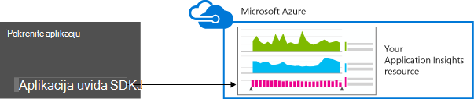
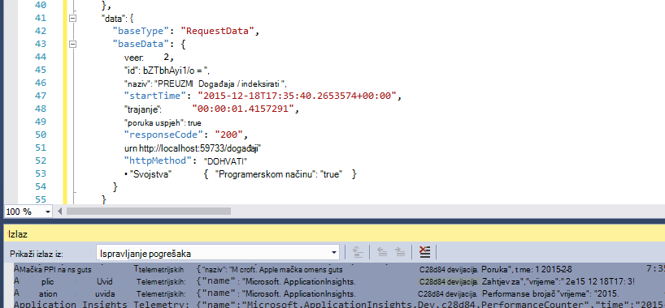
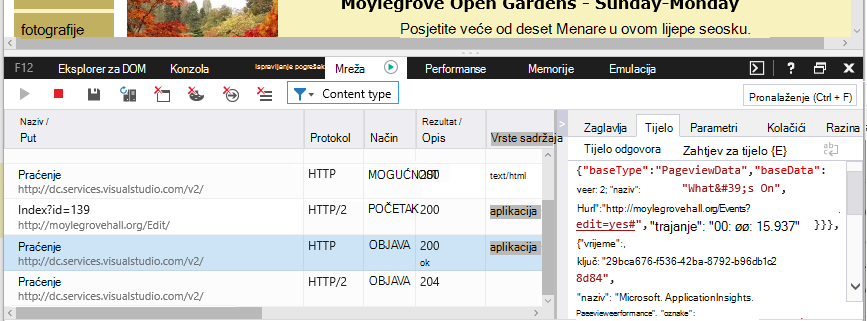

<properties 
    pageTitle="Zadržavanje podataka i prostor za pohranu u aplikaciji uvida" 
    description="Izjava o pravila zadržavanja i zaštita privatnosti" 
    services="application-insights" 
    documentationCenter=""
    authors="alancameronwills" 
    manager="douge"/>

<tags 
    ms.service="application-insights" 
    ms.workload="tbd" 
    ms.tgt_pltfrm="ibiza" 
    ms.devlang="na" 
    ms.topic="article" 
    ms.date="05/17/2016" 
    ms.author="awills"/>

# Prikupljanje podataka, zadržavanja i prostor za pohranu u aplikaciji uvida 

*Aplikacija uvida je u pretpregledu.*

Kad instalirate [Uvida aplikacije za Visual Studio] [ start] SDK u svojoj aplikaciji šalje telemetrijskih o aplikacije u oblak. Prirodno, odgovorni razvojnim inženjerima će vas zanimati točno podacima koje se šalju, što se događa s podacima i kako zadržati kontrolu nad ga. Posebice u nije osjetljivi podaci biti poslana, gdje je spremljena, a koliko ćete sigurnim je? 

Prvo ukratko:

* Standardni telemetrijskih module koji se izvode "izvan okvira" vjerojatno pošaljite povjerljive podatke na servis. Za telemetriju se bavi opterećenja, performanse i korištenje metriku, iznimku izvješća i drugih dijagnostičkih podataka. Vidljive u izvješćima dijagnostičkih podataka glavnom korisničkom su URL-ovi; No aplikacije bi trebalo u svakom slučaju smještati povjerljive podatke u obliku običnog teksta u URL-a.
* Možete upisati kod koji šalje dodatne prilagođene telemetrijskih pomoć kod za dijagnostiku i nadzor korištenja. (Ova mogućnost proširenja je odličan značajka aplikacije uvid.) Bi moguće, greškom, da biste napisali kod tako da obuhvaća osobne i druge povjerljive podatke. Ako aplikacija radi s tih podataka, primjene procesa istaknuti pregled da biste sav kod u pišete.
* Prilikom razvoja i testiranja aplikacije jednostavno je provjera što se šalje putem SDK-a. Podaci se pojavljuje u pogrešaka windows izlaz IDE i preglednika. 
* Podaci čuva se [Microsoft Azure](http://azure.com) poslužitelji u SAD-u. (Ali bilo kojeg mjesta možete pokrenuti aplikaciju.) Azure ima [jaku sigurnost obrađuje i zadovoljava širok raspon standarde usklađenosti](https://azure.microsoft.com/support/trust-center/). Samo vi i vaš tim za određenu imati pristup podacima. Microsoft osoblje možete ste ograničili pristup da biste ga samo u određenim uvjetima ograničeni s vašeg znanja. Iako ne na poslužiteljima na kojima je šifriran na putu.

Ostatku članka potpunije elaborates na te odgovore. Sadrži dizajniran biti samostalnih, tako da možete pokazati kolege koji nisu dio vašeg tima.

## Što je aplikacija uvida?

[Uvid aplikacije za Visual Studio] [ start] je servis koji nudi Microsoft koji olakšava poboljšati performanse i upotrebljivosti uživo aplikacije. Ga nadzire aplikacije stalno pokrenut, tijekom testiranja i nakon što ste objavili ili ga implementiran. Aplikacija uvida stvara grafikone i tablice koje se prikazuju, na primjer, koje doba dana se većina korisnika, kako odredište je aplikaciju i koliko će se dobro poslužena tako da sve vanjske servise koji ovisi o. Ako postoje ruši, pogreške ili probleme s performansama, možete pretraživati kroz telemetrijskih podataka detaljno dijagnosticiranje uzrok. I servis poslat će vam poruke e-pošte ako su sve promjene u dostupnosti i performanse aplikacije.

Da bi se ta je funkcija, instalirajte programa SDK aplikacije uvida u aplikaciji koja postaje dio njegov kod. Kada je pokrenut aplikacije, SDK nadzire njegov postupak i šalje telemetrijskih uvida aplikacije servisa. Ovo je servis u oblaku hostira tvrtka [Microsoft Azure](http://azure.com). (Ali uvida aplikacije radi sve aplikacije, ne samo one koji se nalaze u Azure.)

Servis aplikacije uvida sprema i analizira za telemetriju. Da biste pogledali analizu ili pretražite pohranjene telemetrijskih, prijavite se na račun za Azure i otvorite aplikaciju uvida resurs za svoju aplikaciju. Pristup podacima možete razmjenjivati i s drugim članovima tima ili navedeni Azure pretplatnika.

Može vam podaci izvezeni iz servisa aplikacija uvide, primjerice s bazom podataka ili vanjski Alati. Svaki alat pružiti posebne tipke koje ste nabavili iz servisa. Po potrebi možete opozvati tipku. 

Aplikacija uvida SDK-ovi su dostupne za raspon vrsta aplikacija: web-usluge u vlastiti J2EE ili ASP.NET poslužitelji ili Azure; web-klijentima – to jest, kod koji se izvodi na web-stranici; stolne aplikacije i servise; uređaj aplikacije kao što je Windows Phone, iOS i Android. Svi oni telemetrijskih poslati istu servisa.

## Što su podaci ga prikuplja?

### Po čemu se podaci prikupljaju?

Postoje tri izvora podataka:

* SDK integrirane aplikacije [u razvoju](app-insights-asp-net.md) ili [vrijeme izvođenja](app-insights-monitor-performance-live-website-now.md). Postoje različite SDK-ovi za vrste drugu aplikaciju. Postoji programa [SDK za web-stranice](app-insights-javascript.md)koja se učitava u pregledniku krajnjeg-korisnika zajedno sa stranice.

 * Svaki SDK sadrži broj [module](app-insights-configuration-with-applicationinsights-config.md), koji se koriste različite tehnike da biste prikupili različite vrste telemetrijskih.
 * Ako instalirate SDK u razvoju, njegov API-JA možete koristiti da biste poslali vlastite telemetrijskih, osim standardni moduli. Ovaj prilagođeni telemetrijskih mogu sadržavati podatke koje želite poslati.
* U nekim web-poslužiteljima postoje i agenata koji pokrenuti uz aplikaciju i slanje telemetrijskih o procesora i memorije occupancy mreže. Ako, na primjer, Azure VMs, Docker domaćini i [J2EE poslužitelji](app-insights-java-agent.md) mogu sadržavati takve agenata.
* [Dostupnost testira](app-insights-monitor-web-app-availability.md) su postupaka pokrenite Microsoft Pošalji zahtjeve na web-aplikaciju u pravilnim vremenskim razmacima. Rezultati šalju se sa servisom uvida aplikacije.

### Vrste podataka prikuplja?

Glavni kategorije su:

* [Telemetrijskih poslužitelja web](app-insights-asp-net.md) - HTTP zahtjeva.  URI, vrijeme za obradu zahtjev, kod odgovor, IP adresu klijenta. Id sesije.
* Broji se [web-stranica](app-insights-javascript.md) - stranica, korisnik i sesiju. Vremena učitavanja stranice. Iznimke. Pozivi AJAX-a.
* Performanse mjerača - memorije, procesora, IO, occupancy mreže.
* Postupak klijentske i poslužiteljske kontekst - OS, regionalnu shemu, vrsta uređaja, preglednika, razlučivost zaslona.
* [Iznimke](app-insights-asp-net-exceptions.md) i ruši - **stoga ako ste**, međuverziju id, vrsta procesora. 
* [Zavisnosti](app-insights-asp-net-dependencies.md) - poziva za vanjske servise kao što je OSTALE, SQL, AJAX-a. Niz URI ili vezu, trajanje, uspjeh, naredba.
* [Dostupnost testira](app-insights-monitor-web-app-availability.md) - trajanje probno te korake, odgovore.
* [Praćenje zapisnika](app-insights-search-diagnostic-logs.md) i [Prilagođeni telemetrijskih](app-insights-api-custom-events-metrics.md) - **ništa kod u zapisnicima ili telemetrijskih**.

[Više detalja](#data-sent-by-application-insights).

## Kako mogu provjeriti što koji se prikupljaju?

Ako razvijate aplikaciji Visual Studio, pokrenite aplikaciju u načinu rada za ispravljanje pogrešaka (F5). Pojavit će se za telemetriju u izlaznom prozoru. Iz nje, možete kopirati i oblikovati kao JSON za jednostavno provjere. 

Postoji i čitljiviji prikaza u prozoru Dijagnostika.

Za web-stranice, otvorite prozor za ispravljanje pogrešaka u web-pregledniku.

### Je li moguće napisati kod da biste filtrirali za telemetriju prije slanja?

To činite moguće pisanjem [telemetrijskih procesor dodatak](app-insights-api-filtering-sampling.md).

## Koliko je podataka zadržane? 

Neobrađenog točaka (to jest, stavke koje možete provjeriti u dijagnostičkih pretraživanju) čuvaju sedam dana. Ako morate zadržati podatke dulje od koje možete koristiti [Neprekinuti izvoz](app-insights-export-telemetry.md) da biste ga kopirali s računom za pohranu.

Skupne podatke (to jest, broji, prosjeke i druge statističke podatke koje vidite u programu Explorer metrika) se zadržavaju na Žitne 1 minuti 30 dana, a 1 h ili 1 dana (ovisno o vrsti) za barem 90 dana.

## Tko može pristupiti podacima?

Podaci su vidljive vama i, ako imate račun tvrtke ili ustanove, članovima tima. 

Ga možete izvesti i članovima tima i nije biti kopirali na druga mjesta i prenijeti na drugim osobama.

#### Što Microsoft raditi s podacima aplikacije šalje aplikacije uvid u?

Microsoft koristi podatke samo za pružanje usluge.

## Gdje se održava podatke? 

* U SAD-u. 

#### Je moguće pohraniti negdje drugdje, primjerice u Europi? 

* Ne na prezentacije. 

#### To znači aplikacije mora se nalaziti u Hrvatskoj?

* ne. Aplikacije možete pokrenuti bilo gdje u vlastiti domaćini lokalnog ili u oblak.

## Koliko ćete sigurnim jesu li Moji podaci?  

Aplikacija uvida je usluga Azure u pretpregledu. Dok se nalazite u pretpregledu radimo pri zaštiti podataka po pravila opisane u [Azure sigurnost, privatnost i usklađenost studiju](http://go.microsoft.com/fwlink/?linkid=392408).

Na poslužiteljima sustava Microsoft Azure pohrane podataka. Za račune na portalu za Azure račun ograničenja opisana su u [Azure sigurnost, privatnost i usklađenost dokumenta](http://go.microsoft.com/fwlink/?linkid=392408). Računa u Visual Studio tima Services portala za [Visual Studio tim servisima zaštita podataka](http://download.microsoft.com/download/8/E/E/8EE6A61C-44C2-4F81-B870-A267F1DF978C/MicrosoftVisualStudioOnlineDataProtection.pdf) dokumenta odnosi. 

Ograničen pristup podacima Microsoftovo osoblje. Ne možemo pristup vašim podacima samo s vašom dozvolom i ako je potrebno za podršku korištenje aplikacije uvida. 

Podaci u aggregate preko aplikacija sve naše klijenata (kao što je stope podataka i average veličina kašnjenja) koriste se za poboljšanje uvida aplikacije.

#### Nije moguće tuđe telemetrijskih ometati Moji podaci uvida aplikacije?

Nije moguće šalju dodatne telemetrijskih računa pomoću ključa za instrumentation koju je moguće pronaći u kod web-stranice. Uz dovoljno dodatne podatke na mjernih podataka nije ispravno predstavljala performanse i korištenje aplikacije programa.

Ako zajednički koristite kod s drugim projektima, imajte na umu da biste uklonili ključ instrumentation.

## Podaci šifriran? 

Ne unutar poslužitelja na prezentacije.

Svi podaci šifriran dok se pomiče između centre za podatke.

#### Podaci šifriran u prijelazu iz moje aplikacije na poslužitelje uvida aplikacije?

Da, https koristimo za slanje podataka na portalu iz gotovo sve SDK-ovi, uključujući web-poslužiteljima, uređajima i HTTPS web-stranice. Jedina je iznimka podataka koji se šalju iz običnog HTTP web-stranica. 

## Personally Identifiable Information

#### Nije Personally Identifiable informacije (PII) biti poslana do uvida aplikacije? 

Da, moguće je. 

Kao opće smjernice:

* Većini standardnih telemetriju (to jest, telemetrijskih poslane bez pisanja koda za sve) obuhvaćaju eksplicitnih PII. Međutim, možda je moguće prepoznavanja pojedinaca Primjena iz zbirke događaja.
* Iznimke i praćenje poruka mogu sadržavati PII
* Prilagođeni telemetrijskih - pozive to jest, kao što su TrackEvent koje pišete u kodu korištenjem kašnjenja API-JA ili zapisnik - mogu sadržavati podatke koje odaberete.

Tablica na kraju ovog dokumenta sadrži detaljne opise podatke prikupljene.

#### Koristim li dužni poštivati zakonima i pravilnicima o PII?

Da. Je odgovornost da biste bili sigurni da prikupljanje i korištenje podataka usklađuje s zakonima i pravilnicima, i Microsoft Online Services uvjete.

Korisnici trebali biste komponenta obavijestili o podataka aplikacije prikuplja i način korištenja podataka.

#### Mogu korisnicima isključiti uvida aplikacije?

Ne izravno. Ne dajemo parametar koji se vaši korisnici možete upravljati da biste isključili uvida aplikacije.

Međutim, kao što je značajka možete implementirati u aplikaciji. Sve SDK-ovi obuhvaćaju postavku za API koji isključuje telemetrijskih zbirke. 

#### Moje aplikacije slučajno prikuplja povjerljive podatke. Možete aplikacije uvida scrub ove podatke tako da ga ne zadržavaju?

Aplikacija uvida filtriranje ili brisanja podataka. Trebali biste komponenta upravljanje podacima i izbjeći slanje tih podataka do uvida aplikacije.

## Podataka koji se šalju putem aplikacije uvida

U SDK-ovi razlikovati platforme, a postoji nekoliko komponenti koje možete instalirati. (Pogledajte [uvida aplikacije – prvi koraci][start].) Svaku komponentu šalje različite podatke.

#### Klase podataka koji se šalju u različitim scenarijima

Radnju  | Klase podataka koji se prikupljaju (pogledajte sljedeću tablicu)
---|---
[Dodavanje aplikacije uvida SDK u projekt web .NET][greenbrown] | Kontekst poslužitelja Nenamjerna Mjerača mjerača performansi Zahtjevi za **Iznimke** Sesije korisnici
[Kliknite pločicu Nadzornik stanja IIS][redfield]|Zavisnosti Kontekst poslužitelja Nenamjerna Mjerača mjerača performansi
[Dodavanje aplikacije uvida SDK Java web App][java]|Kontekst poslužitelja Nenamjerna Zahtjev Sesije korisnici
[Dodavanje JavaScript SDK web-stranicu][client]|ClientContext  Nenamjerna Stranica ClientPerf AJAX-a
[Definiranje zadana svojstva][apiproperties]|**Svojstva** na svim standardnih ili prilagođenih događajima
[TrackMetric poziv][api]|Numeričke vrijednosti **Svojstva**
[Praćenje poziva *][api]|Naziv događaja **Svojstva**
[TrackException poziv][api]|**Iznimke** Ispis u stogu **Svojstva**
SDK ne može prikupiti podatke. Ako, na primjer:   -nije moguće pristupiti mjerača mjerača performansi  -Iznimka u telemetrijskih initializer | Dijagnostika SDK
 

Za [SDK-ovi za druge platforme][platforms], potražite u članku svoje dokumente.

#### Klase prikupljenih podataka

Klase prikupljenih podataka | Obuhvaća (ne iscrpan popis) 
---|---
**Svojstva**|**Svi podaci - određen kod**
DeviceContext |ID, IP, regionalnu shemu, model uređaja, mreže, vrsta mreže, naziva OEM-a, razlučivost zaslona, uloge instancu, naziv uloge, vrsta uređaja
ClientContext |OS, regionalnu shemu, jezik, mreže, prozor razlučivosti
Sesije | id sesije
Kontekst poslužitelja |Naziv računala, regionalnu shemu, OS, uređaj, korisničke sesije, kontekst korisnika, postupak 
Nenamjerna |mjesto zemlj iz preglednika vremenske oznake, OS, IP adresa
Mjerenja | Metričkim naziva i vrijednosti
Događaji | Naziv događaja, a vrijednost
PageViews | Naziv URL-a i stranice ili zaslona
Klijent mjerača performansi | Naziv URL-stranice, vrijeme učitavanja preglednika
AJAX-a | HTTP pozive iz web-stranice na poslužitelj
Zahtjevi za |URL-a, trajanje, kod odgovor
Zavisnosti|Vrsta (SQL, HTTP,...), niz veze ili URI sinkronizaciju/asinkrone, trajanje, uspjeh, SQL naredbe (s Status monitora)
**Iznimke** | Vrsta, **poruke**, snop poziva, broj datoteka i redak izvora, niti ID-a
Zatvara | Id procesa, id nadređenog procesa, rušenje niti ID-jeve. aplikacija zakrpa, id, a zatim Sastavi;  Vrsta iznimke, adrese, razlog; zatamnjenog simbola i Registri, binarni adrese početka i završetka, binarni naziv i put, vrsta procesora
Praćenje | **Poruke** i težinu razinu
Mjerača mjerača performansi | Procesor vrijeme, dostupnom memorijom, Učestalost zahtjeva, iznimku stopa, postupak privatnih bajtova, IO stopa, u drugoj, Duljina reda čekanja zahtjeva
Dostupnost | Šifra odaziva test za web, trajanje svakog test korak, test ime, vremenska oznaka, uspjeh, reakcija, mjesto test
Dijagnostika SDK | Praćenje poruka ili iznimke 

Možete [isključite neke podatke prema uređivanja ApplicationInsights.config][config]

## Kredita

Za ovaj proizvod sadrži GeoLite2 podataka stvorio nudi [http://www.maxmind.com](http://www.maxmind.com)MaxMind.

## Videozapisi

#### Uvod

> [AZURE.VIDEO application-insights-introduction]

#### Početak rada

> [AZURE.VIDEO getting-started-with-application-insights]

<!--Link references-->

[api]: app-insights-api-custom-events-metrics.md
[apiproperties]: app-insights-api-custom-events-metrics.md#properties
[client]: app-insights-javascript.md
[config]: app-insights-configuration-with-applicationinsights-config.md
[greenbrown]: app-insights-asp-net.md
[java]: app-insights-java-get-started.md
[platforms]: app-insights-platforms.md
[pricing]: http://azure.microsoft.com/pricing/details/application-insights/
[redfield]: app-insights-monitor-performance-live-website-now.md
[start]: app-insights-overview.md

 