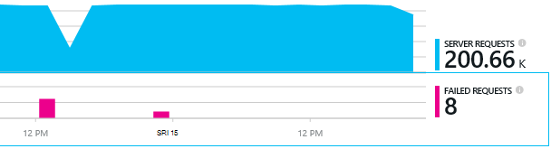

<properties 
    pageTitle="Dijagnosticiranje problema s ovisnosti u aplikaciji uvida" 
    description="Pronalaženje pogrešaka i sporo uzrokovanih ovisnosti" 
    services="application-insights" 
    documentationCenter=""
    authors="alancameronwills" 
    manager="douge"/>

<tags 
    ms.service="application-insights" 
    ms.workload="tbd" 
    ms.tgt_pltfrm="ibiza" 
    ms.devlang="na" 
    ms.topic="article" 
    ms.date="05/12/2016" 
    ms.author="awills"/>
 
# <a name="diagnosing-issues-with-dependencies-in-application-insights"></a>Dijagnosticiranje problema s ovisnosti u aplikaciji uvida


*Ovisnost* je vanjski komponenta naziva aplikacije. Obično je servis naziva pomoću HTTP, baze podataka ili u datotečnom sustavu. Ili u skriptu web-stranica može biti poziv AJAX-a na poslužitelj. U uvide aplikacije Visual Studio, jednostavno možete vidjeti koliko aplikacije čeka ovisnosti, a koliko često ne uspije ovisnost poziv.

## <a name="where-you-can-use-it"></a>Gdje je možete koristiti

Izvan okvira za nadzor ovisnost trenutno dostupna je za:

* ASP.NET web-aplikacije i servise na poslužitelju komponente IIS ili Azure
* [Java web-aplikacije](app-insights-java-agent.md)
* [Web-stranice](https://azure.microsoft.com/blog/ajax-collection-in-application-insights/)

Za ostale vrste, kao što je aplikacija uređaja možete napisati vlastite zaslona pomoću [TrackDependency API -JA](app-insights-api-custom-events-metrics.md#track-dependency).

Ovisnost Izlaz u-tvorničke monitor trenutno izvješća pozive na te vrste ovisnosti:

* PLATFORME ASP.NET
 * Baze podataka SQL
 * ASP.NET web- a WCF usluge koje koriste utemeljen na HTTP povezivanja
 * Lokalnom ili udaljenom HTTP poziva
 * Azure DocumentDb, tablice, blobova i reda čekanja
* Java
 * Pozivi u bazi podataka kroz [JDBC](http://docs.oracle.com/javase/7/docs/technotes/guides/jdbc/) upravljačkog programa, kao što su MySQL, SQL Server, PostgreSQL ili SQLite.
* Web-stranice
 * [Pozivi AJAX-a](app-insights-javascript.md)

Ponovno možete napisati vlastite pozive SDK praćenje drugih ovisnosti.

## <a name="to-set-up-dependency-monitoring"></a>Da biste postavili ovisnost nadzora

Instalirajte odgovarajuće agent za poslužitelj glavnog računala.

Platforme | Instalacija
---|---
IIS poslužitelj | Ili [Instalacija Nadzornik stanja na poslužitelju](app-insights-monitor-performance-live-website-now.md) ili [nadogradnju aplikacije za .NET framework 4.6 ili noviji](http://go.microsoft.com/fwlink/?LinkId=528259) i instalirajte [SDK aplikacije uvida](app-insights-asp-net.md) u aplikaciji.
Azure Web App | [Proširenje uvida aplikacije](app-insights-azure-web-apps.md)
Java web-poslužitelj | [Java web-aplikacije](app-insights-java-agent.md)
Web-stranice | [JavaScript monitor](app-insights-javascript.md) (Bez dodatne postavke osim nadzirati web-stranicu)
Azure u Oblaku |  [Korištenje pokretanje zadatka](app-insights-cloudservices.md#dependencies) ili [instalirati .NET framework 4.6 +](../cloud-services/cloud-services-dotnet-install-dotnet.md)  

Status monitora za IIS poslužitelje ne mora ponovno stvaranje izvora projekta s uvida SDK aplikacije. 

## <a name="application-map"></a>Karta aplikacije

Karta aplikacije ponaša se kao vizualno pomagalo za otkrivanje međuzavisnosti komponenti aplikacije. 


Iz okvira, možete se kretati odgovarajući ovisnost i druge grafikone.

Kliknite malu [x] da biste saželi podstabla.

Prikvačite karti na [nadzornu ploču](app-insights-dashboards.md), gdje će biti potpuno funkcionalni.

[Dodatne informacije](app-insights-app-map.md).

## <a name="diagnosis"></a>Dijagnosticiranje probleme s performansama ovisnosti na web-poslužitelju

Da biste procijenite performanse zahtjeva na vašem poslužitelju:


Pomaknite se do odjeljka susret rešetki zahtjeva za:


Gornji jedan traje neobično dugo. Pogledajmo ako smo možete saznati koje je utrošeno vrijeme.

Kliknite tom retku da biste vidjeli zahtjev za pojedinačne događaja:


Kliknite bilo koju dugoročnih instancu da biste ga dodatno pregledati.

> [AZURE.NOTE] Pomaknite se prema dolje bitne da biste odabrali instance. Kašnjenje u kanalu katkad znači da podaci za gornje instance nije potpun.

Pomaknite se do odjeljka poziva udaljene ovisnost vezane uz taj zahtjev:


Izgleda većinu vremena održavanje zahtjev je utrošeno u pozivu lokalni servis. 

Odaberite tom retku da biste dobili dodatne informacije:


Pojedinosti sadrži potrebne informacije za dijagnosticiranje problema.


## <a name="failures"></a>Pogreške

Ako postoje neuspjelih zahtjeva, kliknite grafikon.



Kliknite putem vrstu zahtjeva i instancu zahtjev, da biste pronašli nije uspjelo poziva udaljene ovisnosti.


## <a name="custom-dependency-tracking"></a>Prilagođeni ovisnost praćenja

Standardni modul ovisnost praćenje automatski otkriva vanjske ovisnosti kao što su baze podataka i REST API-ji. No možda ćete neke dodatne komponente tretirati na isti način. 

Kod koji šalje informacije o zavisnosti možete pisati pomoću isti [TrackDependency API](app-insights-api-custom-events-metrics.md#track-dependency) koji koriste standardni moduli.

Ako, na primjer, ako je kod stvaranja s grupom koju niste napisali sami, nije vrijeme sve pozive, da biste saznali što doprinos će se na vaše vrijeme odgovor. Da bi se ove podatke prikazane u ovisnosti grafikona u aplikaciji uvida, pošaljite je pomoću `TrackDependency`.

```C#

            var success = false;
            var startTime = DateTime.UtcNow;
            var timer = System.Diagnostics.Stopwatch.StartNew();
            try
            {
                success = dependency.Call();
            }
            finally
            {
                timer.Stop();
                telemetry.TrackDependency("myDependency", "myCall", startTime, timer.Elapsed, success);
            }
```

Ako želite da biste se prebacili isključeno praćenje modul standardne ovisnost, uklonite referencu DependencyTrackingTelemetryModule u [ApplicationInsights.config](app-insights-configuration-with-applicationinsights-config.md).


## <a name="ajax"></a>AJAX-a

U odjeljku [web-stranice](app-insights-javascript.md).


 