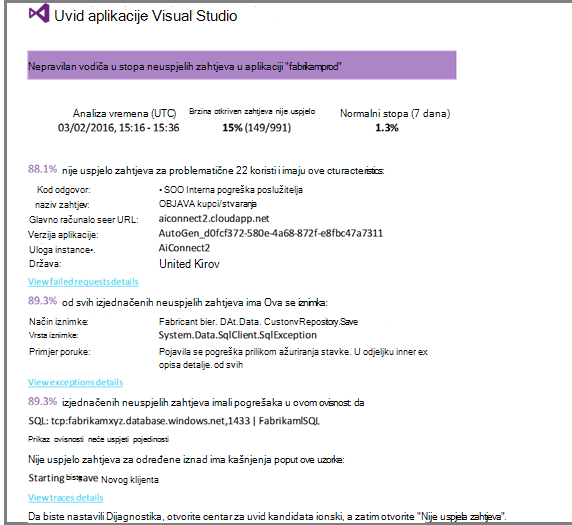

<properties
    pageTitle="Otkrivanje, razvrstavati, dijagnosticiranje"
    description="Analitika ruši i otkrivanje i dijagnosticiranje probleme s performansama aplikacija"
    authors="alancameronwills"
    services="application-insights"
    documentationCenter=""
    manager="douge"/>

<tags
    ms.service="application-insights"
    ms.workload="tbd"
    ms.tgt_pltfrm="ibiza"
    ms.devlang="na"
    ms.topic="article" 
    ms.date="11/06/2015"
    ms.author="awills"/>

# Otkrivanje, razvrstavati i dijagnosticiranje s računala uvida

*Aplikacija uvida je u pretpregledu.*

Aplikacija uvida pomaže saznali ste kako izvršava aplikacije i koristi se kada je uživo. A ako imate problema, omogućuje vam informacije o ga pridonosi procijenite posljedice i pomaže pri određivanju uzroka.

Ovdje je račun s tim koje razvija web-aplikacije:

* *"U nekoliko dana ćemo uvesti 'Sporedna' hitni popravak. Ne možemo niste funkcioniraju široku probno lozinka, no Nažalost imate neki neočekivane promjene spojiti opseg uzrokuje nekompatibilnost između naprijed i natrag završava. Odmah, je pokrenulo iznimke poslužitelja surged naš upozorenja, a zatim ćemo nastali upoznat situaciji. Nekoliko klikova Odsutan na portal za aplikacije uvida dobili smo dovoljno informacija od callstacks iznimku da biste suzili problem. Ne možemo vraćen odmah i ograničeno štete. Aplikacija uvida učinio taj dio na devops ciklusa vrlo lako i s akcijama."*

Pogledajmo kako razvojnom timu za uobičajene web pomoću aplikacije uvida praćenje performansi. Ne možemo ćete pratiti u tim u bankovni Fabrikam koje razvija u sustavu online bankovne (OBS).

U tim radi na krugu ovako:

Preduvjeti dolaziti njihova razvoja zaostale (popis zadataka). Ukratko rade sprints, često izlaganje rad softver – obično u obliku poboljšanja i proširenja za postojeće aplikacije. Nove značajke često ažurirati aplikaciju uživo. Dok je uživo, tim je nadzire za performanse i korištenje uz pomoć uvida aplikacije. Ovu analizu sažetke sadržaja natrag u njihove zaostale razvoj.

U tim koristi aplikacije uvida praćenje uživo web-aplikaciji usko za:
* Performanse. Žele da biste razumjeli kako vrijeme odaziva razlikuju se u zahtjev za brojanje; koliko procesora, mreže, disk i ostale resurse koji se koriste; i gdje se nalaze na grla.
* Pogreške. Ako postoje iznimke ili nije uspjela zahtjeve, ili ako performanse brojač vodi izvan upoznati rasponu, tim nije potrebno znati hitro tako da ih možete poduzeti akciju.
* Korištenje. Kad god je nova značajka je izdao, tima želite saznati što mjeri se koristi i hoće li korisnici imaju sve poteškoća s njim.

Pogledajmo usredotočite se na dio povratne informacije ciklusa:

## Otkrivanje nisku dostupnosti

Marcela Markova je viši programiranje članova tima OBS i traje vodi na performanse online za nadzor. Postavi nekoliko [testira web][availability]:

* Test jednostruko URL za glavni odredišna stranica za aplikaciju, http://fabrikambank.com/onlinebanking/. Ana 'Dobro došli'! postavlja kriterija HTTP kod 200 i tekst. Ako to testiranje ne uspije, nešto nije u utjecati redu s mrežom ili poslužitelja ili možda implementacije problem. (Ili netko promijeni Dobro došli! poruka na stranici bez da svoj know.)

* Detaljnije više koraka test, koji zapisuje i dobiti trenutnog računa stavku, provjera nekoliko ključne detalje na svakoj stranici. Ovaj test provjerava radi li se veza s bazom podataka računa. Ana koristi id izmišljeni kupca: nekoliko ih održavaju svrhe test.

Marcela je te postavljanje testira, sigurni da će brzo tima znati o sve prekida.  

Do neuspjele prikazuju se kao crvena točke na web-test grafikon:

No više važno je napomenuti da, hoće li biti je upozorenje o bilo slali razvojnom timu za. Na taj način znaju o njoj prije gotovo sve klijente.

## Praćenje performansi mjerenja

Na stranici pregled u aplikaciji uvida je grafikon koji prikazuje različite [ključa metriku][perf].

Vrijeme učitavanja stranice preglednika proizlazi iz telemetrijskih poslane izravno s web-stranice. Vrijeme odaziva poslužitelja, poslužitelj zahtjeva za brojanje zahtjeva count se sve u mjeri u web-poslužitelj i šalju do uvida aplikacija iz njega.

Marcela je malo zamaraju na grafikonu poslužitelja odgovor koji prikazuje Prosječno vrijeme između kada poslužitelj primi zahtjev HTTP iz preglednika korisnika, a kada vratit će odgovor. Nije neobično da biste vidjeli varijacije u tom se grafikonu tijekom učitavanja u sustavu mijenja se. No u tom slučaju postoji čini se da se korelacije između malih dolazi u brojanje zahtjeva za, a velike dolazi u vremenu odgovor. Koji ukazuje sustav radi samo na njegov ograničenja. 

Ana otvara grafikoni poslužitelja:

Postoji čini se da se ne prijavite postoji, ograničenje resursa pa možda udaraca u grafikonima odgovor poslužitelja su samo coincidence.

## Upozorenja

Ipak, Ana želi nadzirali puta odgovor. Ako izmjene prevelika, Ana želi odmah znati o njemu.

Da bi se ona postavlja [upozorenja][metrics], za odgovor puta veći od standardne praga. Tako ćete dobiti svoj pouzdanosti koje ona ćete znati o njoj ako se vrijeme odaziva sporo.

Upozorenja možete postaviti na razna druge metriku. Ako, na primjer, možete primati poruke e-pošte ako count iznimku postaje Visoko ili dostupnom memorijom dolazi malo ili ako zahtjevi klijenta na vrh.

## Određene proaktivne dijagnostičkih upozorenja

Sljedeći dan, iz aplikacije uvida stižu upozorenja e-pošte. Ali kada se ona je otvori, pronalazi she nije upozorenje vrijeme odgovor koji je postavljen. Umjesto toga ga govori njegove otkrivena iznenadno vodiča u neuspjelih zahtjeva – to jest, zahtjevi za koje je vratilo kodove pogreške od 500 ili više njih.

Nije uspjelo zahtjevi se gdje korisnici imaju vidjeti pogrešku - obično slijedi je iznimka kod. Možda se prikaže poruka koja kaže "Nažalost nije ažuriramo pojedinosti odmah" ili kod apsolutna neprikladne najgore, stoga ispis na zaslonu korisnika dobiveni su ljubaznošću web-poslužitelj.

Upozorenje je iznenađenje, jer ona gledali, zadnji put count zahtjeva encouragingly niskog. Mali broj neuspjeha je očekivati busy poslužitelj. 

Također je malo iznenađenje za njegove jer ona ne morate konfigurirati upozorenje. Zapravo, određene proaktivne Dijagnostika automatski dolazi s uvida aplikacije. Automatski prilagođava uobičajene pogreške uzorak pokrenite aplikaciju i pogreške "se koristi za" na određenu stranicu ili velikom opterećenju ili povezane s drugim mjernih podataka. Samo ako je vodiča iznad dođe očekivati, pokreće zajedničko korištenje.

Ovo je vrlo koristan e-pošte. Ne samo Potenciranje alarma; Postoji mnogo razvrstavanje i dijagnostičkih rad previše.

Prikazuje utječe na koliko kupci, i koje web-stranice ili operacije. Marcela možete odlučiti hoće li Zasad mora se cijeli tim rad na to kao dubinske analize fire ili li ga možete zanemariti sve dok se ne sljedeći tjedan.

E-pošte također se prikazuje da određene iznimku došlo je do i - čak i zanimljivijom - problem vezan uz nije uspjelo pozive na određenu bazu podataka. Time se objašnjava zašto kvara iznenada pojavljivala iako Marcela na tim je postavila sva ažuriranja nedavno. 

Ana pings Voditelj od tima za bazu podataka. Da, oni objavio hitni popravak u zadnjih pola sata; i Oops, možda možda postoji promjena manji sheme...

Tako da je problem na način fiksno, čak i prije istražuje zapisnika i u roku od ga neki 15 minuta. Međutim, Marcela klikova na vezu da biste otvorili aplikaciju uvide. Otvara se izravno na zahtjeva nije uspjelo i korisnik može vidjeti baze podataka nije uspjelo poziva na popisu pridruženih ovisnost poziva. 

## Otkrivanje iznimke

Uz malo postavljanja, [iznimke](app-insights-asp-net-exceptions.md) prijavljene aplikacije uvid u automatski. Ih možete također biti zabilježene izričito tako da umetnete poziva [TrackException()](app-insights-api-custom-events-metrics.md#track-exception) u kod:  

    var telemetry = new TelemetryClient();
    ...
    try
    { ...
    }
    catch (Exception ex)
    {
       // Set up some properties:
       var properties = new Dictionary <string, string>
         {{"Game", currentGame.Name}};

       var measurements = new Dictionary <string, double>
         {{"Users", currentGame.Users.Count}};

       // Send the exception telemetry:
       telemetry.TrackException(ex, properties, measurements);
    }

U tim Fabrikam bankovni sadrži razvile vježbe uvijek slanja telemetrijskih iznimku, osim ako postoji očite oporavak.  

Zapravo je čak i šira od njihove strategije: šalju telemetriju u svakoj slučaju gdje se nalazi kupac gumb u ono što oni htjeli učiniti, hoće li se odgovara iznimku kod ili ne. Na primjer, ako vanjski među bankovni prijenos sustava vraća poruku "nije moguće dovršiti ove transakcije" iz nekog razloga radu (bez kvara Kupac) pa ih pratiti taj događaj.

    var successCode = AttemptTransfer(transferAmount, ...);
    if (successCode < 0)
    {
       var properties = new Dictionary <string, string>
            {{ "Code", returnCode, ... }};
       var measurements = new Dictionary <string, double>
         {{"Value", transferAmount}};
       telemetry.TrackEvent("transfer failed", properties, measurements);
    }

TrackException koristi se za izvješćivanje iznimke jer šalje kopiju snopa; TrackEvent koristi se za izvješćivanje druge događaje. Možete priložiti sva svojstva koja može biti koristan u Dijagnostika.

Iznimke i događaje prikazuju se u [Dijagnostike pretraživanja] [ diagnostic] plohu. Možete dubinsko analiziranje ih da biste vidjeli dodatna svojstva i posložiti praćenja.

## Nadzor aktivnosti korisnika

Kada dosljedno dobro je vrijeme odaziva i postoji nekoliko iznimki, tim razvojni možete razmislite o tome kako da biste poboljšali iskustvo korisnika i da biste potaknuli više korisnika da biste postigli željeni ciljeva.

Na primjer, ima putovanje Tipični korisnik putem web-mjesta Očisti 'lijevak': broju korisnika pogledajte stope različite vrste kredita; Neke od njih ispunite obrazac ponude; i onih koji se ponuda, nekoliko nastaviti i uklanjanje kredita.

Po odlučuje gdje ispustite maksimalnog broja kupcima, tvrtke možete raditi da biste dobili više korisnika na dno lijevka. U nekim slučajevima možda postoje pogreške korisničkog sučelja (UX) –, na primjer, "sljedeće" gumb je teško pronaći ili nisu očite upute. Vjerojatnije, postoji više značajan tvrtke razloga za ispuštanje odbacivanja: možda su prevelika stope kredita.

Bilo kakve razloga, podatke pomaže u tim razradite što korisnici rade. Praćenje pozive se umeće razradite više detalja. TrackEvent() može se koristiti za brojanje radnje korisnika iz precizno pojedinosti klikova pojedinačne gumb da biste značajan postignuća kao što su plaćanja isključivanje zajam, plaćenu.

Tim za početak se pojavljuju informacije o aktivnosti korisnika. Danas, svaki put kada su dizajnirali je nova značajka, rade izgleda kako će dobiti povratne informacije o njegova korištenja. Oni dizajna praćenje pozive u značajku od početka. Da bi značajka svakog ciklusa razvoja koriste povratne informacije.

## Određene proaktivne nadzora  

Marcela ne samo sjesti oko čekanje upozorenja. Odmah nakon svakog ponovno uvođenje Ana vodi susret [odgovor puta] [ perf] -cjelokupan slika i tablicu najmanju zahtjeve, kao i broji iznimke.  

Ana možete otkriti efekt performanse svaki implementacije obično Usporedba svaki dan s zadnje. Ako postoji iznenadno worsening, ona koja pokreće s odgovarajući razvojnim inženjerima.

## Razvrstavanje

Razvrstavanje - assessing težinu i opseg problem – prvi je korak nakon otkrivanja. Ne možemo nazovite izvan tima od ponoći? Ili ga ostati do sljedeće praktičan razmaka u na zaostale? Postoje neke ključne pitanja u razvrstavanje.

Koliko se to događa? Grafikoni na pregled plohu perspektivu neke da biste problem. Ako, na primjer, aplikacije Fabrikam generira četiri upozorenja probno web jedan noći. Pogled na grafikon u Jutro, tim nije potražite u članku da postoje uistinu neke crvena točke iako su i dalje Većina testova zelena. Dubinska analiza grafikona dostupnost, bile Očisti sve te Povremeni probleme su s jednog test mjesta. Pogrešno je problem s mrežom u utjecaja samo jedan usmjeravanje i vjerojatno će poništite sam.  

Za razliku od toga dramatičnosti i stabilan vodiča u grafikonu iznimku odgovora ili Broji koliko je puta pogrešno nešto nije u panic o.

Korisni razvrstavanje taktika je Isprobajte ga sami. Ako naiđete na isti problem, znate da je real.

Odnosi se na koje razlomak korisnika? Da biste nabavili gruba odgovor, stopu podijelite s pogreške broj sesija.

U slučaju spora odgovor usporedite tablici najmanju reagirati zahtjeva s učestalosti korištenja svake stranice.

Kako važno je blokirana scenarij? Ako je funkcionalni problem blokiranje određeni korisnički priče, je važno slično? Ako korisnici ne možete platiti njihove računi, to je ozbiljne; Ako se ne možete promijeniti svoje preference boje zaslona, možda ga možete pričekajte. Detalje o događaju ili iznimke ili identitet sporo stranice možete vidjeti gdje korisnici imate poteškoća.

## Dijagnostika

Dijagnostika nije prilično isto što i ispravljanje pogrešaka. Prije nego što počnete praćenje putem koda, imat ćete gruba ideju zašto, gdje i kada se pojavljuje problem.

**Kada se to događa?** Prikaza povijesnih nudi grafikoni događaj i metriku olakšava povezivanje efekata s mogućih razloga. Ako su odgovor vremena ili iznimke stope Povremeni peaks, pogledajte count zahtjev: Ako peaks u isto vrijeme, a zatim izgleda problem resursa. Trebate dodijeliti više procesora i memorije? Ili je ovisnosti koje nije moguće upravljati opterećenje?

**Je li nam?**  Ako imate iznenadno padajuće performanse određene vrste zahtjev – na primjer kada klijent želi na račun iskaz -, a zatim postoji vjerojatnost možda je vanjski podsustav umjesto web-aplikacije. U programu Explorer mjernih podataka, odaberite brzina ovisnost pogreške i trajanje ovisnost stope i usporedite njihove transparentnost preko zadnjih nekoliko sati ili dana s koje otkriven problem. Ako postoji correlating promjene, vanjski podsustav možda je u blame.  

Neki problemi sporo ovisnost su problemi geolokacija-a. Bankovni Fabrikam koristi Azure virtualnim strojevima i otkrio da su imali slučajno nalazi svoje web-poslužitelj i račun poslužitelja u različite zemlje. Dramatičnosti unaprjeđivanja je ne unese po migracije jedan od njih.

**Što nije smo?** Ako se problem ne pojavljuje u ovisnosti, a drugu uvijek ima, ga je vjerojatno uzrok nedavnu promjenu. Povijesne perspektive nudi grafikoni metričke i događaja olakšava povezivanje iznenadno promjene s implementacijama. Koje sužava pretraživanje za dani problem.

**Šta se događa?** Neke probleme samo rijetko pojavljuju, a može biti teško pronaći tako da testirate izvanmrežno. Sve možemo učiniti jest da biste snimili pogreške kada se pojavi uživo. Možete provjeriti ispisi snop u izvješćima iznimke. Osim toga, možete napisati poziva za praćenje, s vašeg framework omiljeni zapisivanje ili TrackTrace() ili TrackEvent().  

Fabrikam imao Povremeni problemi s prijenosi među računa, ali samo s određenim vrstama računa. Da biste bolje razumjeli što je događa, mogu umetnuti TrackTrace() pozive na ključne točke u kodu, priložite vrstu računa kao svojstvo svaki poziv. Koji upućuje jednostavno filtriranje samo onih kašnjenja u dijagnostičkih pretraživanju. Vrijednosti parametara kao svojstva i mjere su priložene i praćenje poziva.

## Postupanje s njom

Nakon što ste prepoznate problem, možete stvoriti plan za popravak. Možda ćete morati vratiti nedavnu promjenu ili možda samo nastaviti i alata za popravak. Nakon dovršetka popravak aplikacije uvida se li uspješno.  

Fabrikam banke razvojnom timu potrajati više strukturirane pristup za mjerenje performanse nego prije koriste uvida aplikacije.

* Na stranici pregled aplikacije uvida postavljaju ciljeve pomoću određenih mjere.

* Dizajniranje mjere performanse u aplikaciju na početnom zaslonu kao što su metrike koji mjere korisnika napredak kroz "funnels."  

## Korištenje

Aplikacija uvida se može koristiti i da biste saznali što korisnici učinite aplikacije. Kada je pokrenut provođenju, tima želite saznati koje su značajke najpopularnijih, što korisnicima sviđa ili imaju poteškoća s i koliko često mogu vratiti. Koji pomažu im prioritet rade nadolazeće. I namjeravaju izmjeriti uspjeh svake značajke kao dio ciklusa razvoja. [Dodatne informacije][usage].

## Aplikacija

To je jedne tima pomoću aplikacije uvide ne samo da biste riješili probleme za pojedinačne, ali da biste poboljšali njihove životni ciklus razvoja. Nadam se da je vam je dala nekih ideja o tome kako aplikaciju uvida olakšavaju poboljšati performanse vlastite aplikacije.

## Videozapis

[AZURE.VIDEO performance-monitoring-application-insights]

<!--Link references-->

[api]: app-insights-api-custom-events-metrics.md
[availability]: app-insights-monitor-web-app-availability.md
[diagnostic]: app-insights-diagnostic-search.md
[metrics]: app-insights-metrics-explorer.md
[perf]: app-insights-web-monitor-performance.md
[usage]: app-insights-web-track-usage.md
 
