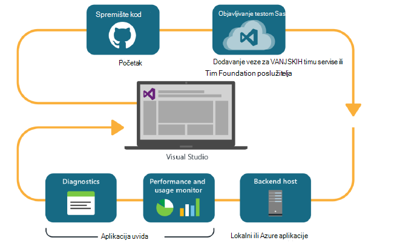
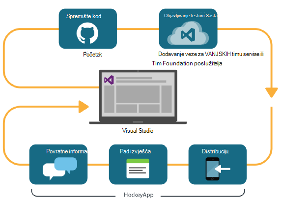

<properties
    pageTitle="Analytics za razvojne inženjere"
    description="DevOps s Visual Studio, uvida aplikacije i HockeyApp"
    authors="alancameronwills"
    services="application-insights"
    documentationCenter=""
    manager="douge"/>

<tags
    ms.service="application-insights"
    ms.workload="tbd"
    ms.tgt_pltfrm="ibiza"
    ms.devlang="na"
    ms.topic="article" 
    ms.date="05/18/2016"
    ms.author="awills"/>

# Za razvojne inženjere analize pomoću aplikacije uvida i HockeyApp

*Aplikacija uvida je u pretpregledu.*

Više projekata radi brzog [DevOps](https://en.wikipedia.org/wiki/DevOps) ciklusa. Oni Sastavljanje i distribucija aplikacija njihovoj, prikupljanje povratnih informacija o načinu na koji izvršava i što korisnicima raditi s njima, a zatim pomoću tog znanja isplanirati dodatno ciklusa razvoja. 

Da biste pratili korištenje i performanse, je važno je imati telemetrijskih iz aplikacije za uživo, kao i povratnih informacija sami korisnici. 

Mnogim sustavima ugrađenih iz više komponenti: web-servisa, pozadinskog procesora i služi za pohranu podataka i klijentski softver koji se izvodi u pregledniku korisnika ili aplikacije u telefona ili neki drugi uređaj. Telemetrijskih iz te razne komponente je da bi se otvorila zajedno.

Neke izdanja je ograničeno za raspodjelu na određenu mogućnost; imamo i organizacija flighting (testira novih značajki s ograničenom ciljne skupine) i A | B testiranje (paralelno testira zamjenski korisničkog sučelja).

Upravljanje distribucija i integracija nadzor nad više postupak klijentske i poslužiteljske komponenti nije trivial zadatka. Ovaj postupak je ključna dio arhitektura aplikacije: ćemo nije moguće stvoriti sustava tom JAMSTAVA bez programa ciklusa razvoja izračun s iteracijama i dobro Alati za nadzor.

U ovom se članku ćete smo pogledajte kako nadzora aspekte ciklusa devOps uklapa pomoću drugih dijelova postupka. 

Ako želite pogledati određene primjer, postoji [zanimljive Studije slučaja](http://aka.ms/mydrivingdocs) koja ima više postupak klijentske i poslužiteljske komponente.

## DevOps ciklusa

Alati Visual Studio i analize za razvojne inženjere nude devOps dobro integrirano sučelje. Ako, na primjer, ovo su uobičajeni ciklusa za web-aplikaciju (što može biti Java, Node.js ili ASP.NET):

* Razvojni inženjer provjerava u spremištu kod ili spaja u glavnom grani. Spremište je brojka na ovoj slici, no možda ravnomjerno [Kontrolu verzije Foundation tima](https://www.visualstudio.com/docs/tfvc/overview).
* Promjene pokretanje Sastavi i jedinica test. Servis za sastavljanje može biti u [Visual Studio Team Services ili njegov lokalnog postoji zamjena u obliku, tim Foundation poslužitelja](https://www.visualstudio.com/docs/vsts-tfs-overview). 
* Test jedinica i uspješno Sastavi možete [okidača automatsko implementacije](https://www.visualstudio.com/docs/release/author-release-definition/more-release-definition). Glavno računalo web app može biti vlastitu web-poslužitelj ili Microsoft Azure. 
* Telemetriju u aplikaciji uživo šalju se u [Aplikaciju uvide](app-insights-overview.md), i s poslužitelja i [iz preglednika klijenta](app-insights-javascript.md). Postoji, možete Analitika performanse uzoraka aplikacije i korištenje. Napredni [Alati za pretraživanje](app-insights-analytics.md) pomoći dijagnosticiranje problema. [Upozorenja](app-insights-alerts.md) provjerite jesu li informacije o problemu čim ga nastaje. 
* Na sljedeći ciklus razvoja se obavještavaju po analize uživo telemetrijskih.

### Uređaj i desktop

Uređaj i aplikacija za stolna računala, dio raspodjele ciklusa je malo drugačije jer smo nisu samo prijenos s jednom ili dvjema poslužiteljima. Umjesto toga uspješno Sastavi i testiranje jedinica mogu [okidača prenosi HockeyApp](https://support.hockeyapp.net/kb/third-party-bug-trackers-services-and-webhooks/how-to-use-hockeyapp-with-visual-studio-team-services-vsts-or-team-foundation-server-tfs). HockeyApp supervises distribucije za vaš tim testnih korisnika (ili javnosti, po želji). 

HockeyApp prikuplja i performanse i podataka o korištenju, u obrascima:

* Povratna li korisnik snimke zaslona
* Pad izvješća
* Prilagođeni telemetrijskih programiranja vi.

I opet ciklusa devOps dovršetka dok radite planove budući razvoj in the light of stekli povratne informacije.

## Postavljanje Analytics za razvojne inženjere

Za svaki dio aplikacije – mobilni ili web ili radne površine – korake zapravo isti su. Za mnoge vrste aplikacije Visual Studio automatski izvodi neke od ovih koraka.

1. Dodajte odgovarajuće SDK aplikacije. Za aplikacije uređaj je HockeyApp, a za web-usluge je uvida aplikacije. Svaka ima nekoliko varijante za različite platforme. (Preporučuje se i moguće koristiti oba SDK za aplikacije za stolna računala, iako preporučujemo HockeyApp.)
2. Registrirajte se aplikacije s portala uvida aplikacije ili HockeyApp, ovisno o SDK koji ste koristili. Evo gdje ćete vidjeti analitičke podatke iz aplikacije programa uživo. Dobit instrumentation ključ ili ID koji je konfigurirati u aplikaciju tako da se SDK zna gdje da biste poslali njegov telemetrijskih.
3. Prilagođeni kod (po želji dodajte) da biste se prijavili događaje ili mjernih podataka, koje će vam pomoći u Dijagnostika ili da biste analizirali performanse ili korištenje. Postoji mnogo nadzor ugrađena, tako da vam nisu potrebna na vaš prvi ciklus.
3. Za aplikacije uređaj:
 * Prenesite ispravljanje pogrešaka Sastavi HockeyApp. Iz njega možete je distribuirati timu testnih korisnika. Kada prenesete kasnije sastavlja, tim će biti obaviješteni.
 * Prilikom postavljanja sustava neprekinuti napraviti servisa, stvorite definiciju izdanja koja koristi dodatak korak da biste prenijeli na HockeyApp.

### Izvoz za telemetriju HockeyApp i analize

Možete istražiti HockeyApp Prilagođeno i prijavu telemetrijskih pomoću analize i neprekinuti izvoz značajke aplikacije uvida postavljanjem [most](app-insights-hockeyapp-bridge-app.md).

## Daljnji koraci
 
Ovo su detaljne upute za različite vrste aplikacija:

* [ASP.NET web-aplikacije](app-insights-asp-net.md) 
* [Java web-aplikacije](app-insights-java-get-started.md)
* [Node.js web-aplikacije](https://github.com/Microsoft/ApplicationInsights-node.js)
* [aplikaciju za iOS](https://support.hockeyapp.net/kb/client-integration-ios-mac-os-x-tvos/hockeyapp-for-ios)
* [Mac OS X aplikacije](https://support.hockeyapp.net/kb/client-integration-ios-mac-os-x-tvos/hockeyapp-for-mac-os-x)
* [Aplikacija za android](https://support.hockeyapp.net/kb/client-integration-android/hockeyapp-for-android-sdk)
* [Aplikacija za univerzalni Windows](https://support.hockeyapp.net/kb/client-integration-windows-and-windows-phone/how-to-create-an-app-for-uwp)
* [Aplikacija za Windows Phone 8 i 8.1](https://support.hockeyapp.net/kb/client-integration-windows-and-windows-phone/hockeyapp-for-windows-phone-silverlight-apps-80-and-81)
* [Prezentacija Windows Foundation aplikacije](https://support.hockeyapp.net/kb/client-integration-windows-and-windows-phone/hockeyapp-for-windows-wpf-apps)

