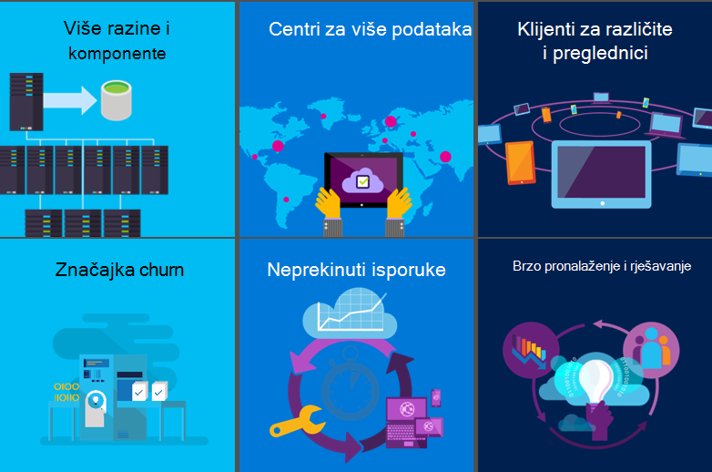
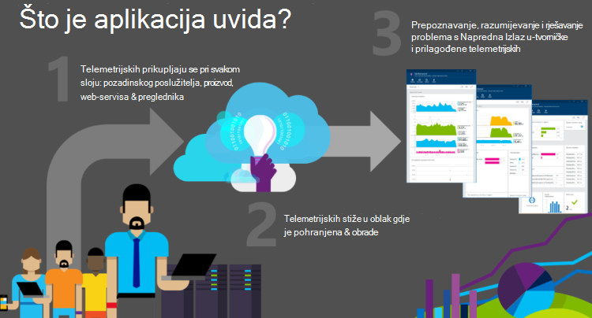
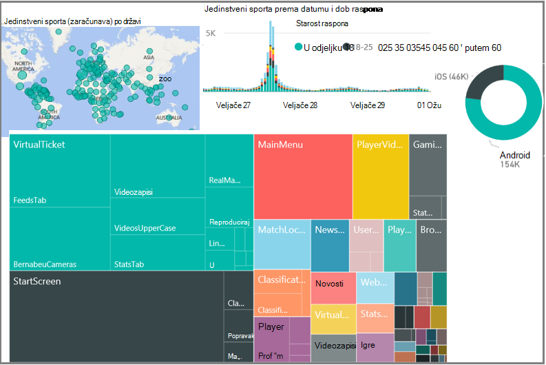
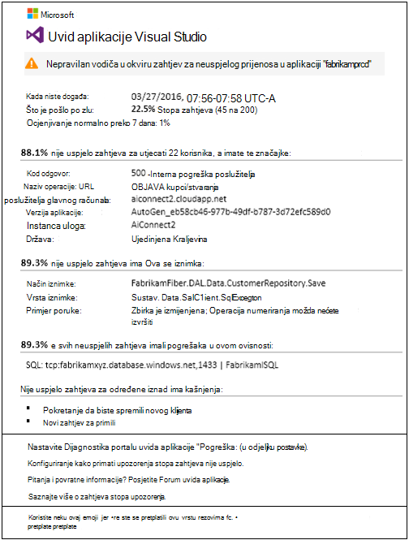
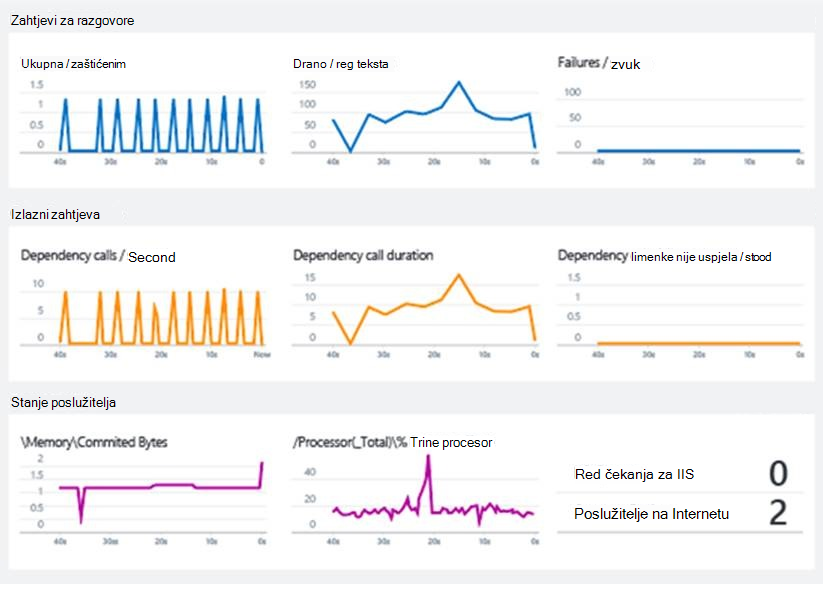
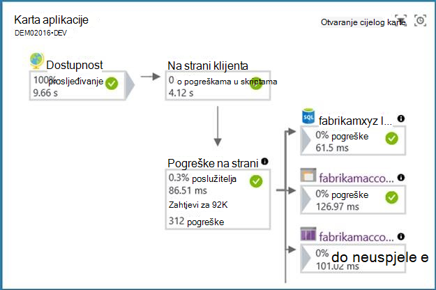
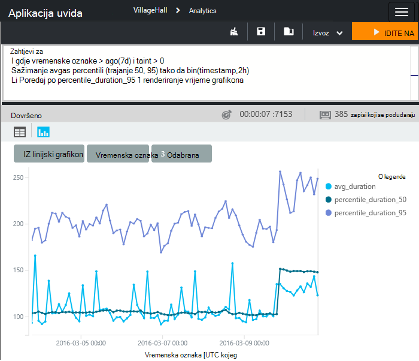
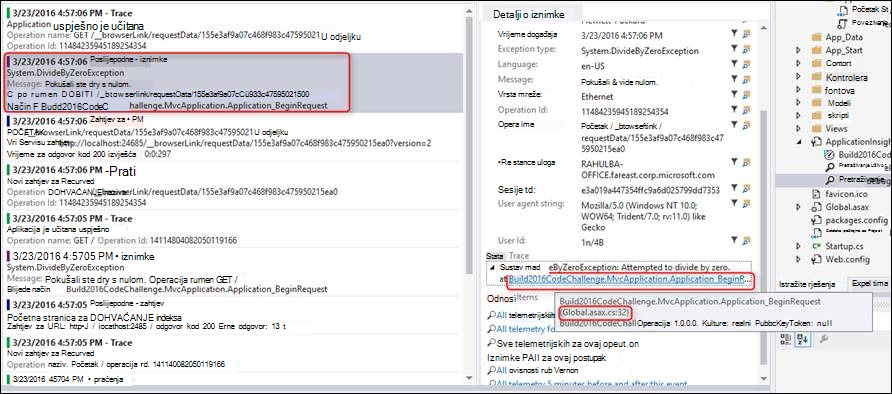
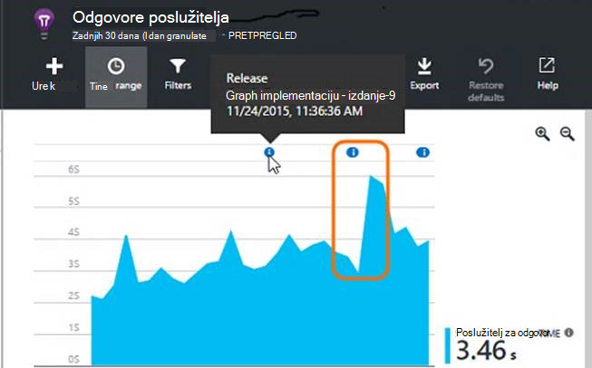

<properties
    pageTitle="Precizno Dijagnostika za web-aplikacije i usluge s ugovorima aplikaciju uvida | Microsoft Azure"
    description="Kako aplikacije uvida pristaju devOps ciklusa"
    services="application-insights"
    documentationCenter=""
    authors="alancameronwills"
    manager="douge"/>

<tags
    ms.service="application-insights"
    ms.workload="tbd"
    ms.tgt_pltfrm="ibiza"
    ms.devlang="multiple"
    ms.topic="article" 
    ms.date="08/26/2016"
    ms.author="awills"/>

# Precizno Dijagnostika za web-aplikacije i usluge s ugovorima uvida aplikacije

## Zašto moram uvida aplikacije?

Aplikacija uvida nadzire web-aplikaciju programa izvodi. Obavještava o pogrešaka i probleme s performansama i pomaže vam analizirati načinu na koji korisnici koriste aplikacije. Radi aplikacije koji se izvode na mnogo platforme (ASP.NET, J2EE, Node.js,...), a nalazi se u Oblaku ili na lokalnim. 

Je ključan praćenje Moderna aplikacije dok se izvodi. Većina važno je napomenuti da, želite da biste otkrili pogreške prije većinu klijentima. I želite da biste otkrili i riješili probleme s performansama, dok je ne do teškog oštećenja, možda usporiti stvari ili uzrokuju neke neugodnosti za korisnika. I u sustavu odjeljaka za zadovoljstvo želite saznati što korisnici rade s njom: su pomoću najnovije značajke? Su oni uspješnu s njom?

Moderna web-aplikacije su razvijene u krugu neprekidnog isporuke: otpustite nove značajke i poboljšanja; Pogledajte koliko će se dobro funkcionira za sve korisnike Sljedeći korak razvoja koji se temelji na toj znanja za planiranje. Ključni dio ovog ciklus je faza opažanje. Aplikacija uvida nudi alate za praćenje web-aplikaciju za performanse i korištenje.

Najvažnije aspekt postupak je za dijagnostiku i Dijagnostika. Ako aplikacija ne uspije, zatim tvrtke koji se gube se. Uloga značajke prime nadzora framework je zato da biste otkrili pogreške pouzdano, vas odmah, a kako bi vam informacije potrebne za dijagnosticiranje problema. To je točno funkcija uvida aplikacije.

### Odakle dolaze programskih pogrešaka?

Problemi s sustavi web obično dođe do problema s konfiguracijom ili neispravni interakcije između njihove mnogo komponente. Prvi zadatak kada tackling incident vezan uz web-mjesta uživo stoga je prepoznavanje locus problem: koje komponenta ili odnos uzrokuje?

Neke od nam, osobama sa sivim kosa može zapamtiti jednostavniji era u kojem se računalni program pokrenuli u jednom računalu. Za razvojne inženjere bi ga testirate temeljito prije dostavu. i imate, bi rijetko potražite u članku ili razmislite o tome. Korisnike bit će potrebno stavi s razlike programskih pogrešaka za mnoge godine. 

Što sada su pa vrlo različit. Aplikacije sadrži plethora različite uređaje pokrenuti, a može biti teško jamči točno istog ponašanja na svaki od njih. Hostiranje aplikacije u oblaku znači programskih pogrešaka moguće je ispraviti brzo, ali i znači neprekidnog konkurencije i očekivanja novih značajki Česti intervalima. 

U sljedeće uvjete jedini način da biste zadržali potvrđeni kontrole na broj pogrešku je automatizirana jedinica testiranja. Bilo bi nemoguće da biste ručno ponovno testirali sve na svaku isporuku. Testiranje jedinica sada je commonplace dio postupka Sastavi. Alati kao što je oblak Test Xamarin pomoći unosom automatiziranog korisničkog Sučelja testiranje na više verzija preglednika. Ove testiranja regimes nam Nadam se da je da se stopa programskih pogrešaka pronađen unutar aplikaciju biti zadržane na najmanje omogućuju.

Uobičajeni web-aplikacije imate mnogo uživo komponente. Osim klijenta (u pregledniku ili uređaj aplikacija) i web-poslužitelj, vjerojatno će biti znatno pozadinskog obrada. Možda pozadinski se kanal komponenti ili looser zbirka suradnju komada. I mnoge od njih neće biti u kontroli – postanu vanjske servise na kojem ovise.

U konfiguracijama poput ovih, možda ćete teže i uneconomical testiranje za ili foresee, način svaki mogući pogreške osim u sam sustav uživo. 

### Pitanja...

Neka pitanja koja ne možemo kada ste razvoj web sustava:

* Aplikacija ruši? 
* Što točno se dogodilo? – Ako je zahtjev, želim znati kako je još primio. Potrebna za praćenje događaja...
* Aplikacija je dovoljno brzo? Koliko dugo traje odgovora na zahtjeve za uobičajene?
* Može li poslužitelj rukovati opterećenja Kada stopa zahtjeva za dolazi, ne vrijeme odaziva držite stižu?
* Kako odredište su ovisnosti - REST API-ji, baze podataka i druge komponente poziva Moje aplikacije. U posebice ako je sustav spor, je moj komponente ili mi sporo odgovore od nekog drugog?
* Aplikacija je prema gore ili dolje? Mogu se vidjeti iz svijeta? Želim znati ako zaustavlja...
* Što je uzrok? Je pogreške u moj komponente ili ovisnosti? Je li komunikacije problem?
* Koliko korisnika su negativno utjecati na značajku? Ako imam više od jedne problem riješiti, što je najvažnija?

## Što je aplikacija uvida?

1. Aplikacija uvida instruments aplikacije i šalje telemetrijskih o njemu dok se izvodi aplikaciju. Možete izraditi uvida SDK aplikacije u aplikaciju ili možete primijeniti instrumentation tijekom rada. Prijašnji način je fleksibilnije, prilikom dodavanja vlastite telemetrijskih običnog module.
2. Za telemetriju šalje se na portal za aplikacije uvide, gdje je pohranjena i obrađuju. (Iako aplikacije uvida nalazi se u Microsoft Azure, može nadzirati aplikacija web - aplikacije ne samo Azure.)
3. Za telemetriju raspoređene su u obliku grafikone i tablice događaja.

Postoje dvije glavne vrste telemetrijskih: zbroja i neobrađenog instance. 

* Podaci instance sadrži, na primjer, izvješće o zahtjeva primila web-aplikaciju programa. Možete pronaći za i provjera pojedinosti zahtjeva za korištenje alata za pretraživanje u portal za aplikacije uvide. Instancu imao bi podataka kao što su odgovoriti na zahtjev, kao i zatraženi URL, aproksimaciju lokaciji klijentskog programa i drugih podataka koliko dugo traje aplikacije.
* Skupne podatke obuhvaća broji događaja po jedinici vrijeme, tako da možete usporediti stopu zahtjeva za uz vremena odgovor. Obuhvaća i prosjeke metriku kao što su vrijeme odaziva zahtjev.

Glavni kategorija podataka su:

* Zahtjevi za aplikaciju (obično HTTP zahtjeva), s podacima na URL-a, vrijeme odaziva i uspjelo ili nije.
* Zavisnosti - ODMOROM i SQL pozive za aplikaciju, također s URI, vrijeme odaziva i uspjeh
* Iznimke, uključujući kašnjenja stogu.
* Stranica prikaz podatke koji dolaze iz preglednika korisnika.
* Metriku kao što su mjerača performansi, kao i metriku u pišete sami. 
* Prilagođene događaje koje možete koristiti da biste pratili tvrtke događaje
* Prijavite se kašnjenja koji se koriste za ispravljanje pogrešaka.

## Studije slučaja: F.C. realni Madrid

Web-usluge [Realni kluba nogometu Madrid](http://www.realmadrid.com/) služi oko 450 milijuna sporta diljem svijeta. Sporta pristupiti i putem web-preglednici i mobilne aplikacije u klubu. Sporta se ne samo rezervirajte karte, no pristupiti i informacije i videoisječke na rezultate, reproduktora i nadolazeće igre. Možete traže pomoću filtara kao što su brojevi ciljeva testu dobije. Postoje i veze na društvene mreže. Korisnički doživljaj iznimno personalizirane, a namijenjen kao dvosmjerni komunikacije sudjelovati sporta.

U rješenje [je sustav servisa i aplikacije na Microsoft Azure](https://www.microsoft.com/en-us/enterprise/microsoftcloud/realmadrid.aspx). Ključni preduvjet je skalabilnost: promet je varijabla i možete doći do vrlo visoka količine tijekom i oko rezultata.

Za realni Madrid je ključan praćenje performansi sustava. Uvid aplikacije za Visual Studio nudi potpun prikaz u sustavu osiguravanje pouzdanog i visoke razine pružanja usluge. 

U klubu dobiti i detaljnije objašnjenje njegov sporta: gdje se nalazili (samo 3% nalaze se u Španjolska), koje vas zanimaju imaju u reproduktora, povijesne rezultata i nadolazeći igre i kako odgovori tako da odgovara ishoda.

Većinu tih telemetrijskih podataka automatski se prikupljaju bez koda dodane koji pojednostavnjeni rješenje i smanjuje radu složenosti.  Za realni Madrid, aplikacija uvida bavi milijarde 3.8 telemetrijskih točke svakog mjeseca.

Realni Madrid koristi modul za Power BI da biste pogledali svoje telemetrijskih.

## Pametno otkrivanje

[Određene proaktivne Dijagnostika](app-insights-proactive-diagnostics.md) je nedavno korištene značajke. Bez sve posebnu konfiguraciju koje ste aplikacije uvida automatski otkriva i koji vas upozorava da neobično dolazi u stope pogreške u aplikaciji. Nije dovoljno pametni da biste zanemarili pozadinu Povremeni pogreške, kao i koji su jednostavno proporcionalno vodiča u zahtjevima za dolazi. Tako, primjerice, ako postoji pogreška u nekim od servisa ovise o ili novi sastavljanje ste upravo implementiran ne funkcionira tako dobro, a zatim ćete informacije o tome čim pregled e-pošte. (I postoje webhooks tako da pokrenete drugim aplikacijama)

Aspekt značajka izvodi dnevni temeljitije analize telemetrijskih, tražite neobično uzoraka performansi koji je teško otkriti. Ako, na primjer, to možete pronaći slabe performanse povezan s određenom zemljopisnom području ili u verziji za preglednik.

U oba slučaja upozorenje ne samo obavijestit će vas simptomi otkrijete, ali i daje podatke koji vam trebaju za dijagnostiku problem, kao što su izvješća odgovarajuće iznimke.

Korisnička Samtec rečeno: "tijekom nedavne značajka prijelaznu, naišli smo u odjeljku-skalirana baze podataka koji je odlazak njegov ograničenja resursa i uzrokuje vremensko ograničenje. Upozorenja određene proaktivne otkrivanje ste dobili doslovno kao što su smo triaging problem vrlo blizu stvarnom vremenu kao što je objavljeno. Upozorenje povezano s upozorenja platforme Azure pomaže nam gotovo trenutačno rješavanje problema. Ukupna nedostupnost < 10 minuta."

## Live strujanje mjerenja

Implementacija ažuran može biti anxious iskustvo. Ako postoje problemi, ako želite saznati o njima odmah, tako da možete poništiti ako je potrebno. Aktivno strujanje metriku daje ključa metriku s latencije od jedne sekunde.

## Karta aplikacije

Aplikacija karte automatski otkrije topologiji aplikacije, postavljanje informacije o performansama nudi, da biste omogućili lakše prepoznali grla performanse i problematična tokova preko raspodijeljeno okruženju. Omogućuje otkrivanje međuzavisnosti aplikaciju servisa Azure. Problem možete razvrstavati, razumijevanje ako je vezane uz kod ili ovisnost odnose i na jedno mjesto analize u povezanim Dijagnostika sučelje. Na primjer, aplikacija možda neuspješnih zbog smanjene performanse performanse u sloju SQL. S kartom aplikacije, možete ga odmah vidjeti te dubinski analizirati Savjetnik za indeks SQL ili uvida upit će se pojaviti.

## Analitički uvida aplikaciju

S [analize](app-insights-analytics.md)možete napisati proizvoljne upita snažna SQL nalik jeziku.  Dijagnosticiranje preko stog cijelu aplikaciju postaje jednostavno se pridružuju različitih perspektiva i možete zatražiti desnom pitanja za povezivanje servisa performanse s metriku tvrtke i korisnička sučelja. 

Upit možete poslati sve instance telemetrijskih i metrike neobrađenog podatke pohranjene na portalu. Jezik sadrži filtar, spoj, zbrajanja i ostalih operacija. Možete izračunati polja i statističku analizu. Postoje tablični i grafički vizualizacije.

Na primjer, jednostavno je:

* Fazi podataka o performansama zahtjev za vaše aplikacije po kupca razine da biste shvatili svoje okruženje.
* Traženje određeni kodovi pogreške ili prilagođeni događaj imena tijekom istrage uživo web-mjesta.
* Naniže u korištenje aplikacije za određene korisnike da biste razumjeli kako dobivene i prihvatile značajki.
* Praćenje sesije i odgovor vremena za određene korisnike da biste omogućili podrška i postupci timovima pružanja izravne korisničke podrške.
* Određivanje značajki često korištenih aplikaciju za odgovaranje na pitanja prioritet značajke.

Korisnička DNN rečeno: "uvida aplikacije nudi nam s nedostaje dio Jednadžba koja se može za kombiniranje, sortiranje, upita i filtriranje podataka prema potrebi. Dopuštanje naš tim za korištenje vlastitih domišljatosti i iskustvo da biste pronašli podatke s jezikom naprednih upita dopustio nam da biste pronašli uvida i rješavanje problema s smo niste čak i znati smo imali. Mnogo zanimljivih odgovore potjecati iz pitanja počevši od *' li veselja ako... ".*"

## Razvoj Alati za integraciju 

### Konfiguriranje aplikacije uvida

Visual Studio i Eclipse imate alate za konfiguriranje točan paketa SDK za projekt razvijate. Nema naredbe izbornika da biste dodali aplikaciju uvide.

Ako slučajno hoćete li koristiti za praćenje bilježenje u zapisnik framework kao što su Log4N, NLog ili System.Diagnostics.Trace, zatim dobit mogućnost poslati zapisnike aplikacije uvid u zajedno s drugim telemetrijskih tako da možete lako povezivanje s kašnjenja sa zahtjevima, ovisnosti pozive i iznimke.

### Traženje telemetrijskih u Visual Studio

Prilikom razvoja i ispravljanje pogrešaka značajku, možete pregledavati i pretraživanje za telemetriju izravno u Visual Studio, pomoću funkcije pretraživanja isti kao web-portalu.

I kada aplikacija uvida prijavi iznimku, možete prikazati točke podataka u Visual Studio i odmah baciti na odgovarajuću šifru.

Tijekom ispravljanje pogrešaka, imate mogućnost da biste za telemetriju na računalu razvoj prikaz u Visual Studio, ali bez slanja portalu. Tu mogućnost lokalne izbjegava Miješanje ispravljanje pogrešaka s telemetrijskih proizvodnje.

### Sastavljanje primjedbe

Ako koristite Visual Studio Team Services omogućuje stvaranje i implementaciju aplikacije, primjedbe implementacije se prikazuju se na grafikonima na portalu. Ako na najnovije izdanje imala učinka na metriku, on postaje očite.

### Njegove stavke 

Kada se potencira upozorenja, uvida aplikaciju možete automatski stvoriti radnu stavku u svoj rad sustav (Visual Studio Team Services samo trenutno) za praćenje.

## No što je s...?

* [Izjave o zaštiti privatnosti i pohranu](app-insights-data-retention-privacy.md) – vaše telemetrijskih čuva se na Azure sigurne poslužiteljima.
* Performanse – utjecaj nedostaje. Telemetrijskih je odbacivanja.
* [Podržava](app-insights-get-dev-support.md) – možete iskoristiti programa Azure podrška. Postoje životopisnim forume gdje možete dobiti odgovore iz naših razvojnim inženjerima. I u uspije, ne možemo ponudit će vam pomoći za pojedinačne.
* [Određivanje cijena](app-insights-pricing.md) - biste mogli početi s radom besplatno, a koji i dalje dok ste u niska glasnoća.

## Daljnji koraci

Uvod u aplikaciji uvida je jednostavno. Glavni mogućnosti su:

* Instrumenata web-aplikaciju programa već izvode. Tako ćete dobiti sve telemetrijskih ugrađene performansi. Nije dostupan za [Java](app-insights-java-live.md) i [poslužitelji IIS](app-insights-monitor-performance-live-website-now.md)i [Azure web-](app-insights-azure.md)aplikacijama.
* Tijekom razvoja instrumenata projekta. To možete učiniti na [ASP.NET](app-insights-asp-net.md) ili [Java](app-insights-java-get-started.md) aplikacija, kao i [Node.js](app-insights-nodejs.md) i mnoštvom [drugih vrsta](app-insights-platforms.md). 
* Instrument [web-stranicu](app-insights-javascript.md) u dodavanjem kratki koda.

