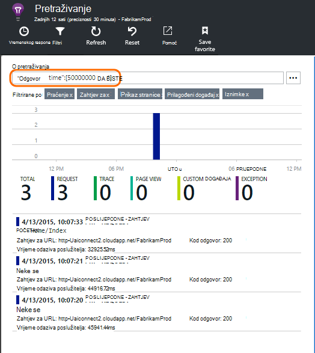

<properties 
    pageTitle="Pomoću dijagnostike pretraživanja | Microsoft Azure" 
    description="Pretraživanje i filtriranje pojedinačne događaje, a zatim na zahtjeve za i prijavu kašnjenja." 
    services="application-insights" 
    documentationCenter=""
    authors="alancameronwills" 
    manager="douge"/>

<tags 
    ms.service="application-insights" 
    ms.workload="tbd" 
    ms.tgt_pltfrm="ibiza" 
    ms.devlang="na" 
    ms.topic="article" 
    ms.date="06/09/2016" 
    ms.author="awills"/>
 
# Korištenje dijagnostike pretraživanja u uvide aplikacije

Dijagnostičke pretraživanje je značajka [Aplikacije uvida] [ start] koristite da biste pronašli i istraživanje telemetrijskih pojedinačne stavke, primjerice prikaza stranice, iznimke, ili web-zahtjeva. A možete pogledati kašnjenja zapisnika i događaje koje su postavljene.

## Gdje vidjeti dijagnostike pretraživanja

### Na portalu za Azure

Dijagnostičke pretraživanje možete otvoriti izričito:

Otvara se i kada kliknete kroz neke grafikone i rešetke stavke. U ovom slučaju njezinim filtrima unaprijed postavljene na usredotočite se na vrstu stavke koju ste odabrali. 

Ako, na primjer, ako je vaša aplikacija web-servisa, plohu pregled prikazuje grafikon jedinice zahtjeva za. Kliknite ga, a možete pristupiti grafikonu detaljnije uz stavku prikazuje koliko zahtjeva uvedena je za sve URL-ove. Kliknite bilo koji redak, a dobit ćete popis pojedinačne zahtjeve za tu URL ADRESU:

Glavno tijelo dijagnostike pretraživanja je popis stavki za telemetriju - zahtjeve poslužitelja stranice prikaza, prilagođene događaje koje ste programiranja i tako dalje. Pri vrhu popisa je sažetak grafikona s prikazom brojanja događaji tijekom vremena.

Događaji obično prikazivati u dijagnostike pretraživanja prije pojavljuju se u metričkim explorer. Iako u plohu osvježava sam intervalima, ako čekate za određeni događaj možete kliknite Osvježi.

### U Visual Studio

Otvaranje prozora za pretraživanje u Visual Studio:

Prozor za pretraživanje sadrži iste značajke kao web-portalu:

## Uzorkovanja

Ako aplikaciju generira mnogo telemetriju (i koristite 2.0.0-beta3 za verzije platforme ASP.NET SDK ili noviji), modul prilagodljivo uzorkovanje automatski Smanjivanje glasnoće koja je poslana na portal slanjem samo predstavnik razlomak događaja. Međutim, događaja koji se odnose na isti zahtjev će biti odabrana sustavu ili Neoznačeni grupe tako da možete se kretati između događaje povezane. 

[Informirajte se o uzorkovanje](app-insights-sampling.md).

## Provjera pojedinačnih stavki

Odaberite bilo koju stavku telemetriju da biste vidjeli ključne polja i povezane stavke. Ako želite vidjeti cijeli skup polja, kliknite "...". 

Da biste pronašli potpunog skupa polja, pomoću običnog nizovi (bez zamjenskih znakova). Dostupna polja ovisi o vrsti telemetrijskih.

## Stvaranje radnu stavku

Pogreška u Visual Studio Team Services možete stvoriti s pojedinostima iz bilo koje stavke telemetrijskih. 

Kada prvi put tog vas se konfigurirati vezu računa za servise u tim i project.

(Možete i pristupiti plohu konfiguracije na stranici Postavke > njegove stavke.)

## Filtriranje vrsta događaja

Otvorite plohu filtar, a zatim odaberite vrsta događaja koji želite pogledati. (Ako naknadno želite vratiti filtre koji ste otvorili u plohu, kliknite Vrati izvorno.)

Vrsta događaja su:

* **Praćenje** – uključujući TrackTrace, log4Net, NLog i System.Diagnostic.Trace pozive zapisnicima dijagnostičkih podataka.
* **Zahtjev za** - HTTP zahtjeva primio poslužiteljsku aplikaciju, uključujući stranice, skripte, slike, stil datoteke i podatke. Ti događaji se koriste za stvaranje zahtjeva i odgovora pregled grafikona.
* **Prikaz stranice** – Telemetriju poslao web-klijentu koristi za stvaranje stranica prikaz izvješća. 
* **Prilagođeni događaj** – ako ste umetnuli poziva TrackEvent() redoslijedom [nadzor korištenja][track], ih možete pretraživati ovdje.
* **Iznimke** – je neuhvaćenu iznimke u poslužitelj i one koje se ne prijavljujete pomoću TrackException().

## Filtriranje vrijednosti nekretnina

Možete filtrirati i događaji na vrijednosti njihova svojstva. Dostupnih svojstava ovise o vrsti događaj koji ste odabrali. 

Ako, na primjer, odaberite out zahtjeva za određeni odgovor koda.

Odabir nema vrijednosti određenog svojstva ima isti učinak kao i odaberete sve vrijednosti; prelazi isključivanje filtriranje na to svojstvo.

### Sužavanje pretraživanja

Obratite pozornost na to broji s desne strane vrijednosti filtra prikaz ima koliko pojavljivanja su u trenutnom filtrirani skup. 

U ovom primjeru ga je poništite koji na `Reports/Employees` zahtjev rezultate u većini 500 pogreške:

Osim ako želite vidjeti i druge događaje su događa tijekom određenog razdoblja, možete provjeriti **Uključi događaji s Nedefinirano svojstva**.

## Uklanjanje promet test robot i na webu

Korištenje filtra **realnih ili stilova sintetičkih promet** , a zatim potvrdite **realni**.

Možete filtrirati i **izvor stilova sintetičkih promet**.

## Provjera pojedinačne

Dodajte taj naziv zahtjev postavite filtar, a zatim možete provjeriti pojedinačne pojave taj događaj.

Za događaje zahtjev detalje prikaz tijekom obrade zahtjeva došlo je do iznimke.

Kliknite kroz iznimku da biste vidjeli njegove pojedinosti, uključujući Praćenje stoga.

## Traženje događaja s istom svojstvo

Pronađite sve stavke s istom vrijednošću svojstvo:

## Pretraživanje prema metričkim vrijednost

Pronađite zahtjeva za odgovor stalno > 5s.  Vrijeme prikazani su u crtice na osi: 10 000 crtice na osi = 1ms.

## Pretraživanje podataka

Možete tražiti uvjeta u bilo kojem od vrijednosti svojstva. To je posebno korisno ako ste napisali [prilagođene događaje] [ track] s vrijednosti svojstva. 

Možda ćete morati postaviti vrijeme raspon kao pretraživanja u rasponu kraći su brže. 

Traženje uvjete, podnizova ne. Alfanumerički nizovi uključujući neke interpunkcijske znakove kao što su izrazi '.' i '_'. Ako, na primjer:

termina|*podudaraju tako da je*|No to podudaraju
---|---|---
HomeController.About|o Home|h\*o Home\*
IsLocal|Lokalni je \*Lokalni|isl\* islocal i\*l\*
Novi odgode|w d|novi Odgoda n\* i d\*

Evo izraza za traženje možete koristiti:

Primjer upita | Efekt 
---|---
sporo|Pronalaženje svih događaja u raspon datuma čija polja pojam "usporiti"
Baza podataka??|Odgovara database01, databaseAB... ? nije dopušteno na početku pojam za pretraživanje.
Baza podataka * |Odgovara baze podataka, database01, databaseNNNN  * nije dopuštena na početku pojam za pretraživanje
Apple i banana|Traženje događaja koje sadrže oba uvjeta. Korištenje capital "i", nije "i".
Apple ili banana Apple banana|Traženje događaja koje sadrže ili termin. Korištenje "Ili", ne "ili". < /br/ > kratki obrasca.
Apple ne banana Apple-banana|Traženje događaja koje sadrže jedan izraz, ali ne na drugi. Kratki oblik.
aplikacija * i banana-(grape pear)|Logički operatori i zagrade.
"Metrika": 0 i 500 "Metrika": 500 Prima * | Traženje događaja koje sadrže imenovani mjera unutar raspona vrijednosti.

## Spremanje pretraživanja

Kada ste postavili sve filtre želite, pretraživanje možete spremiti kao Favorit. Ako radite u račun tvrtke ili ustanove, možete odabrati želite li da biste zajednički koristili s drugim članovima tima.

Da biste vidjeli pretraživanje ponovno, **idite na pregled plohu** i otvaranje favorita:

Ako ste spremili s relativni vremenski raspon, ponovno otvoriti plohu sadrži najnovije podatke. Ako ste spremili s apsolutne vremenski raspon, vidjet ćete iste podatke svaki put.

## Slanje više telemetrijskih do uvida aplikacije

Osim telemetrijskih Izlaz u-tvorničke poslao SDK uvida aplikacije, možete učiniti sljedeće:

* Snimanje kašnjenja zapisnika iz vaše framework omiljene zapisivanje u [.NET] [ netlogs] ili [Java][javalogs]. To znači možete pretraživati kroz vaše kašnjenja zapisnika, a zatim ih povezivanje s prikaza stranice, iznimke i druge događaje. 
* [Pisanje koda] [ track] da biste poslali prilagođene događaje, prikaza stranice i iznimaka. 

[Saznajte kako poslati zapisnike i prilagođene telemetrijskih aplikacije uvid u][trace].

## Značajka pitanja i odgovora

### Koliko se podaci se zadržavaju?

Do 500 događaji u sekundi u svakoj aplikaciji. Događaji koje se zadržavaju sedam dana.

### Kako vidjeti POST podatke u moj zahtjeve poslužitelja?

Ćemo POST podataka ne prijaviti automatski, ali možete koristiti [TrackTrace zapisnika poziva][trace]. Postavite POST podatke u parametru poruke. Ne možete filtrirati na poruci način na koji možete svojstva, ali dulja je ograničenje veličine.

## Daljnji koraci

* [Slanje zapisnika i prilagođeni telemetrijskih aplikacije uvid u][trace]
* [Postavljanje dostupnosti i reaktivnosti testira][availability]
* [Otklanjanje poteškoća][qna]

<!--Link references-->

[availability]: app-insights-monitor-web-app-availability.md
[javalogs]: app-insights-java-trace-logs.md
[netlogs]: app-insights-asp-net-trace-logs.md
[qna]: app-insights-troubleshoot-faq.md
[start]: app-insights-overview.md
[trace]: app-insights-search-diagnostic-logs.md
[track]: app-insights-api-custom-events-metrics.md

 