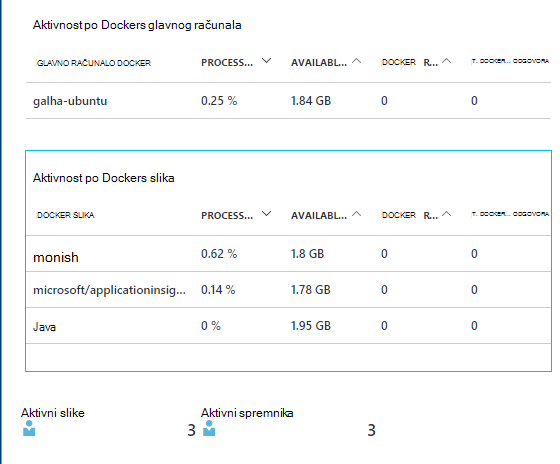

<properties 
    pageTitle="Praćenje Docker aplikacije u aplikaciju uvida" 
    description="Docker mjerača performansi mjerača, događaja i iznimke može se prikazati na uvid aplikacije uz telemetrijskih iz containerized aplikacija." 
    services="application-insights" 
    documentationCenter=""
    authors="alancameronwills" 
    manager="douge"/>

<tags 
    ms.service="application-insights" 
    ms.workload="tbd" 
    ms.tgt_pltfrm="ibiza" 
    ms.devlang="na" 
    ms.topic="article" 
    ms.date="12/01/2015" 
    ms.author="awills"/>
 
# <a name="monitor-docker-applications-in-application-insights"></a>Praćenje Docker aplikacije u aplikaciju uvida

Životni ciklus događaja i mjerača performansi iz spremnika [Docker](https://www.docker.com/) mogu se ucrtavaju u grafikon na uvid aplikacije. Instalacija [Aplikacije uvida](app-insights-overview.md) slike u spremniku u vašem glavno računalo pa će prikazati mjerača performansi za glavno računalo, kao i za druge slike.

S Docker distribucija aplikacija u laganih spremnika s sve ovisnosti. Ćete pokrenuti na glavnom računalu koja se pokreće Docker modul.

Kada pokrenete [aplikaciju uvida slike](https://hub.docker.com/r/microsoft/applicationinsights/) na vašem računalu koje hostira Docker, prikazat će se sljedeće pogodnosti:

* Životni ciklus telemetrijskih o sve spremnike izvodi na glavnom računalu – pokretanje, zaustavljanje i tako dalje.
* Mjerača performansi za sve spremnike. Procesora, memorije, korištenje mreže i drugo.
* Ako je [instalirana aplikacija uvida SDK](app-insights-java-live.md) u aplikacijama izvodi u spremnika, telemetrijskih tim aplikacijama imat će se dodatna svojstva prepoznavanje kontejner i glavnog računala. Tako, primjerice, ako imate instance aplikacije izvodi u više glavnih računala, jednostavno moći da biste filtrirali vaše aplikacije telemetrijskih po glavnog računala.


## <a name="set-up-your-application-insights-resource"></a>Postavljanje vaše aplikacije uvida resursa

1. Prijavite se na [Microsoft Azure Portal](https://azure.com) i otvorite aplikaciju uvida resursa za aplikaciju; ili [stvorite novi](app-insights-create-new-resource.md). 

    *Koji treba koristiti?* Ako su aplikacije koji se izvode na vašem računalu koje hostira razvio nekome drugome, zatim morat ćete [stvoriti nove uvide aplikacije resurs](app-insights-create-new-resource.md). To je mjesto prikaza i analize u telemetrijskih. (Odaberite "Ostalo" za vrstu aplikacije)

    No ako ste programiranje aplikacije, zatim Nadamo [dodali SDK uvida aplikacije](app-insights-java-live.md) na svaku od njih. Ako takvi stupci sve zaista komponente s jednom poslovnom aplikacijom, pa ih da biste poslali telemetrijskih jedan resurs može konfigurirati pa ćete koristiti isti resursa za prikaz Docker životni ciklus i performanse podataka. 

    Treći scenarij je da razvio veći dio aplikacije, ali koristite odvojene resurse da biste prikazali njihove telemetrijskih. U tom slučaju prikazat će vam vjerojatno želite stvoriti zasebnu resursa za Docker podatke. 

2.  Dodavanje pločice Docker: odaberite **Dodavanje pločica**, povucite pločicu Docker iz galerije, a zatim kliknite **gotovo**. 

    


3. Kliknite **Essentials** padajući popis i kopirajte tipku Instrumentation. Time ćete pomoću kojih određujete SDK gdje da biste poslali njegov telemetrijskih.


    

Jednostavan prozor preglednika pristup, kao što je koju ćete vratite se na uskoro da pogledate vaše telemetrijskih.


## <a name="run-the-application-insights-monitor-on-your-host"></a>Pokretanje monitor uvida aplikacije na vašem računalu koje hostira
 
Sad kad imate negdje da biste prikazali na telemetrijskih, možete postaviti containerized aplikacije koja će prikupljanje i pošaljite je.

1.  Povezivanje glavno računalo za Docker. 
2.  Uređivanje ključ instrumentation u tu naredbu, a zatim pokrenite je:
 
    ```

    docker run -v /var/run/docker.sock:/docker.sock -d microsoft/applicationinsights ikey=000000-1111-2222-3333-444444444
    ```

Samo jedne slike uvida aplikacija je obavezan po Docker glavnog računala. Ako je vaša aplikacija implementiran na više Docker domaćini, ponovite naredbu na svako glavno računalo.

## <a name="update-your-app"></a>Ažuriranje aplikacije

Ako je aplikacija instrumented s [SDK uvida aplikacije Java](app-insights-java-get-started.md), dodajte sljedeći redak u datoteku ApplicationInsights.xml u projektu, u odjeljku s `<TelemetryInitializers>` elementa:

```xml

    <Add type="com.microsoft.applicationinsights.extensibility.initializer.docker.DockerContextInitializer"/> 
```

Time se dodaje Docker podatke kao što su spremnik i id glavnog računala za svaku stavku telemetrijskih poslane iz aplikacije.

## <a name="view-your-telemetry"></a>Prikaz vaše telemetrijskih

Vratite se na vaše aplikacije uvida resursa na portalu za Azure.

Kliknite kroz pločicu Docker.

Uskoro ćete vidjeti podatke stiže u aplikaciji Docker osobito ako imate druge spremnike koji se izvode na vašem Docker modul.


Slijede prikaza možete dobiti.

### <a name="perf-counters-by-host-activity-by-image"></a>Mjerača performansi mjerača po glavno računalo, aktivnosti tako da slike





Kliknite bilo koji naziv glavnog računala ili slike podrobnije.


Da biste prilagodili prikaz, kliknite bilo koji od njih, naslov, rešetke ili dodavanje grafikona. 

[Dodatne informacije o explorer mjernih podataka](app-insights-metrics-explorer.md).

### <a name="docker-container-events"></a>Docker spremnik događaja


Da biste istražili pojedinačne događaje, kliknite [pretraživanje](app-insights-diagnostic-search.md). Pretraživanja i filtriranja da biste pronašli događaja o kojima želite. Kliknite bilo koji događaj da biste dobili više detalja.
 
### <a name="exceptions-by-container-name"></a>Iznimke prema nazivu spremnik
 


### <a name="docker-context-added-to-app-telemetry"></a>Kontekst docker dodaje telemetrijskih aplikacije

Zahtjev za telemetriju poslana iz aplikacije instrumented s AI SDK enriched s Docker konteksta:


Vrijeme procesora i memorije mjerača performansi, enriched i grupirane prema nazivu Docker spremnik:


## <a name="q--a"></a>Značajka pitanja i odgovora

*Što ne aplikacije uvida Daj mi koji se ne može se s Docker?*

* Detaljne razrada svega mjerača performansi spremnik i slike.
* Integrirajte podatke kontejner i aplikacije u jedan nadzorne ploče.
* [Izvoz telemetrijskih](app-insights-export-telemetry.md) radi daljnje analize u bazu podataka, Power BI ili druge nadzorne ploče.

*Kako nabaviti telemetrijskih iz same aplikacije?*

* Instalirajte aplikaciju uvida SDK u aplikaciji. Saznajte kako za: [Java web-aplikacije](app-insights-java-get-started.md), [Windows web-aplikacije](app-insights-asp-net.md).
