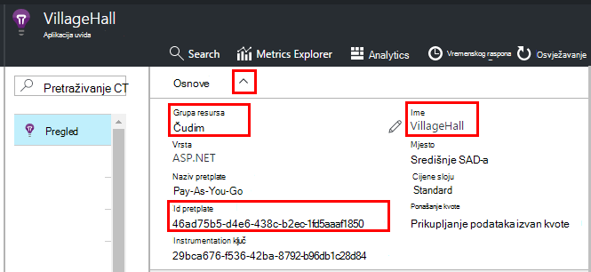

<properties 
    pageTitle="Izvoz u Power BI iz aplikacije uvida | Microsoft Azure" 
    description="Analize upita prikazuje se u dodatku Power BI." 
    services="application-insights" 
    documentationCenter=""
    authors="noamben" 
    manager="douge"/>

<tags 
    ms.service="application-insights" 
    ms.workload="tbd" 
    ms.tgt_pltfrm="ibiza" 
    ms.devlang="na" 
    ms.topic="article" 
    ms.date="10/18/2016" 
    ms.author="awills"/>

# Sažetak sadržaja servisa Power BI iz aplikacije uvida

[Power BI](http://www.powerbi.com/) je paket sustava business analytics alatima koji služe analiza podataka i dijelili Saznanja. Nadzorne ploče obogaćeni su dostupne na svim uređajima. Možete kombiniranje podataka iz više izvora, uključujući analize upita s [Uvida aplikacije za Visual Studio](app-insights-overview.md).

Tri su preporučena metode izvoza podataka aplikacije uvida u Power BI. Možete ih koristiti zasebno ili zajedno.

* [**Prilagodnik za power BI**](#power-pi-adapter) – postavljanje dovršeno nadzorne ploče programa telemetrijskih iz aplikacije. Skup grafikoni je unaprijed definirane, ali možete dodati svoje upite iz drugih izvora.
* [**Izvoz analize upita**](#export-analytics-queries) - napišite nešto upita pomoću analize, a zatim izvoz u Power BI. Ovaj upit možete postaviti na nadzornoj ploči zajedno s bilo koje druge podatke.
* [**Izvoz Continous i analize strujanja**](app-insights-export-stream-analytics.md) – To uključuje dodatne rad da biste postavili. Korisno je ako želite zadržati podatke dugo. U suprotnom, preporučuje se druge načine.

## Power BI prilagodnika

Ovaj postupak za vas stvara dovrši nadzorne ploče programa telemetrijskih. Početni skup podataka je unaprijed definirane, ali na njega možete dodati više podataka.

### Početak prilagodnika

1. Prijavite se na [Power BI](https://app.powerbi.com/).
2. Otvorite **Dohvati podatke**, **servise**ili **aplikacije uvida**

    

3. Detalje o vaše aplikacije uvida resursa.

    

4. Pričekajte minutu ili dvije za podatke koje želite uvesti.

    

Na nadzornoj ploči možete urediti kombiniranja grafikona uvida aplikacije s promjenama drugih izvora i analize upita. Postoji galerije vizualizaciju koju možete dobiti više grafikona, a svaki grafikon ima parametre možete postaviti.

Nakon početnog uvoza na nadzornoj ploči i izvješća i dalje da biste ažurirali svakodnevno. Možete odrediti raspored osvježavanja na skupu podataka.

## Izvoz analize upita

U ovom usmjeravanje omogućuje pisanje bilo koji analize upit koji vam se sviđa, a zatim izvezite koji na nadzornu ploču dodatka Power BI. (Možete dodati na nadzornoj ploči stvorio prilagodnika.)

### Jedna jedinica vremena: instalirati Power BI Desktop

Da biste uvezli aplikacije uvida upit, pomoću verzije programa Power BI za stolna računala. No, pa je možete objaviti na web-mjestu ili u Power BI oblaka prostor programa Groove. 

Instalirajte [Power BI Desktop](https://powerbi.microsoft.com/en-us/desktop/).

### Izvoz upit Analytics

1. [Otvori analize i pisanje upita](app-insights-analytics-tour.md).
2. Testirajte da biste suzili upit dok ne budete zadovoljni s rezultatima.
3. Na izborniku za **Izvoz** odaberite **Power BI (M)**. Spremite tekstnu datoteku.

    
4. U dodatku Power BI Desktop odaberite **Dohvati podatke, prazan upit** , a zatim u uređivaču upita u odjeljku **Prikaz** odaberite **Napredni uređivač upita**.

    Zalijepite izvezenu skripta jezika M u napredne uređivaču upita.

    

5. Možda ćete morati unijeti vjerodajnice da biste omogućili Power BI da biste pristupili Azure. Korištenje "račun tvrtke ili ustanove" da biste se prijavili pomoću Microsoftova računa.

    

6. Odaberite vizualizaciju upita, a zatim odaberite polja za osi x, y i segmenting dimenzije.

    

7. Objavite izvješća servisa Power BI oblaka radnog prostora. Iz nje, moguće je ugraditi sinkronizirane verzija u drugim web-stranice.

    
 
8. Ručno osvježavanje izvješća u vremenskim razmacima ili postaviti zakazano osvježavanje na stranici mogućnosti.

## O uzorkovanje

Ako aplikacija pošalje velike količine podataka, značajku prilagodljivo uzorkovanje može raditi i pošaljite samo postotak vaše telemetrijskih. Isto vrijedi i ako ste ručno uzorkovanje u SDK ili na ingestion. [Saznajte više o uzorkovanje.](app-insights-sampling.md)
 

## Daljnji koraci

* [Power BI – Saznajte](http://www.powerbi.com/learning/)
* [Praktični vodič Analytics](app-insights-analytics-tour.md)
