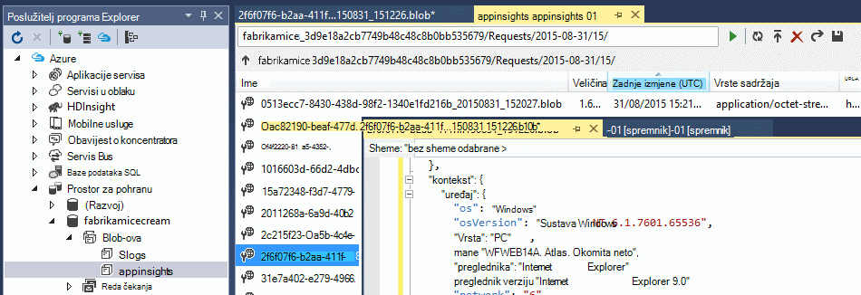
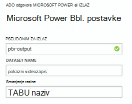

<properties 
    pageTitle="Obrada podataka izvezene iz aplikacije uvide pomoću analize strujanje | Microsoft Azure" 
    description="Strujanje analize možete neprestano pretvorbu, filtrirati i usmjeravanje podataka izvoz iz aplikacija uvide." 
    services="application-insights" 
    documentationCenter=""
    authors="noamben" 
    manager="douge"/>

<tags 
    ms.service="application-insights" 
    ms.workload="tbd" 
    ms.tgt_pltfrm="ibiza" 
    ms.devlang="na" 
    ms.topic="article" 
    ms.date="10/18/2016" 
    ms.author="awills"/>

# <a name="use-stream-analytics-to-process-exported-data-from-application-insights"></a>Korištenje strujanje Analytics za obradu izvezene podatke iz aplikacije uvida

[Azure strujanje analize](https://azure.microsoft.com/services/stream-analytics/) je idealna alat za obradu podataka [izvezene iz aplikacije uvida](app-insights-export-telemetry.md). Analitički strujanje možete uvesti podatke iz različitih izvora. Ga pretvaranje i filtriranje podataka i usmjeravanje raznih primatelji.

U ovom primjeru smo stvorit ćete prilagodnik programa koji uzima podatke iz aplikacije uvide, preimenovanja obrađuje neka polja i cijevi u Power BI.

> [AZURE.WARNING] Postoji mnogo bolje i lakše [preporučeni načini prikaz podataka aplikacije uvida u dodatku Power BI](app-insights-export-power-bi.md). Put prikazanom u nastavku je samo na primjer da biste ilustrirali način obrade izvezene podatke.


## <a name="create-storage-in-azure"></a>Stvaranje prostora za pohranu u Azure

Neprekinuti izvoz uvijek proizvodi podataka na račun za Azure pohranu da morate najprije stvorite prostora za pohranu.

1.  Stvaranje računa "klasični" prostora za pohranu u pretplatu za [Azure portal](https://portal.azure.com).

    

2. Stvaranje spremnika

    

3. Kopiranje tipkovni prečac za pohranu

    Morat ćete ga uskoro da biste postavili unosa na servis za strujanje analize.

    

## <a name="start-continuous-export-to-azure-storage"></a>Pokreni neprekinuti izvoz Azure za pohranu

[Izvoz neprekinuto](app-insights-export-telemetry.md) premješta podatke iz aplikacije uvida u Azure prostora za pohranu.

1. Na portalu Azure pronađite aplikaciju uvida resursa koji ste stvorili za svoju aplikaciju.

    

2. Stvaranje neprekinuti izvoz.

    


    Odaberite račun za pohranu koji ste prethodno stvorili:

    
    
    Postavljanje vrste događaja koje želite vidjeti:

    

3. Pustiti da neki podaci skupiti. Ponovno sjesti i neka druge osobe pomoću aplikacije za neko vrijeme. Telemetrijskih prosljeđivala i vidjet ćete statističkih grafikona u programu [explorer metričke](app-insights-metrics-explorer.md) i pojedinačne događaja u [dijagnostike pretraživanja](app-insights-diagnostic-search.md). 

    Osim toga, podaci će na i izvoz prostora za pohranu. 

4. Provjeri izvezene podatke. U Visual Studio, odaberite **Prikaz / Cloud Explorer**, a zatim otvorite Azure / prostora za pohranu. (Ako još nemate mogućnost na izborniku, morate instalirati Azure SDK: Otvorite dijaloški okvir novi projekt, a Visual C# / Cloud / dobivanje Microsoft Azure SDK za .NET.)

    

    Zabilježite uobičajeni dio naziva put, dobivena iz naziv i instrumentation tipku za aplikacije. 

Događaji zapisuju se bloba datoteke u obliku JSON. Svaki dokument možda sadrži jednu ili više događaja. Stoga željeli bismo čitanje podataka događaja i filtriraju polja želimo. Postoje sve vrste što smo može učiniti s podacima, ali naš plan danas je pomoću analize strujanje pipe podataka dodatka Power bi.

## <a name="create-an-azure-stream-analytics-instance"></a>Stvaranje instance Azure strujanje Analytics

[Klasični Azure portala](https://manage.windowsazure.com/)odaberite servisa Azure strujanje analize i stvaranje novog zadatka strujanje analize:


Kada se Stvori novi zadatak, proširite detalja:


### <a name="set-blob-location"></a>Postavljanje blob lokacije

Postavite ga da bi unos iz vaše blob neprekidnog izvoz:


Sada potreban vam je primarni ključ programa Access s računa za pohranu koji ste ranije zabilježili. Postavi ovo kao ključ za račun za pohranu.


### <a name="set-path-prefix-pattern"></a>Postavljanje put prefiks uzorak 


**Ne zaboravite da biste postavili oblik datuma na gggg-MM-DD (s crtice).**

Put prefiks uzorak određuje gdje strujanje analize ulaznih datoteka u nalazi prostora za pohranu. Morate postaviti tako da odgovaraju kako neprekinuti izvoz sprema podatke. Postavite ovako:

    webapplication27_12345678123412341234123456789abcdef0/PageViews/{date}/{time}

U ovom primjeru:

* `webapplication27`je naziv aplikacije uvida resursa **sve malim slovima**.
* `1234...`je ključ instrumentation aplikacije uvida resursa, **ispuštanje crtice**. 
* `PageViews`je li vrsta podataka koje želite analizirati. Dostupne vrste ovise o tome u neprekinuti izvoz postavite filtar. Pregledajte izvezene podatke da biste vidjeli druge dostupne vrste pa potražite u članku [Izvoz podatkovnog modela](app-insights-export-data-model.md).
* `/{date}/{time}`Uzorak zapisuje doslovno.

> [AZURE.NOTE] Provjeri prostora za pohranu da biste bili sigurni da imate put desno.

### <a name="finish-initial-setup"></a>Završi početnog postavljanja

Potvrdite serijaliziranog oblika:


Zatvorite čarobnjak i pričekajte da biste dovršili postavljanje.

> [AZURE.TIP] Da biste preuzeli neke podatke, koristite naredbu uzorka. Zadržati kao test uzorka za ispravljanje pogrešaka u upit.

## <a name="set-the-output"></a>Postavljanje Izlaz

Sada odaberite svoj posao i postavljanje izlaz.


Navedite svoje **ili školske računa** da biste autorizirali strujanje Analytics za pristup vašem resursa za Power BI. Zatim iznaći naziv za izlaz te za skup podataka za Power BI cilj i tablice.



## <a name="set-the-query"></a>Postavljanje upita

Upit određuje prevođenje iz unosa za izlaz.


Da biste provjerili da ćete dobiti desnom Izlaz, koristite funkciju Test. Dajte mu ogledne podatke koje ste na stranici unosa. 

### <a name="query-to-display-counts-of-events"></a>Upit za prikazivanje broji događaja

Zalijepite ovaj upit:

```SQL

    SELECT
      flat.ArrayValue.name,
      count(*)
    INTO
      [pbi-output]
    FROM
      [export-input] A
    OUTER APPLY GetElements(A.[event]) as flat
    GROUP BY TumblingWindow(minute, 1), flat.ArrayValue.name
```

* Izvoz unos pseudonim smo dodijelili toka za unos
* pbi izlaz pseudonim izlaz definirali
* Koristimo [VANJSKI PRIMIJENITI GetElements](https://msdn.microsoft.com/library/azure/dn706229.aspx) jer je naziv događaja u ugniježđene arrray JSON. Zatim odaberite izdvajanja naziv događaja, zajedno s ukupan broj instanci s tim nazivom u vremenskom razdoblju. Uvjet [Group By](https://msdn.microsoft.com/library/azure/dn835023.aspx) grupira elemenata u vremenskih razdoblja od 1 minute.


### <a name="query-to-display-metric-values"></a>Upit za prikazivanje metričkim vrijednostima


```SQL

    SELECT
      A.context.data.eventtime,
      avg(CASE WHEN flat.arrayvalue.myMetric.value IS NULL THEN 0 ELSE  flat.arrayvalue.myMetric.value END) as myValue
    INTO
      [pbi-output]
    FROM
      [export-input] A
    OUTER APPLY GetElements(A.context.custom.metrics) as flat
    GROUP BY TumblingWindow(minute, 1), A.context.data.eventtime

``` 

* Ovaj upit bušilice u telemetrijskih mjerenja vremena događaja i metrike vrijednost. Su metričkim vrijednosti u polju, tako da koristimo uzorak VANJSKI GetElements PRIMIJENITI da biste izdvojili retke. "myMetric" u ovom slučaju je naziv mjerenja. 

### <a name="query-to-include-values-of-dimension-properties"></a>Da biste uključili vrijednosti dimenzije svojstva za upite

```SQL

    WITH flat AS (
    SELECT
      MySource.context.data.eventTime as eventTime,
      InstanceId = MyDimension.ArrayValue.InstanceId.value,
      BusinessUnitId = MyDimension.ArrayValue.BusinessUnitId.value
    FROM MySource
    OUTER APPLY GetArrayElements(MySource.context.custom.dimensions) MyDimension
    )
    SELECT
     eventTime,
     InstanceId,
     BusinessUnitId
    INTO AIOutput
    FROM flat

```

* Ovaj upit sadrži vrijednosti svojstava dimenzije bez ovisno o određene dimenzije se pri fixed index u polju dimenzije.

## <a name="run-the-job"></a>Pokrenuti posla

Možete odabrati datum u prošlosti da biste započeli na posao. 


Pričekajte da se izvodi posao.

## <a name="see-results-in-power-bi"></a>Pogledajte rezultate u Power BI

> [AZURE.WARNING] Postoji mnogo bolje i lakše [preporučeni načini prikaz podataka aplikacije uvida u dodatku Power BI](app-insights-export-power-bi.md). Put prikazanom u nastavku je samo na primjer da biste ilustrirali način obrade izvezene podatke.

Otvorite Power BI pomoću računa tvrtke ili obrazovne ustanove i odaberite skup podataka i tablicu koju ste definirali kao rezultat posla strujanje analize.


Sada možete koristiti ovaj skup podataka u izvješćima i nadzornih ploča u [Dodatku Power BI](https://powerbi.microsoft.com).


## <a name="no-data"></a>Nema podataka?

* Provjerite te [Postavljanje oblika datuma](#set-path-prefix-pattern) pravilno gggg-MM-DD (s crtice).


## <a name="video"></a>Videozapis

Noam Ben Zeev prikazuje način obrade izvezene podatke pomoću analize strujanje.

> [AZURE.VIDEO export-to-power-bi-from-application-insights]

## <a name="next-steps"></a>Daljnji koraci

* [Neprekinuti izvoza](app-insights-export-telemetry.md)
* [Detaljne podatke modela vodič za svojstvo vrste i vrijednosti.](app-insights-export-data-model.md)
* [Aplikacija uvida](app-insights-overview.md)
* [Dodatne primjere i prikazi](app-insights-code-samples.md)
 
