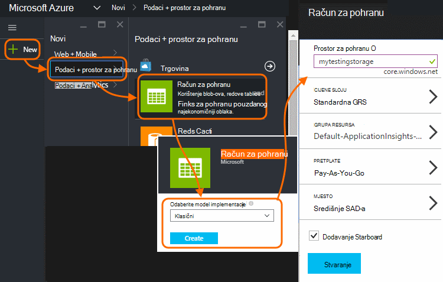
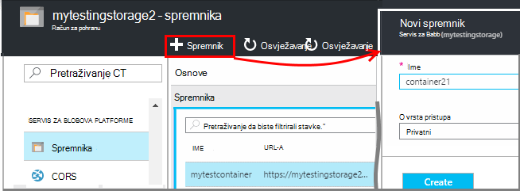
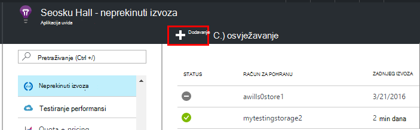
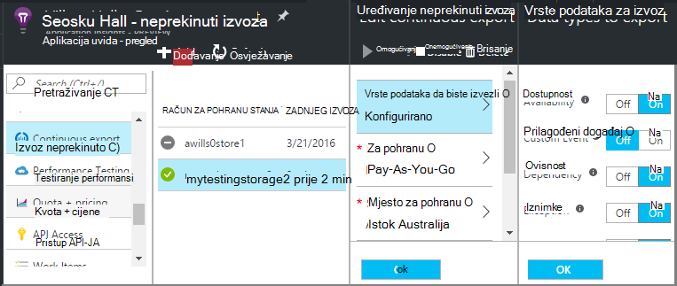
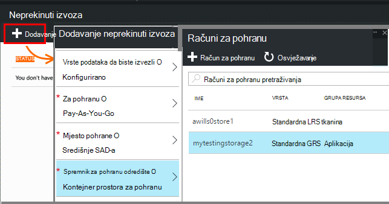
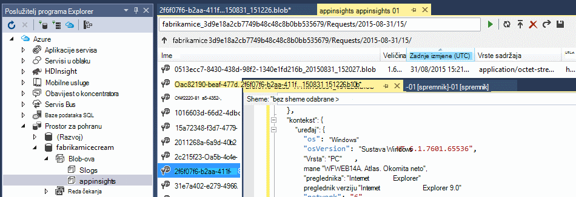
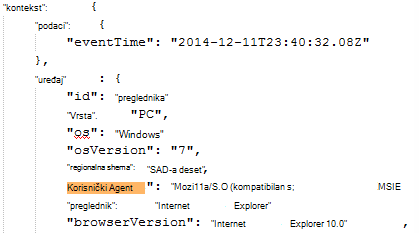
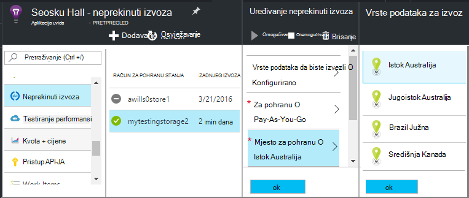

<properties 
    pageTitle="Neprekinuti izvoz telemetrijskih iz aplikacije uvida | Microsoft Azure" 
    description="Izvoz podataka Dijagnostika i korištenje pohranom na servisu Microsoft Azure i preuzmite ga iz nje." 
    services="application-insights" 
    documentationCenter=""
    authors="alancameronwills" 
    manager="douge"/>

<tags 
    ms.service="application-insights" 
    ms.workload="tbd" 
    ms.tgt_pltfrm="ibiza" 
    ms.devlang="na" 
    ms.topic="article" 
    ms.date="10/18/2016" 
    ms.author="awills"/>
 
# Izvoz telemetrijskih iz aplikacije uvida

Želite li zadržati svoje telemetrijskih dulje od razdoblje zadržavanja standardne? Ili obradi na mobitel specijalizirane? Neprekinuti izvoz idealna je za to. Događaji koje vidite u portal za aplikacije uvida moguće je izvesti za pohranom na servisu Microsoft Azure u JSON OSNOVNI oblik. Iz njega možete preuzeti podataka i pisanje ono kod morati obrade.  

Neprekinuti izvoz dostupna je u besplatno probno razdoblje i na [standardnu i Premium cijene tarife](https://azure.microsoft.com/pricing/details/application-insights/).

Prije postavljanja neprekinuti izvoza, postoje neki alternative možda želite uzeti u obzir:

* [Gumb alatu izvoz](app-insights-metrics-explorer.md#export-to-excel) pri vrhu web-mjesto metriku ili u okvir za pretraživanje plohu omogućuje prijenos tablice i grafikoni proračunsku tablicu programa Excel. 
* [Analitički](app-insights-analytics.md) nudi jezik naprednih upita za telemetriju i također možete izvesti rezultate.
* Ako tražite [pregledavanje podataka u dodatku Power BI](http://blogs.msdn.com/b/powerbi/archive/2015/11/04/explore-your-application-insights-data-with-power-bi.aspx), to možete učiniti bez korištenja neprekinuti izvoz.

## Stvaranje računa za pohranu

Ako već nemate račun za "klasični" prostora za pohranu, stvorite ga sada.

1. Stvaranje računa za pohranu u pretplatu za [Azure portal](https://portal.azure.com).

    

2. Stvaranje spremnika.

    

## Postavljanje neprekinuti izvoz

Na plohu pregled vašeg računala na portalu uvida aplikaciju, otvorite neprekinuti izvoz: 

Dodavanje neprekinuti izvoz pa odaberite vrsta događaja koji želite izvesti:

Odaberite ili stvorite [račun za Azure prostora za pohranu](../storage/storage-introduction.md) na mjesto na koje želite spremiti podatke:

Kada stvorite izvoz se pokreće prijelaza. (Samo podatke dohvaćate koji dolazi kada stvorite izvoza.) 

Može postojati Odgoda od o jedan sat prije nego što se podaci prikazuju se u blob-om.

Ako želite promijeniti vrstu događaja kasnije, jednostavno uređivanje izvoz:

Da biste prestali toka, kliknite Onemogući. Kada ponovno kliknite Omogući strujanje će se pokrenuti novim podacima. Neće dobiti podatke koje stigli na portalu u izvoz je onemogućen.

Da biste prestali toka trajno, izbrišite izvoz. Time ne briše podataka sa servisa za pohranu.

#### Ne možete dodati ili promijeniti izvoz?

* Da biste dodali ili promijenili izvozom, morate prava pristupa vlasnika, suradnik ili aplikacije uvida suradnika. [Dodatne informacije o ulogama][roles].

## Koji su se događaji koje dobivam?

Izvezene podatke je neobrađenog telemetrijskih ćemo dobiti iz aplikacije, osim što smo dodavanje podataka o lokaciji koje ćemo izračun iz IP adresu klijenta. 

Podaci koji sadrži odbačene [uzorkovanje](app-insights-sampling.md) nije obuhvaćen izvezene podatke.

Uključene su druge izračunate metrike. Na primjer, smo ne izvoz Prosječna utilisation procesora, ali ne možemo izvoz neobrađenog telemetrijskih iz kojeg je izračunati prosjek.

Podaci obuhvaćaju i rezultate bilo koji [testira web dostupnost](app-insights-monitor-web-app-availability.md) ste postavili. 

> [AZURE.NOTE] **Uzorkovanje.** Ako aplikacija šalje velike količine podataka i koristite uvide SDK aplikacije za ASP.NET verzije 2.0.0-beta3 ili noviji, značajku prilagodljivu uzorkovanje može raditi i pošaljite samo postotak vaše telemetrijskih. [Saznajte više o uzorkovanje.](app-insights-sampling.md)

## Provjera podataka

Možete provjeriti prostora za pohranu izravno na portalu. Kliknite **Pregledaj**, odaberite svoj račun za pohranu i otvorite **spremnika**.

Da biste Provjera Azure prostora za pohranu u Visual Studio, otvorite **Prikaz** **Explorer oblaka**. (Ako još nemate tu naredbu, morate instalirati Azure SDK: Otvorite dijaloški okvir **Novi projekt** , proširite Visual C# / u Oblaku, a zatim odaberite **Početak Microsoft Azure SDK za .NET**.)

Kada otvorite spremište blobova platforme, vidjet ćete kontejner s skup blob datoteka. URI svaku datoteku izvedene iz naziv aplikacije uvida resursa, instrumentation ključ, telemetrijskih – vrsta/datuma/vremena. (Naziv resursa je mala slova i tipku instrumentation izostavlja crtice.)

Datum i vrijeme su UTC-a i kada za telemetriju je sprema u spremištu – ne vrijeme je generirana. Pa ako pisanja koda da biste preuzeli podatke ga možete premjestiti Linearno kroz podatke.

Evo obrasca put:

    $"{applicationName}_{instrumentationKey}/{type}/{blobDeliveryTimeUtc:yyyy-MM-dd}/{ blobDeliveryTimeUtc:HH}/{blobId}_{blobCreationTimeUtc:yyyyMMdd_HHmmss}.blob"
  
Gdje 

-   `blobCreationTimeUtc`pripremna je vrijeme blob stvaranja u internog prostora za pohranu
-   `blobDeliveryTimeUtc`put kada se kopira blobova platforme za pohranu odredište izvoza

## Oblikovanje podataka

* Svaki blob nije tekstna datoteka koja sadrži više ' \n'-separated redaka. Sadrži telemetrijskih obrađuju tijekom vremena otprilike pola nekoliko minuta.
* Svaki redak predstavlja točku telemetrijskih podataka kao što je prikaz zahtjev ili stranice.
* Svaki redak je Neoblikovani JSON dokument. Ako želite sjesti i stare na njega, otvorite je u Visual Studio i odaberite Uređivanje, Napredno, datoteke u obliku:

Vrijeme trajanja su u crtice na osi, gdje 10 000 crtice na osi = 1ms. Ako, na primjer, te vrijednosti Pokaži vrijeme 1ms pošaljite zahtjev iz web-preglednika, 3ms dobiti i 1.8s za obradu stranicu u pregledniku:

    "sendRequest": {"value": 10000.0},
    "receiveRequest": {"value": 30000.0},
    "clientProcess": {"value": 17970000.0}

[Detaljne podatke modela vodič za svojstvo vrste i vrijednosti.](app-insights-export-data-model.md)

## Obrada podataka

Mali skalu, možete napisati neke koda za razdvajanje grafikona podataka, pročitajte u proračunsku tablicu i tako dalje. Ako, na primjer:

    private IEnumerable<T> DeserializeMany<T>(string folderName)
    {
      var files = Directory.EnumerateFiles(folderName, "*.blob", SearchOption.AllDirectories);
      foreach (var file in files)
      {
         using (var fileReader = File.OpenText(file))
         {
            string fileContent = fileReader.ReadToEnd();
            IEnumerable<string> entities = fileContent.Split('\n').Where(s => !string.IsNullOrWhiteSpace(s));
            foreach (var entity in entities)
            {
                yield return JsonConvert.DeserializeObject<T>(entity);
            }
         }
      }
    }

Kod uzorak veće potražite u članku [Korištenje ulogu suradnika][exportasa].

## Brisanje starih podataka
Napominjemo da ste odgovorni za upravljanje kapacitet za pohranu i brisanje starih podataka po potrebi. 

## Ako Obnovi ključa za pohranu...

Ako promijenite tipku prostora za pohranu, neprekinuti izvoz će prestati s radom. Vidjet ćete obavijest u račun za Azure. 

Otvorite plohu neprekinuti izvoz i uredite izvoz. Uređivanje odredište izvoz, ali samo ostavite isti prostor za pohranu odabran. Kliknite u redu da biste potvrdili.

Neprekinuti izvoz će se pokrenuti.

## Izvoz uzorka

* [Izvoz u SQL pomoću ulogu suradnika][exportcode]
* [Izvoz u SQL pomoću strujanje Analytics][exportasa]
* [Ogledna analize strujanje 2](app-insights-export-stream-analytics.md)

Na veću ljestvice, razmislite o [HDInsight](https://azure.microsoft.com/services/hdinsight/) - klastere Hadoop u oblaku. HDInsight nudi mnoštvo tehnologije za Upravljanje projektom i analiza velikih skupova podataka.

## Značajka pitanja i odgovora

* *Dok je sve želim jednokratni preuzimanje grafikona.*  
 
    Da, to možete učiniti. Pri vrhu na plohu, kliknite [Izvoz podataka](app-insights-metrics-explorer.md#export-to-excel).

* *Postaviti izvoz, ali nema podataka u moj spremištu.*

    Jeste li aplikacija uvida primanje sve telemetrijskih iz aplikacije programa nakon postavljanja izvoz? Primit ćete samo nove podatke.

* *Sam pokušao postavljanje izvoz, ali je zabranjen pristup*

    Ako račun čiji je vaša tvrtka ili ustanova, morate biti član grupe vlasnika ili suradnika.

* *Možete li izvesti izravno u vlastiti lokalne pohrane?* 

    Ne, nažalost. Naš modul izvoz trenutno funkcionira samo s Azure prostora za pohranu trenutno.  

* *Postoji li ograničenje količinu podataka koji se spremate u moj trgovine?* 

    ne. Ne možemo ćete zadržati margina podataka sve dok ne izbrišete izvoz. Ne možemo ćete Stani ako je ne možemo kliknite vanjski ograničenja za spremište blobova platforme, ali to je vrlo veliki. To je vaša da biste odredili koliko prostora za pohranu koristite.  

* *Koliko blob polja trebali biste vidjeti u prostora za pohranu?*

 * Za svaku vrstu podataka koje ste odabrali za izvoz nove blob se stvara svake minute (Ako je podataka nije dostupna). 
 * Osim toga, za aplikacije s velikog prometa dodatne particije jedinice su dodijeliti. U ovom slučaju svaku jedinicu stvara blob svake minute.

* *Imam regenerated tipku Moje za pohranu ili promijenili naziv spremnika, a sada ne funkcionira s izvozom.*

    Uređivanje izvoz i otvorite odredišnu plohu izvoz. Ostavite isti prostor za pohranu odabran kao prije, a zatim kliknite u redu da biste potvrdili. Izvoz će se pokrenuti. Ako je promjena u zadnjih nekoliko dana, ne biste izgubili podatke.

* *Mogu li Pauziraj izvoz?*

    Da. Kliknite Onemogući.

## Primjere koda

* [Raščlanjivanje izvezene JSON pomoću ulogu suradnika][exportcode]
* [Ogledna strujanje Analytics](app-insights-export-stream-analytics.md)
* [Izvoz u SQL pomoću strujanje Analytics][exportasa]

* [Detaljne podatke modela vodič za svojstvo vrste i vrijednosti.](app-insights-export-data-model.md)

<!--Link references-->

[exportcode]: app-insights-code-sample-export-telemetry-sql-database.md
[exportasa]: app-insights-code-sample-export-sql-stream-analytics.md
[roles]: app-insights-resources-roles-access-control.md

 
