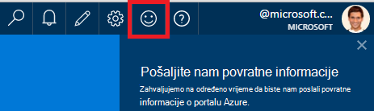
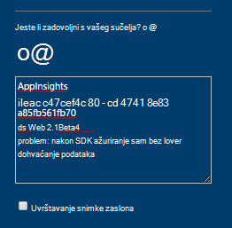
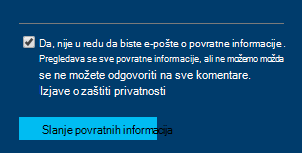

<properties 
    pageTitle="Kako nabaviti tehničke podrške tima za razvoj aplikacija uvida | Microsoft Azure" 
    description="Kada imate slučaj u koji zahtijeva podršku za posebne tima za razvoj aplikacija uvide, to je kako možete poslati detalje da biste dobili podršku." 
    services="application-insights" 
    documentationCenter=""
    authors="alexbulankou" 
    manager="douge"/>
 
<tags 
    ms.service="application-insights" 
    ms.workload="tbd" 
    ms.tgt_pltfrm="ibiza" 
    ms.devlang="na" 
    ms.topic="article" 
    ms.date="06/01/2016" 
    ms.author="albulank"/>
    
# <a name="how-to-get-technical-support-from-application-insights-development-team"></a>Kako nabaviti tehničke podrške tima za razvoj aplikacija uvida
    
Ako imate Tehnički problem s [Uvida aplikacije za Visual Studio](app-insights-overview.md), Slijedi nekoliko mogućnosti za pristup pomoći:

## <a name="1-check-the-documents"></a>1. potvrdite okvir dokumente

* Nema podataka? Provjera: [stvaranje uzoraka](app-insights-sampling.md), [kvotama i ograničavanje](app-insights-pricing.md).
* Otklanjanje poteškoća: [ASP.NET](app-insights-troubleshoot-faq.md) | [Java](app-insights-java-troubleshoot.md)

## <a name="2-search-the-forums"></a>2. na forumima pretraživanja

* [MSDN forum](https://social.msdn.microsoft.com/Forums/vstudio/home?forum=ApplicationInsights)
* [StackOverflow](http://stackoverflow.com/questions/tagged/ms-application-insights)

## <a name="3-azure-support-plan"></a>3. planiranje podrške za azure?

Postoje situacije u kojoj želite razvojnim inženjerima da biste istražili određene slučaj. 

Ako imate na [podržava plan s Microsoft Azure](https://azure.microsoft.com/support/plans/) možete [otvoriti zahtjev za podršku možete](https://portal.azure.com/?#blade/Microsoft_Azure_Support/HelpAndSupportBlade).

## <a name="4-contact-the-application-insights-team"></a>4. Obratite se timu za aplikaciju uvida

Ako nemate tarifu za podršku, naš tim za razvoj je zadovoljni nudi najbolje podršku klijentima uvida aplikacije kao što je Općenito dostupan graničnika se priprema. Ne možemo su Uvod u **neku mogućnost podrške u novi**: možete opisuju slučaj nam slanjem obrazac za povratne informacije portala za Azure, a razvojni inženjer kontakt tima aplikacije uvida natrag da biste riješili problem.


1. [Portal za aplikacije uvida](https://portal.azure.com)kliknite Nasmiješeno lice u gornjem desnom kutu:  

       

2. U okvir komentara provjerite da biste odredili **AppInsights** kao prvi redak, a obuhvaćaju sljedeće informacije:   

    ```

    AppInsights   
    ikey: <instrumentation key>   
    sdk: <SDK that you are using, including name and version>  
    issue: <please describe the problem you are having>

    ```   

       

3. Provjerite "Da, on je u redu da biste e-pošte koji". 

      

Programa inženjeringom članova tima uvida aplikacija će kontaktirati uskoro. Kao što je ovaj servis ćemo vam na temelju najbolje trud, bez formalno SLA može biti zadano sada.


