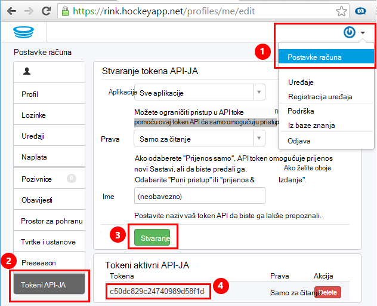
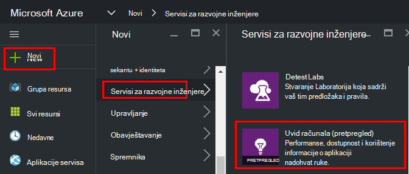
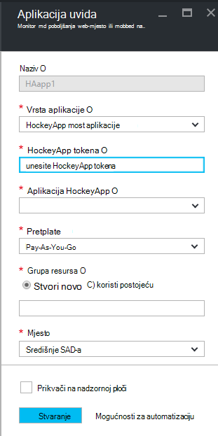
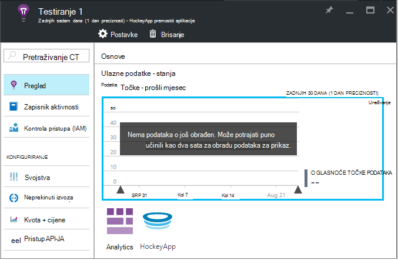
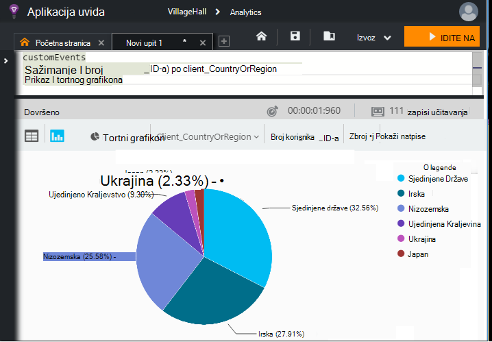

<properties 
    pageTitle="Istraživanje podataka HockeyApp u aplikaciji uvida | Microsoft Azure" 
    description="Analiza korištenja i performanse Azure aplikacije s uvida aplikacije." 
    services="application-insights" 
    documentationCenter="windows"
    authors="alancameronwills" 
    manager="douge"/>

<tags 
    ms.service="application-insights" 
    ms.workload="tbd" 
    ms.tgt_pltfrm="ibiza" 
    ms.devlang="na" 
    ms.topic="article" 
    ms.date="08/25/2016" 
    ms.author="awills"/>

#  Istraživanje podataka HockeyApp u aplikaciji uvida

[HockeyApp](https://azure.microsoft.com/services/hockeyapp/) je preporučena platformu za nadzor uživo radne površine i mobilne aplikacije. Iz HockeyApp, slanje prilagođenih i praćenje telemetrijskih nadzor korištenja i nuđenje pomoći u Dijagnostika (osim dohvaćanje podataka rušenje). Ovaj tok telemetrijskih možete mu pomoću značajke programa [Visual Studio aplikacije uvida](app-insights-overview.md)napredne [analize](app-insights-analytics.md) . Osim toga, možete [izvesti prilagođena, a zatim prati telemetrijskih](app-insights-export-telemetry.md). Da biste omogućili te značajke, postaviti most koji preusmjeri HockeyApp podataka do uvida aplikacije.

## Aplikaciju most HockeyApp

Aplikacija za most HockeyApp je core značajka koja omogućuje pristup HockeyApp podataka u aplikaciji uvida putem analitičkih podataka i neprekinuti izvoz značajke. Sve podatke prikupljene putem HockeyApp nakon stvaranja aplikaciju most HockeyApp bit će dostupni iz tih značajki. Pogledajmo kako postaviti jednu od tih most aplikacija.

HockeyApp, otvorite postavke računa, [Tokeni API -JA](https://rink.hockeyapp.net/manage/auth_tokens). Stvorite novi token ili ponovno korištenje postojećeg. Minimalna prava potrebni su "samo za čitanje". Ponijeti na API tokena.

Otvorite portal Microsoft Azure i [stvoriti do uvida aplikacije resurs](app-insights-create-new-resource.md). Postavljanje vrste aplikacija "HockeyApp most aplikaciju":

Ne morate postaviti naziv – Time se automatski postaviti iz polja Naziv HockeyApp.

Polja most HockeyApp pojavljuju. 

Unesite token HockeyApp ste ranije zabilježili. Ova akcija popunjava padajućeg izbornika "HockeyApp aplikacije" sa svim aplikacijama HockeyApp. Odaberite onaj koji želite koristiti pa dovršite ostatak polja. 

Otvorite novi resurs. 

Imajte na umu da podatke potrebno neko vrijeme da biste pokrenuli slijedi.

To je to! Svi podaci prikupljeni u aplikaciji HockeyApp instrumented od ove točke naprijed sada je i dostupne u značajki analize i neprekinuti izvoz uvida aplikacije.

Kratko Pogledajmo svaka od tih značajki sad je dostupna vama.

## Analytics

Analitički je naprednih alata za ad hoc upite podataka, što omogućuje dijagnosticiranje i analizirati vaše telemetrijskih i brzo otkrili korijenskog uzroka i uzorke.

* [Dodatne informacije o Analytics](app-insights-analytics-tour.md)
* [Uvod u videozapis](https://channel9.msdn.com/events/Build/2016/T666)
* [Naprednih koncepata videozapisa](https://channel9.msdn.com/Events/Build/2016/P591)

## Neprekinuti izvoza

Neprekinuti izvoz omogućuje podataka izvezite u spremniku spremište blobova platforme Azure. Ovo je vrlo koristan ako morate zadržati podatke dulje od razdoblje zadržavanja trenutno nudi uvida aplikacije. Možete zadržati podatke u spremište blobova platforme, obradu u bazi podataka sustava SQL ili željene podatke skladištenje rješenja.

[Dodatne informacije o neprekinuti izvoz](app-insights-export-telemetry.md)

## Daljnji koraci

* [Primjena analize podataka](app-insights-analytics-tour.md)

