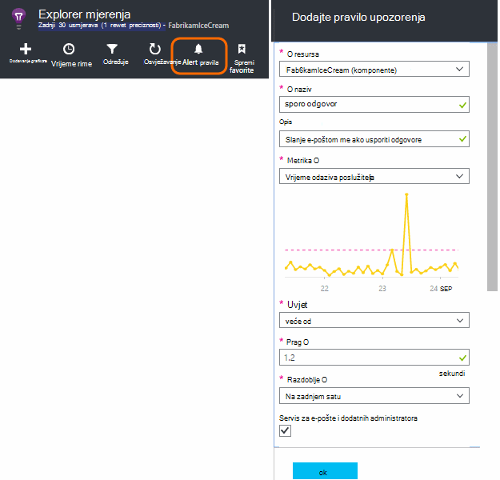
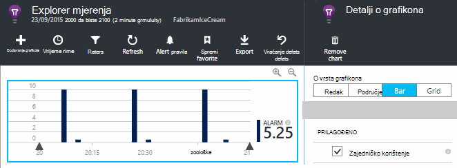
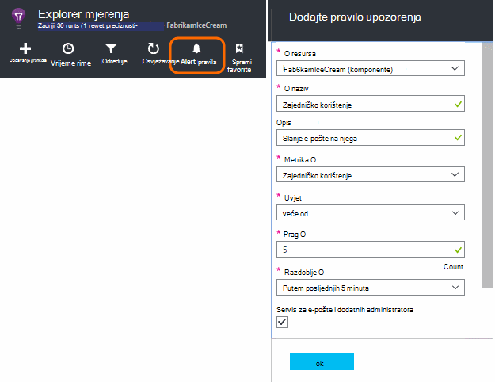
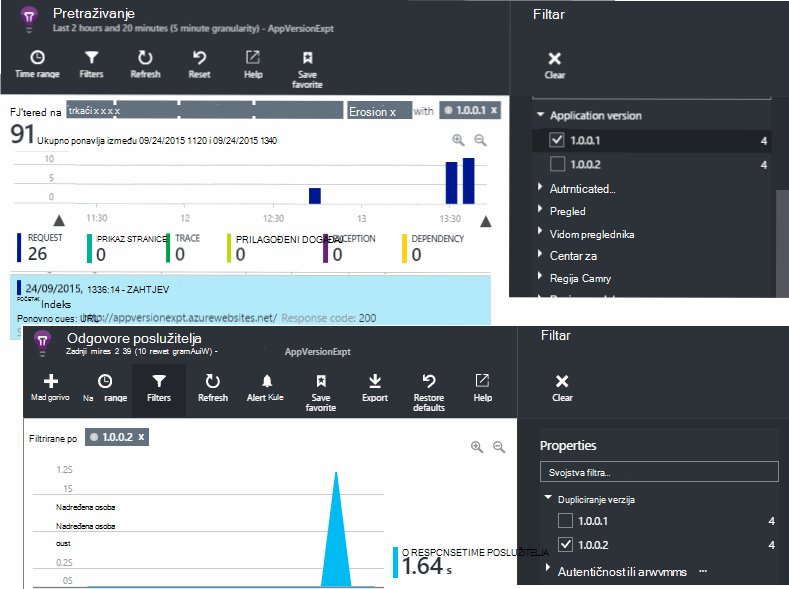
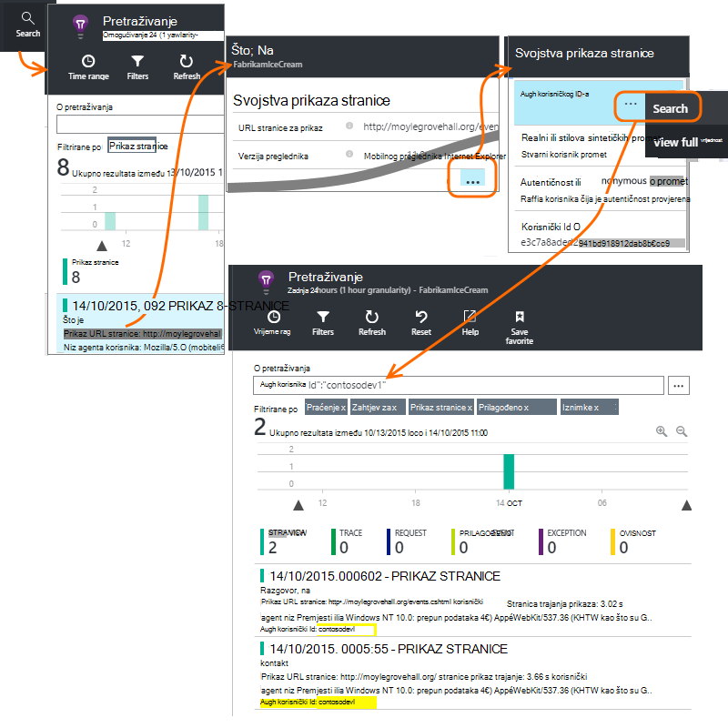
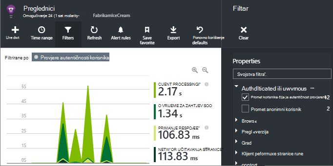
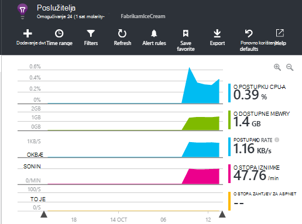

<properties 
    pageTitle="Kako... u aplikaciji uvida | Microsoft Azure" 
    description="Najčešća pitanja vezana uz u uvide aplikaciju." 
    services="application-insights" 
    documentationCenter=""
    authors="alancameronwills" 
    manager="douge"/>

<tags 
    ms.service="application-insights" 
    ms.workload="tbd" 
    ms.tgt_pltfrm="ibiza" 
    ms.devlang="na" 
    ms.topic="article" 
    ms.date="02/05/2016" 
    ms.author="awills"/>

# <a name="how-do-i--in-application-insights"></a>Kako... u aplikaciji uvida?

## <a name="get-an-email-when-"></a>Dobiti poruku e-pošte kada...

### <a name="email-if-my-site-goes-down"></a>E-pošte ako funkcionira Moje web-mjesto

Postavljanje programa [testiranje dostupnosti web](app-insights-monitor-web-app-availability.md).

### <a name="email-if-my-site-is-overloaded"></a>E-pošte ako je pretrpan Moje web-mjesto

Postavljanje [upozorenja](app-insights-alerts.md) na **vrijeme odaziva poslužitelja**. Prag između 1 i 2 sekundi surađivati.



Pokrenite aplikaciju može prikazati predznaku naprezanja vraćanjem šifre pogreške. Postavljanje upozorenja na **zahtjeva nije uspjelo**.

Ako želite postaviti upozorenje na **poslužitelju iznimke**, možda ćete morati učinite [neke dodatne postavke](app-insights-asp-net-exceptions.md) da biste vidjeli podatke.

### <a name="email-on-exceptions"></a>E-pošte na iznimke

1. [Postavljanje nadzor iznimke](app-insights-asp-net-exceptions.md)
2. [Postavljanje upozorenja](app-insights-alerts.md) na broj metriku iznimke


### <a name="email-on-an-event-in-my-app"></a>E-pošte na događaj u mojoj aplikaciji

Pretpostavimo da želite primati poruke e-pošte kada pojavljivanja određenog događaja. Uvid aplikacija ne nudi ovom funkcijom izravno, ali ga možete [poslati upozorenja kada metrike presjek praga](app-insights-alerts.md). 

Upozorenja možete postaviti na [Prilagođeni metriku](app-insights-api-custom-events-metrics.md#track-metric)kroz ne prilagođene događaje. Unesite neki kod da biste povećali metrike kada se pojavi događaj:

    telemetry.TrackMetric("Alarm", 10);

ili:

    var measurements = new Dictionary<string,double>();
    measurements ["Alarm"] = 10;
    telemetry.TrackEvent("status", null, measurements);

Jer upozorenja imaju dva stanja, morate poslati Niska vrijednost razmislite o upozorenje da biste završio:

    telemetry.TrackMetric("Alarm", 0.5);

Stvaranje grafikona u [metričkim explorer](app-insights-metrics-explorer.md) da biste vidjeli svoje alarma:



Sada postaviti upozorenje kada metriku dolazi iznad mid vrijednosti na kratko:




Postavite minimalne averaging razdoblja. 

Prikazat će se poruke e-pošte i kada metriku dolazi iznad i ispod praga.

Nekoliko uzeti u obzir:

* Upozorenje ima dvije državama ("upozorenja" i "dobar"). Stanje procjenjuje samo kada je metrike primljen.
* Poruke e-pošte šalje se samo kada je stanje u kojem se mijenja. Ovo je Zašto se i poslati visoke i metrike Najniža vrijednost. 
* Da biste procijenili upozorenja, prosjek snimljene primljene vrijednosti u prethodnom razdoblju. To se događa prilikom svakog primitka metrike tako da se poruke e-pošte mogu poslati češće od postavite razdoblja.
* Budući da se poruke e-pošte šalju na "upozorenja" i "dobar", možda ćete morati razmislite o ponovno mislim one-shot događaj kao dva stanja uvjeta. Ako, na primjer, umjesto događaj "zadatak dovršen" imati uvjet "zadatak u tijeku" gdje se poruke e-pošte na početku i kraju posao.

### <a name="set-up-alerts-automatically"></a>Automatski postaviti upozorenja

[Korištenje ljuske PowerShell za stvaranje novog upozorenja](app-insights-alerts.md#set-alerts-by-using-powershell)

## <a name="use-powershell-to-manage-application-insights"></a>Upravljanje aplikacije uvide pomoću komponente PowerShell

* [Stvaranje nove resurse](app-insights-powershell-script-create-resource.md)
* [Stvaranje nove upozorenja](app-insights-alerts.md#set-alerts-by-using-powershell)

## <a name="application-versions-and-stamps"></a>Verzije programa i žigovima

### <a name="separate-the-results-from-dev-test-and-prod"></a>Razdvajanje rezultate iz razvojni, testiranje i grupa

* Drugi environmnents postavite različite ikeys
* Za različite žigovima (razvojni, testirajte, radni) označavanje telemetrijskih s različitim svojstvo vrijednostima

[uči više](app-insights-separate-resources.md)
 

### <a name="filter-on-build-number"></a>Filtriranje na broj izdanja

Kad objavite novu verziju aplikacije, želite ćete moći odvojiti za telemetriju iz različitih izdanja.

Svojstvo verzija aplikacije možete postaviti tako da možete filtrirati rezultate [pretraživanja](app-insights-diagnostic-search.md) i [metrike explorer](app-insights-metrics-explorer.md) . 




Postoji nekoliko različitih načina postavite svojstvo verzija aplikacije.

* Postavite izravno:

    `telemetryClient.Context.Component.Version = typeof(MyProject.MyClass).Assembly.GetName().Version;`

* Prelamanje retka u [telemetrijskih initializer](app-insights-api-custom-events-metrics.md#telemetry-initializers) da biste bili sigurni da su sve instance TelemetryClient dosljedno postavljen.

* [ASP.NET] Postavljanje verzije `BuildInfo.config`. Modul web će obraditi verziju s čvor BuildLabel. Uključi ove datoteke u projektu, a ne zaboravite da biste postavili svojstvo uvijek Kopiraj u pregledniku rješenja.

    ```XML

    <?xml version="1.0" encoding="utf-8"?>
    <DeploymentEvent xmlns:xsi="http://www.w3.org/2001/XMLSchema-instance" xmlns:xsd="http://www.w3.org/2001/XMLSchema" xmlns="http://schemas.microsoft.com/VisualStudio/DeploymentEvent/2013/06">
      <ProjectName>AppVersionExpt</ProjectName>
      <Build type="MSBuild">
        <MSBuild>
          <BuildLabel kind="label">1.0.0.2</BuildLabel>
        </MSBuild>
      </Build>
    </DeploymentEvent>

    ```
* [ASP.NET] Automatsko generiranje BuildInfo.config u MSBuild. Da biste to učinili, dodajte nekoliko redaka .csproj datoteku:

    ```XML

    <PropertyGroup>
      <GenerateBuildInfoConfigFile>true</GenerateBuildInfoConfigFile>    <IncludeServerNameInBuildInfo>true</IncludeServerNameInBuildInfo>
    </PropertyGroup> 
    ```

    Taj se način stvara datoteku s nazivom *yourProjectName*. BuildInfo.config. Postupak objavljivanja preimenuje je BuildInfo.config.

    Sastavi natpis sadrži rezervirano mjesto (AutoGen_...) prilikom stvaranja s Visual Studio. No kada u komponenti s MSBuild ga je popunjen broj ispravnu verziju.

    Da biste omogućili MSBuild da biste generirali brojevi verzija, postavljanje verzije kao što su `1.0.*` u AssemblyReference.cs

## <a name="monitor-backend-servers-and-desktop-apps"></a>Praćenje i vanjske poslužitelje pozadinska aplikacija za stolna računala

[Korištenje modul Windows Server SDK](app-insights-windows-desktop.md).


## <a name="visualize-data"></a>Vizualni prikaz podataka

#### <a name="dashboard-with-metrics-from-multiple-apps"></a>Nadzorna ploča s mjernih podataka iz više aplikacija

* U [Programu Explorer metriku](app-insights-metrics-explorer.md)Prilagodba grafikona i spremanje u obliku u favorite. Prikvači na Azure nadzorne ploče.


#### <a name="dashboard-with-data-from-other-sources-and-application-insights"></a>Nadzorna ploča s podacima iz drugih izvora i aplikacije uvida

* [Izvoz telemetrijskih Power bi](app-insights-export-power-bi.md). 

Ili

* Korištenje sustava SharePoint kao nadzorne ploče, prikaz podataka u sustavu SharePoint web-dijelova. [Korištenje neprekinuti izvoz i analize strujanje izvezli u SQL](app-insights-code-sample-export-sql-stream-analytics.md).  Koristite PowerView da biste pregledali baze podataka i stvaranje web-dijela sustava SharePoint za PowerView.


<a name="search-specific-users"></a>
### <a name="filter-out-anonymous-or-authenticated-users"></a>Filtriranje anonimni ili čija je autentičnost provjerena korisnika

Ako vaši korisnici prijaviti, možete postaviti [autentičnost korisničkog id-a](app-insights-api-custom-events-metrics.md#authenticated-users). (Ga se ne događa automatski.) 

Zatim možete:

* Pretraživanje na određene korisničkog ID-a



* Filtriranje metriku anonimni ili čija je autentičnost provjerena korisnicima



## <a name="modify-property-names-or-values"></a>Izmjena svojstava nazive ili vrijednosti

Stvaranje [filtra](app-insights-api-filtering-sampling.md#filtering). To možete izmijeniti ili filtrirati telemetrijskih prije slanja iz aplikacije programa aplikacije uvid u.

## <a name="list-specific-users-and-their-usage"></a>Određene korisnike i njihova korištenja popisa

Ako samo želite [pretraživanja za određene korisnike](#search-specific-users), možete postaviti [autentičnost korisničkog id-a](app-insights-api-custom-events-metrics.md#authenticated-users).

Ako želite da popis korisnika s podacima kao što su koje stranice izgledaju pri ili koliko često prijave, imate dvije mogućnosti:

* [Postavljanje autentičnost korisnički id](app-insights-api-custom-events-metrics.md#authenticated-users), [Izvoz u bazu podataka](app-insights-code-sample-export-sql-stream-analytics.md) i korištenje odgovarajuću Alati za analizu podataka korisnik nema.
* Ako imate samo mali broj korisnika, slanje prilagođenih događaja ili metrike pomoću podataka koji vas zanimaju nazivu metričkim vrijednost ili događaja, kao i postavljanje korisničkog id-a kao svojstvo. Da biste analizirali prikaza stranice, zamijenite standardne poziv trackPageView JavaScript. Da biste analizirali poslužiteljsko telemetrijskih pomoću telemetrijskih initializer da biste dodali korisničkog id-a za sve telemetrijskih poslužitelja. Zatim filtar i segmentu metriku i možete pretraživanja na korisničkog id-a.


## <a name="reduce-traffic-from-my-app-to-application-insights"></a>Smanjivanje promet iz moje aplikacije do uvida aplikacije

* U [ApplicationInsights.config](app-insights-configuration-with-applicationinsights-config.md)onemogućiti module nije potrebno, takve na performanse prikupljanje brojač.
* Koristite [uzorkovanje i filtriranje](app-insights-api-filtering-sampling.md) na SDK-a.
* Na web-stranicama ograničiti broj poziva Ajax potrebnom za svaki prikaz stranice. U isječak skripte nakon `instrumentationKey:...` , umetnite: `,maxAjaxCallsPerView:3` (ili odgovarajuću broj).
* Ako koristite [TrackMetric](app-insights-api-custom-events-metrics.md#track-metric), izračunati zbroj serijama od metričkim vrijednostima prije slanja rezultat. Došlo je do preopterećenja TrackMetric() koja omogućuje za to.


Dodatne informacije o [kvotama i cijene](app-insights-pricing.md).

## <a name="disable-telemetry"></a>Onemogućivanje telemetrijskih

Da biste **dinamički zaustaviti i pokrenuti** zbirka i prijenos telemetrijskih s poslužitelja:

```

    using  Microsoft.ApplicationInsights.Extensibility;

    TelemetryConfiguration.Active.DisableTelemetry = true;
```


**Onemogućivanje odabrane standardni collectors** -, na primjer, mjerača performansi, HTTP zahtjeva ili ovisnosti – brisanje ili komentar izvan odgovarajuće retke u [ApplicationInsights.config](app-insights-api-custom-events-metrics.md). Nije moguće to, na primjer, ako želite poslati TrackRequest podataka.


## <a name="view-system-performance-counters"></a>Mjerača performansi sustava za prikaz

Među mjernih podataka možete prikazati u programu explorer metriku su skup sustava mjerača performansi. Postoji unaprijed definirane plohu naziva **poslužitelja** koja se prikazuje više od njih.



### <a name="if-you-see-no-performance-counter-data"></a>Ako vidite nema podataka o performansama brojač

* **Poslužitelj za IIS** na vlastitom računalu ili na VM. [Instalacija Nadzornik stanja](app-insights-monitor-performance-live-website-now.md). 
* **Azure web-mjesta** – ne podržavamo mjerača performansi još. Postoji nekoliko mjernih podataka možete dobiti u sklopu standardne upravljačku ploču Azure web-mjesta.
* **Poslužitelj za UNIX** - [Instalacija collectd](app-insights-java-collectd.md)

### <a name="to-display-more-performance-counters"></a>Da biste prikazali dodatne mjerača performansi

* Najprije [dodajte novi grafikon](app-insights-metrics-explorer.md) i potražite u članku ako brojač u osnovni postavljena koje nudimo.
* Ako nije, [dodajte brojač skup prikupljene putem modula brojač performanse](app-insights-performance-counters.md).


