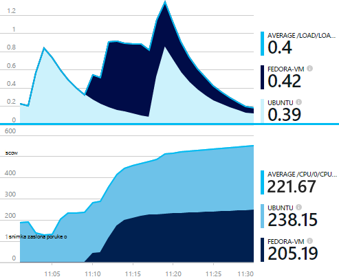
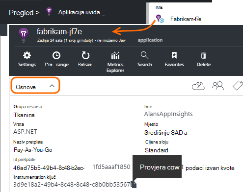
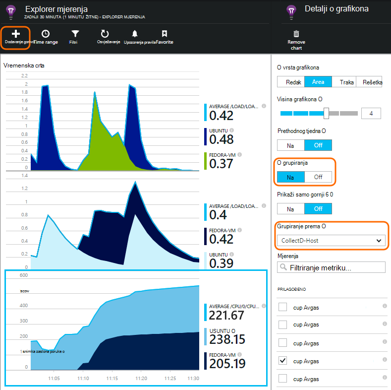

<properties 
    pageTitle="collectd: stat mjerača performansi za Java na Unix u aplikaciji uvida" 
    description="Prošireni nadzor Java web-mjesta s CollectD dodatak za aplikaciju uvida" 
    services="application-insights" 
    documentationCenter="java"
    authors="alancameronwills" 
    manager="douge"/>

<tags 
    ms.service="application-insights" 
    ms.workload="tbd" 
    ms.tgt_pltfrm="ibiza" 
    ms.devlang="na" 
    ms.topic="article" 
    ms.date="08/24/2016" 
    ms.author="awills"/>
 
# <a name="collectd-unix-performance-metrics-in-application-insights"></a>collectd: Unix performanse metriku u aplikaciji uvida

*Aplikacija uvida je u pretpregledu.*

Da biste istražili Unix mjernih podataka performanse sustava u [Aplikaciji uvida](app-insights-overview.md), instalirajte [collectd](http://collectd.org/), zajedno s njegova dodatak uvida aplikacije. Otvori izvor rješenje prikuplja različite statistike sustav i mreže.

Obično ćete koristiti collectd ako već imate [instrumented Java web-servisa pomoću aplikacije uvida][java]. Pruža dodatne podatke koji olakšavaju da biste poboljšali performanse pokrenite aplikaciju ili utvrditi probleme. 



## <a name="get-your-instrumentation-key"></a>Ključ instrumentation

[Portal Microsoft Azure](https://portal.azure.com)otvorite [Aplikaciju uvida](app-insights-overview.md) resursa mjesto na koje želite da se prikazuju. (Ili [stvorite novi resurs](app-insights-create-new-resource.md).)

Preuzimanje kopije tipku instrumentation koji označava resurs.




## <a name="install-collectd-and-the-plug-in"></a>Instalirajte collectd i dodatak

Na Unix poslužitelju:

1. Instalacija [collectd](http://collectd.org/) verziju 5.4.0 ili noviji.
2. Preuzmite [aplikaciju uvida collectd writer dodatak](https://aka.ms/aijavasdk). Imajte na umu broj verzije.
3. Kopiraj dodatak POSUDU u `/usr/share/collectd/java`.
3. Uređivanje `/etc/collectd/collectd.conf`:
 * Provjerite je li omogućen [dodatak za Java](https://collectd.org/wiki/index.php/Plugin:Java) .
 * Ažurirajte JVMArg za u java.class.path da biste uključili sljedeće POSUDU. Broj verzije tako da odgovara onaj koji ste preuzeli ažuriranje:
  * `/usr/share/collectd/java/applicationinsights-collectd-1.0.5.jar`
 * Dodavanje isječaka, pomoću ključa Instrumentation iz vaše resursa:

```

     LoadPlugin "com.microsoft.applicationinsights.collectd.ApplicationInsightsWriter"
     <Plugin ApplicationInsightsWriter>
        InstrumentationKey "Your key"
     </Plugin>
```

Ovdje je dio oglednu datoteku konfiguracije:

    ...
    # collectd plugins
    LoadPlugin cpu
    LoadPlugin disk
    LoadPlugin load
    ...

    # Enable Java Plugin
    LoadPlugin "java"

    # Configure Java Plugin
    <Plugin "java">
      JVMArg "-verbose:jni"
      JVMArg "-Djava.class.path=/usr/share/collectd/java/applicationinsights-collectd-1.0.5.jar:/usr/share/collectd/java/collectd-api.jar"

      # Enabling Application Insights plugin
      LoadPlugin "com.microsoft.applicationinsights.collectd.ApplicationInsightsWriter"
                
      # Configuring Application Insights plugin
      <Plugin ApplicationInsightsWriter>
        InstrumentationKey "12345678-1234-1234-1234-123456781234"
      </Plugin>

      # Other plugin configurations ...
      ...
    </Plugin>
.   ...

Konfigurirajte ostale [collectd dodaci](https://collectd.org/wiki/index.php/Table_of_Plugins), koje možete prikupiti razne podataka iz različitih izvora.

Ponovno pokrenite collectd prema njegov [ručno](https://collectd.org/wiki/index.php/First_steps).

## <a name="view-the-data-in-application-insights"></a>Prikaz podataka u aplikaciji uvida

Resursa vaše aplikacije uvida otvorite [Explorer metriku i dodajte grafikoni][metrics], odabir metrike koju želite vidjeti iz prilagođene kategorije.



Prema zadanim postavkama metriku se pridružuje preko sve glavnog računala iz koje ste prikupili metriku. Da biste pogledali metriku po glavno računalo, pojedinosti plohu grafikona, uključite grupiranje, a zatim odaberite da biste grupirali prema CollectD Host.


## <a name="to-exclude-upload-of-specific-statistics"></a>Da biste izuzeli prijenos određenih statistike

Prema zadanim postavkama, dodatak za aplikaciju uvida šalje sve podatke prikupljene putem omogućeno collectd 'čitanje' dodataka. 

Da biste izuzeli podataka iz određenog izvora dodataka ili podataka:

* Uređivanje konfiguracijskoj datoteci. 
* U `<Plugin ApplicationInsightsWriter>`, dodajte retke uputa ovako:

Uputa | Efekt
---|---
`Exclude disk` | Isključi sve podatke prikupljene putem na `disk` dodatak
`Exclude disk:read,write` | Isključivanje izvora pod nazivom `read` i `write` iz na `disk` dodatak.

Da biste upute zasebnom poslužitelja s u novi redak.


## <a name="problems"></a>Problemi?

*Ne vidim podataka na portalu*

* Otvorite [pretraživanje] [ diagnostic] da biste vidjeli neobrađenog događaje stigla. Ponekad su trajati dulje da se prikazuju u programu explorer mjernih podataka.
* Možda ćete morati [postaviti iznimke vatrozida za izlazne podatke](app-insights-ip-addresses.md)
* Omogućiti praćenje u dodatak za aplikaciju uvide. Dodajte redak unutar `<Plugin ApplicationInsightsWriter>`:
 *  `SDKLogger true`
* Otvorite je terminal i pokrenuti collectd opširno način, da biste vidjeli ga je prijavljivanje problema:
 * `sudo collectd -f`


<!--Link references-->

[api]: app-insights-api-custom-events-metrics.md
[apiexceptions]: app-insights-api-custom-events-metrics.md#track-exception
[availability]: app-insights-monitor-web-app-availability.md
[diagnostic]: app-insights-diagnostic-search.md
[eclipse]: app-insights-java-eclipse.md
[java]: app-insights-java-get-started.md
[javalogs]: app-insights-java-trace-logs.md
[metrics]: app-insights-metrics-explorer.md
[usage]: app-insights-web-track-usage.md

 
