<properties 
    pageTitle="Početak rada s računala uvida s Java u Eclipse" 
    description="Koristite Eclipse dodatak da biste dodali performanse i nadzor korištenja Java web-mjesto s računala uvida" 
    services="application-insights" 
    documentationCenter="java"
    authors="alancameronwills" 
    manager="douge"/>

<tags 
    ms.service="application-insights" 
    ms.workload="tbd" 
    ms.tgt_pltfrm="ibiza" 
    ms.devlang="na" 
    ms.topic="article" 
    ms.date="03/02/2016" 
    ms.author="awills"/>
 
# Početak rada s računala uvida s Java u Eclipse

SDK uvida aplikacije šalje telemetrijskih iz web-aplikacije Java tako da možete analizirati korištenje i performanse. Dodatak za aplikaciju uvida Eclipse automatski instalira SDK u projektu tako da se iz telemetrijskih okvir plus API-JA koje možete koristiti da biste napisali prilagođeni telemetrijskih.   

## Preduvjeti

Trenutno dodatak funkcionira za Maven projekata i dinamični Web projektima u Eclipse. ([Dodavanje aplikacije uvida u druge vrste projekta Java][java].)

Morat ćete:

* Oracle JRE 1,6 ili noviji
* Pretplate na [Microsoft Azure](https://azure.microsoft.com/). (Nije počet ćete [besplatnu probnu verziju](https://azure.microsoft.com/pricing/free-trial/).)
* [Eclipse IDE za razvojne inženjere EE Java](http://www.eclipse.org/downloads/)indigo plava ili noviji.
* Windows 7 ili noviji ili Windows Server 2008 ili noviji

## Kliknite pločicu SDK Eclipse (jedna jedinica vremena)

Morate samo učinite ovo jednokratno svako računalo. Ovaj korak instalira komplet alata za koje možete dodavati SDK-a za svaki dinamički projekt Web.

1. U Eclipse, kliknite Pomoć, a zatim instalirati novi softver.

    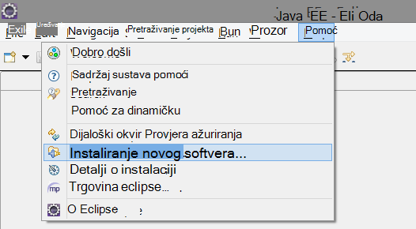

2. SDK-a nalazi se u http://dl.windowsazure.com/eclipse, u odjeljku komplet alata za Azure. 
3. Poništite potvrdni okvir **obratite se sva ažuriranja web-mjesta...**

    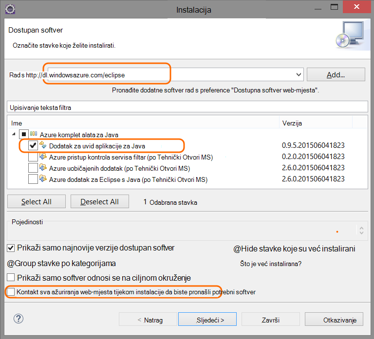

Slijedite preostale korake za svaki projekt Java.

## Stvaranje do uvida aplikacije resursa u Azure

1. Prijavite se na [portal za Azure](https://portal.azure.com).
2. Stvaranje nove uvide aplikacije resursa.  

    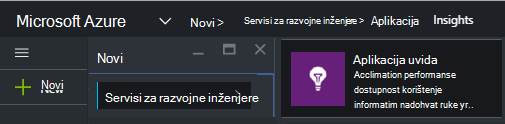  
3. Postavljanje vrste aplikacija Java web-aplikaciju.  

    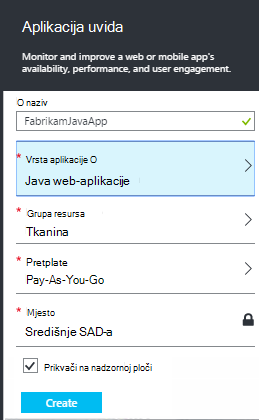  
4. Pronađite ključ instrumentation novi resurs. Morat ćete to uskoro zalijepite u projektu kod.  

    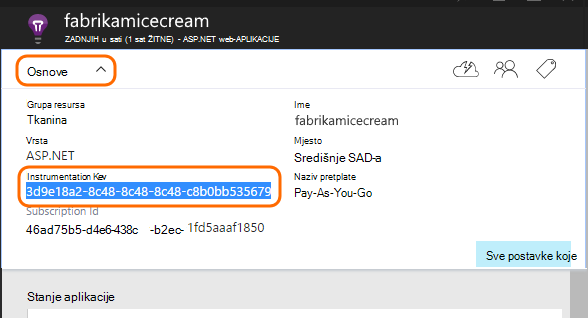  

## Dodavanje aplikacije uvid u projekt

1. Dodajte aplikaciju uvida na kontekstnom izborniku Java web projekta.

    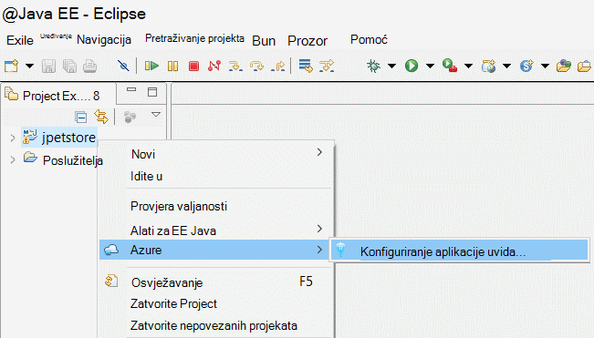

2. Zalijepite ključ instrumentation koju ste dobili na portalu Azure.

    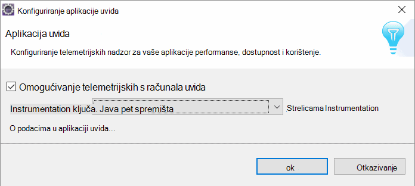

Ključ je poslan i sve stavke telemetrijskih i govori uvida aplikacije da bi se prikazao u vašem resursa.

## Pokrenite aplikaciju i potražite u članku mjerenja

Pokrenite aplikaciju.

Vratite se na vaše aplikacije uvida resursa u Microsoft Azure.

HTTP zahtjeva podataka će se prikazivati plohu pregled. (Ako ga ne postoji, pričekajte nekoliko sekundi i zatim kliknite Osvježi.)

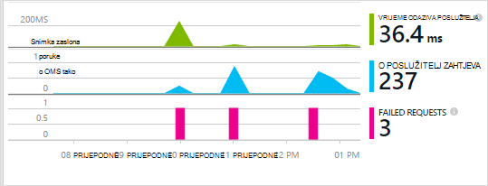
 

Klikajte stavke za bilo koji od njih da biste vidjeli detaljnije metriku. 

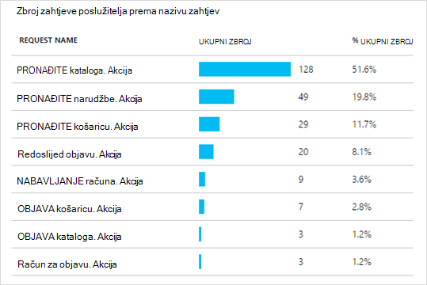

[Saznajte više o mjernih podataka.][metrics]

 

I kada Prikaz svojstava zahtjeva, vidjet ćete događaje telemetrijskih ga kao što su zahtjeve i iznimke pridružene.
 

## Klijentsko telemetrijskih

Plohu brzi početak rada kliknite Dohvati šifru praćenje Moje web-stranice: 

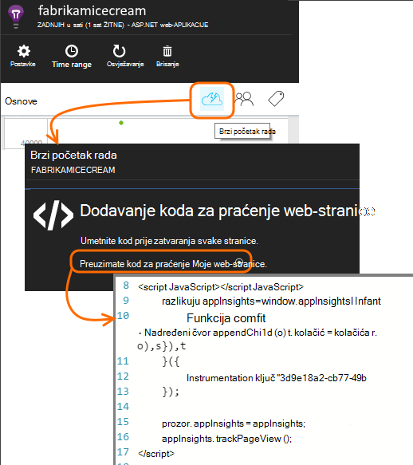

U zaglavlje HTML datoteke umetnite isječak koda.

#### Prikaz podataka na klijentskoj strani

Otvorite ažurirane web-stranica, a zatim ih koristiti. Pričekajte nekoliko minuta ili dvije, a zatim vratite aplikacije uvid u i otvorite plohu korištenje. (S plohu pregled pomaknite se prema dolje i kliknite korištenje).

Prikaz korisnika i sesiju metriku stranice pojavit će se na korištenje plohu:

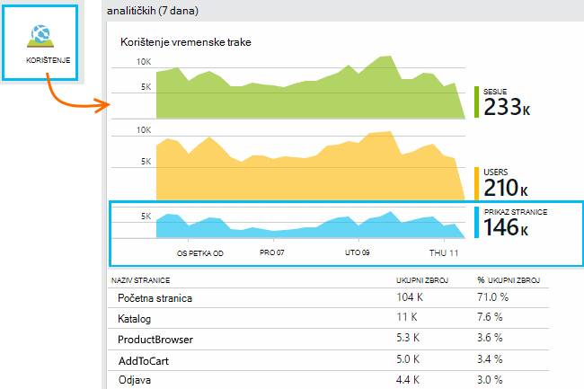

[Dodatne informacije o postavljanju klijentsko telemetrijskih.][usage]

## Objavljivanje aplikacija

Sada objavite aplikaciju na poslužitelju, omogućite osobama koristi, a pogledajte u telemetrijskih prikazuju se na portal.

* Provjerite dopušta li vatrozid aplikacije da biste poslali telemetrijskih priključke:

 * DC.Services.visualstudio.com:443
 * DC.Services.visualstudio.com:80
 * F5.Services.visualstudio.com:443
 * F5.Services.visualstudio.com:80

* Na poslužiteljima sustava Windows, instalirajte:

 * [Microsoft Visual C++ slobodnu distribuciju](http://www.microsoft.com/download/details.aspx?id=40784)

    (To omogućuje mjerača performansi.)

## Iznimke i pogreške na zahtjev

Automatski se prikupljaju neobrađenu iznimke:

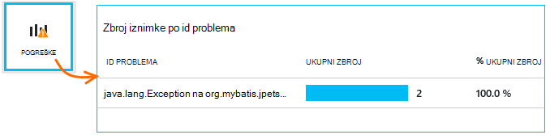

Da biste prikupili podatke na drugim iznimke, imate dvije mogućnosti:

* [Umetanje poziva TrackException u kodu](app-insights-api-custom-events-metrics.md#track-exception). 
* [Instalirajte Agent Java na poslužitelj](app-insights-java-agent.md). Određivanje načina na koji želite gledati.

## Praćenje poziva način i vanjske ovisnosti

[Instalacija programskog jezika Java Agent](app-insights-java-agent.md) za prijavu naveden Interna metoda i pozive putem JDBC, s podacima tempiranje.

## Mjerača performansi

Na vašem plohu pregled pomaknite se prema dolje, a zatim kliknite pločicu **poslužiteljima** . Vidjet ćete raspon mjerača performansi.

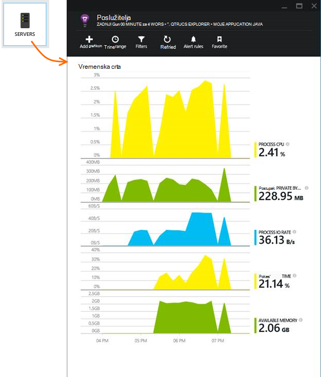

### Prilagodba zbirke brojač performansi

Da biste onemogućili skup Standardni skup mjerača performansi, dodajte sljedeći kod u odjeljku Korijenski čvor ApplicationInsights.xml datoteke:

    <PerformanceCounters>
       <UseBuiltIn>False</UseBuiltIn>
    </PerformanceCounters>

### Prikupljanje dodatnih performanse mjerača

Možete navesti mjerača dodatne performansi prikupljeni.

#### JMX mjerača (izložen putem Java virtualnog računala)

    <PerformanceCounters>
      <Jmx>
        <Add objectName="java.lang:type=ClassLoading" attribute="TotalLoadedClassCount" displayName="Loaded Class Count"/>
        <Add objectName="java.lang:type=Memory" attribute="HeapMemoryUsage.used" displayName="Heap Memory Usage-used" type="composite"/>
      </Jmx>
    </PerformanceCounters>

*   `displayName`– Naziv prikazan na portalu uvida aplikacije.
*   `objectName`– JMX naziv objekta.
*   `attribute`– Atribut naziv objekta JMX za dohvaćanje
*   `type`(neobavezno) – vrsta atributa JMX objekta:
 *  Zadani: jednostavna vrsta kao što su funkcije int ili dugi.
 *  `composite`: u podataka mjerača performansi je u obliku "Attribute.Data"
 *  `tabular`: u podataka mjerača performansi je u obliku retka tablice

#### Mjerača performansi sustava Windows

Svaki [brojač performanse sustava Windows](https://msdn.microsoft.com/library/windows/desktop/aa373083.aspx) pripada kategorije (u na isti način kao da je polje član klase). Kategorije mogu biti globalni, možete imati numerirani ili pod nazivom instance.

    <PerformanceCounters>
      <Windows>
        <Add displayName="Process User Time" categoryName="Process" counterName="%User Time" instanceName="__SELF__" />
        <Add displayName="Bytes Printed per Second" categoryName="Print Queue" counterName="Bytes Printed/sec" instanceName="Fax" />
      </Windows>
    </PerformanceCounters>

*   riješiti problem – naziv prikazan na portalu uvida aplikacije.
*   Naziv kategorije – kategoriju mjerača performansi (performanse objekt) koji je pridružen brojač performansi.
*   counterName – naziv mjerača performansi.
*   instanceName – naziv kategorije instanci brojač performanse ili praznog niza (""), ako kategoriju sadrži jednu instancu. Ako naziv kategorije je postupak i performanse brojač želite li prikupiti iz trenutnog procesa JVM na kojem se izvodi aplikacije, navedite `"__SELF__"`.

Vaš mjerača performansi su vidljive kao prilagođeni metriku u [Programu Explorer metriku][metrics].

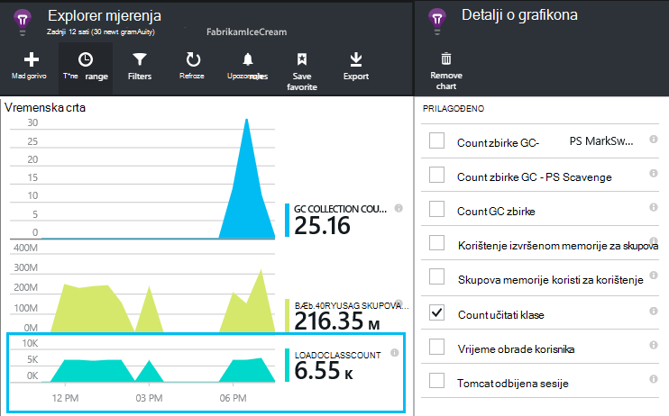

### UNIX mjerača performansi

* [Instalacija collectd s dodatak za uvid aplikacije](app-insights-java-collectd.md) da biste dobili razna sustava i mrežne podataka.

## Testira web dostupnosti

Aplikacija uvida možete testirati web-mjesta u pravilnim vremenskim razmacima kvačicu koja je prema gore i reagirati dobro. [Da biste postavili][availability], pomaknite se prema dolje da biste kliknuli dostupnost.

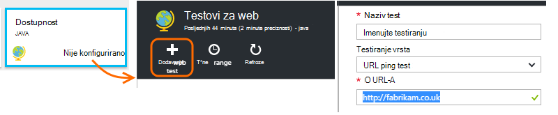

Ako web-mjestu funkcionira prikazat će se grafikoni vrijeme odaziva plus obavijesti e-poštom.

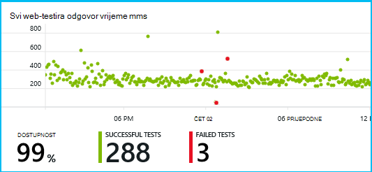

[Dodatne informacije o dostupnosti web testira.][availability] 

## Dijagnostički zapisnici

Ako koristite Logback ili Log4J (v1.2 ili 2.0) za praćenje, imate vaše zapisnika praćenja automatski slati aplikacije uvida gdje možete istraživati i pretraživati na njima.

[Dodatne informacije o zapisnicima dijagnostičkih podataka][javalogs]

## Prilagođeni telemetrijskih 

Umetanje nekoliko redaka koda u web-aplikacije Java da biste saznali što korisnici rade s njom ili pomaže utvrditi probleme. 

Kod možete umetnuti u web-stranicu JavaScript i na strani poslužitelja Java.

[Dodatne informacije o prilagođene telemetrijskih][track]

## Daljnji koraci

#### Prepoznavanje i otklanjanja poteškoća

* [Dodavanje telemetrijskih klijent web] [ usage] da biste telemetrijskih performanse s web-klijentu.
* [Postavljanje web testira] [ availability] da biste bili sigurni aplikacije ostaje uživo i odredište.
* [Potražite u odjeljku događaji i zapisnika] [ diagnostic] da biste pomaže utvrditi probleme.
* [Snimanje Log4J ili Logback kašnjenja][javalogs]

#### Praćenje korištenja

* [Dodavanje telemetrijskih klijent web] [ usage] prikaza stranice monitora i metriku osnovni korisnika.
* [Praćenje prilagođene događaje i metrike] [ track] dodatne informacije o korištenju aplikacije, i na klijentu i s poslužitelja.

<!--Link references-->

[availability]: app-insights-monitor-web-app-availability.md
[diagnostic]: app-insights-diagnostic-search.md
[java]: app-insights-java-get-started.md
[javalogs]: app-insights-java-trace-logs.md
[metrics]: app-insights-metrics-explorer.md
[track]: app-insights-api-custom-events-metrics.md
[usage]: app-insights-web-track-usage.md

 