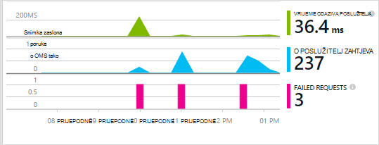
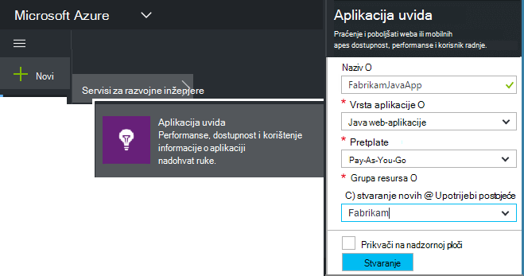
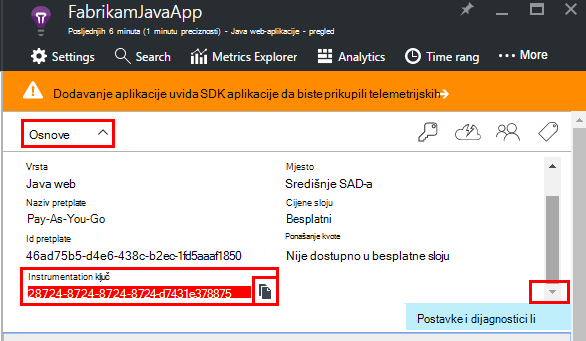
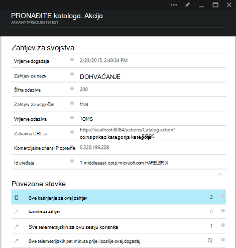
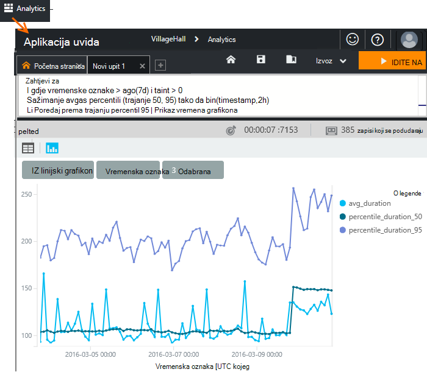
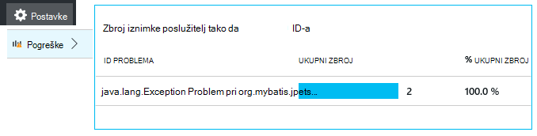
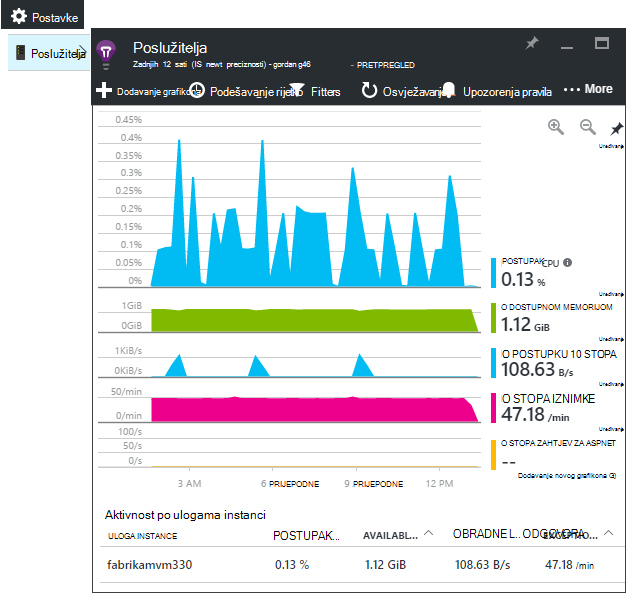
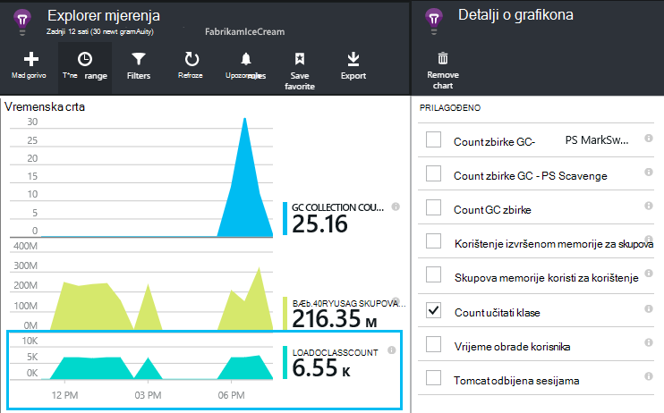
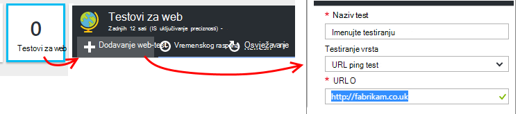
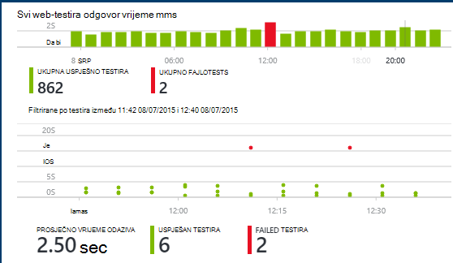

<properties
    pageTitle="Java web-Analitika aplikacija s računala uvida | Microsoft Azure"
    description="Praćenje performansi i korištenje Java web-mjesta pomoću aplikacije uvida. "
    services="application-insights"
    documentationCenter="java"
    authors="alancameronwills"
    manager="douge"/>

<tags
    ms.service="application-insights"
    ms.workload="tbd"
    ms.tgt_pltfrm="ibiza"
    ms.devlang="na"
    ms.topic="get-started-article"
    ms.date="08/17/2016"
    ms.author="awills"/>

# Početak rada s računala uvida u projektu web Java

*Aplikacija uvida je u pretpregledu.*

[AZURE.INCLUDE [app-insights-selector-get-started](../../includes/app-insights-selector-get-started.md)]

[Aplikacije uvida](https://azure.microsoft.com/services/application-insights/) je servis za extensible analytics koji olakšava razumijevanje performanse i korištenje uživo aplikacije. Koristite za [Otkrivanje i dijagnosticiranje probleme s performansama i iznimke](app-insights-detect-triage-diagnose.md)i [Pisanje koda] [ api] da biste pratili što korisnicima postići pomoću aplikacije.

Uvid aplikacija podržava aplikacija Java sustavom Linux, Unix ili Windows.

trebaš:

* Oracle JRE 1,6 ili noviji ili Zulu JRE 1,6 ili noviji
* Pretplate na [Microsoft Azure](https://azure.microsoft.com/). (Nije počet ćete [besplatnu probnu verziju](https://azure.microsoft.com/pricing/free-trial/).)

*Ako imate web-aplikacije koje se već uživo, nije moguće slijedite zamjenski postupak da biste [dodali SDK tijekom rada u web-poslužitelj](app-insights-java-live.md). Taj zamjenski izbjegava novog kod, no ne nudi se mogućnost da biste napisali kod za praćenje aktivnosti korisnika.*

## 1. ključ do uvida aplikacije instrumentation

1. Prijavite se na [portal Microsoft Azure](https://portal.azure.com).
2. Stvaranje do uvida aplikacije resursa. Postavljanje vrste aplikacija Java web-aplikaciju.

    
4. Pronađite ključ instrumentation novi resurs. Morat ćete uskoro zalijepite ovog ključa u projektu kod.

    

## 2. dodati SDK uvida aplikacije za Java u projekt

*Odaberite odgovarajući način projekta.*

#### Ako koristite Eclipse Stvaranje projekta Maven ili dinamični Web...

Korištenje [Aplikacije uvida SDK Java dodatka][eclipse].

#### Ako koristite Maven...

Ako projekt već postavili za korištenje Maven za sastavljanje, spojite sljedeći kod pom.xml datoteku.

Zatim, osvježite ovisnosti projekta da biste dobili binarne datoteke preuzete.

    <repositories>
       <repository>
          <id>central</id>
          <name>Central</name>
          <url>http://repo1.maven.org/maven2</url>
       </repository>
    </repositories>

    <dependencies>
      <dependency>
        <groupId>com.microsoft.azure</groupId>
        <artifactId>applicationinsights-web</artifactId>
        <!-- or applicationinsights-core for bare API -->
        <version>[1.0,)</version>
      </dependency>
    </dependencies>

* *Sastavljanje ili kontrolni zbroj pogreške provjere valjanosti?* Isprobajte određenu verziju, kao što su: `<version>1.0.n</version>`. Najnoviju verziju ćete pronaći u [SDK napomene](https://github.com/Microsoft/ApplicationInsights-Java#release-notes) ili u našem [Maven artefakte](http://search.maven.org/#search%7Cga%7C1%7Capplicationinsights).
* *Morate ažurirati na novi SDK?* Osvježavanje ovisnosti u projekt.

#### Ako koristite Gradle...

Ako projekt već postavili za korištenje Gradle za sastavljanje, spojite sljedeći kod build.gradle datoteku.

Zatim osvježite ovisnosti projekta da biste dobili binarne datoteke preuzeti.

    repositories {
      mavenCentral()
    }

    dependencies {
      compile group: 'com.microsoft.azure', name: 'applicationinsights-web', version: '1.+'
      // or applicationinsights-core for bare API
    }

* Pogreške provjere valjanosti Sastavi ili kontrolni zbroj *? Isprobajte određenu verziju, kao što su:* `version:'1.0.n'`. *Najnoviju verziju ćete pronaći u [SDK napomene](https://github.com/Microsoft/ApplicationInsights-Java#release-notes).*
* *Da biste ažurirali novi SDK*
 * Osvježavanje ovisnosti u projekt.

#### U suprotnom...

Ručno dodavanje SDK:

1. Preuzmite [aplikaciju uvida SDK Java](https://aka.ms/aijavasdk).
2. Izdvajanje u binarne datoteke iz zip datoteke i dodajte ih u projekt.

### Pitanja...

* *Što je odnos između na `-core` i `-web` komponente zip?*

 * `applicationinsights-core`omogućuje Gola API-JA. Morate uvijek komponente.
 * `applicationinsights-web`omogućuje mjernih podataka koje prate broji HTTP zahtjeva i odgovora vremena. Ako ne želite da se ovaj telemetrijskih automatski koji se prikupljaju, izostavite komponente. Na primjer, ako želite napisati vlastitu.

* *Da biste ažurirali SDK kada smo objavite promjene*
 * Preuzmite najnoviju [Aplikaciju uvida SDK Java](https://aka.ms/qqkaq6) i zamijenite starih.
 * Promjene su opisane u [SDK napomene](https://github.com/Microsoft/ApplicationInsights-Java#release-notes).

## 3. dodavanje .xml datoteci aplikacije uvida

Dodavanje ApplicationInsights.xml mapu resursa u projektu, ili provjerite nalazi li se dodaje put klasa implementacije u projekt. Kopirajte sljedeće XML u nju.

Zamijenite tipku instrumentation koju ste dobili na portalu Azure.

    <?xml version="1.0" encoding="utf-8"?>
    <ApplicationInsights xmlns="http://schemas.microsoft.com/ApplicationInsights/2013/Settings" schemaVersion="2014-05-30">

      <!-- The key from the portal: -->

      <InstrumentationKey>** Your instrumentation key **</InstrumentationKey>

      <!-- HTTP request component (not required for bare API) -->

      <TelemetryModules>
        <Add type="com.microsoft.applicationinsights.web.extensibility.modules.WebRequestTrackingTelemetryModule"/>
        <Add type="com.microsoft.applicationinsights.web.extensibility.modules.WebSessionTrackingTelemetryModule"/>
        <Add type="com.microsoft.applicationinsights.web.extensibility.modules.WebUserTrackingTelemetryModule"/>
      </TelemetryModules>

      <!-- Events correlation (not required for bare API) -->
      <!-- These initializers add context data to each event -->

      <TelemetryInitializers>
        <Add   type="com.microsoft.applicationinsights.web.extensibility.initializers.WebOperationIdTelemetryInitializer"/>
        <Add type="com.microsoft.applicationinsights.web.extensibility.initializers.WebOperationNameTelemetryInitializer"/>
        <Add type="com.microsoft.applicationinsights.web.extensibility.initializers.WebSessionTelemetryInitializer"/>
        <Add type="com.microsoft.applicationinsights.web.extensibility.initializers.WebUserTelemetryInitializer"/>
        <Add type="com.microsoft.applicationinsights.web.extensibility.initializers.WebUserAgentTelemetryInitializer"/>

      </TelemetryInitializers>
    </ApplicationInsights>

* Tipku instrumentation je poslan i sve stavke telemetrijskih i govori uvida aplikacije da bi se prikazao u vašem resursa.
* Komponenta HTTP zahtjev nije obavezno. Automatski šalje telemetrijskih o zahtjeva i odgovora vremena na portal.
* Događaji korelacije je dodatak za komponentu HTTP zahtjev. Identifikator dodjeljuje svaki zahtjev primio poslužitelj i dodaje ovaj identifikator kao svojstvo za svaku stavku telemetrijskih kao svojstvo 'Operation.Id'. Omogućuje povezivanje telemetrijskih pridružene svaki zahtjev za postavljanjem filtra u [dijagnostičkih pretraživanju][diagnostic].
* Tipku uvida aplikacije mogu proslijediti dinamički s portala za Azure kao svojstvo sustava (-DAPPLICATION_INSIGHTS_IKEY = your_ikey). Ako nema svojstva definirane, provjerava varijablu okruženja (APPLICATION_INSIGHTS_IKEY) u odjeljku postavke aplikacije Azure. Ako su oba svojstva Nedefinirano, zadani InstrumentationKey se koristi s ApplicationInsights.xml. Taj se redoslijed pomaže dinamično upravljanje različite InstrumentationKeys za različite okruženja.

### Alternativni načini instrumentation ključ postavite

Aplikacija uvida SDK izgleda tipke ovim redoslijedom:

1. Svojstvo sustava:-DAPPLICATION_INSIGHTS_IKEY = your_ikey
2. Varijabla okruženja: APPLICATION_INSIGHTS_IKEY
3. Konfiguracijska datoteka: ApplicationInsights.xml

Možete [postaviti da se u kodu](app-insights-api-custom-events-metrics.md#ikey):

    telemetryClient.InstrumentationKey = "...";

## 4. Dodaj u filtar HTTP

Posljednji korak konfiguriranje omogućuje komponentu HTTP zahtjev za prijavu svaki zahtjev za web. (Nije obavezno ako želite samo Gola API.)

Pronađite i otvorite datoteku web.xml u projektu, a spajanje sljedeći kod u odjeljku čvor web-aplikacije koje su konfigurirana filtre aplikacije.

Da biste dobili najčešće točne rezultate, filtar treba mapirati prije sve filtre.

    <filter>
      <filter-name>ApplicationInsightsWebFilter</filter-name>
      <filter-class>
        com.microsoft.applicationinsights.web.internal.WebRequestTrackingFilter
      </filter-class>
    </filter>
    <filter-mapping>
       <filter-name>ApplicationInsightsWebFilter</filter-name>
       <url-pattern>/*</url-pattern>
    </filter-mapping>

#### Ako koristite Web Proljetna MVC 3.1 ili noviji

Uređivanje tih elemenata za uključivanje paketa aplikacije uvida:

    <context:component-scan base-package=" com.springapp.mvc, com.microsoft.applicationinsights.web.spring"/>

    <mvc:interceptors>
        <mvc:interceptor>
            <mvc:mapping path="/**"/>
            <bean class="com.microsoft.applicationinsights.web.spring.RequestNameHandlerInterceptorAdapter" />
        </mvc:interceptor>
    </mvc:interceptors>

#### Ako koristite Struts 2

Dodajte ove stavke Struts konfiguracijska datoteka (obično pod nazivom struts.xml ili struts default.xml):

     <interceptors>
       <interceptor name="ApplicationInsightsRequestNameInterceptor" class="com.microsoft.applicationinsights.web.struts.RequestNameInterceptor" />
     </interceptors>
     <default-interceptor-ref name="ApplicationInsightsRequestNameInterceptor" />

(Ako imate interceptors koji su definirani u stogu zadane, na interceptor možete jednostavno biti dodane taj snop.)

## 5. pokretanje aplikacije

Pokrenite u načinu rada za ispravljanje pogrešaka na vašem računalu razvoj ili objaviti na poslužitelju.

## 6. prikaz vaše telemetriju u aplikaciju uvida

Vratite se na vaše aplikacije uvida resursa na [portalu Microsoft Azure](https://portal.azure.com).

HTTP zahtjeva podataka pojavljuje se na pregled plohu. (Ako ga ne postoji, pričekajte nekoliko sekundi i zatim kliknite Osvježi.)

[Saznajte više o mjernih podataka.][metrics]

Klikajte stavke za bilo koji od njih da biste vidjeli detaljnije Zbrojeno mjernih podataka.

> Aplikacija uvida pretpostavlja da je oblik HTTP zahtjeva za MVC aplikacije: `VERB controller/action`. Na primjer, `GET Home/Product/f9anuh81`, `GET Home/Product/2dffwrf5` i `GET Home/Product/sdf96vws` su grupirane u `GET Home/Product`. Takvo grupiranje omogućuje smisleni zbrajanja zahtjeva, kao što je broj zahtjeve i Prosječno vrijeme izvršavanja zahtjeva za.

### Podaci instance 

Klikajte stavke za zahtjev za određenu vrstu da biste vidjeli pojedinačne instance. 

Dvije vrste podataka prikazuju se u aplikaciju uvida: zbraja podatke, spremljene i prikazati kao Prosjeci, broji i zbrojeve; i instancu podataka – pojedinih izvješća HTTP zahtjeve, iznimke, prikaza stranice ili prilagođene događaje.

Prilikom pregledavanja svojstva zahtjeva, vidjet ćete događaje telemetrijskih ga kao što su zahtjeve i iznimke pridružene.

### Analytics: Jezik naprednih upita

Kao što je skupiti više podataka, možete pokrenuti upite i za prikupljanje podataka i da biste pronašli pojedine instance. [Analitički]() je Napredna alat za performanse razumijevanje i korištenje i dijagnostičkih svrhe.

## 7. instalirajte aplikaciju na poslužitelju

Sada objavite aplikaciju na poslužitelju, omogućite osobama koristi, a pogledajte u telemetrijskih prikazuju se na portal.

* Provjerite dopušta li vatrozid aplikacije da biste poslali telemetrijskih priključke:

 * DC.Services.visualstudio.com:443
 * F5.Services.visualstudio.com:443

* Na poslužiteljima sustava Windows, instalirajte:

 * [Microsoft Visual C++ slobodnu distribuciju](http://www.microsoft.com/download/details.aspx?id=40784)

    (Ova komponenta omogućuje mjerača performansi).

## Iznimke i pogreške na zahtjev

Automatski se prikupljaju neobrađenu iznimke:

Da biste prikupili podatke na drugim iznimke, imate dvije mogućnosti:

* [Umetanje poziva trackException() u kodu][apiexceptions]. 
* [Instalirajte Agent Java na poslužitelj](app-insights-java-agent.md). Određivanje načina na koji želite gledati.

## Praćenje poziva način i vanjske ovisnosti

[Instalacija programskog jezika Java Agent](app-insights-java-agent.md) za prijavu naveden Interna metoda i pozive putem JDBC, s podacima tempiranje.

## Mjerača performansi

Otvorite **Postavke** **poslužitelja**da biste vidjeli raspon mjerača performansi.

### Prilagodba zbirke brojač performansi

Da biste onemogućili skup Standardni skup mjerača performansi, dodajte sljedeći kod u odjeljku Korijenski čvor ApplicationInsights.xml datoteke:

    <PerformanceCounters>
       <UseBuiltIn>False</UseBuiltIn>
    </PerformanceCounters>

### Prikupljanje dodatnih performanse mjerača

Možete navesti mjerača dodatne performansi prikupljeni.

#### JMX mjerača (izložen putem Java virtualnog računala)

    <PerformanceCounters>
      <Jmx>
        <Add objectName="java.lang:type=ClassLoading" attribute="TotalLoadedClassCount" displayName="Loaded Class Count"/>
        <Add objectName="java.lang:type=Memory" attribute="HeapMemoryUsage.used" displayName="Heap Memory Usage-used" type="composite"/>
      </Jmx>
    </PerformanceCounters>

*   `displayName`– Naziv prikazan na portalu uvida aplikacije.
*   `objectName`– JMX naziv objekta.
*   `attribute`– Atribut naziv objekta JMX za dohvaćanje
*   `type`(neobavezno) – vrsta atributa JMX objekta:
 *  Zadani: jednostavna vrsta kao što su funkcije int ili dugih.
 *  `composite`: u podataka mjerača performansi je u obliku "Attribute.Data"
 *  `tabular`: u podataka mjerača performansi je u obliku retka tablice

#### Mjerača performansi sustava Windows

Svaki [brojač performanse sustava Windows](https://msdn.microsoft.com/library/windows/desktop/aa373083.aspx) pripada kategorije (u na isti način kao da je polje član klase). Kategorije mogu biti globalni, možete imati numerirani ili pod nazivom instance.

    <PerformanceCounters>
      <Windows>
        <Add displayName="Process User Time" categoryName="Process" counterName="%User Time" instanceName="__SELF__" />
        <Add displayName="Bytes Printed per Second" categoryName="Print Queue" counterName="Bytes Printed/sec" instanceName="Fax" />
      </Windows>
    </PerformanceCounters>

*   riješiti problem – naziv prikazan na portalu uvida aplikacije.
*   Naziv kategorije – kategoriju mjerača performansi (performanse objekt) koji je pridružen brojač performansi.
*   counterName – naziv mjerača performansi.
*   instanceName – naziv kategorije instanci brojač performanse ili praznog niza (""), ako kategoriju sadrži jednu instancu. Ako naziv kategorije je postupak i performanse brojač želite li prikupiti iz trenutnog procesa JVM na kojem se izvodi aplikacije, navedite `"__SELF__"`.

Vaš mjerača performansi su vidljive kao prilagođeni metriku u [Programu Explorer metriku][metrics].

### UNIX mjerača performansi

* [Instalacija collectd s dodatak za uvid aplikacije](app-insights-java-collectd.md) da biste dobili razna sustava i mrežne podataka.

## Dohvaćanje podataka korisnika i sesiju

U redu, šaljete telemetrijskih iz web-poslužitelj. Sada da biste dobili prikaz 360 za stupanj aplikacije, možete dodati više nadzor:

* [Dodavanje telemetrijskih web-stranicama] [ usage] prikaza stranice monitora i metriku korisnika.
* [Postavljanje web testira] [ availability] da biste bili sigurni aplikacije ostaje uživo i odredište.

## Snimite kašnjenja zapisnika

Koristite uvide aplikacije isječak i dice zapisnicima Log4J, Logback ili druge okviri zapisivanje. U zapisnicima možete povezivanje sa zahtjevima za HTTP i drugih telemetrijskih. [Saznajte kako][javalogs].

## Slanje vlastite telemetrijskih

Sad kad ste instalirali SDK-a, u API-JA možete koristiti da biste poslali vlastite telemetrijskih.

* [Praćenje prilagođene događaje i metrike] [ api] da biste saznali što korisnici rade s aplikacijom.
* [Potražite u odjeljku događaji i zapisnika] [ diagnostic] da biste pomaže utvrditi probleme.

## Testira web dostupnosti

Aplikacija uvida možete testirati web-mjesta u pravilnim vremenskim razmacima kvačicu koja je prema gore i reagirati dobro. [Da biste postavili][availability], kliknite testira Web.

Ako web-mjestu funkcionira prikazat će se grafikoni vrijeme odaziva plus obavijesti e-poštom.

[Dodatne informacije o dostupnosti web testira.][availability] 

## Pitanja? Problemi?

[Otklanjanje poteškoća s Java](app-insights-java-troubleshoot.md)

## Daljnji koraci

Dodatne informacije potražite u [Centru za razvojne inženjere Java](/develop/java/).

<!--Link references-->

[api]: app-insights-api-custom-events-metrics.md
[apiexceptions]: app-insights-api-custom-events-metrics.md#track-exception
[availability]: app-insights-monitor-web-app-availability.md
[diagnostic]: app-insights-diagnostic-search.md
[eclipse]: app-insights-java-eclipse.md
[javalogs]: app-insights-java-trace-logs.md
[metrics]: app-insights-metrics-explorer.md
[usage]: app-insights-web-track-usage.md
