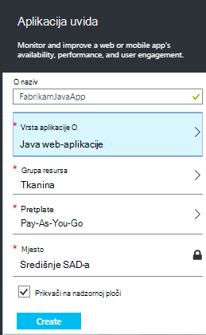
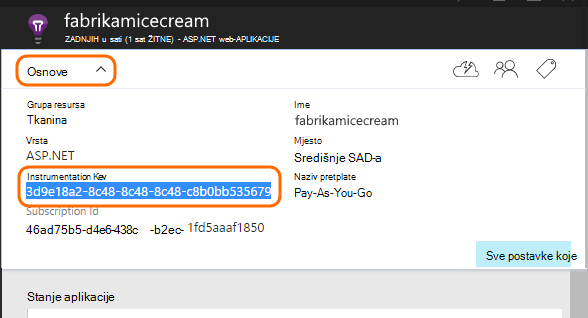

<properties 
    pageTitle="Aplikacija uvida Java web-aplikacijama koje su već live" 
    description="Pokrenite praćenje web-aplikacije koja je već pokrenut na poslužitelju" 
    services="application-insights" 
    documentationCenter="java"
    authors="alancameronwills" 
    manager="douge"/>

<tags 
    ms.service="application-insights" 
    ms.workload="tbd" 
    ms.tgt_pltfrm="ibiza" 
    ms.devlang="na" 
    ms.topic="article" 
    ms.date="08/24/2016" 
    ms.author="awills"/>
 
# Aplikacija uvida Java web-aplikacijama koje su već live

*Aplikacija uvida je u pretpregledu.*

Ako imate web-aplikacije koja je već pokrenut na poslužitelju J2EE, možete pokrenuti nadzor s [Računala uvida](app-insights-overview.md) bez potrebe za promjene kod ili prevoditi projekta. Uz tu se mogućnost zatražite informacije o HTTP zahtjeva poslanih poslužitelj, neobrađenu iznimke i mjerača performansi.

Morat ćete pretplate na [Microsoft Azure](https://azure.com).

> [AZURE.NOTE] Postupak na ovoj stranici dodaje SDK-a na web-aplikaciju prilikom izvođenja. Ovaj instrumentation runtime je korisno ako ne želite obnoviti ili ponovno sastavljanje izvornog koda. No ako je to moguće, preporučujemo vam [Dodavanje SDK za izvorni kod](app-insights-java-get-started.md) umjesto toga. Koje vam više mogućnosti, kao što su pisanja koda za praćenje aktivnosti korisnika.

## 1. ključ do uvida aplikacije instrumentation

1. Prijava na [portal Microsoft Azure](https://portal.azure.com)
2. Stvaranje nove uvide aplikacije resursa

    
3. Postavljanje vrste aplikacija Java web-aplikaciju.

    
4. Pronađite ključ instrumentation novi resurs. Morat ćete uskoro zalijepite ovog ključa u projektu kod.

    

## 2. preuzmite SDK

1. Preuzmite [aplikaciju uvida SDK Java](https://aka.ms/aijavasdk). 
2. Na vašem poslužitelju izdvojiti sadržaj SDK direktorij iz kojeg se učitati binarne datoteke sustava project. Ako koristite Tomcat, taj imenik obično bio u odjeljku`webapps\<your_app_name>\WEB-INF\lib`

## 3. dodavanje aplikacije uvida xml datoteke

Stvaranje ApplicationInsights.xml u mapu u koju ste dodali SDK-a. Stavite u nju sljedeće XML.

Zamijenite tipku instrumentation koju ste dobili na portalu Azure.

    <?xml version="1.0" encoding="utf-8"?>
    <ApplicationInsights xmlns="http://schemas.microsoft.com/ApplicationInsights/2013/Settings" schemaVersion="2014-05-30">

      <!-- The key from the portal: -->

      <InstrumentationKey>** Your instrumentation key **</InstrumentationKey>

      <!-- HTTP request component (not required for bare API) -->

      <TelemetryModules>
        <Add type="com.microsoft.applicationinsights.web.extensibility.modules.WebRequestTrackingTelemetryModule"/>
        <Add type="com.microsoft.applicationinsights.web.extensibility.modules.WebSessionTrackingTelemetryModule"/>
        <Add type="com.microsoft.applicationinsights.web.extensibility.modules.WebUserTrackingTelemetryModule"/>
      </TelemetryModules>

      <!-- Events correlation (not required for bare API) -->
      <!-- These initializers add context data to each event -->

      <TelemetryInitializers>
        <Add   type="com.microsoft.applicationinsights.web.extensibility.initializers.WebOperationIdTelemetryInitializer"/>
        <Add type="com.microsoft.applicationinsights.web.extensibility.initializers.WebOperationNameTelemetryInitializer"/>
        <Add type="com.microsoft.applicationinsights.web.extensibility.initializers.WebSessionTelemetryInitializer"/>
        <Add type="com.microsoft.applicationinsights.web.extensibility.initializers.WebUserTelemetryInitializer"/>
        <Add type="com.microsoft.applicationinsights.web.extensibility.initializers.WebUserAgentTelemetryInitializer"/>

      </TelemetryInitializers>
    </ApplicationInsights>

* Tipku instrumentation je poslan i sve stavke telemetrijskih i govori uvida aplikacije da bi se prikazao u vašem resursa.
* Komponenta HTTP zahtjev nije obavezno. Automatski šalje telemetrijskih o zahtjeva i odgovora vremena na portal.
* Događaji korelacije je dodatak za komponentu HTTP zahtjev. Identifikator dodjeljuje svaki zahtjev primio poslužitelj i dodaje ovaj identifikator kao svojstvo za svaku stavku telemetrijskih kao svojstvo 'Operation.Id'. Omogućuje povezivanje telemetrijskih pridružene svaki zahtjev za postavljanjem filtra u [dijagnostičkih pretraživanju](app-insights-diagnostic-search.md).

## 4. Dodaj u filtar HTTP

Pronađite i otvorite datoteku web.xml u projektu, a spajanje sljedeće isječak koda u odjeljku čvor web-aplikacije koje su konfigurirana filtre aplikacije.

Da biste dobili najčešće točne rezultate, filtar treba mapirati prije sve filtre.

    <filter>
      <filter-name>ApplicationInsightsWebFilter</filter-name>
      <filter-class>
        com.microsoft.applicationinsights.web.internal.WebRequestTrackingFilter
      </filter-class>
    </filter>
    <filter-mapping>
       <filter-name>ApplicationInsightsWebFilter</filter-name>
       <url-pattern>/*</url-pattern>
    </filter-mapping>

## 5. iznimke vatrozida potvrdite

Možda ćete morati [postaviti iznimke slanje odlazne podataka](app-insights-ip-addresses.md).

## 6. ponovno pokrenite aplikaciju za web

## 7. prikaz vaše telemetriju u aplikaciju uvida

Vratite se na vaše aplikacije uvida resursa na [portalu Microsoft Azure](https://portal.azure.com).

Pojavit će se telemetrijskih o HTTP zahtjeva na pregled plohu. (Ako ga ne postoji, pričekajte nekoliko sekundi i zatim kliknite Osvježi.)

 

Klikajte stavke za bilo koji od njih da biste vidjeli detaljnije metriku. 

 

I kada Prikaz svojstava zahtjeva, vidjet ćete događaje telemetrijskih ga kao što su zahtjeve i iznimke pridružene.
 

[Saznajte više o mjernih podataka.](app-insights-metrics-explorer.md)

## Daljnji koraci

* [Dodavanje telemetrijskih web-stranicama](app-insights-web-track-usage.md) prikaza stranice monitora i metriku korisnika.
* [Postavljanje web testira](app-insights-monitor-web-app-availability.md) provjerite je li vaša aplikacija ostaje uživo i odredište.
* [Snimite kašnjenja zapisnika](app-insights-java-trace-logs.md)
* [Pretraživanje događaja i zapisnike](app-insights-diagnostic-search.md) pomaže utvrditi probleme.

 
