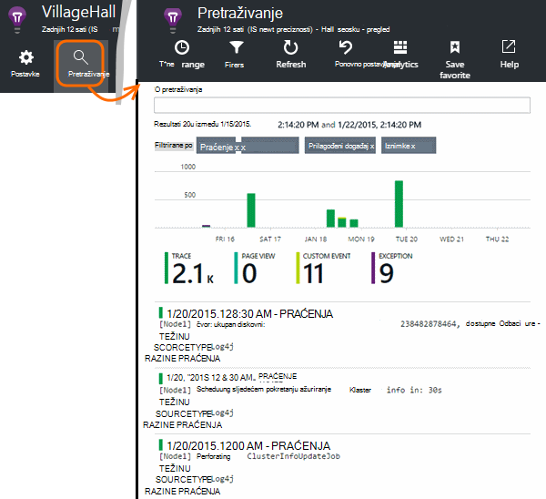

<properties 
    pageTitle="Istražite Java praćenje zapisnika u aplikaciji uvida" 
    description="Pretraživanje Log4J ili Logback kašnjenja u aplikaciji uvida" 
    services="application-insights" 
    documentationCenter="java"
    authors="alancameronwills" 
    manager="douge"/>

<tags 
    ms.service="application-insights" 
    ms.workload="tbd" 
    ms.tgt_pltfrm="ibiza" 
    ms.devlang="na" 
    ms.topic="article" 
    ms.date="07/12/2016" 
    ms.author="awills"/>

# Istražite Java praćenje zapisnika u aplikaciji uvida

Ako koristite Logback ili Log4J (v1.2 ili 2.0) za praćenje, imate vaše zapisnika praćenja automatski slati aplikacije uvida gdje možete istraživati i pretraživati na njima.

Instalacija [Aplikacije uvida SDK Java][java], ako već niste koji.

## Dodavanje biblioteka zapisivanje u projekt

*Odaberite odgovarajući način projekta.*

#### Ako koristite Maven...

Ako projekt već postavili za korištenje Maven za sastavljanje, spojite nešto od sljedećeg isječci koda u datoteci pom.xml.

Zatim osvježite ovisnosti projekta, da biste dobili binarne datoteke preuzeti.

*Logback*

    <dependencies>
       <dependency>
          <groupId>com.microsoft.azure</groupId>
          <artifactId>applicationinsights-logging-logback</artifactId>
          <version>[1.0,)</version>
       </dependency>
    </dependencies>

*Log4J 2.0*

    <dependencies>
       <dependency>
          <groupId>com.microsoft.azure</groupId>
          <artifactId>applicationinsights-logging-log4j2</artifactId>
          <version>[1.0,)</version>
       </dependency>
    </dependencies>

*Log4J v1.2*

    <dependencies>
       <dependency>
          <groupId>com.microsoft.azure</groupId>
          <artifactId>applicationinsights-logging-log4j1_2</artifactId>
          <version>[1.0,)</version>
       </dependency>
    </dependencies>

#### Ako koristite Gradle...

Ako projekt već postavili za korištenje Gradle za sastavljanje, dodati jedan od sljedećih redaka da biste na `dependencies` grupe u datoteci build.gradle:

Zatim osvježite ovisnosti projekta, da biste dobili binarne datoteke preuzeti.

**Logback**

    compile group: 'com.microsoft.azure', name: 'applicationinsights-logging-logback', version: '1.0.+'

**Log4J 2.0**

    compile group: 'com.microsoft.azure', name: 'applicationinsights-logging-log4j2', version: '1.0.+'

**Log4J v1.2**

    compile group: 'com.microsoft.azure', name: 'applicationinsights-logging-log4j1_2', version: '1.0.+'

#### U suprotnom...

Preuzimanje i izdvajanje odgovarajuće appender, a zatim u odgovarajuću biblioteku dodati projekta:

Zapisivaču | Preuzimanje | Biblioteka
----|----|----
Logback|[SDK s Logback appender](https://aka.ms/xt62a4)|applicationinsights zapisivanje logback
Log4J 2.0|[SDK s Log4J v2 appender](https://aka.ms/qypznq)|applicationinsights zapisivanje log4j2 
Log4j v1.2|[SDK s Log4J v1.2 appender](https://aka.ms/ky9cbo)|applicationinsights zapisivanje log4j1_2 

## Dodavanje u appender okvir vašeg zapisivanje

Da biste počeli primati kašnjenja, Spoji odgovarajući isječak koda za konfiguraciju datoteka Log4J ili Logback: 

*Logback*

    <appender name="aiAppender" 
      class="com.microsoft.applicationinsights.logback.ApplicationInsightsAppender">
    </appender>
    <root level="trace">
      <appender-ref ref="aiAppender" />
    </root>

*Log4J 2.0*

    <Configuration packages="com.microsoft.applicationinsights.Log4j">
      <Appenders>
        <ApplicationInsightsAppender name="aiAppender" />
      </Appenders>
      <Loggers>
        <Root level="trace">
          <AppenderRef ref="aiAppender"/>
        </Root>
      </Loggers>
    </Configuration>

*Log4J v1.2*

    <appender name="aiAppender" 
         class="com.microsoft.applicationinsights.log4j.v1_2.ApplicationInsightsAppender">
    </appender>
    <root>
      <priority value ="trace" />
      <appender-ref ref="aiAppender" />
    </root>

Appenders uvida aplikaciju možete se pozivati sve konfigurirani zapisivaču i ne moraju nužno biti zapisivaču korijenski (kao što je prikazano gore primjere koda).

## Istražite vaše kašnjenja na portalu uvida aplikacije

Sad kad ste konfigurirali projekta da biste poslali kašnjenja do uvida aplikacije, možete pogledati i pretraživanje te kašnjenja u portal za aplikacije uvida u okvir [pretraživanje] [ diagnostic] plohu.

## Daljnji koraci

[Dijagnostičke pretraživanja][diagnostic]

<!--Link references-->

[diagnostic]: app-insights-diagnostic-search.md
[java]: app-insights-java-get-started.md

 
