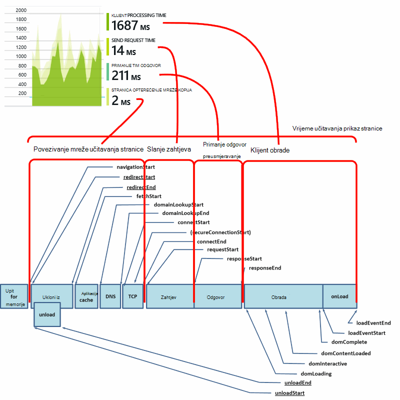

<properties
    pageTitle="Uvid u aplikaciji za JavaScript web-aplikacije | Microsoft Azure"
    description="Početak stranice prikaza i sesiju broji, podataka iz alata web klijent, i praćenje uzoraka korištenja. Na web-stranicama JavaScript otkriva iznimke i probleme s performansama."
    services="application-insights"
    documentationCenter=""
    authors="alancameronwills"
    manager="douge"/>

<tags
    ms.service="application-insights"
    ms.workload="tbd"
    ms.tgt_pltfrm="ibiza"
    ms.devlang="na"
    ms.topic="get-started-article"
    ms.date="08/15/2016"
    ms.author="awills"/>

# Uvid u aplikaciju za web-stranice

[AZURE.INCLUDE [app-insights-selector-get-started-dotnet](../../includes/app-insights-selector-get-started-dotnet.md)]

Saznajte više o performansama i korištenje web-stranicu ili aplikacije. Ako dodate uvida aplikacije za Visual Studio skriptu stranice, prikazat će se tempiranja opterećenje stranice i AJAX pozive, broji i detalje o pregledniku iznimke i pogrešaka AJAX-a, kao i korisnicima te broji sesiju. Sve to se može segmentirajući stranice, klijent OS i verziju preglednika, mjesto zemlj i druge dimenzije. Možete i postavljanje upozorenja na pogreške broji ili usporiti učitavanje stranice.

Koristite uvide aplikacije s bilo kojeg web-stranicama – jednostavno dodajte kratke JavaScript. Ako je web-servisa [Java](app-insights-java-get-started.md) ili [ASP.NET](app-insights-asp-net.md), možete integrirati telemetrijskih s poslužitelja i klijentima.

Potreban vam je pretplate na [Microsoft Azure](https://azure.com). Ako je vaš tim pretplate za tvrtke ili ustanove, obratite se vlasniku da biste dodali Microsoftova Account. Postoji besplatne cijene sloju tako razvoja i korištenje manjih razmjera neće cijena ništa.

## Postavljanje uvida aplikaciju za web-stranicu

Najprije morate dodati uvida aplikacije na web-stranice? To možda ste učinili. Ako odaberete da biste dodali uvida aplikacije na web-aplikaciju u dijaloškom okviru novi projekt u Visual Studio, zatim je dodana skriptu. U tom slučaju ne morate učiniti više.

U suprotnom, morate dodati isječak koda web-stranice, na sljedeći način.

### Otvorite u aplikaciji uvida resurs

Resurs uvida aplikacije se prikazuje podatke o performansama i korištenje svoju stranicu. 

Prijavite se na [portal za Azure](https://portal.azure.com).

Ako ste već postavili nadzor za strani poslužitelja aplikacije, već imate resursa:

Ako ne postoji, stvorite ga:

*Već pitanja?* [Dodatne informacije o stvaranju resurs](app-insights-create-new-resource.md).

### Dodajte skriptu SDK aplikacijama ili web-stranice

U brzi početak rada se skripta za web-stranice:

Neposredno prije Umetanje skripte na `</head>` oznaka svake stranice koje želite pratiti. Ako je web-mjesta na osnovnu stranicu, skriptu možete staviti postoji. Ako, na primjer:

* U projektu programa ASP.NET MVC će se staviti u`View\Shared\_Layout.cshtml`
* U web-mjesta sustava SharePoint, na upravljačkoj ploči otvorite [Postavke web-mjesta / osnovnu stranicu](app-insights-sharepoint.md).

Skripta sadrži instrumentation ključ koji usmjerava podatke za vaše aplikacije uvida resursa. 

([Detaljnije objašnjenje u script.](http://apmtips.com/blog/2015/03/18/javascript-snippet-explained/))

*(Ako koristite okvir poznati web-stranicu, potražite prilagodnici uvida aplikaciju. For example, postoji [u modulu AngularJS](http://ngmodules.org/modules/angular-appinsights).)*

## Detaljne konfiguracija

Postoji nekoliko [parametara](https://github.com/Microsoft/ApplicationInsights-JS/blob/master/API-reference.md#config) možete postaviti, iako u većini slučajeva, nećete morati. Ako, na primjer, onemogućivanje i ograničavanje broja Ajax pozive prijavljenih po prikaz stranice (da biste smanjili promet). Možete postaviti i ispravljanje pogrešaka način da bi telemetrijskih premještanje hitro kroz kanal bez se odbacivanja.

Da biste postavili parametara, potražite taj redak u isječak koda i dodati više stavki odvojenih zarezom nakon njega:

    })({
      instrumentationKey: "..."
      // Insert here
    });

[Dostupnih parametara](https://github.com/Microsoft/ApplicationInsights-JS/blob/master/API-reference.md#config) obuhvaćaju sljedeće:

    // Send telemetry immediately without batching.
    // Remember to remove this when no longer required, as it
    // can affect browser performance.
    enableDebug: boolean,

    // Don't log browser exceptions.
    disableExceptionTracking: boolean,

    // Don't log ajax calls.
    disableAjaxTracking: boolean,

    // Limit number of Ajax calls logged, to reduce traffic.
    maxAjaxCallsPerView: 10, // default is 500

    // Time page load up to execution of first trackPageView().
    overridePageViewDuration: boolean,

    // Set these dynamically for an authenticated user.
    appUserId: string,
    accountId: string,

## Pokretanje aplikacije

Pokrenite web-aplikaciju programa, a zatim ga koristiti neko vrijeme da biste generirali telemetrijskih pa pričekajte nekoliko sekundi. Možete pokrenuti pomoću tipku **F5** na vašem računalu razvoj ili ga objavite i korisnicima koji se reproducirati s njim.

Ako želite provjeriti telemetrijskih koje šalje web-aplikacijama aplikacije uvid u koristiti alate preglednika za ispravljanje pogrešaka (**F12** u preglednicima). Slanje podataka dc.services.visualstudio.com.

## Istraživanje podataka o performansama preglednika

Otvorite plohu preglednici za prikaz podataka o performansama Zbrojeno iz preglednika vaših korisnika.

*Još nema podataka? Kliknite * *Osvježavanje* * pri vrhu stranice. I dalje ništa? Potražite u članku [Otklanjanje poteškoća](app-insights-troubleshoot-faq.md).*

Preglednici plohu je [plohu Explorer metriku](app-insights-metrics-explorer.md) s unaprijed filtre i odabire grafikona. Ako želite i spremiti rezultat na popis favorita možete urediti vremenski raspon, filtrima i konfiguracija grafikona. Kliknite **Vrati zadane postavke** da biste se vratili izvorne plohu konfiguracije.

## Performansi učitavanja stranice

Pri vrhu je segmentiranog grafikon vremena učitavanja stranice. Ukupna visina grafikona predstavlja Prosječno vrijeme za učitavanje i prikaz stranice iz aplikacije u preglednicima vaših korisnika. Vrijeme mjeri se od kada preglednik šalje početne HTTP zahtjev dok sve sinkrono učitavanja događaja nakon obrade, uključujući izgled i izvođenje skripti. To ne obuhvaća asinkronog zadatke kao što su učitavanje web-dijelova iz pozive AJAX-a.

Grafikon segments vrijeme učitavanja Ukupno stranica u [standardni tempiranja definira W3C](http://www.w3.org/TR/navigation-timing/#processing-model). 

Imajte na umu da vrijeme *mrežno povezivanje* često niže nego što možete očekivati jer je prosjek putem sve zahtjeve iz preglednika na poslužitelj. Mnoge pojedinačne zahtjeve imati vrijeme povezivanje 0 jer već postoji aktivnu vezu s poslužiteljem.

### Usporiti učitavanje?

Opterećenje sporo stranice su glavne izvor nezadovoljstva za korisnike. Ako grafikon prikazuje opterećenje sporo stranice, jednostavno je učiniti neke dijagnostičkih Istraživanje.

Grafikon prikazuje prosjek opterećenje sve stranice u svojoj aplikaciji. Da biste vidjeli ako se problem ograničeni na određene stranice, pogledajte daljnje dolje plohu, gdje je s rešetkom segmentirajući po URL stranice:

Obratite pozornost na broj prikaz stranica i standardnu devijaciju. Ako je broj stranica nisku, zatim problem ne utječe na korisnici mnogo. Visoke standardnom devijacijom (usporediti s prosjek same) pokazuje mnogo varijacije između pojedinačnih mjere.

**Povećavanje jedan URL i prikazu za jednu stranicu.** Kliknite naziv neke stranice da biste vidjeli plohu preglednika grafikona filtrirano samo na taj URL; a zatim na instance komponente prikaz stranice.

Kliknite `...` cijeli popis svojstava za taj događaj ili provjera pozive AJAX-a i povezane događaja. Ako su sinkrono sporo pozive AJAX-a utjecati na Ukupno vrijeme učitavanja stranice. Srodni događaje obuhvaćaju zahtjeve poslužitelja za istim URL-om (Ako ste postavili uvida aplikacije na web-poslužitelju).

**Performanse stranice tijekom vremena.** Natrag na plohu preglednici pretvorite stranice prikaz učitavanja vremenske rešetke u linijskom grafikonu da biste vidjeli ako nema peaks u određenom trenutku:

**Fazi tako da druge dimenzije.** Možda su vaše stranice sporije učitati na određeni preglednik, klijent OS ili kraj korisnika? Dodajte novi grafikon i Eksperimentirajte s dimenzije **Grupiraj po** .

## Performanse AJAX-a

Provjerite jesu li sve pozive AJAX-a na web-stranicama izvršavate i. Često se koristi za popunjavanje dijelove stranice asinkrono. Iako stranici Cjelokupan možda za učitavanje nas korisnika nije se frustrated po staring na prazno web-dijelova, Čeka se da se prikazuju u njima.

AJAX pozive iz web-stranice na prikazane su plohu preglednici kao ovisnosti.

Postoje sažetak grafikona u gornjem dijelu na plohu:

i detaljne rešetke u donjem dolje:

Kliknite bilo koji redak konkretnih detalja.

> [AZURE.NOTE] Ako izbrišete preglednici filtra na na plohu, poslužitelj i ovisnosti AJAX-a nalaze se u tim grafikonima. Kliknite Vrati zadano da ponovno konfigurira filtar.

**Da biste dubinski analizirati nije uspjelo Ajax pozive** pomaknite se do pogreške rešetki ovisnost, a zatim retka da biste vidjeli određene instance.

Kliknite `...` za cijeli telemetrijskih tijekom poziva AJAX-a.

### Nema prijavljenih pozive AJAX-a?

Pozivi AJAX-a obuhvaćaju sve HTTP pozive iz skripte web-stranicu. Ako ne vidite ih prijavljena, provjerite ne koda postavljeno na `disableAjaxTracking` ili `maxAjaxCallsPerView` [parametara](https://github.com/Microsoft/ApplicationInsights-JS/blob/master/API-reference.md#config).

## Iznimke u pregledniku

Na plohu preglednici postoji sažetak grafikona programa iznimke i rešetka vrsta iznimke dodatno prema dolje na plohu.

Ako ne vidite preglednika iznimke prijavljena, provjerite ne koda postavljeno na `disableExceptionTracking` [parametar](https://github.com/Microsoft/ApplicationInsights-JS/blob/master/API-reference.md#config).

## Provjera pojedinačne stranice prikaz događaja

Obično telemetrijskih prikaz stranice je analizirati prema uvida aplikacije i vidjeti samo kumulativne izvješća, odrediti prosjek nad svim korisnicima. No za ispravljanje pogrešaka svrhe, možete i pogledati događaji prikaza za pojedinačne stranice.

U plohu dijagnostičkih pretraživanje postavite filtre na prikaz stranice.

Odaberite bilo koji događaj da biste vidjeli dodatne detalje. Na stranici Detalji kliknite "..." da biste vidjeli još više detalja.

> [AZURE.NOTE] Ako koristite [pretraživanja](app-insights-diagnostic-search.md), primijetit ćete morati odgovaraju čitave riječi: "Abou" i "o" ne podudaraju "O".

Napredne [analize jezika za upite](app-insights-analytics-tour.md) možete koristiti i da biste pronašli prikaza stranice.

### Prikaz svojstava stranice

* **Trajanje prikaz stranice** 

 * Prema zadanim postavkama, na vrijeme potrebno za učitavanje stranice iz klijenta zatražiti cijelog učitavanja (uključujući pomoćnih datoteka, ali bez asinkronog zadatke kao što su poziva AJAX-a). 
 * Ako ste postavili `overridePageViewDuration` u [konfiguraciji stranice](#detailed-configuration)interval između klijent zahtjev za izvršavanje prvi `trackPageView`. Ako ste premjestili trackPageView na svoj položaj u uobičajeni nakon inicijalizaciju skriptu, ona odražavaju neku drugu vrijednost.
 * Ako `overridePageViewDuration` je skup i trajanje argument omogućena u na `trackPageView()` poziv, a zatim vrijednost argumenta koristit će se. 

## Broji prilagođene stranice

Prema zadanim postavkama, broj stranica pojavljuje prilikom svakog učitava nove stranice u pregledniku klijent.  No možda ćete morati Brojanje prikaza dodatne stranice. Na primjer, na stranicu u karticama mogu prikazati sadržaj i želite brojati stranice kada korisnik prebacuje kartice. Ili JavaScript koda na stranici možda učitati novi sadržaj bez promjene URL web-preglednika.

Na odgovarajuće mjesto u kodu klijent umetnite poziv JavaScript ovako:

    appInsights.trackPageView(myPageName);

Naziv stranice može sadržavati iste znakove kao URL, ali bilo što nakon "#" ili "?" se zanemaruje.

## Korištenje praćenja

Želite saznati što vaši korisnici raditi s aplikacijom?

* [Dodatne informacije o korištenju praćenja](app-insights-web-track-usage.md)
* [Informirajte se o prilagođene događaje i metriku API-JA](app-insights-api-custom-events-metrics.md).

#### Videozapis: Korištenje za praćenje

> [AZURE.VIDEO tracking-usage-with-application-insights]

## Daljnji koraci

* [Praćenje korištenja](app-insights-web-track-usage.md)
* [Prilagođene događaje i metrike](app-insights-api-custom-events-metrics.md)
* [Sastavljanje-mjere – Saznajte](app-insights-overview-usage.md)

