<properties 
    pageTitle="Istraživanje metriku u aplikaciji uvida | Microsoft Azure" 
    description="Tumačenje grafikona na metrike explorer, a kako prilagoditi blades metričkim explorer." 
    services="application-insights" 
    documentationCenter=""
    authors="alancameronwills" 
    manager="douge"/>

<tags 
    ms.service="application-insights" 
    ms.workload="tbd" 
    ms.tgt_pltfrm="ibiza" 
    ms.devlang="na" 
    ms.topic="article" 
    ms.date="10/15/2016" 
    ms.author="awills"/>
 
# Istraživanje mjernih podataka u aplikaciji uvida

Metriku u [Aplikaciji uvida] [ start] mjerni vrijednosti i brojanja događaja koji su poslani u telemetrijskih iz aplikacije. Oni pomažu otkrije probleme s performansama i gledanje trendova u kako se koristi aplikacija. Postoji širok raspon standardne metriku, a možete i stvoriti vlastiti prilagođeni metriku i događaje.

Zbrojevi mjernih podataka i događaja prikazuju se u grafikonima zbroja vrijednosti, primjerice zbrojeve, prosjeke ili broji.

Slijedi primjer grafikona:

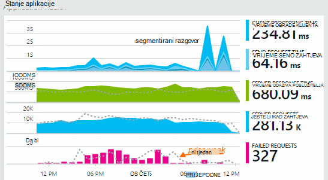

Neki grafikoni su segmentirajući: zbroj mjernih podataka prikazuju je ukupna visina grafikona u bilo kojem trenutku. Legenda po zadanom prikazuje najveću količine.

Točkaste crte pokazuju vrijednost mjerenja prethodno jedan tjedan.

## Vremenskog raspona

Možete promijeniti vremenski raspon prekriveni grafikona ili rešetki na bilo kojem plohu.

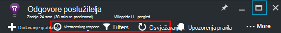

Ako se očekuje da se neki podaci koje još nije pojavila, kliknite Osvježi. Grafikoni osvježavanje same u vremenskim razmacima, ali su intervale za veće vremenski raspon. U načinu izdanje može potrajati neko vrijeme da se podaci primitak kanali analizu na grafikonu.

Da biste povećali u dio grafikona, povucite preko njega:

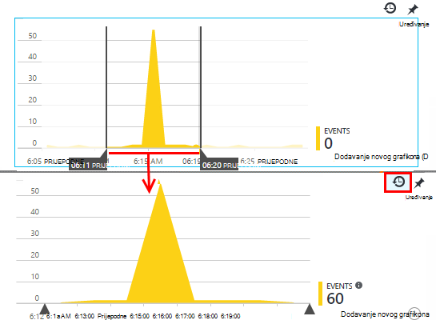

Kliknite gumb Poništi zumiranje da biste ih vratili.

## Preciznosti i zareza vrijednosti

Zadržite pokazivač miša iznad grafikona za prikaz vrijednosti metriku u tom trenutku.

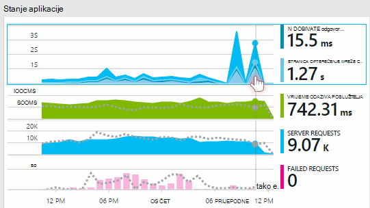

Vrijednost metriku na određenom mjestu se pridružuje u intervalu prethodni uzorkovanje. 

Interval za stvaranje uzoraka ili "granularnosti" prikazuje se pri vrhu na plohu. 

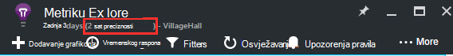

Možete prilagoditi granularnosti u rasponu plohu vremena:

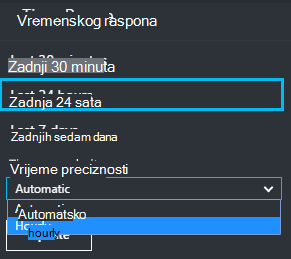

Dostupni granularnosti ovise o vremenski raspon koji ste odabrali. Eksplicitno granularnosti su alternativa "automatski" preciznosti za vremenski raspon. 

## Explorer mjerenja

Klikajte stavke za bilo koji od njih na plohu pregled da biste vidjeli detaljnije skup povezani grafikoni i rešetke. Možete urediti te grafikone i rešetke usredotočili na detalje koji vas zanima.

Ili možete jednostavno kliknite gumb metriku Explorer u zaglavlje plohu pregled.

Na primjer, kliknite putem web-aplikaciji zahtjeva nije uspjelo grafikona:

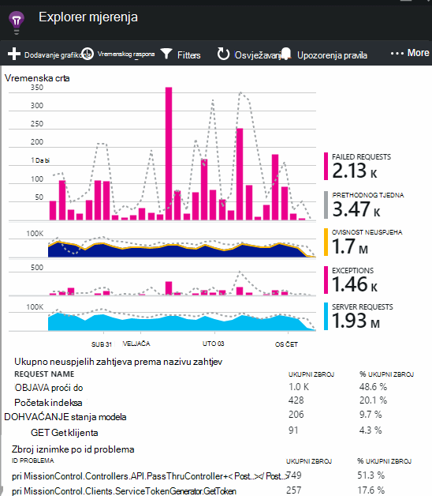

## Što znače brojke?

Legendu na strani prema zadanim postavkama obično prikazuje vrijednost zbroja tijekom razdoblja grafikona. Ako zadržite pokazivač na grafikonu, prikazuje vrijednost u tom trenutku.

Svaka točka podataka na grafikonu je zbroj vrijednosti podataka primljene u prethodnom intervala uzorkovanja ili "preciznosti". U preciznosti se prikazuje pri vrhu na plohu i ovisi o cjelokupan Vremensko mjerilo grafikona.

Metriku možete zbrojiti na različite načine: 

 * **SUM** zbraja vrijednosti u svim točkama podataka primljene putem intervala uzorkovanja ili točka grafikona.
 * **Prosječna** dijeli zbroj broj točaka podataka koji su primili u intervalu.
 * **Jedinstveni** broji se koriste za broji korisnika i računi. U intervalu uzorkovanja ili razdoblju grafikona na slici prikazan broj različiti korisnici vidjeti u tog razdoblja.

Možete promijeniti način zbrajanja:

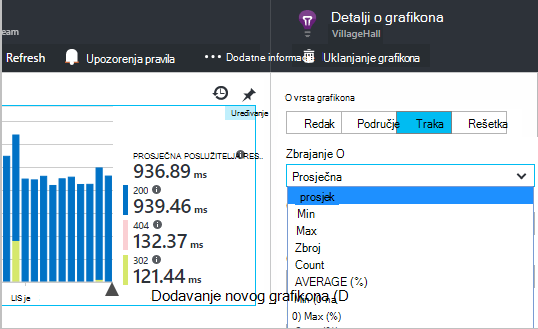

Zadani način za svaki metriku se prikazuje prilikom stvaranja novog grafikona ili kada su odabrana sva mjerenja:

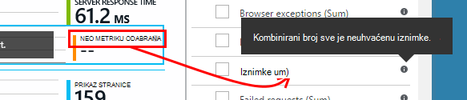

## Uređivanje grafikona i rešetke

Da biste dodali novi grafikon na plohu:

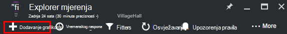

Odaberite **Uređivanje** na postojeći ili novi grafikon da biste uredili što prikazuje:

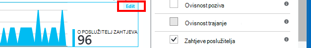

Više od jedne metriku možete prikazati na grafikonu, iako postoje ograničenja o kombinacije koje je moguće prikazati zajedno. Čim odaberete jedan metrika, neke od drugih onemogućene su. 

Ako programiranja [prilagođene metriku] [ track] u aplikaciju (pozivi TrackMetric i TrackEvent) bit će navedeni u nastavku.

## Fazi podataka

Možete razdvojiti metrike tako da svojstvo -, na primjer, da biste usporedili prikaza stranice na klijente s različitim operacijskim sustavima. 

Odaberite grafikonu ili rešetki, prijeđite na grupiranja i odaberite svojstvo Grupiranje prema:

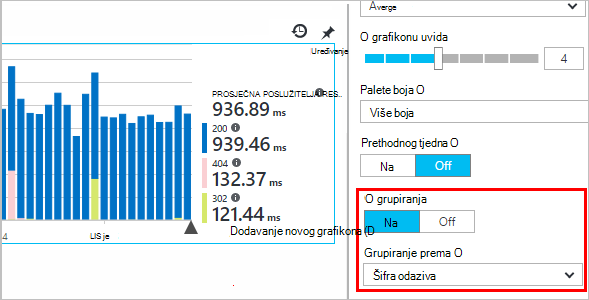

> [AZURE.NOTE] Kada koristite grupiranja, vrste područja i trakastog grafikona omogućuju složeni prikaza. Ovo je odgovarajuću gdje je način zbrajanja Sum. No pri čemu je vrsta zbrajanja prosjek, odaberite Prikaži vrste crte ili rešetku. 

Ako programiranja [prilagođene metriku] [ track] u aplikaciju i sadrže vrijednosti nekretnina, bit ćete moći na popisu odaberite svojstvo.

Grafikon je presitan za segmentiranog podatke? Prilagodite njegova visina:

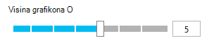

## Filtriranje podataka

Da biste vidjeli samo metriku za odabrani skup vrijednosti svojstva:

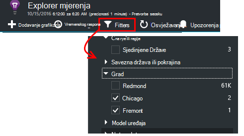

Ako ne odaberete sve vrijednosti za određeno svojstvo je isti kao da ih sve odaberete: nijedan filtar nije na to svojstvo.

Obratite pozornost na to broji događaji uzduž svake vrijednosti svojstva. Kad odaberete vrijednosti jedno svojstvo, prilagođavaju se broji uz druge vrijednosti svojstva.

Filtri primjenjuju se na grafikonima na plohu. Ako želite da drugi primijenjenim različite grafikone, stvaranje i spremanje različitih metriku blades. Ako želite, možete prikvačiti grafikone iz različitih blades na nadzornu ploču tako da ih možete vidjeti duž međusobno povezani.

### Uklanjanje promet probno robot i na webu

Korištenje filtra **realnih ili stilova sintetičkih promet** , a zatim potvrdite **realni**.

Također možete filtrirati prema **izvoru stilova sintetičkih prometa**.

### Da biste dodali svojstva na listu filtara

Želite li da biste filtrirali telemetrijskih na kategoriju vlastite odabiru? Ako, na primjer, možda razdijelili korisnika u različite kategorije, a biste željeli fazi podataka po tih kategorija.

[Stvaranje vlastite svojstva](app-insights-api-custom-events-metrics.md#properties). Postavljanje u [Telemetrijskih Initializer](app-insights-api-custom-events-metrics.md#telemetry-initializers) da bi izgledao u sve telemetrijskih – uključujući standardne telemetrijskih poslao različite SDK module.

## Uređivanje vrste grafikona

Obratite pozornost na to da možete se prebacivati između rešetke i grafikoni:

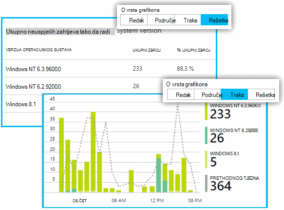

## Spremanje na plohu mjernih podataka

Kada ste stvorili neki grafikoni, spremite ih u favorite. Odaberite želite li omogućiti zajedničko korištenje s drugim članovima tima, ako koristite račun tvrtke ili ustanove.

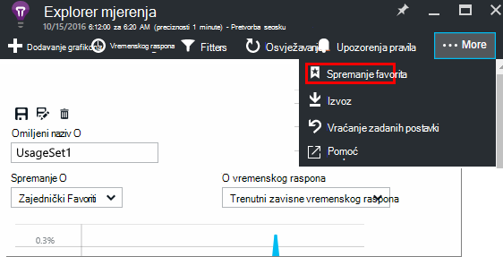

Da biste vidjeli na plohu ponovno, **idite na pregled plohu** i otvaranje favorita:

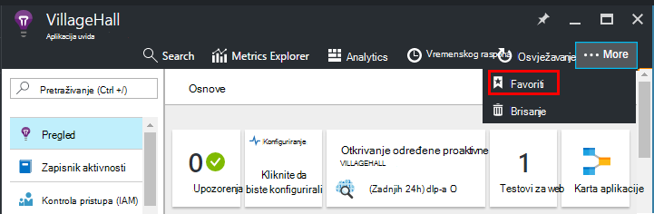

Ako odaberete relativni vremenskog razdoblja koje ste spremili, u plohu će se ažurirati s najnovijim mjernih podataka. Ako ste odabrali apsolutne vremenski raspon, ona će prikazati iste podatke svaki put.

## Ponovno postavljanje na plohu

Ako uređujete u plohu, ali zatim kojima želite da biste se vratili u izvorno stanje spremili skup, samo kliknite Vrati izvorno.

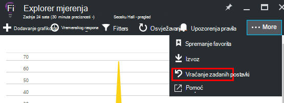

## Aktivno strujanje metriku: izravne metriku Zatvori nadzora

Aktivno strujanje metriku prikazuje vaše aplikacije metriku desno u ovom vrlo trenutku s najbliži stvarnom vremenu Latencija 1 sekunde. Ovo je iznimno je korisna kad ste otpustite novi Sastavi i želite da biste bili sigurni da je sve funkcionira u skladu s očekivanjima ili istražuje incident u stvarnom vremenu.

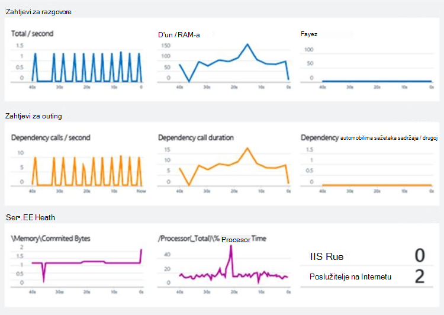

Za razliku od Explorer mjernih podataka uživo metriku toka prikazuje fiksni skup mjernih podataka. Podaci i dalje pojavljuje samo za dok god je na grafikonu, a zatim odbacuju. 

Aktivno strujanje metriku dostupan je sa SDK uvida aplikacije ASP.NET, verzije 2.1.0 ili noviji.

## Postavljanje upozorenja

Da biste primili obavijest putem e-pošte neobično vrijednosti sve mjerenja, dodajte upozorenja. Odaberite nešto od sljedećeg da biste poslali e-poštu administratorima računa ili adrese e-pošte određenog.

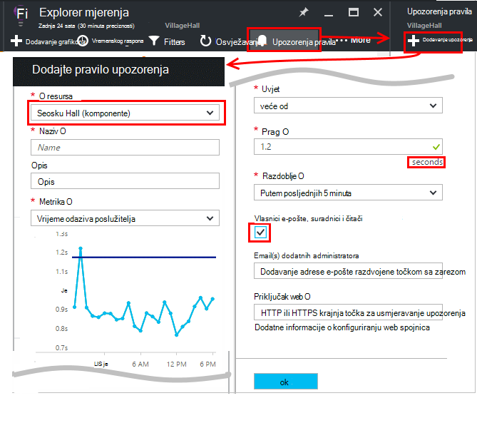

[Dodatne informacije o upozorenjima][alerts].

## Izvoz u Excel

Možete izvesti metričke podatke koji se prikazuje u programu Explorer metriku s datotekom programa Excel. Izvezenih podataka koji sadrži podatke iz sve grafikone i tablice, kao što se vidi na portalu. 

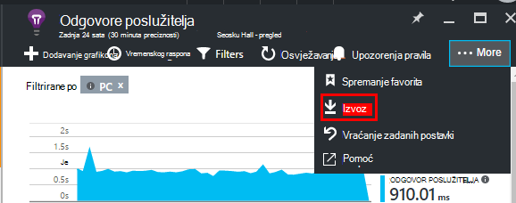

Podatke za svaku grafikon ili tablicu izvozi se na zasebnom listu u datoteci programa Excel.

Što vidite je što će izvesti. Ako želite promijeniti raspon podataka izvezli, promijenite vremenski raspon ili filtre. Za tablice, ako je naredba **Učitavanje više** prikazuje, možete kliknuti ga prije nego što kliknete izvoz, dodatne podatke izvozi.

*Izvoz funkcionira samo za Internet Explorer i Chrome trenutno. Radimo na dodavanje podrška za drugim preglednicima.*

## Neprekinuti izvoza

Ako želite da se podaci neprestano izvezeni tako da se vanjsko postupka, preporučujemo da koristite [Neprekinuto izvoz](app-insights-export-telemetry.md).

### Power BI

Ako želite još bogatiji prikaza podataka, možete [izvesti u Power BI](http://blogs.msdn.com/b/powerbi/archive/2015/11/04/explore-your-application-insights-data-with-power-bi.aspx).

## Analytics

[Analitički](app-insights-analytics.md) je raznovrsniji način da biste analizirali svoje telemetrijskih pomoću naprednih upita jezika. Koristite ako želite kombinirati rezultate iz mjernih podataka za izračun ili izvođenje programa za pretraživanje u deph nedavne performansi za aplikaciju programa. S druge strane, upotrijebite metriku Explorer ako želite da se automatsko osvježavanje grafikona na nadzornoj ploči i upozorenja.

## Otklanjanje poteškoća

*Ne vidite sve podatke na grafikonu.*

* Filtri primjenjuju se na grafikonima na plohu. Provjerite da dok ste naglaskom na jednom grafikonu, niste postavili filtar koji isključuje sve podatke na drugi. 

    Ako želite postaviti drugi filtre na različite grafikone, ih stvorite u različitim blades ih spremiti kao zasebnu Favoriti. Ako želite, možete ih prikvačiti na nadzornu ploču tako da ih možete vidjeti duž međusobno povezani.

* Ako je svojstvo koje je definiran na metriku grupirati grafikon, zatim pojavit će se ništa ne na grafikonu. Pokušajte izbrisati "Grupiraj po" ili odaberite drugi grupiranja svojstvo.
* Podataka o performansama (CPU-a, IO stopa i tako dalje) dostupna je za Java web-servisi Windows aplikacija za stolna računala, [IIS web-aplikacija i servisa ako instalirate Nadzornik stanja](app-insights-monitor-performance-live-website-now.md)te [Servise u Oblaku Azure](app-insights-azure.md). Nije dostupna za Azure web-mjesta.

## Daljnji koraci

* [Nadzor korištenja s računala uvida](app-insights-overview-usage.md)
* [Pomoću dijagnostike pretraživanja](app-insights-diagnostic-search.md)

<!--Link references-->

[alerts]: app-insights-alerts.md
[start]: app-insights-overview.md
[track]: app-insights-api-custom-events-metrics.md

 