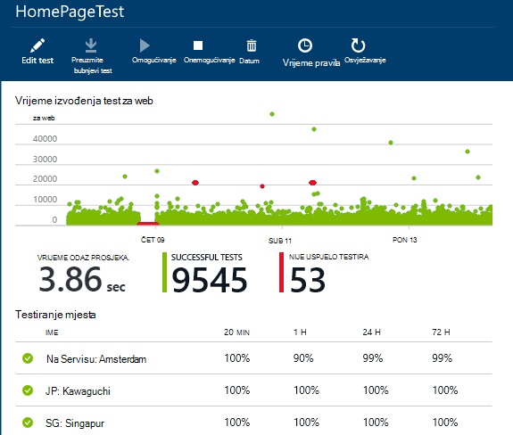
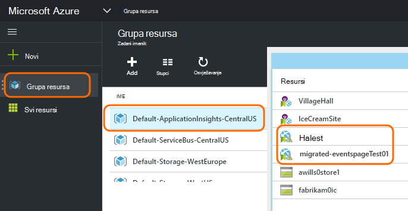
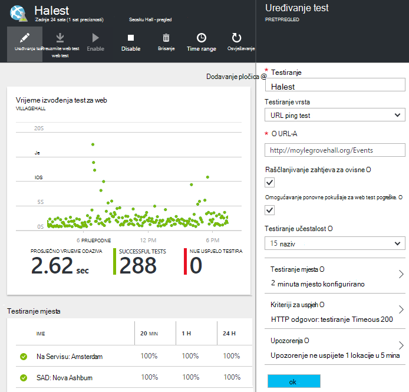

<properties 
    pageTitle="Migriranje Azure krajnje točke u aplikaciju uvida dostupnost testira" 
    description="Migracija klasični Azure krajnjoj točki nadzor testira u aplikaciji uvide dostupnost testira po listopad 31, 2016."
    services="application-insights" 
    documentationCenter=""
    authors="soubhagyadash" 
    manager="douge"/>

<tags 
    ms.service="application-insights" 
    ms.workload="tbd" 
    ms.tgt_pltfrm="ibiza" 
    ms.devlang="na" 
    ms.topic="article" 
    ms.date="07/25/2016" 
    ms.author="awills"/>
 
# Premještanje iz Azure krajnjoj točki nadzora za aplikaciju uvida dostupnost testira

Koristite [Nadzorni krajnja točka](https://blogs.msdn.microsoft.com/mast/2013/03/03/windows-azure-portal-update-configure-web-endpoint-status-monitoring-preview/) za Azure aplikacije? Po *listopad 31, 2016*, ne možemo ćete zamijenite ih nove i jače [testira dostupnost](app-insights-monitor-web-app-availability.md). Već stvorili smo neke novi testove iako ih se onemogućen dok listopad 31, 2016. 

Možete uređivati Novi testova i učiniti parametar sami ako želite. Pronaći ćete ih [Azure portal](https://portal.azure.com) u grupi zadane ApplicationInsights CentralUS resursa.

## Što su dostupnost testira?

Testiranje dostupnosti je značajka servisa Azure koja neprestano provjerava je li se bilo koje web-mjesto ili uslugu i pokretanje slanjem zahtjeva za HTTP (jedan ping testira ili Visual Studio web testira) s do 16 mjesta diljem svijeta. 

[Klasični Azure portal](https://manage.windowsazure.com)te testira su naziva nadzor krajnjoj točki. Više nisu ograničeni u opsegu. Novi testova dostupnost su znatno poboljšati:

* Do 10 testira web Visual Studio ili ping testira po aplikacije uvida resursa. 
* Do 16 mjesta diljem svijeta slanje zahtjeva za testiranje na web-aplikaciju. Veću kontrolu kriterija za uspjeh test. 
* Testirajte bilo koje web-mjesto ili uslugu - ne samo Azure web-aplikacije.
* Testiranje ponovne pokušaje: smanjivanje false pozitivnog upozorenja zbog problema s tranzitne mreže. 
* Webhooks možete primati obavijesti putem HTTP POST za upozorenja.

Dodatne informacije o [dostupnosti testira ovdje](app-insights-monitor-web-app-availability.md).

Dostupnost testira su dio [Uvida aplikacije za Visual Studio](app-insights-overview.md), koji se na servis extensible analytics za sve web-aplikaciju.

## Zato što se dogodilo s Moje krajnje točke testira?

* Ne možemo ste kopirali na krajnjoj točki nadzor testovi nove aplikacije uvida dostupnost testova.
* Novi testova dostupnost trenutno su onemogućene, a stari testova krajnjoj točki i dalje koristite.
* *Ne* migrira s upozorenjem pravila. Novi testova prethodno postavljene pomoću zadanog pravila:
 * Okidača kada više od 1 mjesto izvješća pogrešaka u pet minuta.
 * Šalje e-pošte administratorima pretplate.

[Portal za Azure](https://portal.azure.com)migriranim testova možete pronaći i u grupi resursa "Zadani-ApplicationInsights-CentralUS". Testiranje imena su mjestu "Migrated-". 

## Što je potrebno učiniti?

* Ako mi je došlo do Propušteni migracije testiranja, novi testova dostupnost su [lako postavljanje](app-insights-monitor-web-app-availability.md).

### Mogućnost Nemoj A: ništa. Ostavite nam.

**Na listopad 31, 2016,** provest će se:

* Onemogućivanje stare testova krajnjoj točki.
* Omogućivanje migriranim testova dostupnost.

### Mogućnost B: vam upravljanje i/ili omogućivanje Novi testova.

* Pregledajte i uredite Novi testova dostupnost na novom [Azure portal](https://portal.azure.com). 
 * Pregledajte kriterij okidača
 * Pregled e-pošte primatelja
* Omogućivanje Novi testova
* Pogreške, onemogućit ćemo naslijeđene krajnjoj točki nadzor testove listopad 31, 2016 

### Mogućnost C: izborno izgleda

Ako ne želite koristiti testira dostupnost, možete ih izbrisati [Azure](https://portal.azure.com)portalu. Postoji veza za otkazivanje pretplate na dnu obavijesti e-pošte.

Ne možemo izbrisat će se i dalje stare testova krajnje točke na listopad 31, 2016. 

## Kako uređivati Novi testova?

Prijava na [portal za Azure](https://portal.azure.com) i pronaći web testova "Migrated-": 

Uređivanje i/ili omogućivanje test:

## Zašto se to događa?

Servis za bolje. Stari krajnje točke servisa je mnogo uži. Nije moguće navođenje samo dva URL-ova za jednostavne ping testira s 3 zemlj mjesta na Azure VM ili web-aplikacije. Novi testova jer se može pokrenuti testira web više koraka iz najviše 16 mjesta, a možete odrediti do 10 testira jednu aplikaciju. Možete testirati i sve URL - ga ne mora biti Azure web-mjesta.

Novi testova konfigurirane zasebno iz web-aplikacijama ili VM koje ste testiranja. 

Ne možemo su migracije testova da biste bili sigurni da nastavite kontrole nad ih tijekom korištenja na novom portalu. 

## Što je aplikacija uvida?

Novi testova dostupnost su dio [Uvida aplikacije za Visual Studio](app-insights-overview.md). Ovdje se nalazi [videozapis 2 minutu](http://go.microsoft.com/fwlink/?LinkID=733921).

## Koristim li plaćanja za nove testova?

Migriranim testova postavljaju u do uvida aplikacije resursa u zadani besplatne plan. Time se omogućuje zbirke do 5 milijuna točaka podataka. Koji se jednostavno pokriva glasnoće podataka trenutno će koristiti testiranja. 

Naravno, ako kao što su uvida aplikacije i stvoriti dodatne testira dostupnost ili prihvaćaju više njene performanse i dijagnostičkih značajke, pa ćete generirati više točaka podataka.  Međutim, rezultat će samo biti što može kliknete kvote za besplatne plan. Račun neće primiti osim ako se odlučite za tu mogućnost za standardni prikaz ili Premium tarife. 

[Dodatne informacije o aplikaciji uvida cijene i nadzor kvote](app-insights-pricing.md). 

## Što je i nije migrirati?

Zadržava iz stare testiranja krajnja točka:

* Krajnja točka URL želite testirati.
* Zemlj mjesta iz koje se šalju zahtjeve.
* Testiranje učestalost ostaje pet minuta.
* Testirajte ostaje vremensko ograničenje od 30 sekundi. 

Ne migrira:

* Upozorenja okidača pravilo. Pravilo ne možemo postaviti okidača kada 1 mjesto izvješća pogrešaka u pet minuta.
* Upozorenja primatelja. Obavijesti e-pošte poslat će se pretplata vlasnicima i zajednički vlasnicima. 

## Kako pronaći novog testova?

Možete uređivati svaki novi testova sada ako želite. Prijava na [portal za Azure](https://portal.azure.com), otvorite **Grupa resursa** i odaberite **Zadani ApplicationInsights CentralUS**. U toj grupi nalaze se novi testova web. [Informirajte se o Novi testova dostupnost](app-insights-monitor-web-app-availability.md).

Primijetite da novi upozorenja e-pošte poslat će se na ovu adresu: aplikacija uvida upozorenja(ai-noreply@microsoft.com)

## Što se događa ako se ništa ne učinite?

Primijenit će se mogućnost odgovora. Radimo će omogućiti migriranim testova i postavite zadana upozorenja pravila kao prethodno navedenim. Morat ćete dodati sve prilagođene upozorenja pravila, primatelji kao što je rečeno iznad. Pogreške, onemogućit ćemo naslijeđene krajnjoj točki testovi za nadzor. 

## Gdje Slanje povratnih informacija o tome? 

Cijenimo vaše povratne informacije. Imajte [nam e-pošte](mailto:vsai@microsoft.com). 

