<properties
    pageTitle="Dijagnosticiranje probleme s performansama na pokrenuti IIS web-mjestu | Microsoft Azure"
    description="Praćenje performansi web-mjesto bez ponovno implementacija. Korištenje samostalne ili SDK uvida aplikacije da biste dobili telemetrijskih ovisnosti."
    services="application-insights"
    documentationCenter=".net"
    authors="alancameronwills"
    manager="douge"/>

<tags
    ms.service="application-insights"
    ms.workload="tbd"
    ms.tgt_pltfrm="ibiza"
    ms.devlang="na"
    ms.topic="get-started-article"
    ms.date="10/24/2016"
    ms.author="awills"/>

# Instrument web-aplikacije sa aplikacije uvida prilikom izvođenja

*Aplikacija uvida je u pretpregledu.*

Možete instrumenata uživo web app s Visual Studio uvida aplikacije, bez potrebe za izmjenu ili ponovno implementirate kod. U aplikacijama nalaze se putem lokalnog poslužitelja IIS instalirate Nadzornik stanja; ili ako ste Azure web-aplikacijama ili pokrenuti u programa Azure VM, možete instalirati proširenje uvida aplikacije. (Postoje i zasebne članci o instrumenting [live J2EE web-aplikacije](app-insights-java-live.md) i [Servise u Oblaku Azure](app-insights-cloudservices.md).)

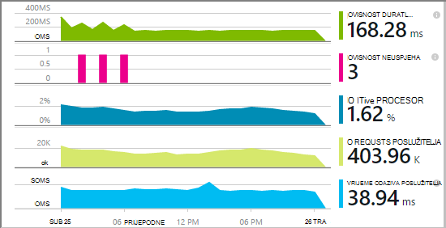

Imate izbor tri usmjerava da biste primijenili uvida aplikacije na web-aplikacija .NET:

* **Sastavljanje vremena:** [Dodavanje aplikacije uvida SDK] [greenbrown] da biste kod web app. 
* **Vrijeme izvođenja:** Instrumenata web aplikacije na poslužitelju, prema uputama u nastavku, bez novog i redeploying kod.
* **Oba:** Sastavljanje SDK u kod web app, a i primijenite proširenja za vrijeme izvođenja. Pronađite najbolje obje mogućnosti. 

Ovo je sažetak se tako da svaki:

||Sastavljanje vremena|Vrijeme izvođenja|
|---|---|---|
|Zahtjevi za & iznimke|Da|Da|
|[Detaljnije iznimke](app-insights-asp-net-exceptions.md)||Da|
|[Ovisnost dijagnostiku](app-insights-asp-net-dependencies.md)|Na .NET 4.6 +|Da|
|[Mjerača performansi sustava](app-insights-performance-counters.md)||IIS ili Azure servis u oblaku, ne Azure web-aplikacije|
|[API za prilagođene telemetrijskih][api]|Da||
|[Integracija zapisnika praćenja](app-insights-asp-net-trace-logs.md)|Da||
|[Stranica & korisnik prikaza podataka](app-insights-javascript.md)|Da||
|Ne morate ponovno stvaranje kod|ne||

## Instrumenata web-aplikaciju programa prilikom izvođenja

Potreban vam je pretplata na [Microsoft Azure](http://azure.com) .

### Ako je aplikacija Azure web aplikaciju ili servis u Oblaku

* Odaberite aplikaciju uvida aplikacije na upravljačkoj ploči Azure. 

    [Dodatne informacije](app-insights-azure.md).

### Ako aplikaciju nalazi se na poslužitelj za IIS

1. Na web-poslužitelju IIS, prijavite se pomoću administratorske vjerodajnice.
2. Preuzmite i pokrenite [Nadzornik stanja installer](http://go.microsoft.com/fwlink/?LinkId=506648).
4. U čarobnjaku za instalaciju, prijavite se u Microsoft Azure.

    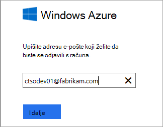

    *Pogreške pri povezivanju? Potražite u članku [Otklanjanje poteškoća](#troubleshooting).*

5. Odaberite instaliranih web-aplikacije ili web-mjesto koje želite nadzirati, a zatim konfiguriranje resursa u kojem želite da biste vidjeli rezultate na portalu uvida aplikacije.

    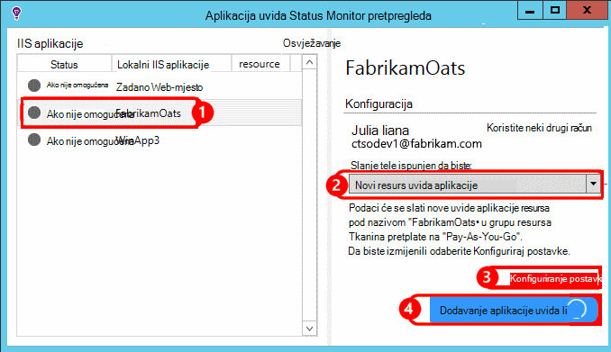

    Normalno, odaberite da biste konfigurirali novi resurs i [grupa resursa][roles].

    U suprotnom koristite postojeći resurs ako ste već postavili [testira web] [ availability] web-mjesta ili [web-klijentu nadzor][client].

6. Ponovno pokrenite IIS.

    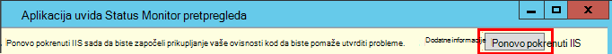

    Za uskoro će biti prekinut web-servisa.

6. Obratite pozornost na to da ApplicationInsights.config umetnut u web-aplikacije koje želite nadzirati.

    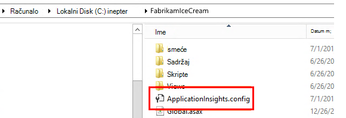

   Postoje i neke promjene u web.config.

#### Želite li (ponovno) konfigurirati kasnije?

Kada dovršite čarobnjak, ponovno možete konfigurirati agenta kad god želite. To možete koristiti i ako ste instalirali agenta, ali nema nekih problema s početnog postavljanja.

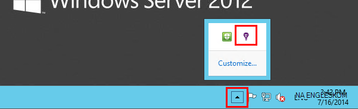

## Prikaz performanse telemetrijskih

Prijavite se na [portal za Azure](https://portal.azure.com), pomaknite uvida aplikaciju i otvorite resurs koji ste stvorili.

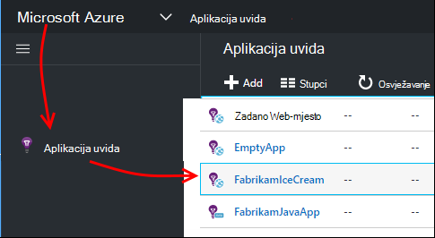

Otvorite plohu performanse da biste vidjeli zahtjev, reakcija, ovisnosti i ostale podatke.

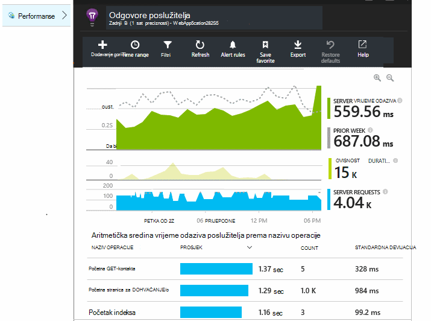

Kliknite bilo koji od njih da biste otvorili detaljnije prikaz.

Možete [Uređivanje, prerasporediti spremanje](app-insights-metrics-explorer.md), i zakvačiti ga grafikona ili cijele plohu na [nadzornoj ploči](app-insights-dashboards.md).

## Zavisnosti

Ovisnost trajanje grafikon prikazuje vrijeme zauzima pozive iz aplikacije programa vanjske komponente kao što je baza podataka, REST API-ji ili blobova platforme Azure.

Da biste fazi grafikona tako da pozive na različitim ovisnosti: uređivanje grafikona, uključite grupiranja i pa grupirajte ovisnost, vrsta ovisnosti ili ovisnost performansi.

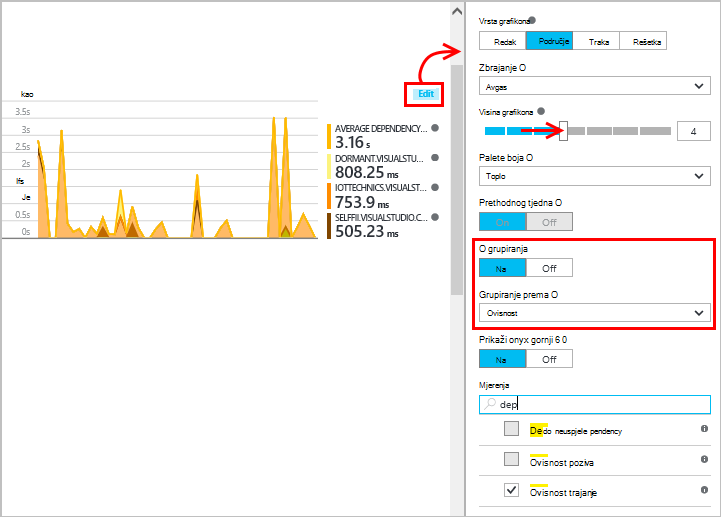

## Mjerača performansi 

(Nije za Azure web-aplikacije.) Kliknite poslužitelje plohu pregled da biste vidjeli grafikoni mjerača performansi poslužitelja kao što su korištenje središnjih procesora occupancy i memorije.

Ako imate više instanci poslužitelja, možda ćete morati uređivanje grafikona da biste grupirali prema uloga instance.

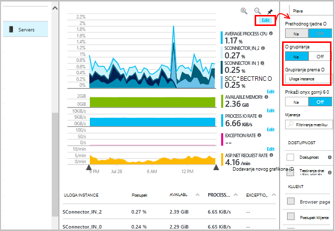

Možete i [promijeniti skup mjerača performansi koje su dojavi SDK-a](app-insights-configuration-with-applicationinsights-config.md#nuget-package-3). 

## Iznimke

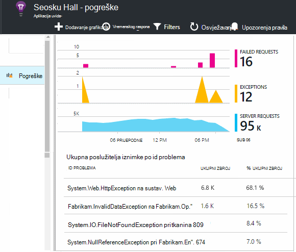

Možete pretraživanje naniže do određenog iznimke (iz zadnjih sedam dana) i stoga kašnjenja i podacima konteksta.

## Stvaranje uzoraka

Ako aplikacija šalje velike količine podataka i koristite uvide SDK aplikacije za ASP.NET verzije 2.0.0-beta3 ili noviji, značajku prilagodljivo uzorkovanje može raditi i pošaljite samo postotka vaše telemetrijskih. [Saznajte više o uzorkovanje.](app-insights-sampling.md)

## Otklanjanje poteškoća

### Pogreške pri povezivanju

Morate otvoriti [neke odlazne priključaka](app-insights-ip-addresses.md#outgoing-ports) u vatrozidu za vaš poslužitelj da biste omogućili Nadzornik stanja za rad.

### Nema telemetrijskih?

  * Da biste generirali neke podatke pomoću web-mjesta.
  * Pričekajte nekoliko minuta da biste omogućili podatke stignu, a zatim kliknite **Osvježi**.
  * Otvorite dijagnostike pretraživanja (pločicu pretraživanja) da biste vidjeli pojedinačna događaja. Događaji često su vidljive u dijagnostičkih pretraživanju prije nego što će se prikazati prikupljanje podataka na grafikonima.
  * Otvorite stanje Monitor, a zatim odaberite aplikacije u lijevom oknu. Provjerite postoje li sve poruke Dijagnostika za ovu aplikaciju u odjeljku "Konfiguriranje obavijesti":

  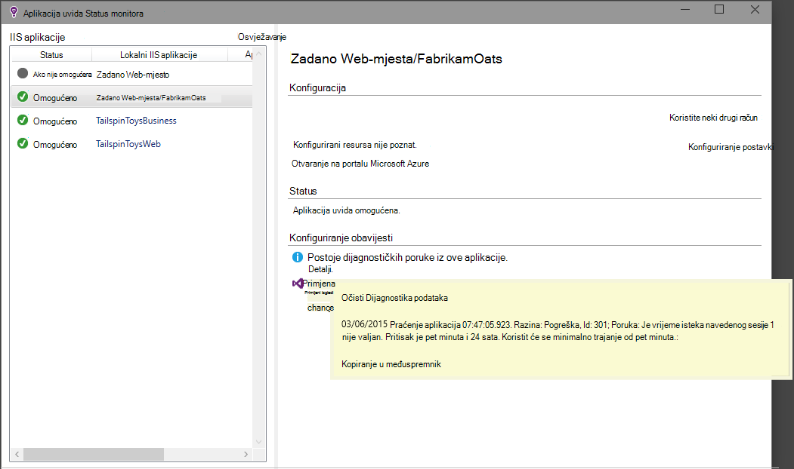

  * Provjerite je li vatrozid server omogućuje odlazni promet za priključke naveden.
  * Na poslužitelju, ako se prikaže poruka o "Nedovoljne dozvole", pokušajte sljedeće:
    * U upravitelju IIS odaberite vaša aplikacija, otvorite **Napredne postavke**, a u odjeljku **Postupak modela** Imajte na umu identitet.
    * Na upravljačkoj ploči računala upravljanje dodajte identiteta grupe korisnika nadzora performansi.
  * Ako imate MMA/SCOM instaliran na vašem poslužitelju, neke verzije može biti u sukobu. Deinstalirajte SCOM i praćenje statusa pa ponovno instalirati najnoviju verziju.
  * Potražite u članku [Otklanjanje poteškoća s][qna].

## Sistemski preduvjeti

OS podrška za aplikacije uvida Status Monitor na poslužitelju:

- Windows Server 2008
- Windows Server 2008 R2
- Windows Server 2012.
- Windows server 2012 R2

s najnovijim SP i .NET Framework 4.0 i 4,5

Na klijentskoj strani Windows 7, 8 i 8.1, ponovno s .NET Framework 4.0 i 4,5

Podrška za IIS: IIS 7 7.5, 8, a zatim 8.5 (IIS nije obavezno)

## Automatizacija sa servisom PowerShell

Možete započeti i prestane nadzirati pomoću komponente PowerShell na IIS poslužitelj.

Najprije uvesti modul uvida aplikacije:

`Import-Module 'C:\Program Files\Microsoft Application Insights\Status Monitor\PowerShell\Microsoft.Diagnostics.Agent.StatusMonitor.PowerShell.dll'`

Saznati provjeravaju koje aplikacije:

`Get-ApplicationInsightsMonitoringStatus [-Name appName]`

* `-Name`(Neobavezno) Naziv web-aplikacijama.
* U ovaj poslužitelj IIS prikazuje uvida aplikaciju nadzor status za svaku web app (ili imenovani aplikaciju).

* Vraća `ApplicationInsightsApplication` za svaku aplikaciju:
 * `SdkState==EnabledAfterDeployment`: Aplikacije prate pa je instrumented prilikom izvođenja alata za praćenje stanja, ili putem `Start-ApplicationInsightsMonitoring`.
 * `SdkState==Disabled`: Aplikaciju ne instrumented za aplikaciju uvide. Nikad ne instrumented ili izvođenju nadzor je onemogućen pomoću alata za praćenje stanja i s `Stop-ApplicationInsightsMonitoring`.
 * `SdkState==EnabledByCodeInstrumentation`: Aplikaciju je instrumented dodavanjem SDK izvornog koda. Njegov SDK ne može ažurirati ili prekinuli.
 * `SdkVersion`prikazuje verziju koristi za nadzor aplikacija.
 * `LatestAvailableSdkVersion`prikazuje trenutno dostupno verziju u galeriji NuGet. Da biste nadogradili aplikaciju na ovu verziju, koristite `Update-ApplicationInsightsMonitoring`.

`Start-ApplicationInsightsMonitoring -Name appName -InstrumentationKey 00000000-000-000-000-0000000`

* `-Name`Naziv aplikacije u IIS-u
* `-InstrumentationKey`Ikey resursa aplikacije uvida mjesto na koje želite da se prikazuje rezultate.

* Ovaj cmdlet utječe samo na aplikacijama koje su nije već instrumented – odnosno SdkState == NotInstrumented.

    Cmdlet ne utječe na aplikaciju koja je već instrumented, trenutku Sastavi dodavanjem SDK kod ili vrijeme izvođenja prethodne pomoću ovaj cmdlet.

    Verzija SDK koji se koristi za instrumenata aplikaciju je verzija koje ste nedavno preuzeli ovaj poslužitelj.

    Da biste preuzeli najnoviju verziju, koristite ažuriranje ApplicationInsightsVersion.

* Vraća `ApplicationInsightsApplication` na uspjehu. Ako ga ne uspije, bilježi za praćenje na stderr.

    
          Name                      : Default Web Site/WebApp1
          InstrumentationKey        : 00000000-0000-0000-0000-000000000000
          ProfilerState             : ApplicationInsights
          SdkState                  : EnabledAfterDeployment
          SdkVersion                : 1.2.1
          LatestAvailableSdkVersion : 1.2.3

`Stop-ApplicationInsightsMonitoring [-Name appName | -All]`

* `-Name`Naziv aplikacije u IIS-u
* `-All`Nadzor sve aplikacije u IIS poslužitelj za koju se zaustavlja`SdkState==EnabledAfterDeployment`

* Zaustavi navedeni aplikacije za nadzor i uklanja instrumentation. To funkcionira samo za aplikacije koje ste je instrumented pri izvođenju pomoću alata za praćenje stanja ili Start ApplicationInsightsApplication. (`SdkState==EnabledAfterDeployment`)

* Vraća ApplicationInsightsApplication.

`Update-ApplicationInsightsMonitoring -Name appName [-InstrumentationKey "0000000-0000-000-000-0000"`]

* `-Name`: Naziv web-aplikacijama u IIS-u.
* `-InstrumentationKey`(Neobavezno). Ta postavka omogućuje promjena resursa na koju se šalju telemetrijskih aplikacije.
* Ovaj cmdlet:
 * Nadograđuje aplikaciju imenovani verziju SDK nedavno preuzeti na ovo računalo. (Funkcionira samo ako `SdkState==EnabledAfterDeployment`)
 * Ako unesete ključa instrumentation aplikaciju imenovani rekonfigurirati je da biste poslali telemetrijskih resursa s tom ključu. (Funkcionira ako `SdkState != Disabled`)

`Update-ApplicationInsightsVersion`

* Preuzimanje najnovije SDK uvida aplikacije na poslužitelj.

## Daljnji koraci

* [Stvaranje testira web] [ availability] da biste bili sigurni ostaje uživo web-mjesta.
* [Potražite u odjeljku događaji i zapisnika] [ diagnostic] da biste pomaže utvrditi probleme.
* [Dodavanje telemetrijskih klijent web] [ usage] da biste vidjeli iznimke iz kod web-stranice i omogućuju umetanje praćenje pozive.
* [Dodavanje aplikacije uvida SDK kod usluge na web] [ greenbrown] tako da umetnete praćenja i zapisnika poziva u kodu poslužitelja.

<!--Link references-->

[api]: app-insights-api-custom-events-metrics.md
[availability]: app-insights-monitor-web-app-availability.md
[client]: app-insights-javascript.md
[diagnostic]: app-insights-diagnostic-search.md
[greenbrown]: app-insights-asp-net.md
[qna]: app-insights-troubleshoot-faq.md
[roles]: app-insights-resources-roles-access-control.md
[usage]: app-insights-web-track-usage.md
