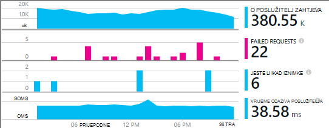
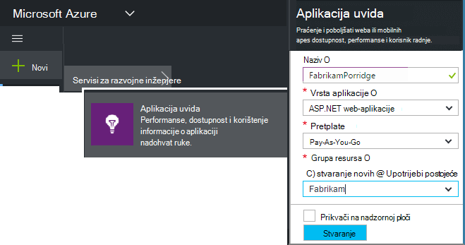
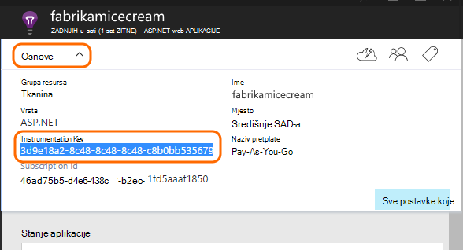
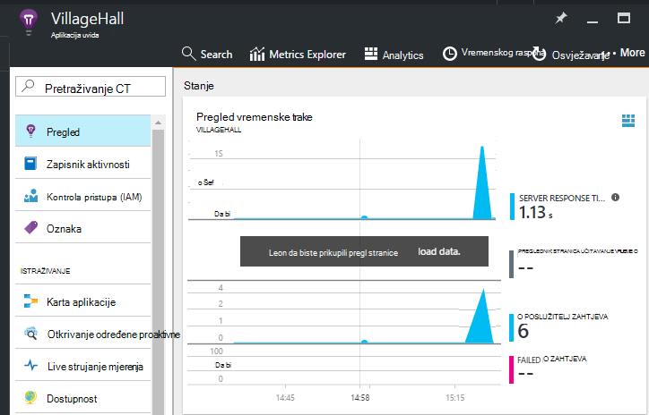

<properties
    pageTitle="Dodavanje aplikacije uvida SDK praćenje aplikacije Node.js | Microsoft Azure"
    description="Analiza korištenje, dostupnost i performanse svog lokalnog ili web-aplikacije Microsoft Azure s uvida aplikacije."
    services="application-insights"
    documentationCenter=""
    authors="alancameronwills"
    manager="douge"/>

<tags
    ms.service="application-insights"
    ms.workload="tbd"
    ms.tgt_pltfrm="ibiza"
    ms.devlang="na"
    ms.topic="get-started-article"
    ms.date="08/30/2016"
    ms.author="awills"/>


# <a name="add-application-insights-sdk-to-monitor-your-nodejs-app"></a>Dodavanje aplikacije uvida SDK praćenje Node.js aplikacije

*Aplikacija uvida je u pretpregledu.*

[Uvid aplikacije za Visual Studio](app-insights-overview.md) nadzire uživo aplikacije da biste lakše [Otkrivanje i dijagnosticiranje probleme s performansama i iznimke](app-insights-detect-triage-diagnose.md)i [ustanovili korištenja aplikacije](app-insights-overview-usage.md). Funkcionira za aplikacije koje se nalaze na vlastitu lokalne poslužitelje IIS ili Azure VMs, kao i Azure web-aplikacije.


SDK omogućuje automatsko skup dolazne stope HTTP zahtjev i odgovore, mjerača performansi (CPU-a, memorije, RPS) i neobrađenu iznimke. Osim toga, možete dodati prilagođene poziva da biste pratili ovisnosti, metriku ili druge događaje.




#### <a name="before-you-start"></a>Prije početka

trebaš:

* Visual Studio 2013 ili noviji. Kasnije je bolje.
* Pretplate na [Microsoft Azure](http://azure.com). Ako vaš tim ili tvrtka ili ustanova ima Azure pretplatu, vlasnik možete dodati ste ga pomoću [Microsoftova računa](http://live.com).

## <a name="add"></a>Stvaranje do uvida aplikacije resursa

Prijava na [portal za Azure][portal], i stvaranje nove uvide aplikacije resursa. [Resurs] [ roles] u Azure je instanca servisa. Ovaj resurs je gdje analizirati i ponuđena telemetrijskih iz aplikacije.



Odaberite ostalo kao vrstu aplikacije. Odabir vrsta aplikacije postavlja zadani sadržaj blades resursa i svojstva vidljive u [Programu Explorer metriku][metrics].

#### <a name="copy-the-instrumentation-key"></a>Kopiranje tipku Instrumentation

Tipku označava resurs pa ćete ga instalirate uskoro u SDK za usmjeravanje podataka resursa.




## <a name="sdk"></a>Instalacija SDK u aplikaciji

```
npm install applicationinsights --save
```

## <a name="usage"></a>Korištenje

To će omogućiti zahtjev za nadzor, neobrađenu iznimku praćenje i nadzor (procesora i memorije/RPS) performanse sustava.

```javascript

var appInsights = require("applicationinsights");
appInsights.setup("<instrumentation_key>").start();
```

Tipku instrumentation moguće je postaviti u varijablu okruženja APPINSIGHTS_INSTRUMENTATIONKEY. Ako to učinite, nije potreban je argument prilikom pozivanja `appInsights.setup()` ili `appInsights.getClient()`.

Možete pokušati SDK bez slanja telemetrijskih: postavljanje ključa instrumentation niza koje nisu prazne.


## <a name="run"></a>Pokrenite projekt

Pokrenite aplikaciju i isprobajte sami: otvaranje različite stranice da biste generirali neke telemetrijskih.


## <a name="monitor"></a>Prikaz vaše telemetrijskih

Vratite se na [portal za Azure](https://portal.azure.com) i pronađite vaše aplikacije uvida resursa.


Pregledajte podatke na stranici pregled. Najprije, samo vidjet ćete jednu ili dvije točke. Ako, na primjer:



Klikajte stavke za bilo koji od njih da biste vidjeli detaljnije mjernih podataka. [Saznajte više o metriku.][perf]

#### <a name="no-data"></a>Nema podataka?

* Korištenje aplikacije, otvaranje druge stranice tako da se generira neke telemetrijskih.
* Otvorite pločicu [pretraživanja](app-insights-diagnostic-search.md) da biste vidjeli pojedinačna događaja. Ponekad je potrebno događaje malo dok je dulje da biste dobili kroz kanal metriku.
* Pričekajte nekoliko sekundi, a zatim kliknite **Osvježi**. Grafikoni osvježavanje same povremeno, ali možete osvježiti ručno ako se čeka nekih podataka koji će se prikazati.
* Potražite u članku [Otklanjanje poteškoća s][qna].

## <a name="publish-your-app"></a>Objavljivanje aplikacije

Sada implementacija aplikacije za IIS ili Azure i gledanje podataka skupiti.


#### <a name="no-data-after-you-publish-to-your-server"></a>Nema podataka nakon što ste objavili na poslužitelju?

Otvorite sljedeće priključke za odlazni promet u vatrozidu za vaš poslužitelj:

+ `dc.services.visualstudio.com:443`
+ `f5.services.visualstudio.com:443`


#### <a name="trouble-on-your-build-server"></a>Imate li problema prilikom na poslužitelj za sastavljanje?

Pogledajte [ove stavke za otklanjanje poteškoća](app-insights-asp-net-troubleshoot-no-data.md#NuGetBuild).


## <a name="customized-usage"></a>Korištenje prilagođene 

### <a name="disabling-auto-collection"></a>Onemogućivanje automatskog zbirke

```javascript
import appInsights = require("applicationinsights");
appInsights.setup("<instrumentation_key>")
    .setAutoCollectRequests(false)
    .setAutoCollectPerformance(false)
    .setAutoCollectExceptions(false)
    // no telemetry will be sent until .start() is called
    .start();
```

### <a name="custom-monitoring"></a>Prilagođeni nadzora

```javascript
import appInsights = require("applicationinsights");
var client = appInsights.getClient();

client.trackEvent("custom event", {customProperty: "custom property value"});
client.trackException(new Error("handled exceptions can be logged with this method"));
client.trackMetric("custom metric", 3);
client.trackTrace("trace message");
```

[Dodatne informacije o telemetrijskih API-JA](app-insights-api-custom-events-metrics.md).

### <a name="using-multiple-instrumentation-keys"></a>Korištenje više tipki instrumentation

```javascript
import appInsights = require("applicationinsights");

// configure auto-collection with one instrumentation key
appInsights.setup("<instrumentation_key>").start();

// get a client for another instrumentation key
var otherClient = appInsights.getClient("<other_instrumentation_key>");
otherClient.trackEvent("custom event");
```

## <a name="examples"></a>Primjeri

### <a name="tracking-dependency"></a>Praćenje ovisnost

```javascript
import appInsights = require("applicationinsights");
var client = appInsights.getClient();

var startTime = Date.now();
// execute dependency call
var endTime = Date.now();

var elapsedTime = endTime - startTime;
var success = true;
client.trackDependency("dependency name", "command name", elapsedTime, success);
```


### <a name="manual-request-tracking-of-all-get-requests"></a>Ručni zahtjev za evidentiranje svih zahtjeva za "DOHVATI"

```javascript
var http = require("http");
var appInsights = require("applicationinsights");
appInsights.setup("<instrumentation_key>")
    .setAutoCollectRequests(false) // disable auto-collection of requests for this example
    .start();

// assign common properties to all telemetry sent from the default client
appInsights.client.commonProperties = {
    environment: process.env.SOME_ENV_VARIABLE
};

// track a system startup event
appInsights.client.trackEvent("server start");

// create server
var port = process.env.port || 1337
var server = http.createServer(function (req, res) {
    // track all "GET" requests
    if(req.method === "GET") {
        appInsights.client.trackRequest(req, res);
    }

    res.writeHead(200, { "Content-Type": "text/plain" });
    res.end("Hello World\n");
}).listen(port);

// track startup time of the server as a custom metric
var start = +new Date;
server.on("listening", () => {
    var end = +new Date;
    var duration = end - start;
    appInsights.client.trackMetric("StartupTime", duration);
});
```

## <a name="next-steps"></a>Daljnji koraci

* [Praćenje vaše telemetrijskih na portalu](app-insights-dashboards.md)
* [Pisanje analize upita putem vaše telemetrijskih](app-insights-analytics-tour.md)


<!--Link references-->

[knowUsers]: app-insights-overview-usage.md
[metrics]: app-insights-metrics-explorer.md
[perf]: app-insights-web-monitor-performance.md
[portal]: http://portal.azure.com/
[qna]: app-insights-troubleshoot-faq.md
[roles]: app-insights-resources-roles-access-control.md
