<properties
    pageTitle="Korištenje analize pomoću aplikacije uvida"
    description="Pregled analitičkih s računala uvida"
    services="application-insights"
    documentationCenter=""
    authors="alancameronwills"
    manager="douge"/>

<tags
    ms.service="application-insights"
    ms.workload="tbd"
    ms.tgt_pltfrm="ibiza"
    ms.devlang="multiple"
    ms.topic="article" 
    ms.date="04/08/2016"
    ms.author="awills"/>

# Korištenje analize pomoću aplikacije uvida

Kada zna načinom korištenja aplikacije omogućuje usredotočite se na scenarije koje su najvažnije im posla razvoj i dobiti uvida u ciljeve koji se mogu pronaći jednostavnije ili teže da biste postigli.

Uvida aplikacije možete omogućuje Očisti prikaz upotrebe vaše aplikacije, što omogućuje da biste poboljšali iskustvo vaših korisnika i zadovoljava vaše poslovne ciljeve.

Aplikacija uvida funkcionira za oba samostalni aplikacije (na iOS, Android i Windows) i web-aplikacijama (hostirane na .NET ili J2EE). 

## Dodavanje aplikacije uvid u projekt

Za početak se pomoću računa s [Microsoft Azure](https://azure.com). (Nakon isteka probnog razdoblja, možete nastaviti s besplatne sloju usluge.)

[Portal za Azure](https://portal.azure.com)stvorite do uvida aplikacije resursa. Evo gdje ćete vidjeti podatke o korištenju i performanse o aplikacije.

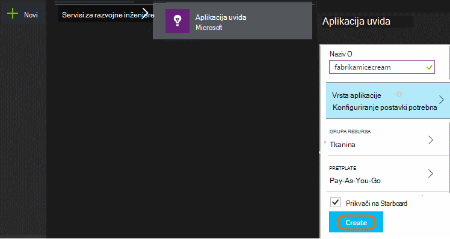

**Ako je aplikacija na uređaju aplikaciju,** dodajte uvida SDK aplikaciju u projekt. Ispravna procedura razlikuje se ovisno o [IDE i platforme](app-insights-platforms.md). Za aplikacije sustava Windows, samo desnom tipkom miša kliknite projekt u Visual Studio i odaberite "Dodaj aplikaciju uvide."

**Ako je web-aplikacijama** otvorite plohu brzi početak rada i dohvatiti isječak koda da biste dodali web-stranica. Ih ponovno objaviti s ovom isječka.

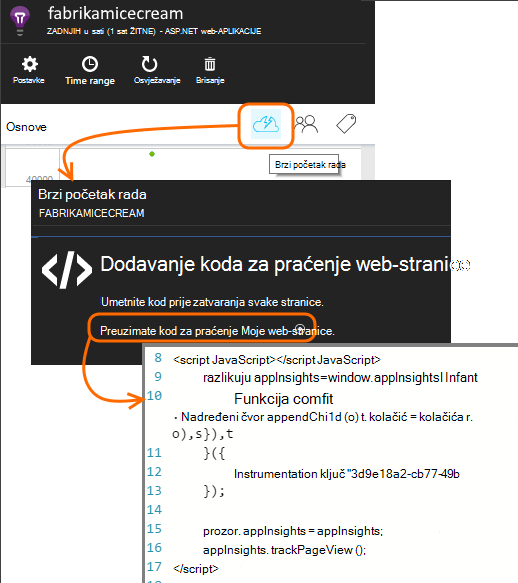

Uvid aplikaciju možete dodati i za poslužitelj kod [ASP.NET](app-insights-asp-net.md) ili [J2EE](app-insights-java-get-started.md) biste kombiniranje telemetrijskih iz klijenta i poslužitelja.

### Pokrenite projekt i potražite u članku prvi rezultata

Pokretanje projekta u načinu rada za ispravljanje pogrešaka za nekoliko minuta pa idite na [portal za Azure](https://portal.azure.com) i idite na projekt resursa u aplikaciji uvida.

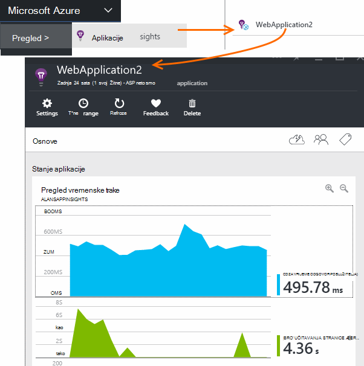

Objavite aplikaciju da biste dobili dodatne telemetrijskih i Saznajte što vaši korisnici rade s aplikacijom.

## Analitički iz okvir

Kliknite pločicu prikaza stranice da biste vidjeli informacije o korištenju.

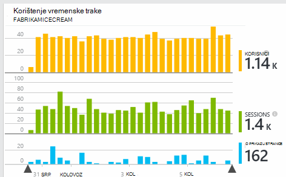

Postavite pokazivač miša u prazan dio iznad grafikona da biste vidjeli broji na određenom mjestu. U suprotnom, brojeve prikazat će se kao vrijednost pridružuje tijekom razdoblja, kao što je prosjek, ukupnog zbroja ili broj poznati korisnici tijekom razdoblja.

U web-aplikacijama, korisnici broje pomoću Kolačići. Osoba koja koristi nekoliko preglednicima, čisti kolačiće ili koristi značajku izjave o zaštiti privatnosti će se brojati nekoliko puta.

Sesije web broje se nakon 30 minuta neaktivnosti. Sesije na telefon ili neki drugi uređaj se broji kada se obustavlja aplikaciju za više od nekoliko sekundi.

Klikajte stavke za bilo koji od njih da biste vidjeli dodatne detalje. Ako, na primjer:

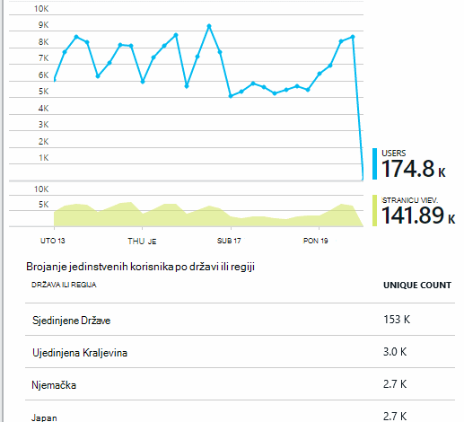

(Ovaj primjer s web-mjesta, ali slične grafikone za aplikacije koji se izvode na uređajima.)

Usporedba s prethodnom tjednu da biste vidjeli ako želite promijeniti stvari:

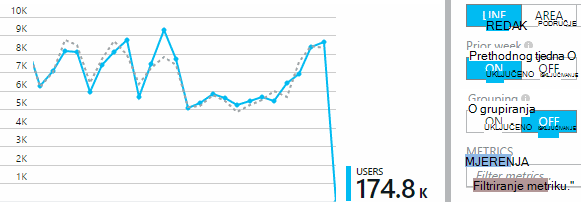

Uspoređivanje dvije metrika, primjerice korisnika i nove korisnike:

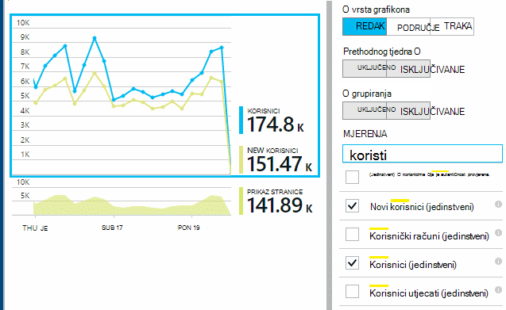

Grupiranje (segmenta) podataka tako da svojstvo preglednika, operacijski sustav ili grad:

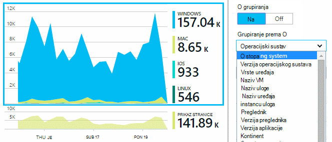

## Korištenje stranica

Kliknite Poploči prikaza stranice da biste na razrada svega najpopularnije stranice:

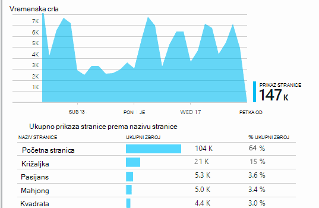

Gornji primjer je igre web-mjestu. Iz nje trenutačno Vidimo:

* Korištenje poboljšane nije tijekom proteklog tjedna. Možda ne možemo trebali biste razmisliti o optimizaciju tražilice?
* Mnogo manje vide igre stranica od na početnu stranicu. Zašto se naš početne stranice ne privući ga drugi mogli reproducirati igre?
* 'Križaljka' je najpopularnijih igra. Da biste nove ideje i poboljšanja postoji smo mora dati prioritet.

## Prilagođeni praćenja

Pretpostavimo da umjesto implementacije svaki utakmica u zasebnom web-stranice, odlučite refactor ih sve u istom aplikaciju za jednu stranicu s većinom funkcionalnosti kodira kao JavaScript koda na web-stranici. Time se omogućuje korisniku brzo prebacivanje između igra, a drugi ili čak i imate nekoliko igre na jednoj stranici.

No i dalje želite uvida aplikaciju da biste se prijavili koliko je puta svaki utakmica otvoren, u potpunosti na isti način kao kada su na zasebnom web-stranicama. To je jednostavno: samo umetnite poziv modul za telemetriju u svoje JavaScript mjesto na koje želite zapis koji se otvorio novi "stranice":

    telemetryClient.trackPageView(game.Name);

## Prilagođene događaje

Telemetrijskih možete koristiti na razne načine da biste razumjeli kako se koristi aplikacija. No uvijek želite kombinirati poruke prema gore s prikaza stranice. Umjesto toga koristite prilagođene događaje. Možete im poslati iz aplikacije uređaj, web-stranica i web-poslužitelju:

(JavaScript)

    telemetryClient.trackEvent("GameEnd");

(C#)

    var tc = new Microsoft.ApplicationInsights.TelemetryClient();
    tc.TrackEvent("GameEnd");

(VB)

    Dim tc = New Microsoft.ApplicationInsights.TelemetryClient()
    tc.TrackEvent("GameEnd")

Najčešći prilagođene događaje navedene su na pregled plohu.

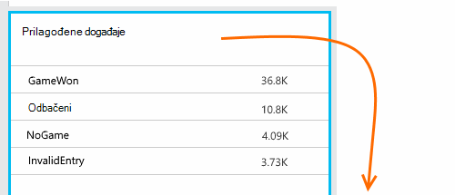

Kliknite zaglavlje tablice da biste vidjeli ukupan broj događaja. Grafikon možete fazi prema različitim atribute kao što su naziv događaja:

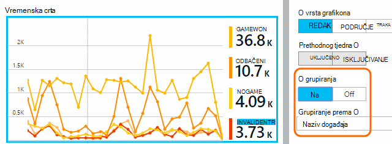

Značajku osobito korisni vremenske crte je povezivanje promjene s drugim metriku i događaje. Ako, na primjer, ponekad kada se reproduciraju više igre, što biste očekivali da biste vidjeli vodiča u kao i odbačeni igrama. No vodiča u odbačeni igrama disproportionate, trebali da biste saznali jesu li visoke opterećenje uzrokuje probleme koji korisnici pronaći prihvatljiva.

## Dubinski analizirati određene događaje

Da biste bolje razumjeli kako uobičajene sesiju dolazi, možda ćete morati usredotočite se na određeni korisnik sesije koja sadrži određene vrste događaja.

U ovom primjeru smo programiranja prilagođeni događaj "NoGame", koja se zove ako korisnik odjavljuje bez zapravo pokretanja igre. Zašto to korisniku želite učiniti? Možda ako dubinski smo neke određene pojave, ne možemo će se na podsjetnik.

Prilagođene događaje koje ste primili iz aplikacije navedene su po nazivu na pregled plohu:

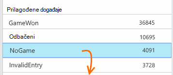

Kliknite kroz događaja koje vas zanimaju pa odaberite nedavne određenog pojavljivanja:

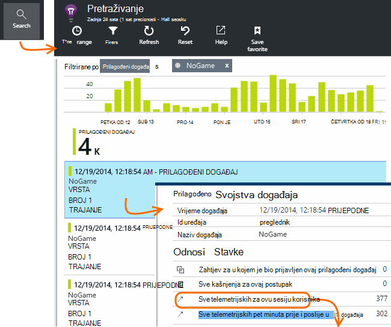

Pogledajmo sve telemetrijskih sesije u kojoj se pojavila taj određeni NoGame događaj.

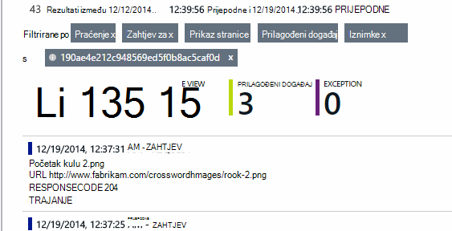

Došlo je do izuzetaka, tako da korisnik nije spriječio reproducira tako da neke pogreške.

Ne možemo možete filtrirati sve vrste telemetrijskih osim prikaza stranice za ovu sesiju:

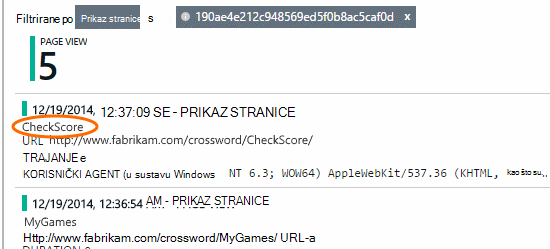

A sada Vidimo da taj korisnik prijavljen samo da biste provjerili najnovijih rezultata. Možda ne možemo razmislite o razvoju priče korisnika koji olakšava vam da to učinite. (I smo treba implementirati prilagođeni događaj izvješće kada se pojavi tu određene priču.)

## Filtriranje, pretraživanje i fazi podataka sa svojstvima
Događaji koje možete pridružiti proizvoljne oznake i numeričke vrijednosti.

JavaScript kod klijenta

    appInsights.trackEvent("WinGame",
        // String properties:
        {Game: currentGame.name, Difficulty: currentGame.difficulty},
        // Numeric measurements:
        {Score: currentGame.score, Opponents: currentGame.opponentCount}
    );

C# na poslužitelju

    // Set up some properties:
    var properties = new Dictionary <string, string>
        {{"game", currentGame.Name}, {"difficulty", currentGame.Difficulty}};
    var measurements = new Dictionary <string, double>
        {{"Score", currentGame.Score}, {"Opponents", currentGame.OpponentCount}};

    // Send the event:
    telemetry.TrackEvent("WinGame", properties, measurements);

VB na poslužitelju

    ' Set up some properties:
    Dim properties = New Dictionary (Of String, String)
    properties.Add("game", currentGame.Name)
    properties.Add("difficulty", currentGame.Difficulty)

    Dim measurements = New Dictionary (Of String, Double)
    measurements.Add("Score", currentGame.Score)
    measurements.Add("Opponents", currentGame.OpponentCount)

    ' Send the event:
    telemetry.TrackEvent("WinGame", properties, measurements)

Dodavanje svojstva prikaza stranice na isti način:

JavaScript kod klijenta

    appInsights.trackPageView("Win",
        {Game: currentGame.Name},
        {Score: currentGame.Score});

U dijagnostičkih pretraživanju Prikaz svojstava tako da kliknete putem pojedinačne pojavu događaja.

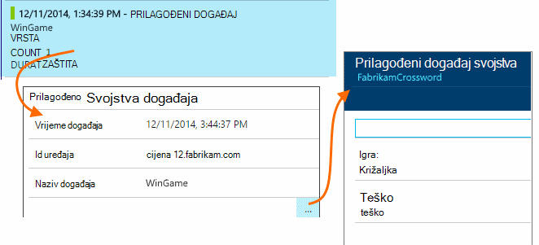

Koristite polje za pretraživanje da biste vidjeli pojavljivanja događaja vrijednošću određenog svojstva.

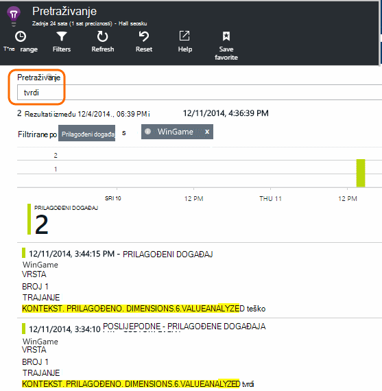

## A | Testiranje B

Ako ne znate koje variant značajka bit će, pustite oba, čime svaki dostupan drugi korisnici. Odrediti uspjeh svakog, a zatim kretanje objedinjenih verziju.

Za ovu tehniku priložiti distinct oznake telemetrijskih koji se šalju tako da u svakoj verziji aplikacije. To možete učiniti definiranjem svojstva u aktivni TelemetryContext. Ove zadana svojstva dodaju se sve telemetrijskih poruke koje šalje aplikaciju - ne samo prilagođene poruke, ali kao i standardne telemetrijskih.

Na portalu za aplikaciju uvida ćete pa ćete moći filtriranje i grupiranje (segmenta) podataka na oznake, odnosno radi što Usporedba različitih verzija.

C# na poslužitelju

    using Microsoft.ApplicationInsights.DataContracts;

    var context = new TelemetryContext();
    context.Properties["Game"] = currentGame.Name;
    var telemetry = new TelemetryClient(context);
    // Now all telemetry will automatically be sent with the context property:
    telemetry.TrackEvent("WinGame");

VB na poslužitelju

    Dim context = New TelemetryContext
    context.Properties("Game") = currentGame.Name
    Dim telemetry = New TelemetryClient(context)
    ' Now all telemetry will automatically be sent with the context property:
    telemetry.TrackEvent("WinGame")

Pojedinačne telemetrijskih možete nadjačati zadane vrijednosti.

Univerzalni initializer možete postaviti tako da se svi novi TelemetryClients automatski koristiti kontekstu.

    // Telemetry initializer class
    public class MyTelemetryInitializer : ITelemetryInitializer
    {
        public void Initialize (ITelemetry telemetry)
        {
            telemetry.Properties["AppVersion"] = "v2.1";
        }
    }

U initializer aplikacija, kao što su Global.asax.cs:

    protected void Application_Start()
    {
        // ...
        TelemetryConfiguration.Active.TelemetryInitializers
        .Add(new MyTelemetryInitializer());
    }

## Sastavljanje - mjere – Saznajte

Kada koristite analize, on postaje integrirani dijela vaše ciklusa razvoja - ne samo nešto razmislite o radi rješavanja problema. Evo nekoliko savjeta:

* Određivanje ključa metriku aplikacije. Želite li proizvoljan broj korisnika moguće ili biste radije malom Sretan korisnika? Želite li Maksimiziranje posjeta ili prodaju?
* Plan za mjerenje svaki priče. Kada skiciranje novi priče korisnika ili značajku ili plan da biste ažurirali postojećeg, uvijek razmislite o tome kako će odrediti uspjeh promjene. Prije nego što kodiranje pokreće, zamolite "koje efekt će to nalaziti na naše metriku ako to funkcionira? Treba mi pratiti sve nove događaje?"
I Naravno, kada je značajka uživo, provjerite je li pogledati analitičkih podataka i rad s rezultatima.
* Ostale metriku odnose se na metriku ključa. Ako, na primjer, ako dodate značajku "Favoriti", želite Saznajte koliko često korisnici Dodaj u favorite. No možda više zanimljive Saznajte koliko često se vratite se na njihove favorite. Možete i najčešće važno je napomenuti da, ne korisnici koji koriste Favoriti konačni kupe više proizvoda?
* Testiranje canary. Postavljanje skretnice značajka koja omogućuje neka je nova značajka bude vidljivo samo određenih korisnika. Koristite uvide aplikacije da biste vidjeli hoće li se koristi nove značajke u način na koji ste envisaged. Izvršite promjene, a zatim pustite širem publici.
* Razgovarajte s korisnicima! Analitički nije dovoljno samostalno, ali komplementarnu za održavanje odnosa klijentima.

## uči više

* [Otkrivanje, razvrstavati i dijagnosticiranje ruši i probleme s performansama u aplikaciji](app-insights-detect-triage-diagnose.md)
* [Početak rada s računala uvida mnogo platforme](app-insights-detect-triage-diagnose.md)

## Videozapis

> [AZURE.VIDEO usage-monitoring-application-insights]

 
