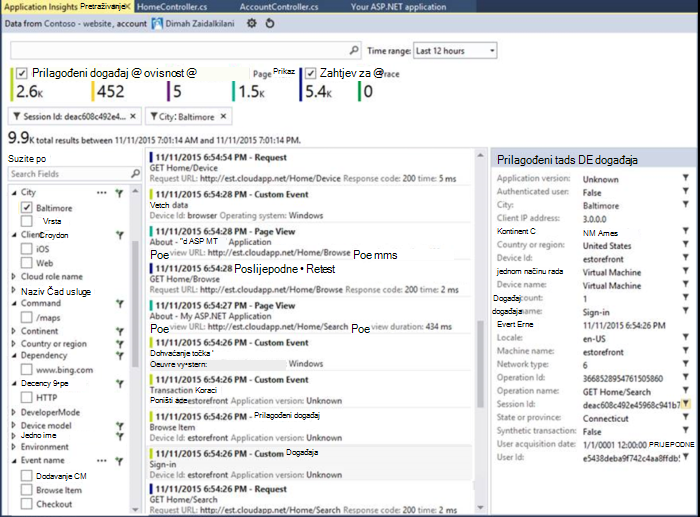

<properties 
    pageTitle="Praktični vodič uvida aplikacije | Microsoft Azure" 
    description="Praćenje korištenja i performanse uživo web-aplikacije.  Otkrivanje, razvrstavati i utvrditi probleme. Neprestano praćenje i poboljšati uspjeh s korisnicima." 
    services="application-insights" 
    documentationCenter=""
    authors="alancameronwills" 
    manager="douge"/>

<tags 
    ms.service="application-insights" 
    ms.workload="tbd" 
    ms.tgt_pltfrm="ibiza" 
    ms.devlang="na" 
    ms.topic="article" 
    ms.date="10/15/2016" 
    ms.author="awills"/>
 
# Aplikacija uvida - Uvod

Uvid aplikacije za Visual Studio je servis za extensible analytics koji nadzire uživo web-aplikacije. Uz nju Odredi i dijagnosticiranje probleme s performansama, a razumijevanje što korisnicima zapravo postići pomoću aplikacije. Služi za razvojne inženjere radi kontinuirano poboljšanja performansi i upotrebljivosti. Radi aplikacije na razna platforme uključujući .NET, Node.js i J2EE, nalaze na lokalni ili u oblaku. 

[Pogledajte Uvod animaciju](https://www.youtube.com/watch?v=fX2NtGrh-Y0).

## Kako to funkcionira?

Instalirati paket small instrumentation u aplikaciji i postavljanje programa aplikacije uvida resursa na portalu Microsoft Azure. Na instrumentation nadzire aplikacije i šalje telemetrijskih podataka na portalu. Na portalu prikazuje statistički grafikoni i sadrži alate za napredno pretraživanje za dijagnosticiranje probleme.

Aplikacija uvida ima nekoliko [standardne instrumentation moduli](app-insights-configuration-with-applicationinsights-config.md) prikupite različite vrste telemetrijskih kao što su vrijeme odaziva zahtjev, iznimke i ovisnosti pozive. Možete i [Pisanje koda za slanje prilagođenih telemetrijskih](app-insights-api-custom-events-metrics.md) portalu.

### Što je indirektnog?

Utjecaj na performanse aplikacije programa je vrlo malen. Praćenje poziva su koje nisu-blokiranje se, se odbacivanja i poslana u zasebnom niti. 

## Što to radi?

Aplikacija uvida je usmjerenih pri razvojnom timu pomoću kojih se objašnjava kako izvršava aplikacije i kako se koristi. Omogućuje:

Vrste telemetrijskih:

* HTTP zahtjev za tečajeve, vrijeme odgovor, postocima uspjeha.
* Ovisnost (HTTP & SQL) nazovite tečajeve, puta odgovor, a zatim postocima uspjeha.
* Iznimke kašnjenja s poslužitelja i klijenta.
* Kašnjenja dijagnostičkog zapisnika.
* Prikaz stranice broji, korisnik i sesiju, učitavanje u pregledniku, a zatim iznimke.
* Prijenosa poziva AJAX-a, vrijeme odaziva i postocima uspjeha.
* Poslužitelj mjerača performansi.
* Prilagođeni postupak klijentske i poslužiteljske telemetrijskih.
* Segmente prema lokaciji klijentskog, verzija preglednika, verzija OS-a, instanca poslužitelja, prilagođenu verziju i više.
* Testira dostupnosti

Alati za dijagnostiku i analitički:

* Pametno i ručno upozorenja o neuspjeh stope i druge metriku te dostupnosti.
* Grafikoni tijekom vremena Zbrojeno metriku.
* Dijagnostičke pretraživanje pojavljivanja zahtjeve, iznimke, a zatim prilagođene događaje zapisnika kašnjenja prikaza stranice, ovisnosti te AJAX-a poziva. 
* Analitički - jezik naprednih upita putem vaše telemetrijskih
* Nadzorne ploče – sastavite grafikoni morate pratiti sve komponente za aplikacije.

## Kako je koristiti?

### Monitora

Instalacija aplikacije uvida u web-aplikaciju programa, postavljanje dostupnosti web testira, a:

* Postavljanje nadzorne ploče za sobe za tim da biste nadzirali opterećenja, odziv i performanse ovisnosti, opterećenje stranice i pozive AJAX-a. 
* Saznajte koji su na najsporiju i zahtjeve za većinu neuspjeh.
* Ako pokrenete novo izdanje odmah zna sve smanjene performanse, pogledajte uživo strujanje.

### Dijagnosticiranje

Kada primati upozorenja ili otkrivanje problema:

* Povezivanje neuspjeha iznimke, ovisnosti pozive i kašnjenja.
* Pregledajte stogu ispisi i zapisnika praćenja.

### Procijenite

Izmjerite učinkovitost svake nove značajke implementacije.

* Plan za mjerenje načinu na koji korisnici koriste novi UX ili značajke za tvrtke.
* Napišite prilagođenu telemetriju u kodu da biste se prijavili korištenje.
* Svakog ciklusa razvoja temeljiti na tvrdi dokaz iz telemetrijskih.

## Početak rada

Aplikacija uvida jedan je od mnoge servise koji se nalazi unutar Microsoft Azure, a postoji poslane telemetrijskih radi analize i prezentacije. Kako učiniti nešto drugo, morat ćete pretplate na [Microsoft Azure](http://azure.com). Je besplatna da biste se registrirali, a možete odabrati besplatne [cijene sloju](https://azure.microsoft.com/pricing/details/application-insights/) od uvida aplikacije. Ako vaša tvrtka ili ustanova već ima pretplatu, nije moguće dodati Microsoftova računa na njega. 

Početak rada na nekoliko načina. Započnite s ovisno o tome što vam najbolje odgovara. Kasnije možete dodati na druge.

* **Za vrijeme izvođenja: instrumenata web aplikacije na poslužitelju.** Izbjegava ažuriranje kod. Administratorski pristup morate na poslužitelju.
 * [**IIS lokalnog ili na VM**](app-insights-monitor-performance-live-website-now.md)
 * [**Azure web-aplikacije ili VM**](app-insights-monitor-performance-live-website-now.md#if-your-app-runs-as-an-azure-web-app)
 * [**J2EE**](app-insights-java-live.md)
* **Vrijeme razvoj: dodavanje aplikacije uvida u kod.** Omogućuje vam pisanje prilagođene telemetrijskih i instrument pozadinske i aplikacija za stolna računala.
 * [Visual Studio](app-insights-asp-net.md) ažuriranje 2013 2 ili novije.
 * Java [Eclipse](app-insights-java-eclipse.md) ili u [druge alate](app-insights-java-get-started.md)
 * [Node.js](app-insights-nodejs.md)
 * [Druge platforme](app-insights-platforms.md)
* Za prikaz stranice, AJAX-a i ostale klijentske telemetrijskih **[instrumenata web-stranice](app-insights-javascript.md)** .
* **[Dostupnost testira](app-insights-monitor-web-app-availability.md)** - ping web-mjesta redovito iz naših poslužitelja.

> [AZURE.NOTE]  Sada možda samo želite dobiti i isprobajte ih. No ako želite da biste vidjeli što možete učiniti uvida aplikacije, nastavite čitati...

## Istražite mjerenja

Pokretanje aplikacije - ili u načinu rada za ispravljanje pogrešaka na vašem računalu razvoj ili uvođenjem na poslužitelju – te ga koristiti za neko vrijeme. Zatim prijavite se na [portal za Azure](https://portal.azure.com).

Idite na pregled plohu uvida aplikacije za aplikaciju programa:

Pregled omogućuje vam da biste odmah vidjeli kako se izvršava aplikacije. Učitavanje (pomoću stopa zahtjeva za) možete usporediti s vremenom aplikacije prevelika za odgovaranje na zahtjeve. Ako postoji disproportionate vodiča u vrijeme odaziva kada opterećenje ide, možda ćete morati dodijeliti dodatne resurse za aplikacije. Ako nakon implementiran novi Sastavi, prikazuje više nije uspjelo odgovore desno, zatim možda ćete morati vratiti.

#### Vidjeti dodatne pojedinosti

Klikajte stavke za bilo koji od njih da biste dobili detaljnije skup grafikona. Na primjer, grafikon vrijeme odaziva poslužitelja potencijalnih klijenata za grafikone koji prikazuju stope zahtjev, vrijeme odaziva i odgovor vremena ovisnosti (odnosno servise koje aplikacije poziva).  

Grafikon ovisnosti je koristan jer olakšava vam vidjeti je li baza podataka i REST API-ji koji koristi aplikacije odgovarate i i što uzrokuje kašnjenja.

#### Prilagodba grafikona

Isprobajte neku od tih grafikona za uređivanje. Ako, na primjer, web-aplikaciju programa pokreće Zbirka instanci poslužitelja, možete usporediti puta odgovor na drugi poslužitelj instance:

1. Pokazivač miša postavite iznad grafikona, a zatim kliknite Uredi.
2. Odaberite metriku. Više mjernih podataka mogu se prikazati na jednom grafikonu, ali samo u određene kombinacije: možda ćete morati poništite odabir jednog metriku prije no što odaberete onu koju želite.
3. Pomoću Group By fazi metrike tako da svojstvo. U ovom primjeru smo prikazuju zasebne retke različita vremena odaziva. 

    Imajte na umu da morate odabrati valjanog svojstva za metriku ili grafikon neće se prikazati sve podatke.
4. Odaberite vrstu grafikona. Područje i trakaste grafikone prikazuju složeni prikaz odgovarajuću kada je vrsta zbrajanja 'Zbroj'.

[Dodatne informacije o Upoznavanje metriku](app-insights-metrics-explorer.md).

## Pretraživanje instancu podataka

Da biste istražili problem, je korisno za provjeru instance određene događaj.

Kliknite kroz metričkim grafikon da bi se podaci instance pretraživati pomoću odgovarajuće filtre i vremenski raspon. Na primjer, kliknite kroz poslužitelj zahtjeva broji da biste vidjeli zahtjev za pojedinačne izvješća. 

Ili možete doći izravno na instancu podatke iz pretraživanja na stranici pregled:

Korištenje filtara da biste fokus na određene vrste događaja i odabrano svojstvo vrijednosti:

Kliknite "..." da biste vidjeli cijeli popis svojstava ili otvaranje druge događaje povezane s istom zahtjev. U ovom primjeru zahtjeva nije uspjelo sadrži izvješća programa pridružene iznimke:

Otvorite događaj – u ovom primjeru povezane iznimku -, a vi možete stvoriti radnu stavku (Ako koristite Visual Studio Team Services za praćenje zadataka). 
 

## Analytics

[Analitički](app-insights-analytics.md) je još napredna pretraživanja i analize značajka, u kojem možete napisati nalik SQL upita telemetrijskih podataka ili da biste potražili specifični problemi ili za prikupljanje statističkih podataka.

Otvorite prozor vodiča da biste vidjeli i pokrenite Primjeri upita podataka ili čitanje dulje [vodiča vodič](app-insights-analytics-tour.md). IntelliSense traži upite koje možete koristiti i postoji [Referenca cijelog jezik](app-insights-analytics-reference.md). 

Upiti obično započeti s nazivom telemetrijskih strujanje kao što su zahtjeve, iznimke ili ovisnosti. Pop otvorili traku sheme s lijeve strane da biste vidjeli popis dostupnih telemetrijskih strujanja. Upit kao što je kanal operacija [upita](app-insights-analytics-reference.md#queries-and-operators) `where` - Booleova filtar - ili `project` -koji formula izračunava nova svojstva. `summarize`[instance zbrajanja](app-insights-analytics-tour.md#aggregate-groups-of-rows), ih grupirate prema funkcije definirate i primjenom funkcije zbrajanja putem grupiranim podacima.

Rezultati može [prikazati tablica ili različite vrste grafikona](app-insights-analytics-tour.md#charting-the-results).

## Prilagođeni telemetrijskih

Ugrađene telemetrijskih koji se isporučuju samo ako instalirate aplikaciju uvida možete analizirati broji, postocima uspjeha i odgovor vremena oba web zahtjeva za aplikaciju i ovisnosti – to jest, pozivima iz aplikacije za SQL, REST API-ji. Dobit kašnjenja iznimku i (uz Status monitora na poslužitelj) mjerača performansi sustava. Ako dodate isječak klijenta na web-stranice, se broji prikaz stranice i učitava, iznimke klijenta i AJAX poziva stope uspjeh i odgovora. 

Analiza ovaj telemetrijskih mogu sadržavati mnogo o performansama i korištenje pokrenite aplikaciju. No katkad koji nije dovoljno. Možda ćete morati praćenje duljinu reda tako da možete precizno podesite performanse; Brojanje prodaje i fazi ih po mjestu; ili na klijentskoj strani Saznajte kako često korisnici kliknite određeni gumb tako da možete ugađanje korisničkog sučelja.

[Aplikacija uvida API](app-insights-api-custom-events-metrics.md) nudi pozive `TrackEvent(name)` i `TrackMetric(name, value)` tako da možete poslati vlastite prilagođene događaje i mjernih podataka. Postoji ekvivalentan poziva za na strani klijenta.

Ako, na primjer, ako je web-stranicu igraće aplikaciju za jednu stranicu, možete umetnuti u retke na odgovarajućim mjestima da biste se prijavili kad korisnik wins ili gubi igre:

    
    appInsights.trackEvent("WinGame");
    ...
    appInsights.trackEvent("LoseGame");

Zatim ćemo stvaranja grafikona broji prilagođeni događaj segmenting ih prema nazivu događaja:

### Kašnjenja zapisnika

Dijagnostičke svrhe je prilagođeni događaj `TrackTrace(message)` koje možete koristiti za izvršavanje kašnjenja. U značajke pretraživanja i analitiku možete pretraživati prema sadržaj poruke, što može biti dulji od naziv događaja. 

Ako već koristite zapisivanje framework kao što su Log4Net, NLog, Log4J ili System.Diagnostic.Trace, zatim te praćenje poziva možete zabilježene po uvida aplikacije te će se pojaviti u telemetrijskih. Visual Studio tools automatski dodati odgovarajući modul SDK.

## Nadzorne ploče

Mnoge aplikacije koji se sastoje od nekoliko komponenti kao što je web-servisa i jedan ili više natrag završetka procesora. Svaku od njih će nadzire odvojene aplikacije uvida resursa. Ako vaš sustav izvodi na Azure, koji bi mogli koristiti - i nadzor - servise kao što su koncentratora za događaj i strojnog učenja kao i. 

Da biste pratili cijeli sustav, možete odabrati zanimljive grafikona iz različitih aplikacija i prikvačiti na programa Azure [nadzorne ploče](app-insights-dashboards.md)omogućujući vam da biste nadzirali cijeli sustav neprestano. 

Zapravo, možete stvoriti više nadzorne ploče –, na primjer, tim sobe nadzorne ploče za nadzor Općenito o općem stanju sustava; Nadzorna ploča za dizajn usredotočuje se na korištenje različitih značajki; zasebnom nadzorne ploče za komponente u odjeljku test; i tako dalje.  

Nadzorne ploče, kao što su resursa, mogu zajednički koristiti članovima tima.

## Razvoj u Visual Studio

Ako koristite Visual Studio za razvoj aplikacija, pronaći ćete nekoliko uvida aplikaciju alata ugrađena. 

### Dijagnostičke pretraživanja

Prozor za pretraživanje prikazuje događaje koje su zapisane. (Ako ste prijavljeni u Azure prilikom postavljanja aplikacije uvide, moći da biste pronašli iste događaja na portalu.)

Pretraživanje slobodni tekstni funkcionira na sva polja u događaje. Na primjer, potražite dio URL-a na stranici vrijednost svojstva kao što je Grad klijenta; ili ili određenim riječima u zapisnik praćenja.

Kliknite bilo koji događaj da biste vidjeli detaljne svojstva.

Možete otvoriti i karticu povezane stavke za dijagnostiku neuspjelih zahtjeva ili iznimke.

### Dijagnostika koncentratora

Koncentrator Dijagnostika (u Visual Studio 2015 ili noviji) prikazuje telemetrijskih poslužitelj aplikacije uvida generira. To funkcionira čak i ako ste odlučili samo da biste instalirali SDK, bez povezivanja s resursa na portalu za Azure.

### Iznimke

Ako ste [postavili iznimku nadzor](app-insights-asp-net-exceptions.md), izvješća iznimku prikazat će se u prozor za pretraživanje. 

Kliknite iznimku za praćenje stogu. Ako kod za aplikaciju je otvorena u Visual Studio, možete kliknuti kroz Praćenje stoga na odgovarajući redak koda.

Osim toga, u retku kod leće iznad svake metode prikazat će ukupan broj iznimke zapisuje aplikacije uvida u zadnjih 24h.

### Lokalni nadzor

(Iz Visual Studio 2015 ažuriranje 2) Ako niste konfigurirali SDK da biste poslali telemetrijskih portal za aplikacije uvida (tako da nema instrumentation ključa u ApplicationInsights.config) prozor Dijagnostika će prikazati telemetrijskih od najkasnijeg pogrešaka sesiju. 

Ovo je poželjno ako već objavljene prethodnu verziju aplikacije. Ne želite na telemetrijskih iz pogrešaka sesija biti kombinaciju telemetrijskih portala za aplikacije uvida u aplikaciji objavljene.

Također je korisno ako imate neke [prilagođene telemetrijskih](app-insights-api-custom-events-metrics.md) koju želite za ispravljanje pogrešaka prije no što pošaljete telemetrijskih portalu.

* *Isprva potpuno li konfiguriran uvida aplikacije da biste poslali telemetrijskih portalu. No sada želim da biste vidjeli telemetrijskih samo u Visual Studio.*

 * U odjeljku postavke prozora za pretraživanje postoji mogućnost da biste pronašli lokalne Dijagnostika čak i ako se aplikacije šalje telemetrijskih portalu.
 * Da biste zaustavili telemetrijskih šalje se na portal sustava, komentar izvan redak `<instrumentationkey>...` iz ApplicationInsights.config. Kada budete spremni ponovno poslati telemetrijskih portalu, uklonite ga.

## Trendova

Trendova u alatu Visual Studio namijenjen vizualizacija ponašanje aplikacije tijekom vremena. 

Odaberite **Istraživanje trendova Telemetrijskih** iz aplikacije uvida gumb na alatnoj traci ili prozor aplikacije uvida pretraživanje. Odaberite neku od pet uobičajene upite za početak rada. Možete analizirati različite skupove podataka na temelju vrste telemetrijskih, vremenski raspon i druga svojstva. 

Da biste pronašli anomalies u vašim podacima, odaberite neku od mogućnosti značajkom u odjeljku "Vrsta prikaza" padajući popis. Mogućnosti filtriranja pri dnu prozora olakšavaju uobličite u na određenim podskupovima vaše telemetrijskih.

## Otpustite novi međuverzije

### Live strujanje mjerenja

Aktivno strujanje metriku prikazuje vaše aplikacije metriku desno u ovom vrlo trenutku s najbliži stvarnom vremenu Latencija 1 sekunde. Ovo je iznimno je korisna kad ste otpustite novi Sastavi i želite da biste bili sigurni da je sve funkcionira u skladu s očekivanjima ili istražuje incident u stvarnom vremenu.

Za razliku od Explorer mjernih podataka uživo metriku toka prikazuje fiksni skup mjernih podataka. Podaci i dalje pojavljuje samo za dok god je na grafikonu, a zatim odbacuju. 

### Napomene

[Izdanje primjedbe](app-insights-annotations.md) na grafikonima metriku pokazuju gdje implementiran novi Sastavi. Jednostavno da biste vidjeli je li promjene imala učinak na performanse vaše aplikacije. Ih je moguće automatski stvoriti tako da [Team Services za Visual Studio stvaranje sustava](https://www.visualstudio.com/en-us/get-started/build/build-your-app-vs), a možete i [stvoriti ih PowerShell](#create-annotations-from-powershell).

Izdanje primjedbe su značajka sastavljanje oblaku i otpustite servisa programa Visual Studio Team Services. 

## Upozorenja

Ako nešto pošlo po redu s aplikacijom, ćete htjeti odmah znati o njemu. 

Aplikacija uvida nudi tri vrste upozorenja, koji se isporučuju putem e-pošte.

### Određene proaktivne dijagnostiku 

Automatski postaviti [određene proaktivne Dijagnostika](app-insights-proactive-failure-diagnostics.md) – ne morate ga konfigurirati. Ako web-mjesto sadrži dovoljno promet, dobit ćete poruku e-pošte ako postoji vodiča u neuspjelih zahtjeva koji je nepoznatu za doba dana ili zahtjev za stopa. Upozorenje sadrži dijagnostičke informacije. 

Evo primjerak upozorenja. 

Druga vrsta određene proaktivne otkrivanje otkrije korelacija između pogrešaka i čimbenicima kao što su mjesto, klijent OS ili vrsta web-preglednika.

### Metričkim upozorenja

Možete konfigurirati [metričkim upozorenja](app-insights-alerts.md) želite reći kada sve metriku presjek vrijednosti praga u razdoblju – primjerice broji pogreške, memorije ili prikaza stranice.

### Dostupnost

[Dostupnost web testira](app-insights-monitor-web-app-availability.md) Pošalji zahtjeve web-mjesta s naših poslužitelja na različitim mjestima diljem svijeta. Mogu vam reći kada je web-mjesto nije dostupan na Internetu ili odgovara sporo. 

## Izvoz

Možete dobiti telemetrijskih podataka iz portal za aplikacije uvida na nekoliko načina:

* Ako želite da ostanu velike dijelove vaše telemetrijskih dulje od razdoblje zadržavanja standardne, idealna je [Neprekinuti izvoz](app-insights-export-telemetry.md) .
* [Metriku](app-insights-metrics-explorer.md#export-to-excel) tablice, rezultati pretraživanja i rezultate [analize](app-insights-analytics.md) možete sve moguće izvesti proračunsku tablicu programa Excel. 
* Da biste potražili i izdvajanje podataka, uključujući pokretanje analize upita može se koristiti podataka programa Access REST API-JA. U API trenutno privatne pretpregled. [Dodatne informacije o uključivanju u pretpregledu](https://visualstudio.uservoice.com/forums/357324-application-insights/suggestions/4999529-make-data-accessible-via-apis-for-custom-processin).
* Možete izvesti nadzornih ploča [analize upita dodatka Power bi](app-insights-export-power-bi.md) i prikaz rezultata u Power BI vizualizacije koju je moguće automatski osvježavati.

 
## Upravljanje podacima

Nema ograničenja korištenja uvida aplikacije koje ovise o tome u određenoj mjeri cijene sheme koje odaberete. Glavni ograničenja nalaze se na:

* Stopa telemetriju u minuti
* Broj točaka podataka mjesečno
* Razdoblje zadržavanja podataka

Mehanizam za smanjivanje troškova i izbjegavanje ograničavanje [uzorkovanje](app-insights-sampling.md) je. Ga odbacuje dio telemetrijskih, zadržavanje predstavniku uzorka. Povezanih stavki (kao što su iznimke i zahtjevi za koje su uzrokovale ih) se zadržavaju ili odbacuju zajedno. Za aplikacije ASP.NET uzorkovanje je automatski, a primijenit će se u aplikaciji; u suprotnom, možete postaviti da se primijeniti na ingestion portalu.

## Daljnji koraci

Početak rada sa prilikom izvođenja:

* [IIS poslužitelj](app-insights-monitor-performance-live-website-now.md)
* [J2EE poslužitelja](app-insights-java-live.md)

Počnite s radom u trenutku razvoj sa:

* [PLATFORME ASP.NET](app-insights-asp-net.md)
* [Java](app-insights-java-get-started.md)
* [Node.js](app-insights-nodejs.md)

## Podrška i povratnih informacija

* Pitanja i probleme:
 * [Otklanjanje poteškoća][qna]
 * [MSDN Forum](https://social.msdn.microsoft.com/Forums/vstudio/home?forum=ApplicationInsights)
 * [StackOverflow](http://stackoverflow.com/questions/tagged/ms-application-insights)
 * [Podrška za razvojne inženjere](app-insights-get-dev-support.md)
* Prijedlozi:
 * [UserVoice](https://visualstudio.uservoice.com/forums/357324)
* Blog:
 * [Blog uvida aplikacije](https://azure.microsoft.com/blog/tag/application-insights)

## Videozapisi

> [AZURE.VIDEO 218]

> [AZURE.VIDEO usage-monitoring-application-insights]

> [AZURE.VIDEO performance-monitoring-application-insights]

> [Uvodni animacije](https://www.youtube.com/watch?v=fX2NtGrh-Y0)

<!--Link references-->

[android]: https://github.com/Microsoft/ApplicationInsights-Android
[azure]: ../insights-perf-analytics.md
[client]: app-insights-javascript.md
[desktop]: app-insights-windows-desktop.md
[detect]: app-insights-detect-triage-diagnose.md
[greenbrown]: app-insights-asp-net.md
[ios]: https://github.com/Microsoft/ApplicationInsights-iOS
[java]: app-insights-java-get-started.md
[knowUsers]: app-insights-overview-usage.md
[platforms]: app-insights-platforms.md
[portal]: http://portal.azure.com/
[qna]: app-insights-troubleshoot-faq.md
[redfield]: app-insights-monitor-performance-live-website-now.md

 