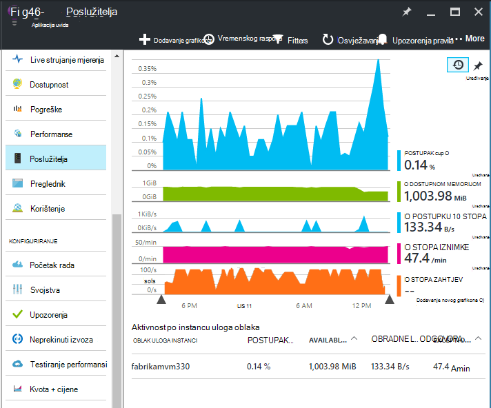
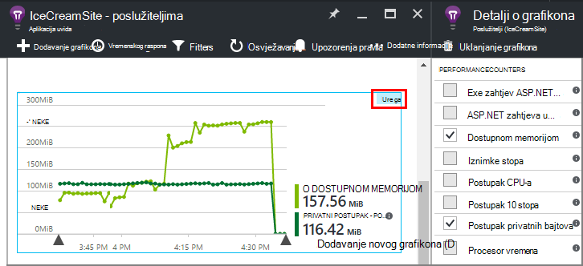
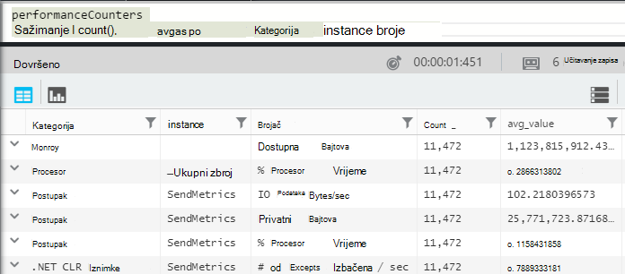
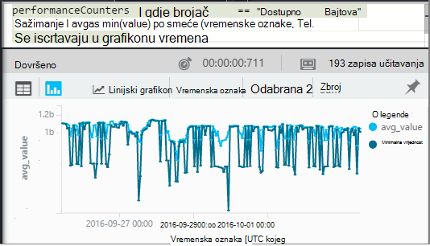
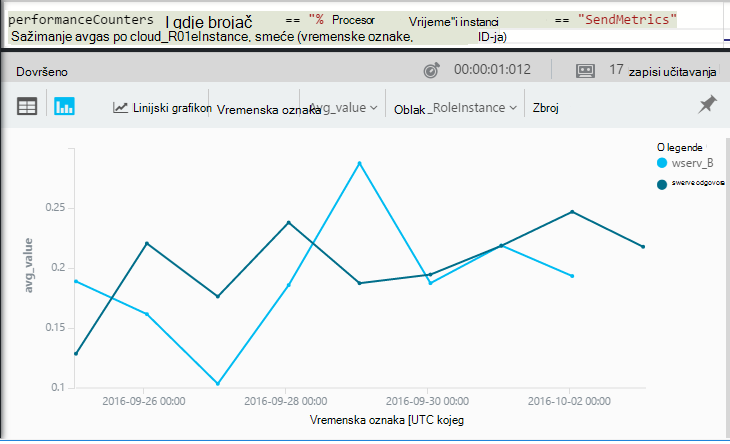

<properties 
    pageTitle="Mjerača performansi u aplikaciji uvida | Microsoft Azure" 
    description="Praćenje sustav i prilagođene mjerača performansi za .NET uvida aplikacije." 
    services="application-insights" 
    documentationCenter=""
    authors="alancameronwills" 
    manager="douge"/>

<tags 
    ms.service="application-insights" 
    ms.workload="tbd" 
    ms.tgt_pltfrm="ibiza" 
    ms.devlang="na" 
    ms.topic="article" 
    ms.date="10/11/2016" 
    ms.author="awills"/>
 
# <a name="system-performance-counters-in-application-insights"></a>Mjerača performansi sustava u aplikaciji uvida


Windows nudi mnoštvo [mjerača performansi](http://www.codeproject.com/Articles/8590/An-Introduction-To-Performance-Counters) kao što su procesora occupancy memorije, na disku i korištenje mreže. Možete definirati i vlastite. [Aplikacija uvida](app-insights-overview.md) možete prikazati te mjerača performansi ako program izvodi u odjeljku IIS na lokalni glavnog računala ili virtualnog računala na kojem imate administratorske pristup. Grafikoni ukazuju dostupnih u aplikaciji uživo resursa, a može pomoći za prepoznavanje neizravnane učitavanja između instanci poslužitelja.

Mjerača performansi pojavljuju se u plohu poslužitelje koji obuhvaća tablice te segmenata po instanca poslužitelja.



(Mjerača performansi nisu dostupne za Azure web-aplikacije. No možete [poslati Azure Dijagnostika aplikacije uvid u](app-insights-azure-diagnostics.md).)

## <a name="configure"></a>Konfiguriranje

Ako aplikacija uvida Status Monitor još nije instaliran na poslužitelju, morate instalirati da biste vidjeli mjerača performansi.

Preuzmite i pokrenite [Nadzornik stanja instalacijski program](http://go.microsoft.com/fwlink/?LinkId=506648) na svaku instancu poslužitelja. Ako je već instalirana, ne morate ponovno instalirati.

* *Mogu [instalirati aplikaciju SDK uvida u mojoj aplikaciji](app-insights-asp-net.md) tijekom razvoj. I dalje potreban Status Monitor?*

    Da, Nadzornik stanja potreban je da biste prikupili mjerača performansi ASP.NET web-aplikacijama. Kao što je možda već znate, Nadzornik stanja i omogućuje [praćenje web-aplikacije koje su već live](app-insights-monitor-performance-live-website-now.md)bez instaliranja SDK tijekom razvoj.


## <a name="view-counters"></a>Prikaz brojača

Plohu poslužitelja prikazuje zadani skup mjerača performansi. 

Da biste vidjeli druge mjerača, uredite na grafikonima plohu poslužitelja ili otvorite novi plohu [Metriku Explorer](app-insights-metrics-explorer.md) i dodajte nove grafikone. 

Dostupne mjerača koji su navedeni kao metriku uređivanje grafikona.



Da biste vidjeli sve svoje najkorisnije grafikone na jednom mjestu, stvaranje [nadzorne ploče](app-insights-dashboards.md) i prikvačiti na njega.

## <a name="add-counters"></a>Dodavanje mjerača

Ako brojač performanse želite nije prikazan na popisu mjernih podataka, to je zato uvida SDK aplikacija nije prikupljanje u web-poslužitelj. Konfigurirajte ga tako da biste to učinili.

1. Saznajte što mjerača dostupne u vašem poslužitelju pomoću ove naredbe ljuske PowerShell na poslužitelju:

    `Get-Counter -ListSet *`

    (See [`Get-Counter`](https://technet.microsoft.com/library/hh849685.aspx).)

1. Otvorite ApplicationInsights.config.

 * Ako ste dodali aplikacije uvida u aplikaciju tijekom razvoja, uredite ApplicationInsights.config u projektu, a zatim ga ponovno implementirati poslužiteljima.
 * Ako ste koristili Nadzornik stanja da biste instrumenata web-aplikacijama prilikom izvođenja, pronađite ApplicationInsights.config u korijenskom direktoriju aplikacije u IIS-u. Je li ažurirati u svaku instancu poslužitelja.

2. Uređivanje uputa za prikupljanje performanse:

 ```XML

    <Add Type="Microsoft.ApplicationInsights.Extensibility.PerfCounterCollector.PerformanceCollectorModule, Microsoft.AI.PerfCounterCollector">
      <Counters>
        <Add PerformanceCounter="\Objects\Processes"/>
        <Add PerformanceCounter="\Sales(photo)\# Items Sold" ReportAs="Photo sales"/>
      </Counters>
    </Add>

```

Možete snimiti i standardne mjerača i oni sami ste implementirali. `\Objects\Processes`primjer standardne brojač dostupne na svim sustava Windows. `\Sales(photo)\# Items Sold`primjer prilagođenog brojač koji se mogu primijeniti na web-servisa je. 

Odaberite oblik `\Category(instance)\Counter"`, ili kategorija koje nemaju instance samo `\Category\Counter`.

`ReportAs`nužan za brojač nazive koji ne odgovaraju `[a-zA-Z()/-_ \.]+` -to jest, koje sadrže znakove koji nisu u sljedećih skupova: slova, okrugle zagrade, kosa crta, spojnica, donja crta, razmak, točka.

Ako navedete instance, prikupljaju se kao dimenziju "CounterInstanceName" prijavljenim mjerenja.

### <a name="collecting-performance-counters-in-code"></a>Prikupljanje mjerača performansi u kodu

Prikupljanje mjerača performansi sustava i poslati ih do uvida računala, možete prilagoditi isječak u nastavku:

    var perfCollectorModule = new PerformanceCollectorModule();
    perfCollectorModule.Counters.Add(new PerformanceCounterCollectionRequest(
      @"\.NET CLR Memory([replace-with-application-process-name])\# GC Handles", "GC Handles")));
    perfCollectorModule.Initialize(TelemetryConfiguration.Active);

Ili možete učiniti na isti način s prilagođene metrike koju ste stvorili:

    var perfCollectorModule = new PerformanceCollectorModule();
    perfCollectorModule.Counters.Add(new PerformanceCounterCollectionRequest(
      @"\Sales(photo)\# Items Sold", "Photo sales"));
    perfCollectorModule.Initialize(TelemetryConfiguration.Active);

## <a name="performance-counters-in-analytics"></a>Mjerača performansi u Analytics

Možete pretraživati i prikaz izvješća o izvedbi brojač u [analize](app-insights-analytics.md).


Izlaže shemi **performanceCounters** na `category`, `counter` naziv i `instance` naziv svaki mjerača performansi.  U telemetrijskih za svaku aplikaciju, vidjet ćete samo mjerača za tu aplikaciju. Na primjer, da biste vidjeli što mjerača dostupne su: 



('Instancu Ovdje se odnosi na brojač instancu izvedbe ne uloga ili poslužitelj za strojno instanci. Naziv instance brojač performanse obično segmenti mjerača kao što su vrijeme procesor od najmanje prema nazivu procesa ili aplikacije.)

Da biste dobili grafikon dostupnom memorijom putem nedavno razdoblje: 




Kao što su druge telemetrijskih **performanceCounters** ima i stupac `cloud_RoleInstance` koji upućuje na to identiteta instanca poslužitelja glavnog računala na kojemu je pokrenut aplikacije. Na primjer, da biste usporedili performanse aplikacije na drugu računala: 




## <a name="aspnet-and-application-insights-counts"></a>ASP.NET i broji uvida aplikacije

*Koja je razlika između iznimku stopa i metrike iznimke?*

* *Rate iznimku* je brojač performanse sustava. Na CLR broji sve obrađene i neobrađenu iznimke koje su izbačena i dijeli ukupni zbroj u intervala uzorkovanja duljinu intervala. SDK uvida aplikacije prikuplja taj rezultat i šalje na portal.
* *Iznimke* je broj izvješća TrackException primio portal u intervalu uzorkovanja grafikona. Uključuje samo obrađene iznimke gdje ste napisali TrackException poziva u kodu, a ne obuhvaća sve [neobrađenu iznimke](app-insights-asp-net-exceptions.md). 

## <a name="alerts"></a>Upozorenja

Kao što su druge metriku možete [postaviti upozorenje koje](app-insights-alerts.md) vas upozoriti ako performanse brojač vodi izvan ograničenja koju navedete. Otvorite plohu upozorenja i kliknite Dodaj upozorenje.


## <a name="next"></a>Daljnji koraci

* [Ovisnost praćenja](app-insights-asp-net-dependencies.md)
* [Iznimke praćenja](app-insights-asp-net-exceptions.md)