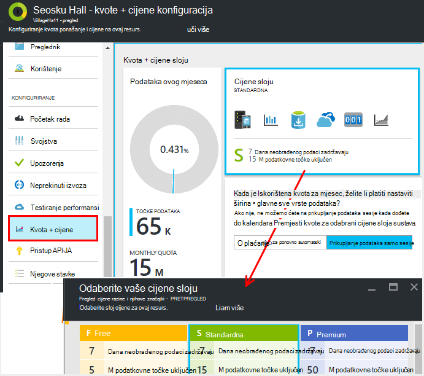
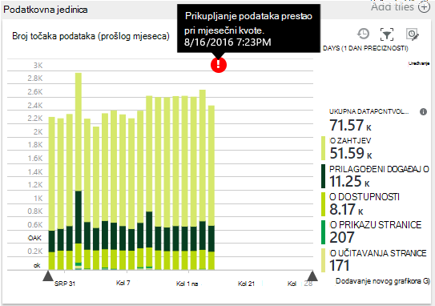
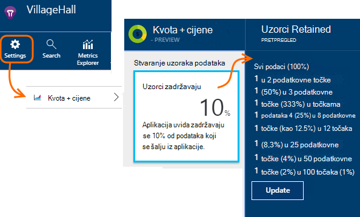
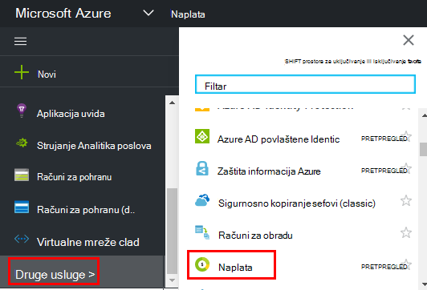

<properties 
    pageTitle="Upravljanje cijene i kvote za aplikaciju uvida | Microsoft Azure" 
    description="Odaberite plan cijena vam je potrebna, upravljanje telemetrijskih količine" 
    services="application-insights" 
    documentationCenter=""
    authors="alancameronwills" 
    manager="douge"/>

<tags 
    ms.service="application-insights" 
    ms.workload="tbd" 
    ms.tgt_pltfrm="ibiza" 
    ms.devlang="na" 
    ms.topic="article" 
    ms.date="10/13/2016" 
    ms.author="awills"/>

# Upravljanje cijene i kvote za aplikaciju uvida

*Aplikacija uvida je u pretpregledu.*

[Cijene] [ pricing] za [Visual Studio aplikacije uvida] [ start] temelji se na jedinici podataka po aplikacije. Postoji znatno besplatne sloju se većina značajki s određena ograničenja.

Svaki resurs uvida aplikacije se naplaćuje kao zasebna servis, a zatim udjela računa za vašu pretplatu za Azure.

[Potražite u članku sheme cijene][pricing].

## Kvota za pregled i cijena plan za vaše aplikacije uvida resursa

Možete otvoriti kvote + cijene plohu s postavkama resursa aplikaciju.

Odabir cijene sheme utječe na:

* [Mjesečni kvote](#monthly-quota) - iznos telemetrijskih možete analizirati svaki mjesec.
* [Stopa podataka](#data-rate) – Maksimalna Brzina kojom je moguće obraditi podaci iz aplikacije.
* [Izvoz neprekinuto](#continuous-export) - li izvoz podataka u druge alate i usluge.

Ta ograničenja postavljaju se zasebno za svaki resurs uvida aplikacije.

### Besplatna probna verzija Premium

Prilikom stvaranja nove uvide aplikacije resursa, pokreće u besplatne sloju.

U bilo kojem trenutku možete prijeći na besplatna probna Premium 30 dana. Tako ćete dobiti prednosti sloju Premium. Nakon 30 dana, on će automatski vratiti ono tier nalazili prije – osim ako izričito odabrati drugi sloju. Odaberite sloj koji biste željeli u bilo kojem trenutku tijekom probnog razdoblja, ali i dalje dobivate besplatnu probnu verziju do kraja razdoblja od 30 dana.

## Mjesečni kvote

* U svakom kalendarskom mjesecu aplikacije možete poslati navedeni količinu telemetrijskih aplikacije uvid u. Trenutno je kvote za besplatne cijene sloju 5 milijuna točaka podataka po mjesec i značajno više uz druge sheme; možete kupiti dodatne ako ne dođete do kvote.  U odjeljku [cijene shemu] [ pricing] za stvarne brojeve. 
* Kvote ovisi o cijenama sloju koje ste odabrali.
* Kvota broje se od ponoći UTC prvog dana svakog mjeseca.
* Grafikon točke podataka prikazuje koliko kvotu je iskorišten ovog mjeseca.
* Kvota mjeri se u *točaka.* Pojedinačnu točku podataka je poziv na jedan od načina evidentiranje li izričito pozvati u kodu, ili module standardni telemetrijskih. Možete imati više priložene svojstva i mjernih podataka.
* Točke podataka generira:
 * [Moduli SDK](app-insights-configuration-with-applicationinsights-config.md) koji automatski prikupljanje podataka, primjerice da biste prijavili zahtjev ili rušenje ili performanse izmjeriti.
 * [API-JA](app-insights-api-custom-events-metrics.md) `Track...` pozive koje ste napisali, kao što su `TrackEvent` ili `trackPageView`.
 * [Dostupnost web testova](app-insights-monitor-web-app-availability.md) koji ste postavili.
* Dok ste ispravljanje pogrešaka, vidjet ćete šalje se s aplikacijom u izlaznom prozoru Visual Studio točaka podataka. Klijentski događaji mogu se vidjeti tako da otvorite karticu mreža u pregledniku je ispravljanje pogrešaka oknu (najčešće F12).
* *Sesije podataka* ne broje se u kvotu. To obuhvaća brojanja korisnika, sesije, okruženje i podataka za uređaj.
* Ako želite prebrojiti gore točaka po provjere, možete ih pronaći na različitim mjestima:
 * Svaku stavku vidite u [dijagnostike pretraživanja](app-insights-diagnostic-search.md), koji obuhvaća HTTP zahtjeve, iznimke, kašnjenja zapisnika, prikaza stranice, ovisnosti događaja i prilagođene događaje.
 * Svaki neobrađenog mjere [metriku](app-insights-metrics-explorer.md) kao što su performanse brojač. (Točke koje vidite na grafikonima su obično zbrajanja više točaka podataka neobrađenog.)
 * Svaka točka na web-dostupnost grafikon je zbroj nekoliko točaka podataka.
* Tijekom ispravljanje pogrešaka možete provjeriti i pojedinačne podatkovne točke na izvora:
 * Ako u načinu rada za ispravljanje pogrešaka u Visual Studio pokrenete aplikaciju, točke podataka zapisat će se u izlaznom prozoru. 
 * Da biste vidjeli klijent točaka podataka, otvorite okno pogrešaka u web-pregledniku (obično F12) i otvorite karticu mreža.
* Stopa podataka može biti (po zadanom) smanjena po [prilagodljivo uzorkovanje](app-insights-sampling.md). To znači da kao korištenje aplikacije se povećava, tečaj za telemetriju neće povećati kao što biste možda pomislili.

### Pokrivenost

Ako aplikacija pošalje više mjesečni kvote, možete učiniti sljedeće:

* Platiti dodatne podatke. U odjeljku [cijene shemu] [ pricing] detalje. Možete odabrati unaprijed tu mogućnost. Ta mogućnost nije dostupna u slobodno cijene sloju.
* Nadogradite na cijene sloju.
* Nemojte učiniti ništa. Sesije podataka će se i dalje će zabilježen, ali ostali podaci neće se pojaviti u dijagnostike pretraživanja ili u programu explorer mjernih podataka.

## Koliko je podataka tijekom slanja?

Grafikon pri dnu cijene plohu prikazuje glasnoću točke podataka za vaše aplikacije grupiranih po vrsti točke podataka. (Možete i stvoriti grafikon u programu Explorer metriku.)

Kliknite grafikon za više detalja ili povucite preko njega, a zatim (+) za pojedinosti vremenski raspon.

Grafikon prikazuje količinu podataka koji dolazi na servisu za aplikaciju uvida nakon [uzorkovanje](app-insights-sampling.md).

Ako je podatkovna jedinica dosegne mjesečni ograničenja, opaske će se pojaviti na grafikonu.

## Stopa podataka

Osim mjesečni kvote postoje regulacije ograničenja na brzinu podataka. Za besplatan [cijene sloju] [ pricing] ograničenje je 200 podatkovne točke u sekundi dulje od pet minuta računa prosječna vrijednost i za u plaćenu tiers ga je 500/s računa prosječna vrijednost od 1 minute. 

Postoje tri memorijski blokovi koje broje se zasebno:

* [Pozivi TrackTrace](app-insights-api-custom-events-metrics.md#track-trace) i [zabilježene zapisnika](app-insights-asp-net-trace-logs.md)
* [Iznimke](app-insights-api-custom-events-metrics.md#track-exception)ograničen na 50 bodova/s.
* Sve ostale telemetriju (prikaza stranice, sesije, zahtjeve, ovisnosti, mjernih podataka, prilagođeni događaji, rezultate testiranja web).

*Što se događa ako aplikacija premašuje stopa po sekundi?*

* Količinu podataka koji se šalje aplikacije je kažnjeni svake minute. Ako premašuje stopa po sekundi odrediti prosjek putem minute, poslužitelj odbije neke zahtjeva. SDK buffers podatke te pokušava ponovno, širi na stabilizatorom nekoliko minuta. Ako aplikaciju dosljedno pošalje brzina iznad regulacije stopa, neki podaci će biti ispušteni. (ASP.NET, Java i JavaScript SDK-ovi pokušajte ponovno poslati na taj način, druge SDK-ovi možda jednostavno padajuće ograničio vrijeme podataka).

Ako se pojavi ograničavanje, vidjet ćete obavijest upozorenje to dogodilo.

*Kako znati koliko točke podataka šalje aplikacije?*

* Otvorite postavke/kvota i određivanje cijena da biste vidjeli glasnoću podataka grafikona.
* Ili u programu Explorer metriku dodajte novi grafikon pa odaberite **podatak glasnoću** kao njegov metriku. Prelazak na grupiranja i Grupiraj po **vrsti podataka**.

## Da biste smanjili vaša stopa podataka

Ako naiđete na regulacije ograničenja, Evo nekoliko stvari koje možete učiniti:

* Pomoću [uzorkovanja](app-insights-sampling.md). Ova tehnologija smanjuje podataka stopa bez skewing vaše mjernih podataka, a ne prekida mogućnost povezane stavke na popisu pretraživanje za navigaciju.
* [Ograničenje broj poziva AJAX-a koji se prijavljivati](app-insights-javascript.md#detailed-configuration) u svaki prikaz stranice ili promjenu isključivanje izvješćivanja AJAX-a.
* Isključuje moduli zbirke nije potrebno uređivanjem [ApplicationInsights.config](app-insights-configuration-with-applicationinsights-config.md). Ako, na primjer, možda odlučite da su inessential mjerača performansi ili ovisnost podataka.
* Unaprijed aggregate metriku. Ako prenesete poziva TrackMetric u aplikaciji, možete smanjiti promet pomoću preopterećenja koji prihvaća vaše izračuna prosječnu vrijednost i standardnu devijaciju skupine mjere. Ili možete koristiti [unaprijed Zbrajanje paketa](https://www.myget.org/gallery/applicationinsights-sdk-labs). 

## Stvaranje uzoraka

[Uzorkovanje](app-insights-sampling.md) je način smanjiti Brzina kojom telemetrijskih šalju se u aplikaciju programa tijekom i dalje zadržavaju se mogućnost da biste pronašli povezane događaji tijekom dijagnostike pretraživanja, a i dalje zadržavanje točan broji događaj. 

Stvaranje uzoraka je na učinkovit način možete smanjiti naknade i zadržavanje unutar kvota za mjesečno. Algoritam uzorkovanje zadržava povezane stavke telemetrijskih, tako da, na primjer, kada koristite pretraživanja, možete pronaći zahtjev vezane uz određenu iznimke. Algoritam zadržava točan broji te vidjeti odgovarajuće vrijednosti u programu Explorer metriku za stope zahtjev, iznimku stope i druge brojeve.

Postoji nekoliko obrazaca uzorkovanje.

* [Prilagodljivo uzorkovanje](app-insights-sampling.md) je zadana postavka za SDK ASP.NET koji se automatski prilagođava jedinicu telemetrijskih koje šalje aplikacije. Radi automatski u SDK u web-aplikaciju programa, tako da se smanjuje telemetrijskih promet na mreži. 
* *Ingestion uzorkovanje* je alternativu koja radi u točki gdje telemetrijskih iz aplikacije programa unosi uvida aplikacije servisa. Ne utječe na količinu telemetrijskih poslane iz aplikacije, ali se smanjuje glasnoću zadržavaju servis. Možete je koristiti da biste smanjili kvota za telemetriju iz preglednika i druge SDK-ovi koriste prema gore.

Da biste postavili ingestion uzorkovanje, postavite kontrolu u na kvote + cijene plohu:

> [AZURE.WARNING] Vrijednost koja se prikazuje na pločici uzoraka zadržavaju pokazuje samo vrijednosti koje ste postavili za stvaranje uzoraka ingestion. Ne prikazuje uzorkovanja koji radi na SDK u svojoj aplikaciji. 
> 
> Ako dolazne telemetrijskih već je uzorkovanja pri SDK, ingestion uzorkovanje nije primijenjena.
 
Da biste otkrili stvarni uzorkovanja bez obzira na to gdje je primijenjen, koristite [upit analitičke podatke](app-insights-analytics.md) kao što su ova:

    requests | where timestamp > ago(1d)
  	| summarize 100/avg(itemCount) by bin(timestamp, 1h) 
  	| render areachart 

U svakoj zadržavaju zapis `itemCount` označava broj izvorne zapise koji je predstavlja, jednako 1 + broj prethodne odbačene zapisa. 

## Pregled računa za vašu pretplatu za Azure

Aplikacija uvida naknade dodaju Azure računa. Možete vidjeti detalje o vašem Azure fakturu na odjeljak naplata portala za Azure i [Naplata Portal Azure](https://account.windowsazure.com/Subscriptions). 

## Ograničenja za naziv

1.  Najviše 200 jedinstvene nazive metričke i 200 svojstvo jedinstveno naziva za svoju aplikaciju. Metriku sadrže podatke koji se šalju putem TrackMetric, kao i mjere na druge vrste podataka kao što su događaji.  [Nazivi metriku i svojstvo] [ api] su globalni po instrumentation ključ.
2.  [Svojstva] [ apiproperties] mogu se koristiti za filtriranje i grupiranja samo dok imaju manje od 100 jedinstvene vrijednosti za svaki svojstvo. Nakon broj jedinstvenih vrijednosti premašuje 100, možete i dalje pretraživanje svojstvo, ali više pomoću filtara ili Grupiraj po.
3.  Standardna svojstva kao što su naziv zahtjev i URL stranice ograničeni su na 1000 jedinstvene vrijednosti po tjednu. Nakon 1000 jedinstvene vrijednosti, dodatne vrijednosti označavaju se kao "Druge vrijednosti." Izvorne vrijednosti i dalje može se koristiti za pretraživanje po cijelom tekstu i filtriranje.

Ako pronađete aplikaciju je prekoračenju ta ograničenja, razmislite o podjele podataka između različitih instrumentation ključeva – to je [stvoriti nove uvide aplikaciju resurse](app-insights-create-new-resource.md) i pošaljite neke podatke nove ključeve instrumentation. Ponekad je bolje strukturiran rezultat. Da biste otvorili različite metriku na zaslon na istom tako da se taj se način ne ograničava mogućnost da biste usporedili različite metriku možete koristiti [nadzorne ploče](app-insights-dashboards.md#dashboards) . 

## Sažetak ograničenja

[AZURE.INCLUDE [application-insights-limits](../../includes/application-insights-limits.md)]

<!--Link references-->

[api]: app-insights-api-custom-events-metrics.md
[apiproperties]: app-insights-api-custom-events-metrics.md#properties
[start]: app-insights-overview.md
[pricing]: http://azure.microsoft.com/pricing/details/application-insights/

 