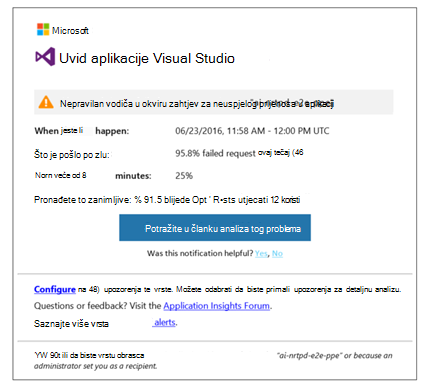
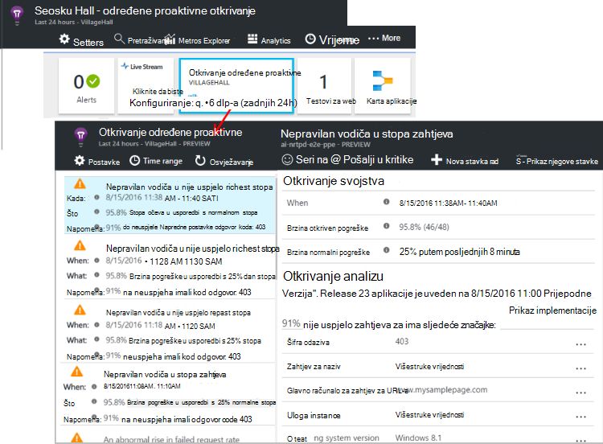

<properties 
    pageTitle="Određene proaktivne Dijagnostika u aplikaciji uvida | Microsoft Azure" 
    description="Aplikacija uvida izvodi automatsko precizno analizu telemetrijskih vaše aplikacije i upozorava vas potencijalne probleme." 
    services="application-insights" 
    documentationCenter="windows"
    authors="rakefetj" 
    manager="douge"/>

<tags 
    ms.service="application-insights" 
    ms.workload="tbd" 
    ms.tgt_pltfrm="ibiza" 
    ms.devlang="na" 
    ms.topic="article" 
    ms.date="08/15/2016" 
    ms.author="awills"/>

#  Određene proaktivne Dijagnostika u aplikaciji uvida

 Određene proaktivne Dijagnostika automatski će vas upozoriti potencijalnih problema s performansama u web-aplikaciji. Pametno analizu telemetrijskih koje šalje aplikacije [Visual Studio aplikacije uvid](app-insights-overview.md)u izvodi. Ako postoji iznenadno vodiča u stope neuspjeh ili neuobičajenog uzorcima poslužitelju ili klijentu performanse, prikazat će se upozorenje. Ta značajka mora bez konfiguracije. Radi ako aplikacija šalje dovoljno telemetrijskih.

Upozorenja određene proaktivne otkrivanja možete pristupiti iz poruke e-pošte primate, i na određene proaktivne otkrivanje plohu.

## Pregledajte svoje dlp-a određene proaktivne

Možete otkriti dlp-a na dva načina:

* **Primite poruku e-pošte** iz aplikacije uvide. Evo uobičajeni primjera:

    

    Kliknite veliki gumb da biste otvorili dodatne detalje na portalu.

* **Pločica u određene proaktivne otkrivanje** pokrenite aplikaciju pregled plohu prikazuje broj nedavno upozorenja. Kliknite pločicu da biste vidjeli popis nedavnih upozorenja.

Odaberite upozorenja da biste vidjeli pojedinosti.

## Prepoznat će se popis problema?

Postoje tri vrste otkrivanja:

* [Dijagnostika stopa određene proaktivne nije uspjelo](app-insights-proactive-failure-diagnostics.md). Koristimo strojnog učenja da biste postavili očekivani rata neuspjelih zahtjeva za aplikaciju programa, correlating s opterećenja i ostali čimbenici. Brzina pogreške vodi izvan očekivani omotnice, ne možemo poslati upozorenja.
* [Dijagnostika određene proaktivne performansi](app-insights-proactive-performance-diagnostics.md). Ne možemo potražite anomalous uzoraka vremena odaziva i stope neuspjeh svaki dan. Ne možemo povezivanje te probleme sa svojstvima kao što su mjesto, preglednika, a zatim klijent OS, instanca poslužitelja i doba dana.
* [Azure servise u Oblaku](https://azure.microsoft.com/blog/proactive-notifications-on-cloud-service-issues-with-azure-diagnostics-and-application-insights/). Ako aplikacija se hostira na servise u Oblaku Azure i instancu komponente uloga ima poteškoća pri pokretanju, često korištenih recikliranje ili ruši prilikom izvođenja primati upozorenja.

(Veze za pomoć u svakom obavijesti doći do odgovarajuće članke.)

## Daljnji koraci

Ove dijagnostičke alate pomoć u provjeri telemetrijskih iz aplikacije programa:

* [Metričkim explorer](app-insights-metrics-explorer.md)
* [Pretraživanje explorer](app-insights-diagnostic-search.md)
* [Analitički - jezik naprednih upita](app-insights-analytics-tour.md)

Određene proaktivne Dijagnostika su potpuno automatsko. No možda želite postaviti neke dodatne upozorenja?

* [Ručno konfigurirati metričkim upozorenja](app-insights-alerts.md)
* [Testira web dostupnosti](app-insights-monitor-web-app-availability.md) 

