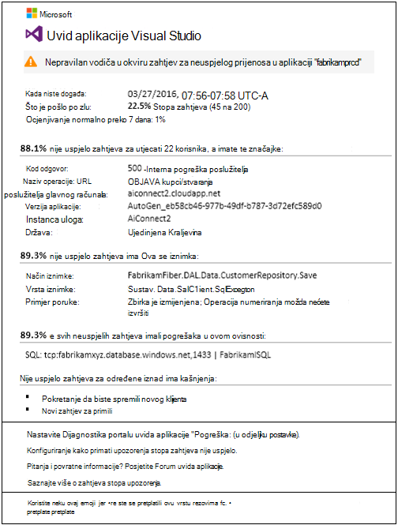
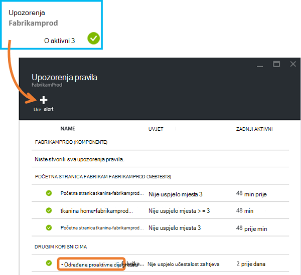
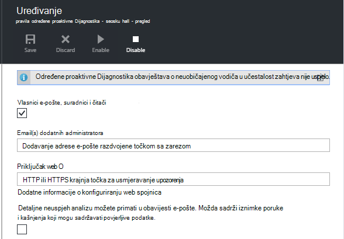
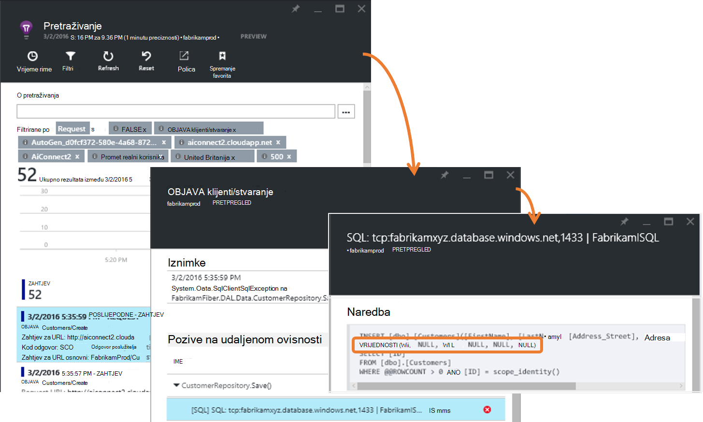
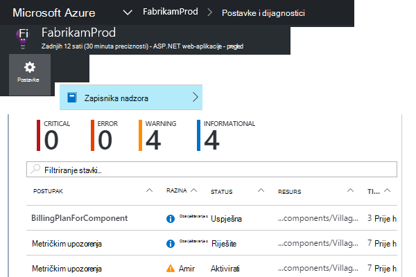
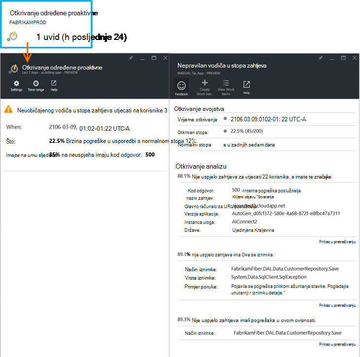

<properties 
    pageTitle="Dijagnostika stopa određene proaktivne pogreške u aplikaciji uvida | Microsoft Azure" 
    description="Upozorava vas na nepoznatu promjene u stopa neuspjelih zahtjeva na web-aplikaciju, a omogućuje dijagnostičkih analize. Potreban je bez konfiguracije." 
    services="application-insights" 
    documentationCenter=""
    authors="yorac" 
    manager="douge"/>

<tags 
    ms.service="application-insights" 
    ms.workload="tbd" 
    ms.tgt_pltfrm="ibiza" 
    ms.devlang="na" 
    ms.topic="article" 
    ms.date="10/12/2016" 
    ms.author="awills"/>
 
# Dijagnostika stopa određene proaktivne pogreške

[Uvid aplikacije za Visual Studio](app-insights-overview.md) automatski koja vas obavještava u najbliži stvarnom vremenu ako web-aplikaciju programa iskustvo neuobičajenog vodiča u Brzina pogrešaka. Otkrije neobično vodiča u stopa HTTP zahtjeva prijavili kao nije uspjelo. To su obično one pomoću kodova odgovor u 400 - i 500-raspona. Da biste lakše razvrstavati i otklanjanja poteškoća, analizu karakteristike neuspjelih zahtjeva i povezane telemetrijskih navedeni u poruci s obavijesti. Postoje i veze na portalu uvida aplikacije za daljnje Dijagnostika. Značajku mora postaviti ni konfiguracije, kao što je koristi strojnog učenja algoritama za predviđanje brzina normalni pogreške.

Ta značajka funkcionira Java i ASP.NET web-aplikacijama hostira u oblaku ili na vlastitu poslužiteljima. Može se funkcionira i za bilo koju aplikaciju koje generira zahtjev za telemetriju – na primjer, imate ulogu suradnika koji poziva [TrackRequest()](app-insights-api-custom-events-metrics.md#track-request). 

Nakon postavljanja [Aplikacije uvida projekta](app-insights-overview.md), uvjet, a aplikacije generira minimalne određeno telemetrijskih, određene proaktivne neuspjeh Dijagnostika traje 24 sata da biste saznali normalno ponašanje aplikacije, prije nego što je Uključi te da bi slati upozorenja.

Evo primjerak upozorenja. 

> [AZURE.NOTE] Po zadanom ćete dobiti e-poštu kraći oblikovanje od u ovom se primjeru. No možete [prijeći na ovom detaljne format](#configure-alerts).

Obratite pozornost na to da ga obavijestit će vas:

* Brzina pogreške u usporedbi s normalnom aplikacije ponašanje.
* Koliko korisnika utječe na – da biste znali za koliko razmišljati.
* Uzorak karakteristikama pridružene na pogreške. U ovom primjeru postoji kod određeni odgovor, zahtjev za naziv (operacije) i verzije aplikacije. Koji odmah možete vidjeti gdje tražiti u kodu. Druge mogućnosti možda određene preglednika ili klijenta operacijski sustav.
* Na iznimku, kašnjenja zapisnika i ovisnost pogreške (baza podataka ili druge vanjske komponente) koji se pojavljuju biti povezane s određene zahtjeva nije uspjelo.
* Veze izravno na odgovarajuću pretraživanja na telemetriju u uvide aplikaciju.

## Prednosti određene proaktivne upozorenja

Obična [metričkim upozorenja](app-insights-alerts.md) reći možda je došlo do problema. No određene proaktivne neuspjeh Dijagnostika pokreće dijagnostičkih posla za vas, izvođenje mnogo analizu u suprotnom morate učiniti sami. Dohvatite rezultate jednostavno pakirat u iskorištavanju da biste brzo pristupili korijenu problem.

## Kako funkcionira

Pri monitora određene proaktivne Dijagnostika stvarnom vremenu u telemetrijskih primljen iz aplikacije, a posebice u učestalost zahtjeva nije uspjelo. Ova metrika broji zahtjeve za koju se `Successful request` svojstvo je false. Prema zadanim postavkama `Successful request== (resultCode < 400)` (osim ako ste napisali prilagođeni kod za [Filtriranje](app-insights-api-filtering-sampling.md#filtering) ili generiranje pozive [TrackRequest](app-insights-api-custom-events-metrics.md#track-request) ). 

Pokrenite aplikaciju performanse sadrži uzorak standardne ponašanja. Neke zahtjeve bit će više podložni pogreške od ostalih; s cjelokupnog brzina pogreške možda kao povećava Učitaj. Dijagnostika određene proaktivne neuspjeh koristi strojnog učenja da biste pronašli te anomalies. 

Kao što je telemetrijskih stupa uvida aplikacije iz web-aplikacije, određene proaktivne neuspjeh Dijagnostika uspoređuje trenutni ponašanje uzorcima vidjeti zadnjih nekoliko dana. Ako je neuobičajenog vodiča u brzina pogreške opaženih by comparison with prethodne performanse, aktivira se analize.

Kada se pokrene analizu, servis provodi klaster analizu nije uspjelo zahtjev, pokušajte da biste odredili uzorak vrijednosti koje karakteriziraju na pogreške. U gornjem primjeru analizu pronašao većine pogrešaka jesu li o kod određenog rezultata, naziv zahtjev, glavno računalo URL poslužitelja i uloga instance. Za razliku od toga analizu pronašao svojstvo za operacijski sustav klijent distribuira preko više vrijednosti i tako da ga nije naveden na popisu.

Kada je na servisu instrumented s ove telemetrijskih, u analyser pronalazi iznimku i ovisnosti pogreške koje su vezane uz zahtjeve u skupini je otkrio, zajedno s primjera sve zapisnika praćenja povezane s tim zahtjevima za.

Analiza rezultata je poslan kao upozorenje, osim ako ga ne ste konfigurirali.

Kao što su [obavijesti o ručno postavljanje](app-insights-alerts.md)možete pregledati stanje upozorenja i konfiguriranje u plohu upozorenja vaše aplikacije uvida resursa. No, za razliku od drugih upozorenja, ne morate postaviti ili konfiguriranje Dijagnostika određene proaktivne pogreške. Ako želite, možete ga onemogućiti ili promijeniti njegov ciljne adrese e-pošte.

## Konfiguriranje upozorenja 

Možete onemogućiti određene proaktivne Dijagnostika, promjena primatelja e-pošte, stvorite na webhook ili uključivanje detaljnije poruke upozorenja.

Otvorite stranicu upozorenja. Određene proaktivne Dijagnostika uključen zajedno s bilo kojeg upozorenja koje ste ručno postavili pa možete vidjeti hoće li se trenutno stanje upozorenja.

Kliknite upozorenje da to učini.

Obavijest da možete onemogućiti određene proaktivne Dijagnostika, ali ne možete je izbrisati (ili stvoriti novi).

#### Detaljne upozorenja

Ako odaberete "Primanje detaljnu analizu" e-poštu će sadržavati više dijagnostičke informacije. Ponekad ćete moći dijagnosticiranje problema samo iz podataka u e-pošte. 

Postoji napraviti manje rizika detaljnije upozorenje može sadržavati povjerljive podatke jer sadrži iznimke i praćenje poruka. Međutim, to bi samo dogoditi kod nije Dopusti povjerljive podatke u te poruke. 

## Triaging i dijagnosticiranje upozorenja

Upozorenje upućuje na to otkriven je neuobičajenog vodiča u učestalost zahtjeva nije uspjelo. Je vjerojatnost da postoji neki problem s aplikacijom ili okruženju.

Od postotka zahtjeva i broj korisnika utjecati možete odlučiti kako hitno je problem. U gornjem primjeru neuspjeh rata 22.5% u usporedbi s normalnom rata 1%, označava da nešto loše se događa. S druge strane, samo 11 su odnosi na korisnike. Ako je aplikacije, želite moći procijenite kako ozbiljne je.

U mnogim slučajevima, moći dijagnosticiranje problema brzo iz zahtjeva za naziv, iznimku, pogreška i praćenje ovisnost podataka koje su navedene. 

Postoje neka clues. Ako, na primjer, ovisnosti brzina pogreške u ovom primjeru jednak iznimku stopa (89.3%). Predlaže da se iznimka nastaje izravno iz pogreška ovisnost – dodjeljivanja Očisti ideju gdje tražiti u kodu.

Da biste istražili dodatne, veze na svakoj sekciji će vas odvesti izravno na [stranicu za pretraživanje](app-insights-diagnostic-search.md) filtrirane tako da se odgovarajući zahtjeve, iznimku, ovisnosti ili kašnjenja. Ili otvorite [portal za Azure](https://portal.azure.com), dođite do uvida aplikacije resursa za aplikacije i otvorite plohu pogreške.

U ovom se primjeru klikom na vezu "U detaljima ovisnost pogreške" otvara plohu pretraživanje aplikacije uvida u SQL naredbi s uzrok: vrijednosti null gdje na obavezna polja i nije prošla provjere valjanosti tijekom spremanja operacija.

## Pregled nedavnih upozorenja

Da biste pregledali upozorenja na portalu, otvorite **Postavke zapisnika nadzora**.

Kliknite bilo koju upozorenje da biste vidjeli njezin cijelog detalja.

Ili kliknite **određene proaktivne otkrivanje** da biste dobili ravne na zadnjoj Upozorenje:

## Koja je razlika...

Dopuna određene proaktivne neuspjeh stopa Dijagnostika druge slične ali različitih značajki aplikacije uvida. 

* [Metrika upozorenja](app-insights-alerts.md) koje ste postavili i možete nadzirati širok raspon mjernih podataka kao što su procesora occupancy, stope zahtjev, vremena učitavanja stranice i tako dalje. Možete ih koristiti da bi vas upozorila, na primjer, ako trebate dodati dodatne resurse. Suprotno tome, određene proaktivne neuspjeh Dijagnostika pokrivaju small raspon ključnih mjernih podataka (trenutno samo zahtjeva stopa), namijenjenu obavijesti u blizini stvarnom vremenu kad nije uspjela web app zatražite stopa povećava znatno u usporedbi s normalno ponašanje web app.

    Dijagnostika stopa određene proaktivne neuspjeh automatski prilagođava praga u odgovoru prevailing uvjeta.

    Dijagnostika stopa određene proaktivne pogreška pokrenuti dijagnostičkih posla za vas. 
* [Dijagnostika određene proaktivne performansi](app-insights-proactive-performance-diagnostics.md) koristi i obavještavanje računala da biste otkrili nepoznatu uzorke u vašem mjernih podataka, a ne konfiguraciju tako da vam je potrebno. Dok je za razliku od određene proaktivne neuspjeh stopa Dijagnostika, svrha Dijagnostika određene proaktivne performansi da biste pronašli segmente od vašeg korištenja preslika koja možda ozbiljno služila – na primjer, po određene stranice na određenu vrstu preglednika. Analiza provodi svakodnevno pa je ako se pronađe bilo koji rezultat, vjerojatno će biti mnogo manje hitno od upozorenja. Suprotno tome, kontinuirano izvršiti analizu za dijagnostiku određene proaktivne pogreške na dolazne telemetrijskih pa ćete primati obavijesti u roku od nekoliko minuta ako su veće od očekivan stope pogreška poslužitelja.

## Ako vam se prikaže upozorenje za dijagnostiku stopa određene proaktivne pogreške

*Zašto primili upozorenje?*

*   Otkrili smo neuobičajenog vodiča u stopa neuspjelih zahtjeva u usporedbi s normalnom osnovne prethodnih razdoblja. Nakon analizu pogrešaka i pridruženi telemetrijskih ćemo zamislite da postoji problem koji se trebala bi izgledati u. 

*Obavijesti znači sigurno imaju problema?*

*   Ne možemo pokušati upozorenja na aplikaciju prekidu ili smanjene performanse, iako samo potpuno znate semantiku i utjecaj na aplikaciju ili korisnicima.

*Tako, guys pogledate moje podatke?*

*   ne. Servis nije potpuno automatsko. Samo se obavijesti. Podaci su [privatni](app-insights-data-retention-privacy.md).

*Imate za pretplatu na ovo upozorenje?* 

*   ne. Svaku aplikaciju slanje zahtjeva za telemetriju ima upozorenja pravilo.

*Kako otkazati pretplatu-dobivati obavijesti poslati Moji suradnici umjesto toga?*

*   Da, u upozorenja pravila, kliknite pravilo određene proaktivne Dijagnostika da to učini. Onemogućivanje upozorenja ili promjena primatelji upozorenja. 

*U slučaju gubitka e-pošte. Gdje pronaći obavijesti na portalu?*

*   U zapisnicima nadzora. Kliknite postavke, a zatim zapisnike nadzora, a zatim bilo koji se upozorenje da biste vidjeli njezin pojavljivanje, ali s ograničenim detaljan prikaz.

*Neka upozorenja koja su poznatih problema, a ne želim primati.*

*   Imamo upozorenja potiskivanje na našem zaostale.

## Daljnji koraci

Ove dijagnostičke alate pomoć u provjeri telemetrijskih iz aplikacije programa:

* [Metričkim explorer](app-insights-metrics-explorer.md)
* [Pretraživanje explorer](app-insights-diagnostic-search.md)
* [Analitički - jezik naprednih upita](app-insights-analytics-tour.md)

Potpuno automatsko su određene proaktivne dlp-a. No možda želite postaviti neke dodatne upozorenja?

* [Ručno konfigurirati metričkim upozorenja](app-insights-alerts.md)
* [Testira web dostupnosti](app-insights-monitor-web-app-availability.md) 

