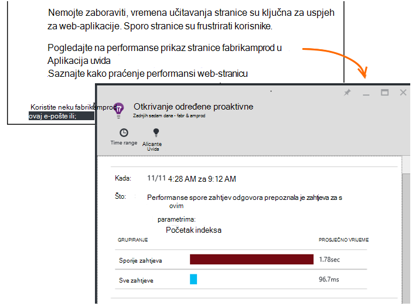

<properties 
    pageTitle="Uvida aplikacije: Dijagnostika određene proaktivne performansi | Microsoft Azure" 
    description="Aplikacija uvida izvodi precizno analizu telemetrijskih vaše aplikacije i upozorava vas potencijalne probleme." 
    services="application-insights" 
    documentationCenter="windows"
    authors="antonfrMSFT" 
    manager="douge"/>

<tags 
    ms.service="application-insights" 
    ms.workload="tbd" 
    ms.tgt_pltfrm="ibiza" 
    ms.devlang="na" 
    ms.topic="article" 
    ms.date="08/31/2016" 
    ms.author="awills"/>

#  Dijagnostika određene proaktivne performansi

*Aplikacija uvida je u pretpregledu.*

[Uvid aplikacije za Visual Studio](app-insights-overview.md) izvodi precizno analizu telemetrijskih vaše aplikacije, a možete Upozori potencijalne probleme s performansama. Vjerojatno ovo čitate jer je jedan od naše određene proaktivne upozorenja primljene putem e-pošte. 

Ova značajka zahtijeva bez postavljanja i aktivan automatski pri aplikacijom generira dovoljno telemetrijskih.

## Što su Dijagnostika određene proaktivne performansi?

Dijagnostika određene proaktivne performansi otkrije neobično uzoraka performanse u svojoj aplikaciji analizom telemetrijskih koje aplikacije šalje aplikacije uvid u. 

Posebno pronalazi probleme s performansama koje utječu samo na nekim korisnicima ili samo utjecati na korisnike u nekim slučajevima.

Ako, na primjer, ga možete vas obavijestiti ako stranica aplikacije znatno usporiti učitavanje tipu preglednika od ostalih ili zahtjeva za sporije poslužena s određenom poslužitelja. Ga, možete otkriti probleme povezane s kombinacije svojstva, kao što su učitavanja sporo stranice u jednom zemljopisnom području u određenom trenutku dana.

Anomalies kao što su ovi vrlo teško je otkriti samo provjerom podatke, ali su uobičajene nego što mislite. Često su samo plošni kada požali klijentima. Pomoću tog vremena je prekasno: zahvaćene korisnike već prelazite na konkurenata!

Trenutno naš algoritama pogledajte vremena učitavanja stranice, zahtjev za odgovor vremena na poslužitelju i ovisnosti odgovor vremena.  

Ne morate da biste postavili sve pragovi ili konfigurirati pravila. Da biste otkrili neuobičajenog uzoraka koriste se strojnog učenja i algoritmi dubinsku analizu podataka. 

Ispričavamo se vrlo krenuti da bi povratne informacije. Javite nam znati kako olakšava vam, kako mogu poboljšati određene proaktivne otkrivanje i koje dodatne mogućnosti želite li da biste dodali. Možete povratne informacije putem slanje pohvale/kritike na portalu ili e-pošte nam AppInsightsML@microsoft.com. 

## O određene proaktivne upozorenja

* *Zašto se ova e-poštom ste primili?*
 * Otkrivanje određene proaktivne analizirati telemetrijskih vaše aplikacije poslane do uvida aplikacije i otkrio problem s performansama u aplikaciji. 
* *Obavijesti znači sigurno imaju problema?*
 * ne. To je jednostavno prijedlog o nečemu želite pogledati više usko. 
* *Što da radim?*
 * [Pregled podataka koji se prikazuju](#responding-to-an-alert). Korištenje Eksplorera za metriku da biste pregledali performanse s vremenom i Dubinska analiza dodatne metriku. Korištenje pretraživanja za filtriranje određene događaje koje olakšavaju prepoznavanje uzrok. 
* *Tako, guys pogledate moje podatke?*
 * ne. Servis nije potpuno automatsko. Samo se obavijesti. Podaci su [privatni](app-insights-data-retention-privacy.md).

## Od procesa otkrivanja

* *Koje vrste anomalies performanse otkrije?*
 * Uzorci koji će vam biti dugotrajan da biste provjerili za sebe. Na primjer, slabe performanse u određenu kombinaciju mjesto, doba dana i platforme.
* *Učinite analizirati sve podatke prikupljene putem aplikacije uvida?*
 * Ne na prezentacije. Trenutno ne možemo analizirati zahtjev reakcija, ovisnosti reakcija i stranica učitavanje vremena. Analiza dodatne metriku uskoro dostupno. 
* *Je li moguće stvoriti vlastiti značajkom pravila za otkrivanje?*
 * još ne. No možete:
 * [Postavljanje upozorenja](app-insights-alerts.md) koje određuju kada metrike presjek praga.)
 * [Izvoz telemetriju](app-insights-export-telemetry.md) u [ [bazu podataka](app-insights-code-sample-export-sql-stream-analytics.md) ili da biste PowerBI](app-insights-export-power-bi.md) ili [druge](app-insights-code-sample-export-telemetry-sql-database.md) alate za, gdje ih možete analizirati sami.
* *Koliko se često provodi analizu*
 * Ne možemo pokrenuti analizu dnevno na telemetrijskih na prethodni dan.
* * Tako da to ne zamjena [metričkim upozorenja](app-insights-alerts.md)?
 * ne.  Ne možemo izvršiti da biste otkrili svaki ponašanje koje razmislite o neuobičajenog.

## Kako istražiti probleme potenciju

Otvorite izvješće u dijagnostičkih iz e-pošte ili na popisu anomalies.

* **Kada** se prikazuje vrijeme otkriven problem.
* **Što** se opisuje
 * Problem otkrivenog;
 * Osobina skupa događaje koje smo pronašli prikazuje ponašanje problem.
* U tablici uspoređuje skup poorly izvođenje s average ponašanje druge događaje.

Kliknite veze da biste otvorili web-mjesto Explorer metriku i u okvir za pretraživanje na odgovarajuću izvješća, filtriran prema svojstva skupa sporo predstavljanja i vrijeme.

Izmjena vremenski raspon i filtre da biste istražili za telemetriju.

## Kako poboljšati performanse?

Sporo i neuspješnih odgovore su jedan od najvećih frustrations za korisnike web-mjesta, znate vlastite iskustvo. Stoga je važno da biste riješili probleme.

### Razvrstavanje

Najprije je važno? Ako se uvijek sporo učitavanje stranice, ali možete pregledati na ikad imati samo 1% korisnika web-mjesta, možda imate više važne stvari koje razmislite o tome. S druge strane, ako je samo otvoriti 1% korisnika, ali throws iznimke prilikom svakog, koji bi mogli biti vrijedi istražuje.

Koristiti naredbu utjecaj e-pošte kao opće smjernice, ali imajte na umu da nije cijelu priču. Prikupite druge dokaz da biste je potvrdili.

Razmislite o parametrima problem. Ako je ovisne o zemljopisnoj, postavljanje [dostupnosti testira](app-insights-monitor-web-app-availability.md) uključujući to područje: jednostavno možda postoji problema s mrežom u tom području. 

### Dijagnosticiranje opterećenje sporo stranice 

Pri čemu je problem? Poslužitelj je spora da biste odgovorili, je stranica vrlo dugo ili ne pregledniku potrebno mnogo rad da biste ga prikazali?

Otvorite plohu metričkim preglednika. [Segmentirani prikaza vremena učitavanja stranice za preglednik](app-insights-javascript.md#explore-your-data) prikazuje gdje će vrijeme. 

* Ako je **Vrijeme zahtjeva za slanje** visoka, poslužitelj sporo odgovara ili je zahtjev objavu s velike količine podataka. Pogledajte [metriku performanse](app-insights-web-monitor-performance.md#metrics) da biste istražili puta odgovor. 
* Postavljanje [praćenja ovisnosti](app-insights-dependencies.md) da biste vidjeli je li u sporost programa zbog vanjske servise ili bazu podataka.
* Ako je **Dobivate odgovor** Izraelu, stranice i njezin zavisne dio – JavaScript, CSS-a, slike i tako dalje (ali ne asinkrono učitavanja podataka) su dugi. Postavljanje programa [testiranje dostupnosti](app-insights-monitor-web-app-availability.md), a ne zaboravite da biste postavili mogućnost da biste učitali zavisne dijelove. Kada se prikaže neki rezultati, otvorite detalje rezultata i proširivanje da biste vidjeli vremena učitavanja različitih datoteka.
* Visoke **vrijeme klijentskog obrade** predlaže skripte su sporo. Ako ne razlog očite, razmislite o dodavanju neke kod tempiranja i slanje vremena u trackMetric pozive.

### Poboljšanje sporo stranice

Postoji web-mjesto pune savjete o poboljšanju odgovore poslužitelja i vremena učitavanja stranice, pa ne možemo neće pokušati ponoviti sve ovdje. Evo nekoliko savjeta koje vjerojatno je već znate, da biste započeli mislim:

* Sporo učitavanja zbog velike datoteke: Asinkrono učitavanje skripte i druge dijelove. Pomoću skripte usnopljavanje. Podijelite glavne stranice u miniaplikacije koje zasebno učitavaju svoje podatke. Ne šalji običan stari HTML za dugačke tablice: koristiti skriptu da biste zatražili podatke kao JSON ili neki drugi sažetom oblik, a zatim unesite tablice na istom mjestu. Postoje sjajno okviri će vam pomoći u sve to. (Oni i entail velike skripte, naravno.)
* Usporiti ovisnosti poslužitelja: razmislite o zemljopisnim područjima komponente. Ako, na primjer, ako koristite Azure, provjerite jesu li web-poslužitelj i bazu podataka u istom području. Učinite upita dohvatiti od koje su im potrebne dodatne informacije? Želite predmemoriranje ili grupnog slanja promjena pomoć?
* Kapaciteta problema: Pogledajte poslužitelja mjerenja vremena odgovor i broji zahtjev. Ako je vrijeme odaziva Vršna neproporcionalno s peaks u broji zahtjev, vjerojatno je da su Rastegnuto poslužitelja. 

## Obavijesti e-pošte

* *Imate za pretplatu na taj servis za primanje obavijesti o?*
 * ne. Naš robot povremeno upitnike podatke iz sve korisnike računala uvida i šalje obavijesti otkrije probleme.
* *Kako otkazati pretplatu-dobivati obavijesti poslati Moji suradnici umjesto toga?*
 * Kliknite vezu Otkaži pretplatu na upozorenju ili e-pošte. 
 
    Trenutno promiču osobe koje imaju [pristup zapisivanju resursa uvida aplikacije](app-insights-resources-roles-access-control.md).

    Možete urediti i popis primatelja postavke u plohu određene proaktivne otkrivanja.
* *Ne želite da vas se flooded s te poruke.*
 * Ograničene jednom dnevno najrelevantnije problem koje ćemo još niste prijavili o još su. Neće se ponavlja bilo koju poruku.
* *Ako se ništa ne učinite, će se podsjetnik?*
 * Ne dobijete poruku o svakom problemu samo jedanput. 
* *U slučaju gubitka e-pošte. Gdje pronaći obavijesti na portalu?*
 * U aplikaciji uvida pregled aplikacije kliknite pločicu **Određene proaktivne otkrivanja** . Tamo moći da biste pronašli sve obavijesti prema gore u stražnji plan 7 dana.

## Daljnji koraci

Ove dijagnostičke alate pomoć u provjeri telemetrijskih iz aplikacije programa:

* [Metričkim explorer](app-insights-metrics-explorer.md)
* [Pretraživanje explorer](app-insights-diagnostic-search.md)
* [Analitički - jezik naprednih upita](app-insights-analytics-tour.md)

Potpuno automatsko su određene proaktivne dlp-a. No možda želite postaviti neke dodatne upozorenja?

* [Ručno konfigurirati metričkim upozorenja](app-insights-alerts.md)
* [Testira web dostupnosti](app-insights-monitor-web-app-availability.md) 

