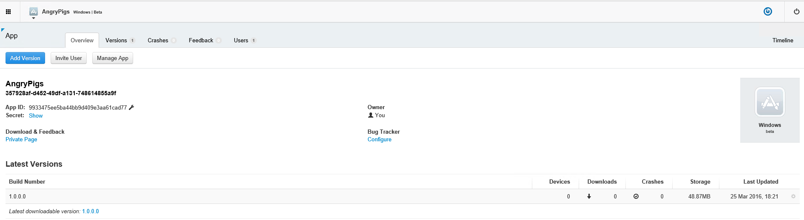
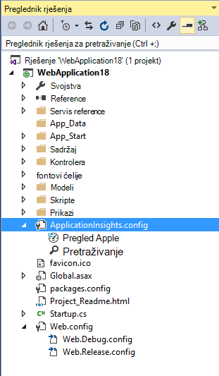

<properties
    pageTitle="Napomene za proširenje za Visual Studio analitičkih za razvojne inženjere"
    description="Najnovija ažuriranja za Visual Studio tools za razvojne inženjere analizu."
    services="application-insights"
    documentationCenter=""
    authors="acearun"
    manager="douge"/>
<tags
    ms.service="application-insights"
    ms.workload="tbd"
    ms.tgt_pltfrm="ibiza"
    ms.devlang="na"
    ms.topic="article"
    ms.date="06/09/2016"
    ms.author="acearun"/>

# Napomene za alate Analytics za razvojne inženjere
Što je novo: uvida aplikacije i HockeyApp analize u Visual Studio.
## Verzije 7.0
### Trendova uvida aplikacije za Visual Studio
Uvid aplikacije za Visual Studio je novog alata u Visual Studio koje možete koristiti da biste lakše analizirati kako funkcionira aplikacije tijekom vremena. Za početak na gumb na alatnoj traci **Uvida aplikacija** ili u prozoru aplikacije uvida pretraživanja odaberite **Istraživanje Telemetrijskih trendova**. Ili, na izborniku **Prikaz** kliknite **Ostale Windows**, a zatim **Aplikaciju uvida trendova**. Odaberite neku od pet uobičajene upite za početak rada. Možete analizirati različitih skupova podataka na temelju vrste telemetrijskih, vremenski raspon i druga svojstva. Da biste pronašli anomalies u vašim podacima, odaberite neku od mogućnosti značajkom na padajućem popisu **Vrsta prikaza** . Mogućnosti filtriranja pri dnu prozora olakšavaju uobličite u na određenim podskupovima vaše telemetrijskih.

### Iznimke u CodeLens
Iznimke telemetrijskih sada prikazuje u CodeLens. Ako projekt ste povezali sa servisom uvida aplikacije, prikazat će se broj iznimke koji su se pojavili u svakom načinu proizvodnje u zadnjih 24 sata. Iz CodeLens, možete se prebaciti na pretraživanje ili trendova da biste istražili iznimke u više detalja.

### Podrška za Core platforme ASP.NET
Aplikacija uvida sada podržava ASP.NET osnovne RC2 projekata u Visual Studio. Uvid aplikaciju možete dodati novih ASP.NET osnovne RC2 projekata u dijaloškom okviru **Novi projekt** , kao sljedeće snimku zaslona. Ili, možete ga dodati u postojeći projekt, desnom tipkom miša kliknite projekt u pregledniku rješenja i zatim **Dodati Telemetrijskih uvida aplikacije**.

ASP.NET 5 RC1 i ASP.NET osnovne RC2 projekata i imaju nova podrška u prozoru dijagnostičke alate. Vidjet ćete aplikacije uvida događaje kao što su zahtjeve i iznimke iz aplikacije programa ASP.NET dok ste ispravljanje pogrešaka lokalno na vašem Računalu. Svaki događaj kliknite **pretraživanje** kroz razine naniže dodatne informacije.

### HockeyApp za univerzalni Windows aplikacije
Osim beta raspodjelu i korisničke povratne informacije, HockeyApp nudi symbolicated rušenje izvješćivanje o aplikacijama univerzalni Windows. Unijeli smo ga pojednostaviti da biste dodali HockeyApp SDK: desnom tipkom miša kliknite na projektu univerzalni Windows, a zatim kliknite **Na Ledu aplikaciju – Omogućivanje pasti analize**. To instalira SDK postavlja rušenje zbirke, a dodjeljuje HockeyApp resursa u oblaku, ne prenosi aplikacije servisa HockeyApp.

Ostale nove značajke:

* Unijeli smo u aplikaciji uvida pretraživanju brže i više intuitivno. Sada vremenski raspon i filtri detalja automatski primjenjuju dok ih odabirete.
* Također u pretraživanju uvida aplikaciju, sada postoji mogućnost da biste se prebacili u kodu izravno iz zahtjeva za telemetriju.
* Unijeli smo poboljšanja sučelje za prijavu HockeyApp.
* U dijagnostičke alate radnog telemetrijskih podataka za iznimke se prikazuju.

## Verzija 5,2
Radimo zadovoljni objava Uvod HockeyApp scenariji u Visual Studio. Prvi Integracija se beta raspodjelu univerzalni Windows aplikacije i obrasce Windows aplikacije iz Visual Studio.

S beta-razdiobu, prenosite ranije verzije aplikacije u HockeyApp za raspodjelu podskup odabranih klijenata ili mogućnost. Beta-razdiobu, u kombinaciji s HockeyApp rušenje prikupljanje i korisnik povratne informacije značajke, može vam pružiti vrijedne informacije o aplikacije prije općenite izdanje. Možete koristiti ti podaci prikazivali adresu problema s aplikacijom tako da možete izbjeći ili minimizirati buduće probleme, kao što su ocjene niskog aplikaciju, negativnih povratnih informacija i tako dalje.

Pogledajte kako je jednostavno prenijeti sastavlja za beta raspodjelu iz Visual Studio.
### Univerzalni Windows aplikacije
Kontekstni izbornik za čvor projekta aplikacije univerzalni Windows sada obuhvaća mogućnost da biste prenijeli na Sastavi HockeyApp.

Odaberite stavku i HockeyApp otvara se dijaloški okvir prijenos. Morate HockeyApp računa da biste prenijeli na Sastavi. Ako ste novi korisnik, ne brinite. Stvaranje poslovnog subjekta jednostavan je postupak.

Kada ste povezani, vidjet ćete obrazac za prijenos u dijaloškom okviru.

Odabir sadržaja da biste prenijeli (.appxbundle ili .appx datoteku), a zatim mogućnosti izdanja u čarobnjaku. Po želji možete dodati napomene na sljedećoj stranici. Odaberite **Završi** da biste započeli prijenos.

Kada prijenos završi, prikazat će se obavijest HockeyApp s potvrde i veza na aplikaciju na portalu HockeyApp.

To je to! Upravo ste prenijeli Sastavi za beta-razdiobu sa samo nekoliko klikova.

Možete upravljati aplikacija na razne načine na portalu HockeyApp. To uključuje pozivanje korisnika koji se pregledavaju rušenje izvješća i povratne informacije, promjenom Detalji i tako dalje.

Potražite u članku [iz baze znanja HockeyApp](http://support.hockeyapp.net/kb/app-management-2) dodatne informacije o upravljanju aplikacije.

### Windows aplikacije za obrasce
Kontekstni izbornik za čvor projekta Windows obrasca sada obuhvaća mogućnost da biste prenijeli na Sastavi HockeyApp.

Otvorit će se dijaloškom okviru prijenos HockeyApp koja je slična onoj u aplikaciji Windows univerzalni.

Imajte na umu novo polje u taj Čarobnjak za određivanje verzije aplikacije programa. Za aplikacije univerzalni Windows, podaci se popunjava iz manifesta. Aplikacija Windows obrasci, nažalost, ne morate ekvivalent u ove značajke. Morat ćete ih ručno određivanje.

Ostale tijek je slična univerzalni Windows aplikacije: Odaberite Sastavi i pustite mogućnosti, dodajte izdanje notes, prijenos i upravljanje na portalu HockeyApp.

Koji se jednostavno je. Isprobajte sami i Recite nam što mislite.
## Verzija 4,3
### Traženje telemetrijskih iz sesije lokalne ispravljanje pogrešaka
Uz to je izdanje sada možete potražiti aplikaciju uvida telemetrijskih generira u sesiji ispravljanje pogrešaka za Visual Studio. Prije, možete koristiti pretraživanje samo ako aplikacije registriran uvida aplikacije. Sada aplikacije samo mora imati SDK uvida aplikacija instalirana za traženje telemetrijskih lokalni.

Ako imate ASP.NET aplikacijom uvida SDK aplikacije, učinite sljedeće korake da biste koristili pretraživanje.

1. Aplikacija za ispravljanje pogrešaka.
2. Otvorite aplikaciju uvida pretraživanje na jedan od sljedećih načina:
    - Na izborniku **Prikaz** kliknite **Ostale Windows**, a zatim **Pretraživanje uvida aplikacije**.
    - Kliknite gumb na alatnoj traci **Aplikacije uvide** .
    - U pregledniku rješenja proširite **ApplicationInsights.config**, a zatim **telemetrijskih sesiju ispravljanje pogrešaka za pretraživanje**.
3. Ako još niste prijavili pomoću aplikacije uvida, prozor za pretraživanje će se otvoriti u načinu rada za telemetriju sesije za ispravljanje pogrešaka.
4. Kliknite ikonu **Traži** da biste vidjeli vaše lokalne telemetrijskih.

## Verzija 4.2
U ovom izdanju dodali smo značajke koje olakšavaju traženje podataka u kontekstu događaje, uz mogućnost da biste prešli s kodom iz više podataka događaja i jednostavno iskustvo da biste poslali zapisivanje podataka do uvida aplikacije. Ovaj kućni broj ažurira mjesečno. Ako imate povratne informacije ili značajku zahtjeva, pošaljite ga da biste aidevtools@microsoft.com.
### Sučelje za zapisivanje bez kliknite
Ako već koristite NLog, log4net ili System.Diagnostics.Tracing, ne morate brinuti o premještanju sve svoje kašnjenja do uvida aplikacije. U ovom izdanju ne možemo ste integrirani prilagodnika aplikacije uvida zapisivanje sučelje normalni konfiguracije.
Ako već imate jednu od ovih okviri zapisivanje konfiguriran, sljedeći odjeljak opisuje način da biste ga.
**Ako ste već dodali uvida aplikacije:**
1. Desnom tipkom miša kliknite čvor projekta i zatim **Uvida aplikacije**, a zatim **Konfigurirati uvida aplikacije**. Provjerite je li vidite mogućnost dodavanja odgovarajući prilagodnik u prozoru konfiguracije.
2. Osim toga, prilikom stvaranja rješenja, imajte na umu skočni prozor koji se pojavljuje u gornjem desnom kutu zaslona kliknite **Konfiguriraj**.

Ako imate instaliran prilagodnik za zapisivanje, pokrenite aplikaciju i provjerite nalazi li se podaci na kartici Alati za dijagnostiku ovako:

### Prelazak na ili pronalaženje šifre gdje je čuje telemetrijskih svojstvo događaja
S novim izdanjima korisnik može kliknuti na bilo koja vrijednost osim događaja pojedinosti i to će potražite odgovarajući niz u trenutno otvorene rješenje. Rezultati prikazat će se u Visual Studio "Pronalaženje rezultata" popis kao što je prikazano u nastavku:

### Novi prozor za pretraživanje za kada niste prijavljeni
Ne možemo ste poboljšati izgled prozora za pretraživanje uvida aplikaciju da biste lakše traženje podataka dok je aplikacija u radni.

### Pogledajte sve telemetrijskih događaje povezanog s događajem
Dodali smo novu karticu s unaprijed definirane upita za sve podatke koji se odnose na događaj telemetrijskih je korisnik prikaza, pokraj kartice za detalja o događaju. Na primjer, zahtjeva za ima poljem pod nazivom **ID operacije**. Svaki događaj povezane zahtjev ima istu vrijednost za **ID operacije**. U slučaju iznimku tijekom postupka obrađuje zahtjev, iznimku izražen je isti postupak ID kao zahtjev da biste lakše pronašli. Ako tražite na zahtjev, kliknite **sve telemetrijskih za ovaj postupak** da biste otvorili na novoj kartici koja se prikazuje nova rezultata pretraživanja.

### Naprijed i natrag povijest u pretraživanju
Sada možete prijeći natrag i naprijed između rezultata pretraživanja.

## Verzija 4.1
U ovom izdanju isporučuje se s nekoliko novih značajki i ažuriranja. Morate imati instaliran da biste instalirali ovo izdanje ažuriranje 1.

### Prijelaz s iznimku na način u izvornog koda
Sada ako pogledate iznimke iz aplikacije programa proizvodnje u prozoru aplikacije uvida pretraživanja, možete prijeći na način u kodu gdje se pojavljuje iznimku. Samo morate imati ispravne učitati projekta i aplikacije uvida vodi brigu o ostale! (Da biste saznali više o prozor za pretraživanje uvida aplikacije, pogledajte napomene u verzije 4.0 u sljedećim odjeljcima).

Kako to funkcionira? Možete koristiti aplikacije uvida pretraživanje čak i kad je rješenje nije otvorena. Praćenje područja stogu prikazuje poruka s informacijama, a veći broj stavki u stogu praćenja nisu dostupne.

Ako je dostupan informacija o datoteci, neke stavke mogu se veze, ali stavke podataka rješenja i dalje biti vidljivi.

Ako kliknete hipervezu, prikazat će se skočni mjesto odabrani način u kodu Možda postoje razlike u broj verzije, ali značajka da biste se prebacili na ispravnu verziju kod, prosljeđivala u noviji izdanja.

### Nove točke unosa na pretraživanje iskustvo u pregledniku rješenja
Sada možete pristupiti pretraživanja kroz preglednik rješenja.

### Prikazat će obavijest kad objavite dovršetka
Na skočnom pojavljuje se dijaloški okvir projekta je objavljen na mreži, tako da pogledate podataka aplikacije uvida u radni.

## Verzije 4.0

### Pretraživanje aplikacije uvida podatke iz Visual Studio
Funkcija pretraživanja u aplikacije uvida portal sada u Visual Studio možete filtrirati i pretraživanje vrsta događaja, svojstvo vrijednosti i tekst se sviđa, a zatim Provjera pojedinačne događaja.

### Pogledajte podatke koji dolaze s lokalnog računala u dijagnostičke alate

Na stranici za Visual Studio Tools dijagnostičkih možete pogledati telemetrijskih, uz druge podatke za ispravljanje pogrešaka. Podržana je samo 4,5 ASP.NET.

### Dodavanje SDK projekta prijavljene Azure

Više ne morate prijaviti na Azure da biste dodali paketa aplikacije uvid u projekt ili putem dijaloški okvir **Novi projekt** na kontekstnom izborniku projekta. Ako se prijavite, SDK će biti instalacije i konfiguracije da biste poslali telemetrijskih portal kao prije. Ako se ne prijavite, SDK dodat će se u projektu i generirat će telemetrijskih za dijagnostičkih koncentratora. Možete konfigurirati ga kasnije ako želite.

### Podrška za uređaje

Pri *funkcija Connect();* 2015, ne možemo [objaviti](https://azure.microsoft.com/blog/deep-diagnostics-for-web-apps-with-application-insights/) je HockeyApp na našem sučelje za mobilni za razvojne inženjere za uređaje. HockeyApp pomaže vam distribucija beta izgradi da biste na mogućnost, prikupljanje i analizirati sve ruši iz aplikacije i prikupljanje povratnih informacija izravno s klijentima.
HockeyApp podržava aplikacije na drugu platformu odaberite da biste sastavili, hoće li koji mogu iOS, Android i Windows ili rješenje različite platforme kao što su Xamarin, Cordova ili jedinstvo.

U budućnosti izdanja proširenja uvida aplikacije, ali ne možemo ćete predstavljanje integrirano sučelje između HockeyApp i Visual Studio. Zasad, možete početi s HockeyApp dodavanjem na referencu NuGet. Potražite u [dokumentaciji](http://support.hockeyapp.net/kb/client-integration-windows-and-windows-phone) za dodatne informacije.
