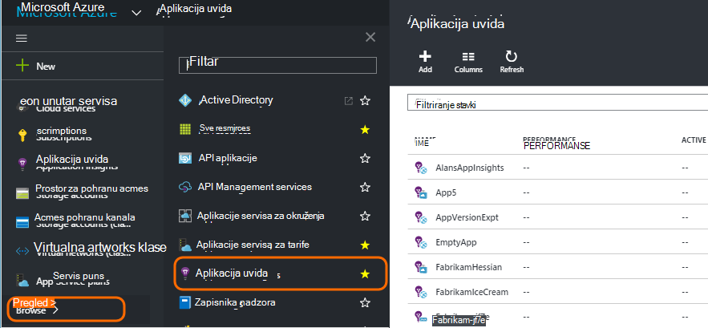
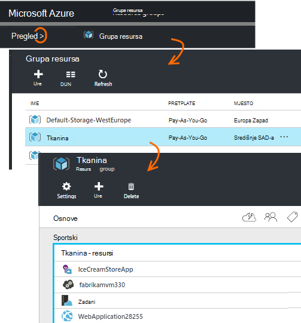
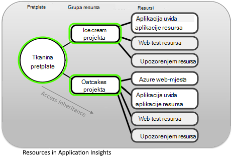
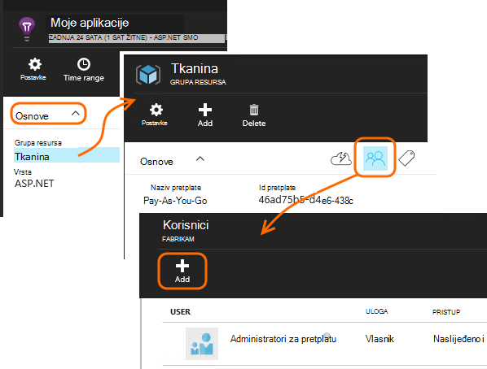
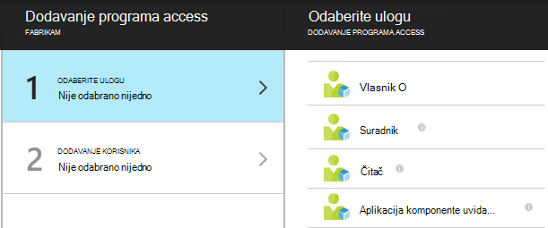
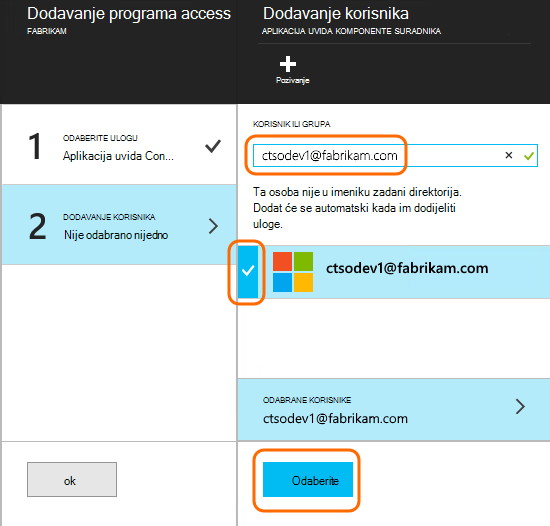

<properties
    pageTitle="Resursi, uloge i kontrola pristupa u aplikaciji uvida"
    description="Vlasnici, suradnici i čitatelji uvida u vašoj tvrtki ili ustanovi."
    services="application-insights"
    documentationCenter=""
    authors="alancameronwills"
    manager="douge"/>

<tags
    ms.service="application-insights"
    ms.workload="tbd"
    ms.tgt_pltfrm="ibiza"
    ms.devlang="na"
    ms.topic="article"
    ms.date="05/07/2016"
    ms.author="awills"/>

# Resursi, uloge i kontrola pristupa u aplikaciji uvida

Možete kontrolirati tko ima čitanje i ažuriranje programa access s podacima u Visual Studio [Aplikacije uvida][start], pomoću [Kontrola pristupa na temelju uloga u Microsoft Azure](../active-directory/role-based-access-control-configure.md).

> [AZURE.IMPORTANT] Korisnicima u **grupu resursa ili pretplatu na** kojem pripada vaš resursa aplikacije – ne u resursa sam dodijeliti pristup. Dodijeliti ulogu **suradnika uvida aplikacije komponente** . Na taj način uniform kontrolu pristupa web testira i upozorenja zajedno s vašeg računala resursa. [Dodatne informacije](#access).

## Resursi, grupe i pretplata

Prvo, neke definicije:

* **Resurs** - instanca servisa Microsoft Azure. Vaše aplikacije uvida resursa prikuplja, analizira i prikazuje telemetrijskih podataka koji se šalju iz aplikacije.  Druge vrste Azure resursa obuhvaća web-aplikacije, baze podataka, i VMs.

    Da biste vidjeli sve resurse, idite na [Portal za Azure][portal], prijavite se u, a zatim kliknite Pregledaj.

    

* [**Grupa resursa** ] [ group] -svaki resurs pripada jedne grupe. Grupa je praktičan način upravljanja povezani resursi, osobito za kontrolu pristupa. Na primjer, u jednu grupu resursa možete umetnuti da Web App, aplikacije uvida resurs koji će praćenje aplikacija i resursa za pohranu da biste zadržali izvezene podatke.

    

* [**Pretplata**](https://manage.windowsazure.com) – da biste koristili uvida aplikacije ili druge resurse za Azure prijave Azure pretplatu. Svaka grupa resursa pripada jedan Azure pretplatu koju odaberete pakiranju cijena i, ako je pretplate za tvrtke ili ustanove, odaberite članove i njihove dozvole za pristup.
* [**Microsoftov račun** ] [ account] -korisničko ime i lozinku koje koristite za prijavu u Microsoft Azure pretplate, XBox Live, Outlook.com i druge Microsoftove servise.

## Upravljanje pristupom u grupu resursa

Je važno je znati da uz resurs koji ste stvorili za aplikaciju, postoje i zasebne skrivene resursi za upozorenja i testira web. Su priložene istoj [grupi resursa](#resource-group) kao aplikacije. Možda i niste stavili drugih servisa za Azure u njemu, kao što je web-mjesta ili prostora za pohranu.

Da biste kontrolirali pristup sljedećim resursima stoga preporučuje se da biste:

* Kontrola pristupa na razini **grupe resursa ili pretplate** .
* Korisnicima dodijeliti ulogu **suradnika uvida komponenti za aplikaciju** . Time ih da biste uredili web testira, upozorenja i resurse za uvid aplikacije, bez osiguravanja pristupa drugih servisa u grupi.

## Za pristup nekom drugom korisniku

Morate imati prava vlasnik pretplate ili grupu resursa.

Korisnik mora imati [Microsoftov račun][account], ili pristup svoje [Tvrtke ili ustanove Microsoftova računa](..\active-directory\sign-up-organization.md). Access omogućuje korisnicima i grupama korisnički definirano u Azure Active Directory.

#### Idite u grupu resursa

Dodavanje korisnika postoji.

Ili nije prešli gore drugu razinu i dodavanje korisnika s pretplatom.

#### Odaberite ulogu

Uloga | U grupi resursa
---|---
Vlasnik | Možete promijeniti ništa, uključujući korisničkog pristupa
Suradnik | Možete uređivati ništa, uključujući svi resursi
Aplikacija komponente uvida suradnika | Možete uređivati aplikacije uvida resursa, testira web i upozorenja
Čitač | Možete prikazati, ali ne mijenja ništa

Stvaranje, brisanje i ažuriranje "Uređivanje obuhvaća:

* Resursi
* Testovi za web
* Upozorenja
* Neprekinuti izvoza

#### Odaberite korisnika

Ako korisniku želite ne nalazi u direktoriju, možete pozvati Svatko s Microsoftovim računom.
(Ako se koriste servisa kao što je Outlook.com, OneDrive, Windows Phone ili XBox Live imaju Microsoftov račun.)

## Korisnika i uloga

* [Kontrola pristupa servisu Azure na temelju uloga](../active-directory/role-based-access-control-configure.md)

<!--Link references-->

[account]: https://account.microsoft.com
[group]: ../resource-group-overview.md
[portal]: https://portal.azure.com/
[start]: app-insights-overview.md
