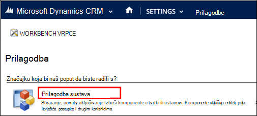
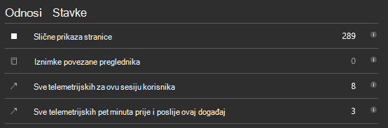

<properties 
    pageTitle="Vodič: Praćenje Microsoft Dynamics CRM s računala uvida" 
    description="Dohvaćanje telemetrijskih iz Microsoft Dynamics CRM Online pomoću aplikacije uvide. Vodič postavljanja početak podatke, vizualizacija i izvoz." 
    services="application-insights" 
    documentationCenter=""
    authors="mazharmicrosoft" 
    manager="douge"/>

<tags 
    ms.service="application-insights" 
    ms.workload="tbd" 
    ms.tgt_pltfrm="ibiza" 
    ms.devlang="na" 
    ms.topic="article" 
    ms.date="11/17/2015" 
    ms.author="awills"/>
 
# Vodič: Omogućivanje Telemetrijskih za Microsoft Dynamics CRM Online pomoću aplikacije uvida

U ovom se članku objašnjava dohvaćanje telemetrijskih podataka iz [Microsoft Dynamics CRM Online](https://www.dynamics.com/) pomoću [Uvida aplikacije za Visual Studio](https://azure.microsoft.com/services/application-insights/). Ćemo vas provesti kroz cijeli postupak dodavanja skriptu aplikaciju uvida u aplikaciji, dohvaćanje podataka i vizualizaciju podataka.

>[AZURE.NOTE] [Pregled uzorak rješenja](https://dynamicsandappinsights.codeplex.com/).

## Dodavanje aplikacije uvida novi ili postojeći instanca CRM Online 

Da biste pratili vaše aplikacije, dodajte programa SDK aplikacije uvida u aplikaciji. SDK šalje telemetrijskih [portal za aplikacije uvide](https://portal.azure.com), gdje možete koristiti naše Napredna analiza i Alati za dijagnostiku ili izvoz podataka u prostor za pohranu.

### Stvaranje do uvida aplikacije resursa u Azure

1. Pronađite [računa u Microsoft Azure](http://azure.com/pricing). 
2. Prijavite se na [portal za Azure](https://portal.azure.com) i dodajte novi resurs uvida aplikacije. To su gdje obrađuju i prikazati podatke.

    

    Odaberite ASP.NET kao vrsta aplikacije.

3. Otvorite karticu za brzi početak rada i otvorite skripte kod.

    

**Kodna stranica ostati otvoren** dok radite na sljedeću koraka u drugom prozoru preglednika. Morat ćete kod uskoro. 

### Stvaranje web-resursa JavaScript u sustavu Microsoft Dynamics CRM

1. Otvorite CRM Online instancu i prijavite se s administratorskim ovlastima.
2. Sustav prilagoditi prilagodbe, otvaranje Microsoft Dynamics CRM postavke

    
    
    

    

3. Stvaranje JavaScript resursa.

    

    Dajte naziv, odaberite **skriptu (JScript)** i otvorite uređivač teksta.

    
    
4. Kopirajte kod iz aplikacije uvide. Prilikom kopiranja provjerite je li da biste zanemarili skripte oznake. Pogledajte ispod snimka zaslona:

    

    Kod obuhvaća ključ instrumentation koja služi za identifikaciju vaše aplikacije uvida resursa.

5. Spremite i objavite.

    

### Obrasci instrument

1. U programu Microsoft CRM Online otvorite obrazac poslovnog subjekta

    

2. Otvorite obrazac svojstva

    

3. Dodati JavaScript web-resurs koji ste stvorili

    

    

4. Spremite i objavite ih obrasca.

## Metriku zabilježene

Sada ste postavili telemetrijskih snimanja za obrazac. Kad god se podataka poslat će se na vaše aplikacije uvida resurs.

Evo primjera podataka prikazat će se.

#### Stanje aplikacije

Iznimke u pregledniku:

Kliknite grafikon da biste dobili dodatne detalje:

#### Korištenje

#### Preglednici

#### Geolokacija-a

#### Zahtjev za prikaz unutrašnji stranice

## Ogledni kod

[Pregled uzorak koda](https://dynamicsandappinsights.codeplex.com/).

## Power BI

Čak i dublju analizu možete učiniti ako [Izvoz podataka u Microsoft Power BI](app-insights-export-power-bi.md).

## Uzorak Microsoft Dynamics CRM rješenja

[Evo uzorak rješenja implementirana u sustavu Microsoft Dynamics CRM] (https://dynamicsandappinsights.codeplex.com/).

## uči više

* [Što je aplikacija uvida?](app-insights-overview.md)
* [Uvid u aplikaciju za web-stranice](app-insights-javascript.md)
* [Dodatne primjere i prikazi](app-insights-code-samples.md)

 
