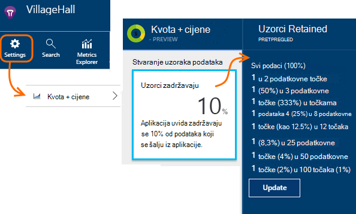

<properties 
    pageTitle="Telemetrijskih uzorkovanje u aplikaciji uvida | Microsoft Azure" 
    description="Kako se održava količinu telemetriju u odjeljku kontrola." 
    services="application-insights" 
    documentationCenter="windows"
    authors="vgorbenko" 
    manager="douge"/>

<tags 
    ms.service="application-insights" 
    ms.workload="tbd" 
    ms.tgt_pltfrm="ibiza" 
    ms.devlang="na" 
    ms.topic="article" 
    ms.date="08/30/2016" 
    ms.author="awills"/>

#  <a name="sampling-in-application-insights"></a>Stvaranje uzoraka u aplikaciji uvida

*Aplikacija uvida je u pretpregledu.*


Stvaranje uzoraka je određenoj značajci programa [Visual Studio aplikacije uvida](app-insights-overview.md) preporučeni način da biste smanjili telemetrijskih promet i pohranu uz čuvanje statistically ispravnu analizu podataka aplikacije. Filtar odabire stavke koje su povezane tako da možete se kretati među stavkama kada radite dijagnostičkih istrage.
Kada metričkim broji predstavljanja vama na portalu, su renormalized da bi račun uzorkovanje da biste minimizirali utječe na statistike.

Uzorkovanje smanjuje promet pomaže vam zadržati unutar mjesečni kvote podataka te izbjeći ograničavanje.

## <a name="in-brief"></a>U pregled podataka o:

* Stvaranje uzoraka zadržava 1 u zapisima *n* i odbacuje ostale. Na primjer, ga zadržati 1 u 5 događaje, uzorkovanja 20%. 
* Stvaranje uzoraka u slučaju automatski aplikacije šalje mnogo telemetrijskih, u ASP.NET web-poslužitelj aplikacijama.
* Možete postaviti i ručno uzorkovanje ili na portalu na stranici cijene; ili u ASP.NET SDK u datoteci .config i smanjiti mrežni promet.
* Ako se odjavite prilagođene događaje, a želite da biste bili sigurni da postavljanje događaja ili zadržavaju ili odbacuju zajedno, provjerite je li imaju iste vrijednosti OperationId.
* Djelitelj uzorkovanje *n* prijavljuje u svakom zapisu u svojstvu `itemCount`, koji u pretraživanju se pojavljuje u odjeljku neslužbeni naziv "broji zahtjev" ili "događaj broji". Kada se uzorkovanje nisu operacije `itemCount==1`.
* Ako pišete analize upita, trebali biste [poduzeti račun uzorkovanje](app-insights-analytics-tour.md#counting-sampled-data). Posebno umjesto jednostavno Brojanje zapisa, trebali biste koristiti `summarize sum(itemCount)`.


## <a name="types-of-sampling"></a>Vrste uzorkovanje


Postoje tri načina zamjenski uzorkovanje:

* **Prilagodljivo uzorkovanje** automatski prilagođava količinu telemetrijskih šalje SDK u ASP.NET aplikacije. Zadani iz SDK v 2.0.0-beta3. Trenutno dostupno za ASP.NET poslužiteljsko telemetrijskih samo. 
* **Fiksno stopa uzorkovanje** smanjuje količinu telemetrijskih Poslano s obje ASP.NET poslužitelja i iz preglednika vaših korisnika. Postavite stopa. Postupak klijentske i poslužiteljske će sinkronizirati svoje uzorkovanje tako, u pretraživanja, možete se kretati između prikaza povezane stranice i zahtjeve.
* **Ingestion uzorkovanje** smanjuje količinu telemetrijskih zadržavaju servis aplikacije uvida brzinom koji ste postavili. Ne smanjite promet za telemetriju, ali pomaže vam zadržati unutar kvota za mjesečno. 

Ako u operaciji uzorkovanje stopa prilagodljivo ili fiksno, Ingestion uzorkovanje je onemogućen.

## <a name="ingestion-sampling"></a>Ingestion uzorkovanje

Ovaj oblik uzorkovanje pristajete u točki gdje telemetrijskih s web-poslužitelj, preglednika i uređaje dosegne krajnja točka servisa uvida aplikaciju. Iako je ne smanjili promet za telemetriju poslane iz aplikacije, smanjite količinu obrađuju i zadržavaju (i naplatiti) tako da uvida aplikaciju.

Koristite ovu vrstu uzorkovanje aplikaciju često prelazi preko kvota mjesečni i nemate mogućnost pomoću vrsta SDK temelje uzorkovanje. 

Postavljanje uzorkovanja u na kvote i cijene plohu:



Kao što su druge vrste uzorkovanje algoritam zadržava telemetrijskih povezanih stavki. Ako, na primjer, kada ste pregled telemetriju u pretraživanju, ćete moći pronaći zahtjev vezane uz određenu iznimke. Metrika broji kao što su učestalost zahtjeva i iznimke stopa zadržavaju se ispravno.

Točke podataka koje odbacuju uzorkovanje nisu dostupne u bilo kojoj aplikacije uvida značajki kao što su [Neprekinuti izvoz](app-insights-export-telemetry.md).

Ingestion uzorkovanje ne rade dok se SDK temelje prilagodljivo ili rate uzorkovanje operacija. Ako je uzorkovanja pri SDK manje od 100%, zanemaruje se ingestion uzorkovanja koji ste postavili.

> [AZURE.WARNING] Vrijednost koja se prikazuje na pločici pokazuje vrijednost koju ste postavili za stvaranje uzoraka ingestion. Ako je SDK uzorkovanje u operaciji ga ne predstavlja stvarni uzorkovanja.


## <a name="adaptive-sampling-at-your-web-server"></a>Prilagodljivo uzorkovanje na web-poslužitelj

Prilagodljivo uzorkovanje dostupna je za uvid SDK aplikacije ASP.NET v 2.0.0-beta3 i novijim verzijama, a po zadanom je omogućena. 


Prilagodljivo uzorkovanje utječe na količinu telemetrijskih poslana iz web-aplikacije za poslužitelj sa servisom uvida aplikacije. Volumen se automatski prilagođava da biste zadržali unutar navedeni Maksimalna brzina prometa.

Ga ne rade niskog količine telemetrijskih, tako da u aplikaciji za ispravljanje pogrešaka i neće utjecati na web-mjesta s mali broj korisnika.

Da biste postigli Ciljna jedinica neke telemetrijskih generira se odbacuju. Ali kao što su druge vrste uzorkovanje algoritam zadržavaju telemetrijskih povezanih stavki. Ako, na primjer, kada ste pregled telemetriju u pretraživanju, ćete moći pronaći zahtjev vezane uz određenu iznimke. 

Metrika broji kao što su učestalost zahtjeva i iznimke stopa prilagođavaju pokrivaju uzorkovanja, vaše tako da se prikazuju približno odgovarajuće vrijednosti u programu Explorer metriku.

**Ažuriranje u projekt NuGet** paketa najnoviju verziju *predizdanje* aplikacije uvida: desnom tipkom miša kliknite projekt u pregledniku rješenja, odaberite upravljanje NuGet paketa, potvrdite okvir **Uključi predizdanja** i traženje Microsoft.ApplicationInsights.Web. 

U [ApplicationInsights.config](app-insights-configuration-with-applicationinsights-config.md), možete prilagoditi nekoliko parametara u `AdaptiveSamplingTelemetryProcessor` čvor. Slika prikazane su zadane vrijednosti:

* `<MaxTelemetryItemsPerSecond>5</MaxTelemetryItemsPerSecond>`

    Cilj stopa koja algoritam prilagodljivo trebao za **na svakom računalu koje hostira poslužitelja**. Ako web-aplikaciju programa izvodi na mnogo domaćini, smanjite tu vrijednost biste ostaju unutar rata prometa na portal za aplikacije uvida cilj.

* `<EvaluationInterval>00:00:15</EvaluationInterval>` 

    Interval na kojoj je trenutna stopa telemetrijskih ponovno provjeriti u odnosu. Procjena se izvodi kao pokretnog prosjeka. Možda ćete morati skratili interval ako je vaš telemetrijskih porezu na iznenadno bursts.

* `<SamplingPercentageDecreaseTimeout>00:02:00</SamplingPercentageDecreaseTimeout>`

    Kada uzorkovanje promjene postotka vrijednosti, kako uskoro nakon smo dopušteno donji navedeni postotak da biste snimili manje podataka.

* `<SamplingPercentageIncreaseTimeout>00:15:00</SamplingPercentageIncreaseTimeout>`

    Kada uzorkovanje promjene postotka vrijednosti, kako uskoro nakon smo dopušteno da biste povećali navedeni postotak da biste snimili više podataka.

* `<MinSamplingPercentage>0.1</MinSamplingPercentage>`

    Kao što je uzorkovanje postotak mijenja se, što je minimalnu vrijednost smo moći postaviti.

* `<MaxSamplingPercentage>100.0</MaxSamplingPercentage>`

    Kao uzorkovanje postotak mijenja se, što je maksimalna vrijednost smo moći postaviti.

* `<MovingAverageRatio>0.25</MovingAverageRatio>` 

    Izračunavanje pokretnog prosjeka, težina dodijeljeni zadnje vrijednosti. Upotrijebite vrijednost jednaka nuli ili manja od 1. Manje vrijednosti možete izmijeniti algoritam manje ponovno aktiviranje za iznenadno.

* `<InitialSamplingPercentage>100</InitialSamplingPercentage>`

    Vrijednost dodijeliti kada samo pokrene aplikaciju. Ne smanjite to dok ste ispravljanje pogrešaka. 

### <a name="alternative-configure-adaptive-sampling-in-code"></a>Zamjenski: Konfiguriranje prilagodljivo uzorkovanje u kodu

Umjesto Prilagodba uzorkovanje u .config datoteci, možete koristiti kod. Omogućuje određivanje povratnog funkciju koja se poziva kad god se uzorkovanja ponovno provjeriti u odnosu. Možete koristiti to, na primjer, da biste saznali što uzorkovanja se koristi.

Uklanjanje na `AdaptiveSamplingTelemetryProcessor` čvor iz datoteke .config.


*C#*

```C#

    using Microsoft.ApplicationInsights;
    using Microsoft.ApplicationInsights.Extensibility;
    using Microsoft.ApplicationInsights.WindowsServer.Channel.Implementation;
    using Microsoft.ApplicationInsights.WindowsServer.TelemetryChannel;
    ...

    var adaptiveSamplingSettings = new SamplingPercentageEstimatorSettings();

    // Optional: here you can adjust the settings from their defaults.

    var builder = TelemetryConfiguration.Active.TelemetryProcessorChainBuilder;
    
    builder.UseAdaptiveSampling(
         adaptiveSamplingSettings,

        // Callback on rate re-evaluation:
        (double afterSamplingTelemetryItemRatePerSecond,
         double currentSamplingPercentage,
         double newSamplingPercentage,
         bool isSamplingPercentageChanged,
         SamplingPercentageEstimatorSettings s
        ) =>
        {
          if (isSamplingPercentageChanged)
          {
             // Report the sampling rate.
             telemetryClient.TrackMetric("samplingPercentage", newSamplingPercentage);
          }
      });

    // If you have other telemetry processors:
    builder.Use((next) => new AnotherProcessor(next));

    builder.Build();

```

([Saznajte više o procesorima telemetrijskih](app-insights-api-filtering-sampling.md#filtering).)


<a name="other-web-pages"></a>
## <a name="sampling-for-web-pages-with-javascript"></a>Stvaranje uzoraka za web-stranice s JavaScript

Možete konfigurirati web-stranica za uzorkovanje stopa s bilo kojeg poslužitelja. 

Kada [Konfiguriranje web-stranice radi uvida aplikaciju](app-insights-javascript.md), izmjena isječak koji ste dobili od portal za aplikacije uvide. (U aplikacijama ASP.NET u isječak obično dolazi u _Layout.cshtml.)  Umetanje retka kao što su `samplingPercentage: 10,` prije instrumentation ključ:

    <script>
    var appInsights= ... 
    }({ 


    // Value must be 100/N where N is an integer.
    // Valid examples: 50, 25, 20, 10, 5, 1, 0.1, ...
    samplingPercentage: 10, 

    instrumentationKey:...
    }); 
    
    window.appInsights=appInsights; 
    appInsights.trackPageView(); 
    </script> 

Za stvaranje uzoraka postotka odaberite postotka sličan onome 100/N pri čemu je N cijeli broj.  Trenutno uzorkovanje ne podržava druge vrijednosti.

Ako omogućite uzorkovanje stopa na poslužitelju, klijentima i poslužitelja će sinkronizirati tako, u pretraživanja, možete se kretati između prikaza povezane stranice i zahtjeve.


## <a name="fixed-rate-sampling-for-aspnet-web-sites"></a>Stvaranje uzoraka stopa za ASP.NET web-mjesta

Fiksne stope uzorkovanja smanjuje promet poslane s web-poslužitelj i web-preglednika. Za razliku od prilagodljivo uzorkovanje smanjuje telemetrijskih na fiksnom stopom Odlučili ste. Ga i sinkronizira klijenta i poslužitelja uzorkovanje tako da se povezane stavke se zadržavaju – na primjer, tako da pogledate prikaz stranice u odjeljku pretraživanje može pronaći njegov povezane zahtjev.

Algoritam uzorkovanje zadržava povezanih stavki. Za svaki HTTP zahtjev za događaj, ga i njegov događaje povezane su odbačene ili prenose. 

U programu Explorer metriku stope kao što su zahtjev i iznimke su množi faktor da vaše za uzorkovanja, tako da su približno ispravni.

1. Najnoviju verziju *predizdanje* aplikacije uvid **u projekt NuGet pakete ažuriranja** . Desnom tipkom miša kliknite projekt u pregledniku rješenja, odaberite upravljanje NuGet paketa, potvrdite okvir **Uključi predizdanja** i traženje Microsoft.ApplicationInsights.Web. 

2. **Onemogućivanje prilagodljivo uzorkovanje**: [ApplicationInsights.config](app-insights-configuration-with-applicationinsights-config.md), uklanjanje ili komentar odgovor na `AdaptiveSamplingTelemetryProcessor` čvor.

    ```xml

    <TelemetryProcessors>
    <!-- Disabled adaptive sampling:
      <Add Type="Microsoft.ApplicationInsights.WindowsServer.TelemetryChannel.AdaptiveSamplingTelemetryProcessor, Microsoft.AI.ServerTelemetryChannel">
        <MaxTelemetryItemsPerSecond>5</MaxTelemetryItemsPerSecond>
      </Add>
    -->
    

    ```

2. **Omogućivanje modul uzorkovanje stopa.** Dodajte ovu isječak [ApplicationInsights.config](app-insights-configuration-with-applicationinsights-config.md):

    ```XML

    <TelemetryProcessors>
     <Add  Type="Microsoft.ApplicationInsights.WindowsServer.TelemetryChannel.SamplingTelemetryProcessor, Microsoft.AI.ServerTelemetryChannel">

      <!-- Set a percentage close to 100/N where N is an integer. -->
     <!-- E.g. 50 (=100/2), 33.33 (=100/3), 25 (=100/4), 20, 1 (=100/100), 0.1 (=100/1000) -->
      <SamplingPercentage>10</SamplingPercentage>
      </Add>
    </TelemetryProcessors>

    ```

> [AZURE.NOTE] Za stvaranje uzoraka postotka odaberite postotka sličan onome 100/N pri čemu je N cijeli broj.  Trenutno uzorkovanje ne podržava druge vrijednosti.


### <a name="alternative-enable-fixed-rate-sampling-in-your-server-code"></a>Zamjenski: Omogućivanje uzorkovanje stopa u kodu poslužitelja


Umjesto postavljanja parametar uzorkovanje u .config datoteci, možete upotrijebiti kod. 

*C#*

```C#

    using Microsoft.ApplicationInsights.Extensibility;
    using Microsoft.ApplicationInsights.WindowsServer.TelemetryChannel;
    ...

    var builder = TelemetryConfiguration.Active.GetTelemetryProcessorChainBuilder();
    builder.UseSampling(10.0); // percentage

    // If you have other telemetry processors:
    builder.Use((next) => new AnotherProcessor(next));

    builder.Build();

```

([Saznajte više o procesorima telemetrijskih](app-insights-api-filtering-sampling.md#filtering).)


## <a name="when-to-use-sampling"></a>Kada koristiti uzorkovanje?

Prilagodljivo uzorkovanje je automatski omogućena ako koristite verziju 2.0.0-beta3 ASP.NET SDK ili noviji. Bez obzira na to koju koristite verziju SDK, možete koristiti ingestion uzorkovanje (u našem server).

Za većinu aplikacija za male i srednje veličine ne morate uzorkovanje. Najkorisnije dijagnostičke informacije, a najviše točne Statistika dobivaju se po prikupljanja podataka na svim aktivnosti korisnika. 

 
Glavnih prednosti navedeni su:

* Aplikaciju uvida servisa izostavlja ("Reguliranje") točke podataka kada aplikaciju pošalje vrlo visoka rata telemetrijskih ukratko vremenski interval. 
* Da biste zadržali unutar [kvote](app-insights-pricing.md) točaka podataka za vaše cijene sloju. 
* Da biste smanjili mrežni promet iz zbirke telemetrijskih. 

### <a name="which-type-of-sampling-should-i-use"></a>Koju vrstu uzorkovanje trebao koristiti?


**Koristite ingestion uzorkovanje ako:**

* Često idite do vaše mjesečni kvota za telemetriju.
* Koristite verziju SDK koji ne podržava uzorkovanje – na primjer, Java SDK ili ASP.NET verzije starije od 2.
* Primate mnogo telemetrijskih iz vaših korisnika web-preglednika.

**Koristite-stopa uzorkovanje ako:**

* Koristite uvide SDK aplikacije za ASP.NET web services verzije 2.0.0 ili noviji, a
* Želite sinkronizirane uzorkovanje između klijenta i poslužitelja, pa se, kada ste istražuje događaja u [pretraživanja](app-insights-diagnostic-search.md), možete se kretati između povezanih događaja na postupak klijentske i poslužiteljske, kao što su prikaza stranice i http zahtjeva.
* Koji imaju odgovarajuće navedeni postotak aplikacije. Mora biti dovoljno visoku da biste dobili točne metriku, ali ispod stopa koja premašuje kvota za cijene i regulacije ograničenja. 


**Koristite prilagodljivo uzorkovanje:**

U suprotnom preporučujemo prilagodljivo uzorkovanje. To je po zadanom omogućen u ASP.NET server SDK 2.0.0-beta3 verzija ili noviji. Ga ne smanjiti promet do s određenim minimalne stope, tako da ga neće utjecati na nisko pomoću web-mjesta.


## <a name="how-do-i-know-whether-sampling-is-in-operation"></a>Kako znati je li se u operaciji uzorkovanje?

Da biste otkrili stvarni uzorkovanja bez obzira na to gdje je primijenjen, koristite [upit analitičke podatke](app-insights-analytics.md) kao što su ova:

    requests | where timestamp > ago(1d)
  	| summarize 100/avg(itemCount) by bin(timestamp, 1h) 
  	| render areachart 

U svakoj zadržavaju zapis `itemCount` označava broj izvorne zapise koji je predstavlja, jednako 1 + broj prethodne odbačene zapisa. 


## <a name="how-does-sampling-work"></a>Kako funkcionira uzorkovanje?

Stopa i prilagodljivo navedeni su značajka SDK u ASP.NET verzije s 2.0.0 nadalje. Ingestion uzorkovanje je značajka servisa uvida aplikacije, a može biti u operaciji ako SDK je izvođenje uzorkovanje. 

Algoritam uzorkovanje odlučuje ispustite telemetrijskih stavki, a koje korisnik da biste zadržali (hoće li se u SDK ili na servisu uvida aplikacije). Odluka uzorkovanje temelji se na nekoliko pravila koja usmjerite da biste sačuvali svim točkama podataka povezanih netaknuta zadržavanje dijagnostičkih iskustvom u uvide aplikaciju koja je s akcijama i pouzdane čak i uz smanjenom skupa podataka. Ako, na primjer, ako zahtjeva nije uspjelo aplikacije šalje dodatne telemetrijskih stavki (kao što su iznimke i kašnjenja prijavljeni s zahtjev), uzorkovanje će ne podijeliti zahtjev i drugih telemetrijskih. Ga zadržati ili ih izostavlja sve zajedno. Kao rezultat pogledate zahtjev pojedinosti u uvide aplikaciju, uvijek možete vidjeti zahtjev uz stavki povezane telemetrijskih. 

Za aplikacije koje definiraju "korisnik" (to jest, Najčešći web-aplikacije), uzorkovanje odluka temelji se na raspršivanje korisničkog id-a, što znači da sve telemetrijskih za neki određeni korisnički je zadržan ili ispušteno. Vrsta aplikacije koje ne definiranje korisnika (kao što je web-servisi) odluka uzorkovanje temelji se na id operacije zahtjeva. Na kraju, za telemetriju stavke čiji niti korisnik ni operacija ID-a (za stavke telemetrijskih primjer prijavljenih iz asinkronog niti s bez konteksta http) uzorkovanje jednostavno snima postotak telemetrijskih stavke svake vrste. 

Kada se prikazuje telemetrijskih natrag, uvida aplikacije servisa prilagođava metriku isti postotak uzorkovanje koji je korišten u trenutku zbirke za vaše nedostaju točaka podataka. Dakle, prilikom pregledavanja telemetriju u aplikaciju uvide, korisnici vide statistically odgovarajuće procjene koji su vrlo blizu realnih brojeva.

Točnost u manjoj mjeri uglavnom ovisi o konfigurirani navedeni postotak. Osim toga, točnost povećava za aplikacije koji upravljaju velik broj obično slične zahtjeve iz veći broj korisnika. S druge strane, za aplikacije koje ne funkcioniraju s značajan opterećenjem uzorkovanje nije potreban kao te aplikacije obično možete poslati svoje telemetrijskih uz zadržavanje unutar ograničenja, bez gubitka podataka iz ograničavanje. 

Imajte na umu da uvida aplikacija ne poslušajte telemetrijskih vrste metriku i sesije od za ove vrste, smanjenje preciznost može biti vrlo neželjenog. 

### <a name="adaptive-sampling"></a>Prilagodljivo uzorkovanje

Prilagodljivo uzorkovanje dodaje komponente koji nadzire trenutna stopa transmission iz SDK i prilagođava postotak uzorkovanje pokušati da ostanete u ciljnom Maksimalna brzina. Prilagođavanje ponovnog izračuna u pravilnim vremenskim razmacima i temelji se na pomični prosjek odlazne brzinu prijenosa.

## <a name="sampling-and-the-javascript-sdk"></a>Stvaranje uzoraka i JavaScript SDK

Na strani klijenta (JavaScript) SDK sudjeluje za stvaranje uzoraka stopa u kombinaciji s SDK poslužiteljsko. Instrumented stranica samo poslat će klijentsko telemetrijskih s istim korisnicima za koje na strani poslužitelja izvršene njegova odluku da biste "uzorak u". U ovom logike osmišljena je za zadržavanje integriteta korisničke sesije preko klijent-poslužitelj-stranama i. Zbog toga iz bilo koje stavke određeni telemetriju u uvide aplikaciju možete pronaći sve telemetrijskih stavke za ovog korisnika ili u sesiju. 

*Moje klijenta i telemetrijskih poslužiteljsko ne prikazuj usklađenih uzoraka kao što se opisuje iznad.*

* Potvrdite da ste omogućili-stopa uzorkovanje i na poslužitelju i klijenta.
* Provjerite je li SDK verzije 2.0 ili noviji.
* Potvrdite okvir Postavljanje isti navedeni postotak u klijenta i poslužitelja.


## <a name="frequently-asked-questions"></a>Najčešća pitanja 

*Zašto nije uzorkovanje na jednostavne "prikupite X postotka svake vrste telemetrijskih"?*

 *  Dok odlučile uzorkovanje bi pružio vrlo visoka preciznosti u metričkim procjene, želite prekinuti omogućuje povezivanje dijagnostičkih podataka po korisniku, sesije i zahtjev za koje je za dijagnostiku. Stoga uzorkovanje radi bolje s "prikupljanje sve telemetrijskih stavke za X postotak korisnici aplikacije" ili "prikupljanje sve telemetrijskih za X postotak zahtjeva za aplikaciju" logike. Za telemetriju stavke nije povezana ni s zahtjeva (kao što su asinkronog obrada pozadini), ponovno jesen će se "prikupite X postotak svih stavki za svaku vrstu telemetrijskih." 

*Možete promijeniti za stvaranje uzoraka postotak tijekom vremena*

 * Da, prilagodljivo uzorkovanje postupno mijenja uzorkovanje postotka, na temelju trenutno opaženih količinu za telemetriju.

 

*Ako koristim uzorkovanje stopa, kako mogu znati koje navedeni postotak funkcionirat će najbolje za aplikacije?*

* Jednosmjerna je započeti s prilagodljivo uzorkovanje, Saznajte što je ocijeniti settles na (vidi iznad pitanje), a zatim prijeđite u stopa uzorkovanje pomoću tog stopa. 

    U suprotnom, morate pogoditi. Analiza trenutnog korištenja telemetriju u AI, pridržavajte se sve ograničavanje koji se pojavio i procjenu količinu prikupljene telemetrijskih. Ove tri unosa, zajedno s vašeg odabrane cijene sloju predlažu koliko želite smanjiti količinu prikupljene telemetrijskih. Međutim, povećava broj korisnika ili neke druge shift u opsegu telemetrijskih može poništiti valjanost vaše procjenu.

*Što se događa ako ću konfigurirati uzorkovanje postotka pretihi?*

* Prenapadno niskog navedeni postotak (over-aggressive uzorkovanje) smanjuje točnosti procjene, kada aplikacija uvida pokuša vaše vizualizaciju podataka za smanjivanje glasnoće podataka. Osim toga, dijagnostičkih sučelje možda može negativno utjecati na, kao što je dio zahtjeva za diskovni neuspješnih ili sporo možda uzorkovanja odgovor.

*Što se događa ako ću konfigurirati navedeni postotak prevelika?*

* Konfiguriranje prevelika navedeni postotak (ne izrazito dovoljno) rezultira dovoljno smanjenja u opsegu prikupljene telemetrijskih. I dalje primijetiti gubitka podataka za telemetriju vezane uz ograničavanje i trošak pomoću aplikacije uvida možda će biti veća od planirano zbog pokrivenosti troškove.

*Platforme koje možete koristiti uzorkovanje?*

* Ingestion uzorkovanje automatski može doći za sve telemetrijskih iznad neke jedinice, ako SDK je izvođenje uzorkovanje. To radite, na primjer, ako aplikacija koristi Java poslužitelj ili ako koristite stariju verziju ASP.NET SDK.

* Ako koristite verzije platforme ASP.NET SDK 2.0.0 i iznad (smještena u Azure ili na svoj poslužitelj), dobit prilagodljivo uzorkovanje prema zadanim postavkama, ali možete se prebaciti na stopa prethodno opisan. Pomoću uzorkovanja stopa preglednika SDK automatski sinkronizira za uzorak povezane događaja. 

*Postoje određene rijetko događaje koje uvijek želite vidjeti. Kako se nabavljaju prošle modul za stvaranje uzoraka?*

 * Pokretanje zasebna instanca TelemetryClient s nove TelemetryConfiguration (nije zadani aktivan). Koji koristite za slanje rijetko događaja.


## <a name="next-steps"></a>Daljnji koraci

* [Filtriranje](app-insights-api-filtering-sampling.md) omogućuju veću kontrolu izričite od što šalje vaš SDK.
