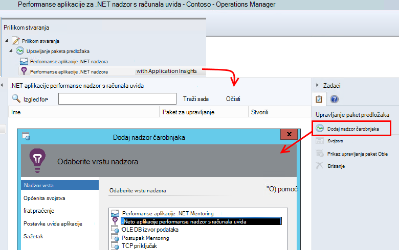
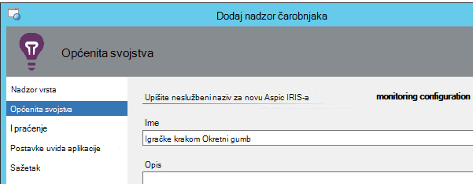
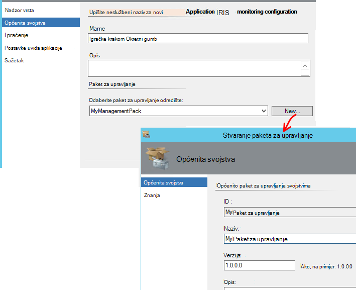
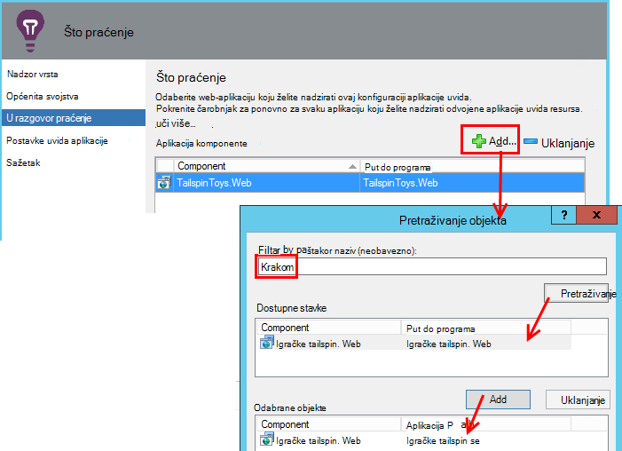
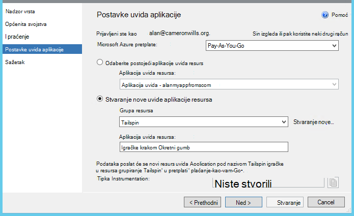
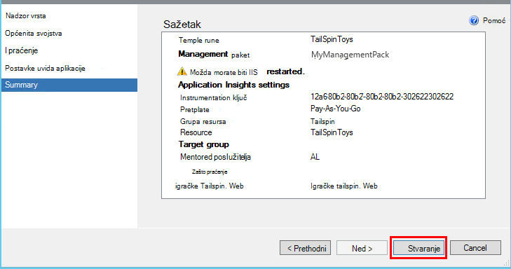
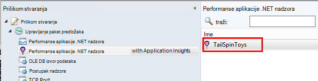
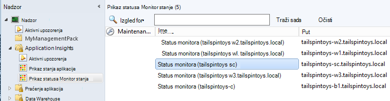

<properties 
    pageTitle="SCOM Integracija s računala uvida | Microsoft Azure" 
    description="Ako ste korisnik sustava SCOM, praćenje performansi i dijagnosticiranje problema s uvida aplikacije. Sveobuhvatan nadzorne ploče, pametne upozorenja, Napredni alati za dijagnostiku i analizu upita." 
    services="application-insights" 
    documentationCenter=""
    authors="alancameronwills" 
    manager="douge"/>

<tags 
    ms.service="application-insights" 
    ms.workload="tbd" 
    ms.tgt_pltfrm="ibiza" 
    ms.devlang="na" 
    ms.topic="article" 
    ms.date="08/12/2016" 
    ms.author="awills"/>
 
# Aplikacija praćenje performansi pomoću aplikacije uvida za SCOM

Ako koristite sustav centar operacije Manager (SCOM) za upravljanje poslužitelja, možete praćenje performansi i dijagnosticiranje probleme s performansama uz pomoć programa [Visual Studio aplikacije uvide](app-insights-asp-net.md). Aplikacija uvida nadzire dolaznih zahtjeva web-aplikacije odlazne OSTALE i SQL pozive, iznimke i zapisnika kašnjenja. Pruža nadzorne ploče s metričkim grafikone i pametnih upozorenja, kao i napredna pretraživanja dijagnostičkih i analytical upita putem ovaj telemetrijskih. 

Možete se prebaciti na aplikaciju uvida nadzor pomoću paketa za upravljanje SCOM.

## Prije početka

Pretpostavimo da:

* Koje poznajete SCOM i korištenje SCOM 2012 R2 ili 2016 da biste upravljali vaše IIS web-poslužiteljima.
* Ste već instalirali na poslužiteljima web-aplikaciju koju želite nadzirati pomoću aplikacije uvide.
* Verzija framework aplikacija je .NET 4.5 ili noviji.
* Imate pristup pretplate na [Microsoft Azure](https://azure.com) , a možete se prijaviti na [portal za Azure](https://portal.azure.com). Tvrtka ili ustanova može imati pretplatu i možete dodati Microsoftova računa na njega.

(Tim za razvoj možda Međuverzija [SDK aplikacije uvida](app-insights-asp-net.md) u web-aplikaciji. Ovaj instrumentation Sastavi vrijeme im daje veću fleksibilnost u pisanju prilagođene telemetrijskih. Međutim, nije važno: slijedite korake koje se ovdje opisuju sa ili bez SDK ugrađena.)

## (Jedna jedinica vremena) Instalirajte paket za upravljanje uvida aplikacije

Na računalu na kojem pokrenete Operations Manager:

2. Deinstalirajte sve starije verzije paketa za upravljanje:
 1. Otvorite Administracija paketi za upravljanje u Operations Manager. 
 2. Izbrišite staru verziju.
1. Preuzmite i instalirajte paket za upravljanje iz kataloga.
2. Ponovno pokrenite Operations Manager.

## Stvaranje paketa za upravljanje

1. U Operations Manager otvorite **dokumentima**, **.NET... s uvida aplikacije**, a zatim **Čarobnjak za dodavanje nadzora**i ponovno odaberite **.NET... s uvida aplikacije**.

    

2. Naziv konfiguracija nakon aplikacije. (Morate instrumenata aplikacije jedan po jedan.)
    
    

3. Na istoj stranici čarobnjaka, stvorite novi paket za upravljanje ili odaberite paket koji ste stvorili za aplikaciju uvida neke starije verzije.

     (Uvida aplikacije [paket za upravljanje](https://technet.microsoft.com/library/cc974491.aspx) je predložak, iz kojeg je stvoriti instancu. Pa je možete koristiti u istoj instanci kasnije.)

    

4. Odaberite jednu aplikaciju koju želite nadzirati. Značajke pretraživanja pretražuje među instaliranu na poslužiteljima.

    

    Neobavezna polja opseg praćenja se poslužite da biste odredili podskup poslužitelje, ako ne želite pratiti aplikacije u svim poslužiteljima.

5. Na sljedećoj stranici čarobnjaka, morate unijeti vjerodajnice za prijavu u Microsoft Azure.

    Na ovoj stranici odaberite resursa aplikacije uvida mjesto na koje želite da telemetrijskih podatke koje želite analizirati i prikazati. 

 * Ako aplikacija nije konfiguriran za aplikacije uvida tijekom razvoja, odaberite njegove postojeće resurs.
 * U suprotnom, stvorite novi resurs pod nazivom aplikacije. Ako su druge aplikacije koja su komponente sustava isti, umetnite ih u istoj grupi resursa, da biste pojednostavnili pristup da biste na telemetrijskih za upravljanje.

    Ove postavke možete naknadno promijeniti.

    

6. Dovršite čarobnjak.

    
    
Ponovite taj postupak za svaku aplikaciju koju želite nadzirati.

Ako je potrebno promijeniti postavke kasnije ponovno otvoriti svojstva monitora iz prozora na dokumentima.

## Provjerite je li nadzor

Provjerite jeste li instalirali Traži aplikacije na svakom poslužitelju monitor. Gdje se nalazi aplikaciji je konfigurira Nadzornik stanja uvida aplikacije praćenje aplikaciju. Ako je potrebno, Nadzornik stanja najprije instalira na poslužitelju.

Možete provjeriti koje će se instance aplikaciju pronađe:

## Prikaz telemetriju u aplikaciji uvida

[Portal za Azure](https://portal.azure.com)potražite resurse za aplikaciju. [Potražite u članku grafikonima prikazuje telemetrijskih](app-insights-dashboards.md) iz aplikacije. (Ako nije prikazana prema gore na glavnoj stranici još, kliknite aktivno strujanje mjernih podataka).

## Daljnji koraci

* [Postavljanje nadzorne ploče](app-insights-dashboards.md) na objediniti najvažnije grafikoni nadzor to i drugih aplikacija.
* [Dodatne informacije o mjerenja](app-insights-metrics-explorer.md)
* [Postavljanje upozorenja](app-insights-alerts.md)
* [Dijagnosticiranje probleme s performansama](app-insights-detect-triage-diagnose.md)
* [Napredne analize upita](app-insights-analytics.md)
* [Testira web dostupnosti](app-insights-monitor-web-app-availability.md)
