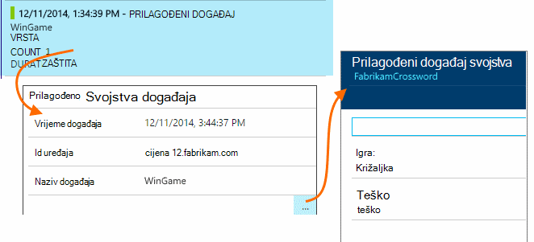

<properties 
    pageTitle="Zapisnici, iznimke i prilagođene Dijagnostika za ASP.NET u aplikaciji uvida" 
    description="Dijagnosticiranje problema u ASP.NET web-aplikacijama pretraživanjem zahtjeve, iznimke i zapisnika generirao praćenja, NLog ili Log4Net." 
    services="application-insights" 
    documentationCenter=""
    authors="alancameronwills" 
    manager="douge"/>

<tags 
    ms.service="application-insights" 
    ms.workload="tbd" 
    ms.tgt_pltfrm="ibiza" 
    ms.devlang="na" 
    ms.topic="article" 
    ms.date="04/08/2016" 
    ms.author="awills"/>
 
# Zapisnici, iznimke i prilagođene Dijagnostika za ASP.NET u aplikaciji uvida

[Aplikacija uvida] [ start] obuhvaća Napredna [Pretraživanja dijagnostičkih] [ diagnostic] alat koji omogućuje vam da biste istražili i Dubinska analiza telemetrijskih poslao uvida SDK aplikacije iz aplikacije. Broj događaja kao što je korisnik prikaza stranice automatski se šalju po SDK-a.

Možete upisati i kod da biste poslali prilagođene događaje, iznimku izvješća i kašnjenja. A ako već koristite zapisivanje framework kao što su log4J, log4net, NLog ili System.Diagnostics.Trace, možete snimiti te zapisnika i obuhvatiti pretraživanjem. Time se olakšava povezivanje kašnjenja zapisnika s korisničkim akcijama, iznimke i druge događaje.

## Prije pisanja prilagođene telemetrijskih

Ako još niste [postavili aplikacije uvida projekta][start], učinite to sada.

Kada pokrenete aplikaciju, ona će poslati neke telemetrijskih koji prikazat će se u dijagnostike pretraživanja, uključujući zahtjeva za poslužitelj, stranica prikaza prijavljeni na klijentskom računalu, a je neuhvaćenu iznimke.

Otvorite dijagnostike pretraživanja da biste vidjeli telemetrijskih koji se automatski šalje SDK-a.

Pojedinosti razlikovati od vrsta jedne aplikacije na drugu. Možete klikati bilo koji pojedinačni događaj da biste dobili više detalja.

## Stvaranje uzoraka 

Ako aplikacija šalje velike količine podataka i koristite uvide SDK aplikacije za ASP.NET verzije 2.0.0-beta3 ili noviji, značajku prilagodljivo uzorkovanje može raditi i pošaljite samo postotka vaše telemetrijskih. [Saznajte više o uzorkovanje.](app-insights-sampling.md)

##Prilagođene događaje

Prilagođene događaje prikazuju se i u [Dijagnostike pretraživanja] [ diagnostic] i u [Programu Explorer metriku][metrics]. Možete im poslati s uređaja, web-stranica i poslužiteljske aplikacije. Moguće ih je koristiti dijagnostičkih svrhe i da biste [shvatili uzoraka korištenja][track].

Prilagođeni događaj ima naziv, a mogu prenositi svojstava koja možete filtrirati, zajedno s numerički mjere.

JavaScript kod klijenta

    appInsights.trackEvent("WinGame",
         // String properties:
         {Game: currentGame.name, Difficulty: currentGame.difficulty},
         // Numeric measurements:
         {Score: currentGame.score, Opponents: currentGame.opponentCount}
         );

C# na poslužitelju

    // Set up some properties:
    var properties = new Dictionary <string, string> 
       {{"game", currentGame.Name}, {"difficulty", currentGame.Difficulty}};
    var measurements = new Dictionary <string, double>
       {{"Score", currentGame.Score}, {"Opponents", currentGame.OpponentCount}};

    // Send the event:
    telemetry.TrackEvent("WinGame", properties, measurements);

VB na poslužitelju

    ' Set up some properties:
    Dim properties = New Dictionary (Of String, String)
    properties.Add("game", currentGame.Name)
    properties.Add("difficulty", currentGame.Difficulty)

    Dim measurements = New Dictionary (Of String, Double)
    measurements.Add("Score", currentGame.Score)
    measurements.Add("Opponents", currentGame.OpponentCount)

    ' Send the event:
    telemetry.TrackEvent("WinGame", properties, measurements)

### Pokrenite aplikaciju i prikaz rezultata.

Otvorite dijagnostike pretraživanja.

Odaberite prilagođeni događaj, a zatim odaberite naziv određenog događaja.

Filtriranje podataka u više tako da unesete pojam za pretraživanje na vrijednost.  

Dubinski analizirati pojedinačnog događaja da biste vidjeli detaljne svojstva.

##Prikaza stranice

Telemetrijskih prikaz stranice je poslao poziv trackPageView() u [isječak jezika JavaScript umetnuti u web-stranica][usage]. Čija je Glavna svrha je da biste slali broji prikaza stranice koje vidite na stranici pregled.

Obično se zove jednom na svakoj stranici HTML, ali umetanja pozive – na primjer, ako imate aplikaciju za jednu stranicu, a želite prijaviti nove stranice kada se korisnik može vidjeti više podataka.

    appInsights.trackPageView(pageSegmentName, "http://fabrikam.com/page.htm"); 

Ponekad je korisno priložiti svojstva koje možete koristiti kao filtri u dijagnostike pretraživanja:

    appInsights.trackPageView(pageSegmentName, "http://fabrikam.com/page.htm",
     {Game: currentGame.name, Difficulty: currentGame.difficulty});

##Praćenje telemetrijskih

Praćenje telemetrijskih kod koje umetnete posebno da biste stvorili dijagnostičke zapisnike. 

Na primjer, nije moguće umetnuti pozive ovako:

    var telemetry = new Microsoft.ApplicationInsights.TelemetryClient();
    telemetry.TrackTrace("Slow response - database01");

####  Instalirati prilagodnik za vaše framework zapisivanje

Možete pretraživati i zapisnika generirao zapisivanje framework - log4Net, NLog ili System.Diagnostics.Trace. 

1. Ako namjeravate koristiti log4Net ili NLog, instalirajte ga u projektu. 
2. U pregledniku rješenja, desnom tipkom miša kliknite projekt i odaberite **Upravljanje NuGet paketa**.
3. Odaberite internetski > sve, odaberite web-mjesto **Uključiti predizdanja** i u okvir za pretraživanje unesite "Microsoft.ApplicationInsights"

    

4. Odaberite odgovarajući paket – jedan od:
  + Microsoft.ApplicationInsights.TraceListener (da biste snimili System.Diagnostics.Trace pozive)
  + Microsoft.ApplicationInsights.NLogTarget
  + Microsoft.ApplicationInsights.Log4NetAppender

Paket NuGet instalira potrebne sklopova i i mijenja web.config ili app.config.

#### Umetanje dijagnostičkog zapisnika poziva

Ako koristite System.Diagnostics.Trace, uobičajeni poziv bio sljedeći:

    System.Diagnostics.Trace.TraceWarning("Slow response - database01");

Ako biste radije log4net ili NLog:

    logger.Warn("Slow response - database01");

Pokretanje aplikacije u načinu rada za ispravljanje pogrešaka ili njegove implementacije kod.

Vidjet ćete poruke u dijagnostike pretraživanja kada odaberete filtar za praćenje.

### Iznimke

Početak iznimku izvješća u aplikaciji uvida sadrži vrlo Napredna doživljaj, osobito jer je za navigaciju neuspjelih zahtjeva i iznimke i pročitajte stog iznimke.

U nekim slučajevima, morate [umetnuti nekoliko redaka koda] [ exceptions] da biste bili sigurni da su iznimki automatski otkrivena.

Možete pisati i eksplicitnih kod da biste poslali telemetrijskih iznimke:

JavaScript

    try 
    { ...
    }
    catch (ex)
    {
      appInsights.TrackException(ex, "handler loc",
        {Game: currentGame.Name, 
         State: currentGame.State.ToString()});
    }

C#

    var telemetry = new TelemetryClient();
    ...
    try 
    { ...
    }
    catch (Exception ex)
    {
       // Set up some properties:
       var properties = new Dictionary <string, string> 
         {{"Game", currentGame.Name}};

       var measurements = new Dictionary <string, double>
         {{"Users", currentGame.Users.Count}};

       // Send the exception telemetry:
       telemetry.TrackException(ex, properties, measurements);
    }

VB

    Dim telemetry = New TelemetryClient
    ...
    Try
      ...
    Catch ex as Exception
      ' Set up some properties:
      Dim properties = New Dictionary (Of String, String)
      properties.Add("Game", currentGame.Name)

      Dim measurements = New Dictionary (Of String, Double)
      measurements.Add("Users", currentGame.Users.Count)
  
      ' Send the exception telemetry:
      telemetry.TrackException(ex, properties, measurements)
    End Try

Svojstva i mjere parametre nije obavezno, ali su korisne za filtriranje i dodavanje dodatnih informacija. Na primjer, ako imate aplikaciju koja se može pokrenuti nekoliko igre, nije moguće pronaći sva izvješća iznimku vezana uz određena igra. Možete dodati proizvoljan broj stavki po želji svaki rječnik.

#### Prikaz iznimke

Prikazat će se sažetak iznimke prijavili na plohu pregled, a možete klikati da biste vidjeli dodatne detalje. Ako, na primjer:

[]

Kliknite na bilo koju vrstu iznimku da biste vidjeli određene pojave:

[]

Možete i izravno otvoriti dijagnostike pretraživanja, filtrirali iznimke i odaberite vrsta iznimke koje želite vidjeti.

### Izvješćivanje o pogreškama neobrađenu iznimke

Aplikacija uvida izvješća neobrađenu iznimke gdje ga možete s uređaja, [web-preglednici][usage], ili web-poslužiteljima, hoće li se instrumented po [Nadzornik stanja] [ redfield] ili [Aplikacije uvida SDK][greenbrown]. 

Međutim, nije uvijek moći učiniti u nekim slučajevima jer .NET framework dohvaća iznimke.  Da biste bili sigurni da vidite sve iznimke, stoga morate pisati small iznimku događajima. Preporučeni postupak ovisi o tehnologija. U odjeljku [iznimke telemetrijskih za ASP.NET] [ exceptions] detalje. 

### Correlating s na Sastavi

Kada čitate dijagnostičke zapisnike, vjerojatno je da izvorni kod ste promijenili jer je uveden uživo kod.

Stoga je korisno da biste postavili Sastavi informacija, kao što je URL trenutnu verziju u svojstvo uz svaku iznimke ili praćenje. 

Umjesto dodavanja svojstvo zasebno svaki iznimku poziv, možete postaviti podatke u kontekstu zadani. 

    // Telemetry initializer class
    public class MyTelemetryInitializer : ITelemetryInitializer
    {
        public void Initialize (ITelemetry telemetry)
        {
            telemetry.Properties["AppVersion"] = "v2.1";
        }
    }

U initializer aplikacija, kao što su Global.asax.cs:

    protected void Application_Start()
    {
        // ...
        TelemetryConfiguration.Active.TelemetryInitializers
        .Add(new MyTelemetryInitializer());
    }

###Poslužitelj web-zahtjeva

Zahtjev za telemetriju šalju automatski kada [instalirati Nadzornik stanja na web-poslužitelju][redfield], ili [Dodavanje aplikacije uvid u projekt web][greenbrown]. Također se sadržaje u vrijeme grafikoni zahtjeva i odgovora u programu Explorer metriku i na stranici pregled.

Ako želite poslati dodatne događaje, možete koristiti TrackRequest() API-JA.

## Značajka pitanja i odgovora

### Prikazuje se pogreška "Instrumentation ključa ne može biti prazna"

Izgleda kao da ste instalirali paket Nuget prilagodnika zapisivanje bez instaliranja aplikacije uvide.

U pregledniku rješenja, desnom tipkom miša kliknite `ApplicationInsights.config` , a zatim odaberite **Ažuriranje aplikacije uvide**. Prikazat će se dijaloški okvir koji vas za prijavu na Azure poziva pa stvorite resursa do uvida aplikacije ili iskoristite postojeći. Koje treba alata za popravak.

### Koliko se podaci se zadržavaju?

Do 500 događaji sekundi iz svaku aplikaciju. Događaji koje se zadržavaju sedam dana.

### Neki Moje događaja ili kašnjenja ne pojavljuju

Ako aplikacija šalje velike količine podataka i koristite uvide SDK aplikacije za ASP.NET verzije 2.0.0-beta3 ili noviji, značajku prilagodljivo uzorkovanje može raditi i pošaljite samo postotak vaše telemetrijskih. [Saznajte više o uzorkovanje.](app-insights-sampling.md)

## Daljnji koraci

* [Postavljanje dostupnosti i testira odziv][availability]
* [Otklanjanje poteškoća][qna]

<!--Link references-->

[availability]: app-insights-monitor-web-app-availability.md
[diagnostic]: app-insights-diagnostic-search.md
[exceptions]: app-insights-asp-net-exceptions.md
[greenbrown]: app-insights-asp-net.md
[metrics]: app-insights-metrics-explorer.md
[qna]: app-insights-troubleshoot-faq.md
[redfield]: app-insights-monitor-performance-live-website-now.md
[start]: app-insights-overview.md
[track]: app-insights-api-custom-events-metrics.md
[usage]: app-insights-web-track-usage.md

 
